# KPSS 2026 GENEL YETENEK

## içindekiler

Temel İşlemler ..... 1    

Temel Kavramlar ..... 8    

Tek - Çift Sayılar ..... 13    

Asal Sayılar ..... 17    

Ardışık Sayılar ..... 20    

Faktöriyel ..... 25    

Sayı Basamakları ..... 29    

Taban Aritmetiği ..... 35    

Bölme ..... 38    

Bölünebilme ..... 41    

Asal Çarpanlar ..... 46    

EBOB - EKOK ..... 49    

Rasyonal Sayılar ..... 56    

Ondalıkli Sayılar ..... 62    

Basit Eşitsizlikler ..... 66    

Mutlak Değer ..... 73    

Üslü Sayılar ..... 81    

Köklü Sayılar ..... 89    

Çarpanlara Ayırma ..... 99    

I. Dereceden Denklemler ..... 108    

Oran - Oranti ..... 113    

Sayı - Kesir Problemleri ..... 121    

Yaş Problemleri ..... 131    

Karişim Problemleri ..... 135

İşçi - Havuz Problemleri.....138    

Yüzde - Kâr - Zarar Problemleri.....141    

Hız Problemleri.....149    

Grafik Problemleri.....156    

Kümeler.....166    

Küme Problemleri.....171    

İşlem.....175    

Modüler Aritmetik.....179    

Permütasyon.....183    

Kombinasyon.....188    

Olasılık.....192    

Fonksiyonlar.....198    

Sayısal Mantık.....206    

Doğruda Açılar.....213

Üçgende Açılar ..... 217    

Dik Üçgen ..... 223    

İkizkenar Üçgen - Eşkenar Üçgen ..... 227    

Açıortay ..... 230    

Kenarortay ..... 234    

Üçgende Alan ..... 239    

Üçgende Benzerlik ..... 244    

Çokgenler ..... 257    

Dörtgenler ..... 263    

Çember - Daire ..... 283    

Kati Cisimler ..... 293    

Analitik Geometri ..... 301

### A. BiLINMESİ GEREKEN TEMEL BİLGİLER

1. işaretler tablosu;

Negatif iki sayının çarpımı ya da bölümü pozitiftir.

Pozitif iki sayının çarpımı ya da bölümü pozitiftir.

Zit işaretli iki sayının çarpımı ya da bölümü negatiftir.

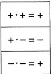

 $$ \frac{+}{+}=+ $$ 

ve

 $$ \frac{ 卄 }{ 卄 }=- $$ 

 $ \frac{2}{2}=+1 $

### 2. Parantez acima

Parantez açma işlemi yapılırken parantezin önündeki işaret işlem üzerine dağıtılır.

Örnekler;

✓  $ -(-x) = +x $

✓  $ -(+x) = -x $

 $$ \begin{array}{r l}{\surd}&amp;{{}-(-x-y-z)=x+y+z}\end{array} $$ 

### B. DÖRT İŞLEM

1) TOPLAMA - ÇIKARMA İŞLEMİ

* İki sayının işaretleri aynı ise toplama yapılır sonucun işareti ortak olan işarettir.

#### Örnekler;

✓  $ (+3) $ +  $ (+5) $ = +8

✓ (-7) + (-13) = -7 - 13 = -20

√ -11 - 14 = -25

✓ -7 -11 -6 = -24

✓ -14x - 11x = -25x

✓  $ (-5x) + (9x) = -5x + 9x = 4x $

* İki sayının işaretleri farklı ise çıkarma işlemi yapılır sonucun işaretini büyük sayı belirler.

Örnekler;

✓ 3-5=-2

✓ -8 +12 =4

✓ 7 + (-13) = 7 - 13 = -6

✓ -7 +11 -6 =4 -6 =-2

✓ (3x) - (7x) = 3x - 7x = -4x

#### 2) CARPMA - BÖLME İŞLEMI

Çarpma ve bölme işlemleri yapılırken işaretler tablosuna göre işaret belirlenir.

&lt;table border=1 style='margin: auto; word-wrap: break-word;'&gt;&lt;tr&gt;&lt;td style='text-align: center; word-wrap: break-word;'&gt;+·+ = +&lt;/td&gt;&lt;/tr&gt;&lt;tr&gt;&lt;td style='text-align: center; word-wrap: break-word;'&gt;+·- = -&lt;/td&gt;&lt;/tr&gt;&lt;tr&gt;&lt;td style='text-align: center; word-wrap: break-word;'&gt;-·- = +&lt;/td&gt;&lt;/tr&gt;&lt;/table&gt;

#### Örnekler;

✓ (-7) · (-13) = 91 ✓ -11 · 4 = -44 ✓ (+8) : (-2) = -4 ✓ (-15) : (-3) = 5

## a) Kuvvet alma

 $$ x^{2}=x\cdot x $$ 

 $$ \left(-x\right)^{2}=\left(-x\right)\cdot\left(-x\right) $$ 

 $$ x^{3}=x\cdot x\cdot x $$ 

 $$ \left(-x\right)^{3}=\left(-x\right)\cdot\left(-x\right)\cdot\left(-x\right) $$ 

 $$ x^{0}=1 $$ 

Örnekler;

 $$ \checkmark3^{2}=9 $$ 

 $$ \checkmark(-1907)^{0}=1 $$ 

#### tip-1

##### x - (x - (-x - 3x))

işleminin sonucu kaçtır?

A) -4x B) -x C) x D) 2x E) 3x

#### TIP-2

 $$ :4-2+5:2)\cdot(6-1+5\left(-1\right)) $$ 

işleminin sonucu kaçtır?

A) 4 B) 3 C) 1 D) 0 E) -1

## b) Faktöriyel

1 den n ye kadar ardışık doğal sayıların çarpımı n! dir.

✓ 1!=1

✓ 2!=1·2=2

 $$ 3!=1\cdot2\cdot3=6 $$ 

#### TIP-3

(0! + 1! + 2!) ! - (3! - 0!) !

isleminin sonucu kaçtır?

A) 120 B) -96 C) 96 D) 100 E) 120

## c) İşlem önceliği:

1. varsa kuvvet ifadeleri

2. varsa parantez içi

3. varsa çarpma, bölme

4. toplama, çıkarma işlemleri sırası ile yapılır.

#### Örnekler:

 $$ \checkmark\quad(-5+7)^{2}=4\quad\checkmark12+5\cdot(-3)=-3 $$ 

 $$ \begin{aligned}\checkmark\left(-5\right)\cdot\left(-3\right)+\left(-2\right)\cdot\left(+3\right)=15-6=9\end{aligned}\quad\begin{aligned}\checkmark\left(+15\right):\left(-3\right)+\left(-17\right)=-5-17=-22\end{aligned} $$ 

### C. TEMEL İŞLEMLER

1) DENKLEM CÖZME

* Bir işlemde denklem çözümü yapılırken aynı cins ifadeler bir yerde toplanır. Burada dikkat edilmesi gereken şey eşitliğin karşısına geçen ifadenin işareti değişir.

#### Tip-4

 $$ 2x+3=x+11 $$ 

denklemini sağlayan x değeri kaçtır?

A) 6 B) 7 C) 8 D) 9 E) 10

* İki bilinmeyenli bir denklem çözümü yapılıyorsa taraf tarafa toplanarak ya da çıkarılarak yok etme işlemi yapılır. Ya da yerine koyma yönetimi uygulanarak denklem çözülür.

#### Tip - 5

 $$ \begin{array}{l}x+y=12\\x-y=4\end{array} $$ 

denklemini sağlayan x değeri kaçtır?

A) 6 B) 7 C) 8 D) 9 E) 10

#### TIP-6

2x + y = 8

 $$ x+y=15 $$ 

denklemini sağlayan y değeri kaçtır?

A) 16 B) 18 C) 20 D) 22 E) 24

2) IÇLER DIŞLAR ÇARPIM

 $$ \frac{a}{b}=\frac{c}{d}\Rightarrow\boldsymbol{a}\cdot\boldsymbol{d}=\boldsymbol{b}\cdot\boldsymbol{c} $$ 

işlemine içler dışlar çarpımı yapma denir.

#### tip-7

 $$ \frac{x-2}{x+1}=\frac{3}{2} $$ 

denklemini sağlayan x değeri kaçtır?

A) -7 B) -8 C) -9 D) -10 E) -11

#### tip-8

 $$ 4-2x=\frac{3x-4}{-2} $$ 

denklemini sağlayan x değeri kaçtır?

A) 3 B) 4 C) 5 D) 6 E) 7

3) PARANTEZ AÇMA

 $$ \boldsymbol{x}\cdot(\boldsymbol{a}+\boldsymbol{b}+\boldsymbol{c})\Rightarrow\boldsymbol{x}\cdot\boldsymbol{a}+\boldsymbol{x}\cdot\boldsymbol{b}+\boldsymbol{x}\cdot\boldsymbol{c} $$ 

işleminde x, şekildeki gibi sırası ile çarpılarak parantez açılır.

#### Örnekler;

✓  $ 3 \cdot (x - 2) = 3x - 6 $

 $$ \begin{array}{r}{\checkmark\quad-2\cdot(-5-2y+x)=10+4y-2x}\end{array} $$ 

#### tip-9

 $$ 2\cdot(2x-y+z)-3(y+2z-2x)-5\cdot(2x-y) $$ 

ifadesinin esiti nedir?

A) 2x B) y C) -y D) -2z E) -4z

#### 4) PARANTEZE ALMA

 $$ x\cdot\mathbf{a}+x\cdot\mathbf{b}+x\cdot\mathbf{c}\Rightarrow x\cdot(\mathbf{a}+\mathbf{b}+\mathbf{c}) $$ 

işleminde x her bir terimde ortak olduğu için ortak çarpan parantezine alınarak ifade düzenlenir.

#### Örnekler;

 $$ \swarrow\quad3x+2yx=x(3+2y) $$ 

 $$ \begin{array}{r} 6+2x-4y=2(3+x-2y) \end{array} $$ 

 $$ \begin{array}{r}{\surd2a-4a b-6a c=2a(1\;-2b\;-3c)}\end{array} $$ 

#### 5) SADELEŞTIRME VE ORANLAMA

Kesirli sayılarda pay ile paydanın ortak bir sayı ile bölünmesine sadeleştirme denir.

Oranlama ise iki ifadenin birbirine bölünmesidir.

a'nın b'ye oranı  $ \frac{a}{b} $ dir.

Örnekler;

 $$ \checkmark\ \frac{18}{10}=\frac{9}{5} $$ 

 $$ \checkmark\;\frac{49}{13}\cdot\frac{26}{7}=14 $$ 

 $$ \sqrt{\frac{5}{7}}\cdot\frac{9}{5}\cdot\frac{\frac{3}{21}}{\frac{18}{2}}=\frac{3}{2} $$ 

TIP-10

 $$ \frac{3}{7}\cdot777-\frac{2}{5}\cdot555+\frac{3}{2}\cdot444 $$ 

işleminin sonucu kaçtır?

A) 777 B) 666 C) 555 D) 444 E) 333

#### Tip-11

a ve b sifırdan farklı reel sayılardır.

 $$ 5a=4b $$ 

esitliğinde a'nın b'ye oranı kaçtır?

A)  $ \frac{1}{5} $ B)  $ \frac{2}{5} $ C)  $ \frac{3}{5} $ D)  $ \frac{4}{5} $ E)  $ \frac{5}{4} $

6) RASYONEL SAYILARDA DÖRT İŞLEM

a. Toplama - Çikarma: Rasyonel sayılarda toplama çıkarma işlemi yapılırken payda eşitlenerek işlem yapılır.

 $$ \frac{a}{b}+\frac{c}{d}=\frac{ad+bc}{b\cdot d}\quad dir. $$ 

Örnekler;

 $$ \begin{align*}\sqrt{}\ \frac{1}{2}+\frac{2}{3}&amp;=\frac{7}{6}\quad\sqrt{}\ \frac{1}{3}+\frac{3}{5}-3=\frac{-31}{15}\quad\sqrt{}\ \frac{1}{2}-\frac{1}{3}+\frac{1}{6}=\frac{1}{3}\\\sqrt{}\ 3+\frac{2}{5}&amp;=\frac{17}{5}\quad\sqrt{}\ \frac{5}{3}-4=\frac{-7}{3}\end{align*} $$ 

b. Çarpma - Bölme: Rasyonel sayılarda çarpma işleminde paylar kendi içinde paydalar kendi içinde çarpılır.

 $$ \frac{a}{b}\cdot\frac{c}{d}=\frac{a\cdot c}{b\cdot d}\quad dir. $$ 

Bölme işlemi yapılırken bölme işaretinin hemen sağındaki ifade ters çevrilerek çarpım durumuna getirilir.

 $$ \frac{a}{b}:\frac{c}{d}=\frac{a}{b}\cdot\frac{d}{c}\quad dir. $$ 

Kesirli bölme işlemlerinde ise kesir çizgisinin üstündeki ifade aynen durur, kesir çizgisinin altındaki ifade ters çevrilerek çarpım durumuna getirilir.

 $$ \frac{\frac{a}{b}}{\frac{c}{d}}=\frac{a}{b}\cdot\frac{d}{c} $$ 

 $$ ^{*}\quad\frac{\overline{a}}{b\atop c}=\frac{a}{b}\cdot\frac{1}{c} $$ 

 $$ \ast\quad\frac{a}{\underline{b}}\!=\!\frac{a}{1}\!\cdot\!\frac{c}{b}\! $$ 

#### Örnekler;

 $ \sqrt{\frac{\frac{2}{3}}{\frac{3}{2}}}=\frac{2}{3}\cdot\frac{2}{3}=\frac{4}{9} $  $ \sqrt{\frac{1}{2}}=\frac{1}{2}\cdot\frac{1}{3}=\frac{1}{6} $  $ \sqrt{\frac{3}{12}}=3\cdot\frac{2}{1}=6 $

#### TIP-12

 $$ \frac{1}{2}-\left(\frac{3}{5}-\frac{1}{3}+\frac{1}{7}\right)-\left(\frac{1}{3}-\frac{3}{5}-\frac{1}{7}-\frac{1}{2}\right) $$ 

işleminin sonucu kaçtır?

A) 0 B) 1 C) 2 D) 3 E) 4

## c. Tam sayılı kesir - Negatif kuvvet:

* a $ \underline{\text{b}} $ = a +  $ \underline{\text{b}} $ gibi ifadelere tam sayili kesir denir.

* Bir sayının negatif kuvveti o sayının ters çevrileceği anlamına gelir.

*  $ \left(\frac{a}{b}\right)^{-2} = \left(\frac{b}{a}\right)^{2} $ gibi

Örnekler; ✓  $ 5\frac{2}{3}=5+\frac{2}{3}=\frac{17}{3} $ ✓  $ -2\frac{1}{4}=-\left(2+\frac{1}{4}\right)=-\frac{9}{4} $

 $ \begin{array}{l}\checkmark \quad 11\frac{2}{3}+17\frac{1}{3}=11+\frac{2}{3}+17+\frac{1}{3}=11+17+\frac{2+1}{3}=28+1=29\\ \checkmark \quad 5\frac{3}{2}-1\frac{1}{2}=5+\frac{3}{2}-1-\frac{1}{2}=4+1=5\\ \checkmark \quad 2^{-1}=\frac{1}{2} \quad \checkmark \quad \left(\frac{1}{3}\right)^{-2}=3^{2}=9 \quad \checkmark \quad \left(-\frac{2}{3}\right)^{-2}=\left(-\frac{3}{2}\right)^{2}=\frac{9}{4}\end{array} $

#### TIP-13

-2$\frac{1}{3}$+3$\frac{4}{3}$-2$\frac{10}{3}$

isleminin sonucu kaçtir?

A) 3 B) $\frac{-1}{3}$ C) $\frac{-5}{3}$ D) $\frac{-10}{3}$ E) -15

#### TIP-14

 $$ (2^{-1}-5^{0}+1)^{-1}+(-2)^{3} $$ 

işleminin sonucu kaçtır?

A) 6 B) 4 C) -4 D) -5 E) -6

#### Tip-15

 $$ \frac{41\frac{3}{7}-39\frac{2}{7}}{1\frac{1}{7}-1} $$ 

işleminin sonucu kaçtır?

A) 15 B) 11 C) 9 D) 7 E) 3

&lt;div style="text-align: center;"&gt;&lt;div style="text-align: center;"&gt;Tip~16&lt;/div&gt; &lt;/div&gt;

 $$ \frac{x-4}{3}-\frac{x-3}{4}=-\frac{1-x}{2} $$ 

denklemini sağlayan x değeri kaçtır?

A)  $ \frac{1}{6} $ B)  $ \frac{1}{5} $ C)  $ -\frac{1}{5} $ D)  $ -\frac{1}{6} $ E)  $ -\frac{1}{12} $

&lt;div style="text-align: center;"&gt;&lt;div style="text-align: center;"&gt;Tip-17&lt;/div&gt; &lt;/div&gt;

1. 3 ○ -6

II. -6 ○ 2

III. 1 ○ 4

IV. 1 ○ -3

ifadelerindeki boş dairelerin içine toplama (+), çıkarma (-), çarpma (x) ve bölme (:) sembolleri hangi sirayla yerleştirilirse üç işlemin sonucu da aynı sayıya eşit olur?

&lt;table border=1 style='margin: auto; word-wrap: break-word;'&gt;&lt;tr&gt;&lt;td style='text-align: center; word-wrap: break-word;'&gt;&lt;/td&gt;&lt;td style='text-align: center; word-wrap: break-word;'&gt;I&lt;/td&gt;&lt;td style='text-align: center; word-wrap: break-word;'&gt;II&lt;/td&gt;&lt;td style='text-align: center; word-wrap: break-word;'&gt;III&lt;/td&gt;&lt;td style='text-align: center; word-wrap: break-word;'&gt;IV&lt;/td&gt;&lt;/tr&gt;&lt;tr&gt;&lt;td style='text-align: center; word-wrap: break-word;'&gt;A)&lt;/td&gt;&lt;td style='text-align: center; word-wrap: break-word;'&gt;+&lt;/td&gt;&lt;td style='text-align: center; word-wrap: break-word;'&gt;-&lt;/td&gt;&lt;td style='text-align: center; word-wrap: break-word;'&gt;x&lt;/td&gt;&lt;td style='text-align: center; word-wrap: break-word;'&gt;:&lt;/td&gt;&lt;/tr&gt;&lt;tr&gt;&lt;td style='text-align: center; word-wrap: break-word;'&gt;B)&lt;/td&gt;&lt;td style='text-align: center; word-wrap: break-word;'&gt;+&lt;/td&gt;&lt;td style='text-align: center; word-wrap: break-word;'&gt;x&lt;/td&gt;&lt;td style='text-align: center; word-wrap: break-word;'&gt;-&lt;/td&gt;&lt;td style='text-align: center; word-wrap: break-word;'&gt;:&lt;/td&gt;&lt;/tr&gt;&lt;tr&gt;&lt;td style='text-align: center; word-wrap: break-word;'&gt;C)&lt;/td&gt;&lt;td style='text-align: center; word-wrap: break-word;'&gt;+&lt;/td&gt;&lt;td style='text-align: center; word-wrap: break-word;'&gt;:&lt;/td&gt;&lt;td style='text-align: center; word-wrap: break-word;'&gt;-&lt;/td&gt;&lt;td style='text-align: center; word-wrap: break-word;'&gt;x&lt;/td&gt;&lt;/tr&gt;&lt;tr&gt;&lt;td style='text-align: center; word-wrap: break-word;'&gt;D)&lt;/td&gt;&lt;td style='text-align: center; word-wrap: break-word;'&gt;-&lt;/td&gt;&lt;td style='text-align: center; word-wrap: break-word;'&gt;:&lt;/td&gt;&lt;td style='text-align: center; word-wrap: break-word;'&gt;+&lt;/td&gt;&lt;td style='text-align: center; word-wrap: break-word;'&gt;x&lt;/td&gt;&lt;/tr&gt;&lt;tr&gt;&lt;td style='text-align: center; word-wrap: break-word;'&gt;E)&lt;/td&gt;&lt;td style='text-align: center; word-wrap: break-word;'&gt;:&lt;/td&gt;&lt;td style='text-align: center; word-wrap: break-word;'&gt;+&lt;/td&gt;&lt;td style='text-align: center; word-wrap: break-word;'&gt;-&lt;/td&gt;&lt;td style='text-align: center; word-wrap: break-word;'&gt;x&lt;/td&gt;&lt;/tr&gt;&lt;/table&gt;

##### TIP-18

Aşağıda kareler içerisinde bulunan ifadelere yukarıdan aşağıya doğru bağlı bulunduğu daire içerisindeki işlemler uygulanacaktır.

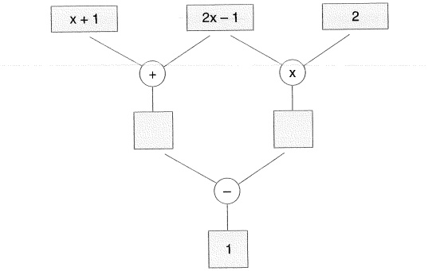

Buna göre, x'in alabileceği değerler toplamı kaçtır?

A) 1 B) 2 C) 3 D) 4 E) 5

1. Rakam: Sayilari ifade etmeye yarayan sembollere denir.

A = {0, 1, 2, 3, 4, 5, 6, 7, 8, 9} kümesinin elemanlarıdır.

2. Sayma sayilari: S = {1, 2, 3, ...} şeklinde giden sayilardır.

3. Doğal sayılar: N = {0, 1, 2, 3, ...} şeklinde giden sayılardır. N ile gösterilir.

4. Tam sayilar:

 $$ \begin{array}{c}Z=\{\underbrace{-\infty,\;\ldots-2,-1,}_{negatif~tam~sayi}\;\bigg|\;\underbrace{0,\;1,2,\;\ldots\;\infty}_{pozitif~tam~sayi}\}\quad\uplus\quad\\ i\uplus a r e t s i z d i r\end{array} $$ 

Z ile gösterilir.

5. Rasyonel sayilar: a ve b (b ≠ 0) tam sayı olmak üzere  $ \frac{a}{b} $ şeklinde ifade edilen sayilardır. Q ile gösterilir.

6. irrasyonel sayilar:  $ \theta' = \left\{ \sqrt{2}, \frac{1}{\sqrt{3}}, e, \pi \right\} $ şeklinde ifade edilen sayilardır.  $ \theta' $ ile gösterilir.

7. Reel sayilar: Rasyonel sayilar ile irrasyonel sayılar kümesinin birleşimin-den oluşan sayılar kümesidir. R ile gösterilir.

#### tip-1

a, b ve c rakamdir.

Buna göre, 3a + 2b - c ifadesinin  $ \underline{\text{en büyük}} $ ve  $ \underline{\text{en küçük}} $ değeri kaçtır?

CEVAP: 45, -9

a ve b doğal sayılardır.

 $$ a+b=10 $$ 

oldu�una gõre, a ⋅ b çarpiminin  $ \underline{\text{en büyük}} $ ve  $ \underline{\text{en küçük}} $ değeri kaçtir?

CEVAP: 25,0

#### Tip-3

a ve b doğal sayı, x reel sayıdır.

a = 11 - x

b = x + 13

ifadeleri veriliyor.

Buna göre, a · b çarpımının  $ \underline{\text{en büyük}} $ değeri kaçtır?

A) 24 B) 56 C) 88 D) 120 E) 144

&lt;div style="text-align: center;"&gt;&lt;div style="text-align: center;"&gt;Tip-4&lt;/div&gt; &lt;/div&gt;

a ve b doğal sayıdır.

a · b = 18

olduğuna göre, a + b toplamının  $ \underline{\text{en büyük}} $ ve  $ \underline{\text{en küçük}} $ değerinin toplamı kaçtır?

A) 9 B) 14 C) 28 D) 32 E) 36

#### TIP-5

a ve b tam sayıdır.

a  $ \cdot $ b = 12

olduġuna għoré, a + b toplaminn  $ \underline{\text{en büyük}} $ ve  $ \underline{\text{en küçük}} $ değerinin toplamı kaçtir?

A) 20 B) 17 C) 10 D) 5 E) 0

#### TIP-6

a, b ve c tam sayıdır.

 $ a \cdot b = 12 $

 $ b \cdot c = 16 $

olduğuna göre, a + b + c toplamının  $ \underline{\text{en küçük}} $ değeri kaçtır?

A) - 29 B) -25 C) 20 D) 27 E) 29

#### tip-7

a, b ve c negatif tam sayilardır.

 $ \frac{a}{b}=\frac{2}{3} $ ,  $ \frac{b}{c}=\frac{4}{5} $

olduğuna göre, a + b + c toplamının  $ \underline{\text{en büyük}} $ değeri kaçtır?

A) - 20 B) -27 C) -30 D) -35 E) -42

#### tip-8

a, b ve c sifirdan farklı doğal sayılardır.

2a = 3b

4b = 5c

olduğuna göre, a + b + c toplamının  $ \underline{\text{en küçük}} $ değeri kaçtır?

A) 17 B) 25 C) 30 D) 32 E) 33

##### TIP-9

a, b, c ve d doğal sayılardır.

 $ a - b = 1 $

b - c = 2

c - d = 3

olduğuna göre, a + b + c + d toplamının  $ \underline{\text{en küçük}} $ değeri kaçtır?

A) 10 B) 12 C) 14 D) 16 E) 18

#### Tip-10

a, b ve c tam sayilardır.

a - b = c

oluguna göre, 3a + b + c toplamının sonucu aşağıdakilerden hangisi olabilir?

A) 11 B) 17 C) 22 D) 26 E) 36

#### Tip-11

a, b ve c farklı doğal sayılardır.

3a + 2b + c = 47

denklemini sağlayan  $ \underline{\text{en büyük}} $ b sayısı kaçtır?

A) 20 B) 21 C) 22 D) 23 E) 24

##### Tip-12

a ve b doğal sayılardır.

3a + 5b = 25

denklemini sağlayan kaç farklı b sayısı vardır?

A) 1 B) 2 C) 3 D) 4 E) 5

##### TIP-13

&lt;table border=1 style='margin: auto; word-wrap: break-word;'&gt;&lt;tr&gt;&lt;td colspan="5"&gt;a ve b pozitif tam sayıdır.&lt;/td&gt;&lt;/tr&gt;&lt;tr&gt;&lt;td colspan="5"&gt;2a + 3b = 20&lt;/td&gt;&lt;/tr&gt;&lt;tr&gt;&lt;td colspan="5"&gt;denklemini sağlayan kaç farklı (a, b) ikilisi vardır?&lt;/td&gt;&lt;/tr&gt;&lt;tr&gt;&lt;td style='text-align: center; word-wrap: break-word;'&gt;A) 1&lt;/td&gt;&lt;td style='text-align: center; word-wrap: break-word;'&gt;B) 2&lt;/td&gt;&lt;td style='text-align: center; word-wrap: break-word;'&gt;C) 3&lt;/td&gt;&lt;td style='text-align: center; word-wrap: break-word;'&gt;D) 4&lt;/td&gt;&lt;td style='text-align: center; word-wrap: break-word;'&gt;E) 5&lt;/td&gt;&lt;/tr&gt;&lt;/table&gt;

TIP-14

a ve b doğal sayıdır.

2a + 5b = 47

&lt;table border=1 style='margin: auto; word-wrap: break-word;'&gt;&lt;tr&gt;&lt;td colspan="5"&gt;denklemini sağlayan kaç farklı (a, b) ikilisi vardır?&lt;/td&gt;&lt;/tr&gt;&lt;tr&gt;&lt;td style='text-align: center; word-wrap: break-word;'&gt;A) 1&lt;/td&gt;&lt;td style='text-align: center; word-wrap: break-word;'&gt;B) 2&lt;/td&gt;&lt;td style='text-align: center; word-wrap: break-word;'&gt;C) 3&lt;/td&gt;&lt;td style='text-align: center; word-wrap: break-word;'&gt;D) 4&lt;/td&gt;&lt;td style='text-align: center; word-wrap: break-word;'&gt;E) 5&lt;/td&gt;&lt;/tr&gt;&lt;/table&gt;

&lt;div style="text-align: center;"&gt;&lt;div style="text-align: center;"&gt;TIP-15&lt;/div&gt; &lt;/div&gt;

x tam sayıdır.

 $$ \begin{array}{r} x+8 \\ \times \quad 8 \\ \hline x \end{array} $$ 

ifadesini tam sayı yapan kaç farklı x değeri vardır?

A) 4 B) 6 C) 8 D) 10 E) 12

&lt;div style="text-align: center;"&gt;&lt;div style="text-align: center;"&gt;Tip-16&lt;/div&gt; &lt;/div&gt;

x tam sayıdır.

 $$ \frac{x+7}{x+1} $$ 

ifadesini tam sayı yapan kaç farklı x değeri vardır?

A) 4 B) 5 C) 6 D) 7 E) 8

##### TIP-17

x tam sayıdır.

 $$ \frac{2x-7}{x-2} $$ 

ifadesini tam sayı yapan kaç farklı x tam sayı değeri vardır?

A) 4 B) 5 C) 6 D) 7 E) 8

TiP-18

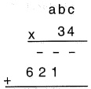

işleminin sonucu kaçtır?

A) 6128 B) 6348 C) 6928

D) 7038 E) 7638

&lt;div style="text-align: center;"&gt;&lt;div style="text-align: center;"&gt;tip-19&lt;/div&gt; &lt;/div&gt;

Aşağıdaki şekilde bir rafi tamamen dolduran ve her birinin kalınlığı tam sayı cinsinden a, b ve c olan A, B ve C kitaplarının görünmü verilmiştir.

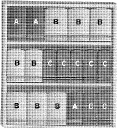

Buna göre, a + b + c toplamı aşağıdakilerden hangisi olabilir?

A) 11 B) 16 C) 18 D) 26 E) 30

#### TIP-20

Aşağıda Şekil-I'de her bir silginin fiyati 5 TL olan x tane silgi ve Şekil-II'de her bir silginin fiyati 3 TL olan y tane silgi bulunan iki farklı kutunun görünümü verilmiştir.

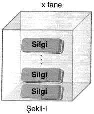

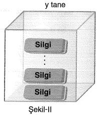

Bu iki kutu silgiden birer tane alan Kerem toplam 160 TL para ödüyor.

Buna göre, x + y toplamı kaç farklı değer alır?

A) 8 B) 9 C) 10 D) 11 E) 12

## yarqi yayinevi

Tek ve Çift Sayılar

2 nin katı olan tam sayılara çift sayı, 2 nin katı olmayan tam sayılara tek sayı denir.

 $$ \mathcal{C}=\mathcal{C}\mathrm{i f}t\mathrm{s a y}i=\{\ldots,-4,-2,0,2,4,\ldots,2n,\ldots\} $$ 

 $$ \mathsf{T}=\mathsf{T e k}\ \mathsf{S a y i}=\{...,-3,-1,1,3,...,2n-1,...\} $$ 

 $$ \begin{align*}\begin{array}{l}T\pm T=\mathbb{C}\\T\pm\mathbb{C}=T\\\mathbb{C}\pm\mathbb{C}=\mathbb{C}\end{array}\end{align*} $$ 

 $$ \begin{array}{c}\mathsf{T}\cdot\mathsf{T}=\mathsf{T}\\\mathsf{T}\cdot\mathsf{C}=\mathsf{C}\\\mathsf{C}\cdot\mathsf{C}=\mathsf{C}\end{array} $$ 

♢  $ \underbrace{\text{T}\cdot\text{T}\cdot\text{T}\ldots\text{T}}_{\text{n tane}} = \text{T}^n = \text{T} $ (n doğal sayı)

 $ \underbrace{\complement_{\mathbb{C}}\cdot\complement_{\mathbb{C}}\cdot\underbrace{\complement}_{\mathrm{n t a n e}}}_{\mathrm{n t a n e}} = \complement^{\mathrm{n}} = \complement $ (n pozitif doğal sayı)

◇ 0!=1

1! = 1

2! = 2

3! = 6

##### TIP-1

I.  $ 8^{17} + 7^{15} $ II.  $ 17^{0} + 5^{3} $ III.  $ 16^{12} - 14^{2} $ IV.  $ 7^{-3} + 5^{6} $ V. 0! + 17! VI. 17! + 18!

Yukarida verilen ifadelerden kaç tanesi tek sayıdır?

A) 2 B) 3 C) 4 D) 5 E) 6

TIP-2

a tek, b ve c çift sayıdır.

tek, b ve c qnt sayul

1. $2a+3b+c$

II. $3ab+c$

III. $a+b$

IV. $a^{b}$

V. $(b+c)^{a}$

ifadelerinden kaç tanesi  $ \underline{\text{her zaman}} $ çift sayıdır?

A) 1 B) 2 C) 3 D) 4 E) 5

a, b ve c doğal sayılardır.

 $$ \frac{2a+b}{4}=c $$ 

olduğuna göre, aşağıdakilerden hangisi  $ \underline{\text{kesinlikle}} $ doğrudur?

A) a çift sayıdır. B) b çift sayıdır. C) c tek sayıdır.

D) c çift sayıdır. E) a + c çift sayıdır.

#### Tip-4

a, b ve c tam sayilardır.

a·b + a·c = 27

oldu $ \underset{\cdot}{g} $una g $ \underset{\cdot}{o} $re, a $ \underset{\cdot}{s} $a $ \underset{\cdot}{g} $idakilerden hangisi  $ \underline{\text{her zaman}} $ do $ \underset{\cdot}{g} $rudur?

A) a  $ \underset{\cdot}{c} $ift say $ \underset{\cdot}{i} $dr. B) b  $ \underset{\cdot}{c} $ift say $ \underset{\cdot}{i} $dr. C) c tek say $ \underset{\cdot}{i} $dr.

D) b·c  $ \underset{\cdot}{c} $ift say $ \underset{\cdot}{i} $dr. E) b + c  $ \underset{\cdot}{c} $ift say $ \underset{\cdot}{i} $dr.

#### Tip-5

17 tane tam sayının toplamı tek sayı ise bu sayılardan  $ \underline{\text{en çok}} $ kaç tanesi çifttir?

A) 13 B) 14 C) 15 D) 16 E) 17

 $$ x^{2}+5 $$ 

ifadesinin sonucu tek sayı ise aşağıdakilerden hangisi daima çifttir?

A)  $ x + 7 $ B)  $ x^{3} + 4 $ C)  $ x^{5} + 1 $ D)  $ x^{4} + 6 $ E)  $ x^{9} - 4 $

#### Pozitif - Negatif Sayilar

Pozitif sayıların tüm kuvvetleri pozitiftir.

Negatif sayıların tek kuvvetleri negatif, çift kuvvetleri pozitiftir.

* İşaret sorularında çift kuvvetli ifadeler sorudan atılır çünkü ifadenin işareti bilinmez, tek kuvvetli ifadelerin de kuvvetleri silinir.

##### tip-7

x, y ve z reel sayılardır.

 $$ x^{4}\cdot y^{5}\cdot z&lt;0 $$ 

 $$ x^{3}\cdot y^{4}&gt;0 $$ 

 $$ x\cdot z&lt;0 $$ 

olduğuna göre x, y ve z nin işaretleri sırasıyla aşağıdakilerden hangisidir?

A) +,-, -

B) +,+, -

C) -, +,-

D) -, -, +

E) +, +, +

#### Tip-8

a, b ve c sifirdan farklı doğal sayılardır.

I.  $ a^{2} + b^{2} + c^{2} $

II.  $ (a+b)^{2} + c^{2} $

III.  $ a^{8} - b^{8} + c^{4} $

ifadelerinden hangilerinin sonucu sifir olabilir?

A) Yalnız I B) Yalnız III C) I ve II

D) II ve III E) I, II ve III

##### Tip-9

a ve b tam sayıdır.

 $$ 2a+3b=27 $$ 

#### olduğuna göre,

1. a çift sayıdır.

II. b tek sayıdır.

III.  $ a \cdot b \geq 0 $ dir.

#### ifadelerinden hangileri  $ \underline{\text{daima}} $ doğrudur?

A) Yalnız I B) Yalnız II C) Yalnız III

D) I ve II E) I ve III

TIP-10

a, b ve c birer tam sayı olmak üzere,

 $ a + \frac{b}{c} $

ifadesi bir tek tam sayıdır.

a çift tam sayı olduğunu göre,

1. a. b + c

II. a + b + c

III. a + b.c

ifadelerinden hangileri  $ \underline{\text{her zaman}} $ çift sayıdır?

A) Yalnız I B) Yalnız II C) Yalnız III

D) I ve II E) II ve III

#### Tip-11

a, b ve c pozitif tam sayılar olmak üzere,

a + a. b + a. b. c

ifadesı tek sayıdır.

Buna göre,

1. a

II. a + b. c

III. b + b. c

ifadelerinden hangileri  $ \underline{\text{her zaman}} $ çifttir?

A) Yalnız I B) Yalnız II C) Yalnız III

D) I ve II E) II ve III

TiP-12

a, b ve c pozitif tam sayılar olmak üzere a . b + c ifadesinin bir çift sayıya, a + b . c ifadesinin bir tek tam sayıya eşit olduğu biliniyor.

Buna göre,

1.  $ b^{a} + c^{b} $

II. a, b, c

III.  $ a + b + c $

ifadelerinden hangileri birer çift sayıya eşittir?

A) Yalnız I B) Yalnız II C) I ve II

D) II ve III E) I, II ve III

##### Tip-13

1'den 7'ye kadar numaralandırılmış toplar bir torbaya atılıyor. Bu torbadan Alper 3 top, Hatice 2 top alıyor. Alper elindeki toplara bakarak Hatice'ye şunu söylüyor: "Senin elindeki topların toplamı çifttir."

Buna göre, Alper'in elindeki topların toplamı kaçtır?

A) 12 B) 16 C) 18 D) 19 E) 20

#### tip-14

On katlı bir apartmanın ardışık numaralı her iki katı arasında eşit sayıda merdiven basamağı bulunmaktadır. Bu apartmanın farklı katlarında oturan Arda, Burak ve Cem'in oturdukları katlarla ilgili aşağıdakiler bilinmektedir.

- Arda'nın oturduğu kat ile Burak'ın oturduğu kat arasındaki toplam basamak sayısı çifttir.

Burak'ın oturduğu kat ile Cem'in oturduğu kat arasındaki toplam basamak sayısı tektir.

Buna göre Arda, Burak ve Cem'in oturdukları katların numaraları aşağıdakilerden hangisi olabilir?

&lt;table border=1 style='margin: auto; word-wrap: break-word;'&gt;&lt;tr&gt;&lt;td style='text-align: center; word-wrap: break-word;'&gt;&lt;/td&gt;&lt;td style='text-align: center; word-wrap: break-word;'&gt;Arda&lt;/td&gt;&lt;td style='text-align: center; word-wrap: break-word;'&gt;Burak&lt;/td&gt;&lt;td style='text-align: center; word-wrap: break-word;'&gt;Cem&lt;/td&gt;&lt;/tr&gt;&lt;tr&gt;&lt;td style='text-align: center; word-wrap: break-word;'&gt;A)&lt;/td&gt;&lt;td style='text-align: center; word-wrap: break-word;'&gt;2&lt;/td&gt;&lt;td style='text-align: center; word-wrap: break-word;'&gt;4&lt;/td&gt;&lt;td style='text-align: center; word-wrap: break-word;'&gt;7&lt;/td&gt;&lt;/tr&gt;&lt;tr&gt;&lt;td style='text-align: center; word-wrap: break-word;'&gt;B)&lt;/td&gt;&lt;td style='text-align: center; word-wrap: break-word;'&gt;3&lt;/td&gt;&lt;td style='text-align: center; word-wrap: break-word;'&gt;6&lt;/td&gt;&lt;td style='text-align: center; word-wrap: break-word;'&gt;9&lt;/td&gt;&lt;/tr&gt;&lt;tr&gt;&lt;td style='text-align: center; word-wrap: break-word;'&gt;C)&lt;/td&gt;&lt;td style='text-align: center; word-wrap: break-word;'&gt;4&lt;/td&gt;&lt;td style='text-align: center; word-wrap: break-word;'&gt;7&lt;/td&gt;&lt;td style='text-align: center; word-wrap: break-word;'&gt;10&lt;/td&gt;&lt;/tr&gt;&lt;tr&gt;&lt;td style='text-align: center; word-wrap: break-word;'&gt;D)&lt;/td&gt;&lt;td style='text-align: center; word-wrap: break-word;'&gt;5&lt;/td&gt;&lt;td style='text-align: center; word-wrap: break-word;'&gt;8&lt;/td&gt;&lt;td style='text-align: center; word-wrap: break-word;'&gt;10&lt;/td&gt;&lt;/tr&gt;&lt;tr&gt;&lt;td style='text-align: center; word-wrap: break-word;'&gt;E)&lt;/td&gt;&lt;td style='text-align: center; word-wrap: break-word;'&gt;6&lt;/td&gt;&lt;td style='text-align: center; word-wrap: break-word;'&gt;8&lt;/td&gt;&lt;td style='text-align: center; word-wrap: break-word;'&gt;10&lt;/td&gt;&lt;/tr&gt;&lt;/table&gt;

## yarqi yayinevi

1 ve kendisinden başka pozitif böleni olmayan 1 den büyük doğal sayılara asal sayılar denir.

 $$ A=\{2,3,5,7\ldots\} $$ 

Asal sayılar içinde 2 den başka çift sayı yoktur.

Aralarında Asal Sayılar

1 den başka ortak pozitif böleni olmayan sayılara denir.

##### Tip-1

x ve y doğal sayıdır.

(x-1)·(y+3)=11

denklemini sağlayan x·y çarpımının değeri kaçtır?

A) 12 B) 14 C) 16 D) 18 E) 20

##### TIP-2

x ve y doğal sayı p asal sayıdır.

 $ (x-3)\cdot(y+2)=p $

olduğuna göre, x + y - p ifadesinin sonucu kaçtır?

A) 1 B) 2 C) 3 D) 4

##### TIP-3

x ve y reel sayı, p asal sayıdır.

 $ x^{2}-y^{2}=p $

olduġuna ġöre x in p cinsinden ifadesi nedir?

A) p B) p + 1 C) p - 1 D)  $ \frac{p+1}{2} $ E)  $ \frac{p-1}{2} $

#### TIP-4

a, b, c ve d asal sayılar ve a &lt; b &lt; c &lt; d olmak üzere,

 $$ \mathsf{a}\bigstar+\bigstar\mathsf{b}\star\star\mathsf{.}\quad\mathsf{c=d} $$ 

eşitliğini sağlayan d asal sayılarına günəş asalı denir.

Buna göre, aşağıdakilerden hangisi günəş asalıdır?

A) 11 B) 13 C) 19 D) 23 E) 31

#### Tip-5

(47! + 3) ile (47! + 42)

sayilari arasinda kaç tane asal sayı vardır?

A) 0 B) 1 C) 8 D) 10 E) 11

#### MATEMATIK

#### TIP-6

x ve y aralarında asal sayılardır.

 $$ \frac{x}{y}=\frac{15}{12} $$ 

olduğuna göre, x·y çarpımı kaçtir?

A) 4 B) 5 C) 10 D) 15 E) 20

#### tip-7

x ve y aralarında asaldır.

 $$ \frac{x+y}{x-y}=\frac{15}{12} $$ 

olduğuna göre, x·y çarpımı kaçtir?

A) 9 B) 10 C) 12 D) 15 E) 18

(x-y) ve (x+y) ifadeleri aralarında asaldır.

 $$ \frac{x+y}{x-y}=\frac{25}{15} $$ 

olduġuna gõre, x·y ċarpimi kaċtir?

A) 2 B) 3 C) 4 D) 5 E) 6

##### tip-9

x ile y aralarında asaldır.

 $$ \frac{x}{12}=\frac{y}{15} $$ 

olduğuna göre x+y toplamı kaçtır?

A) 4 B) 5 C) 9 D) 12 E) 18

#### TIP-10

x ve y doğal sayılar ve (x-2) ile (y+3) aralarında asaldır.

 $$ x\cdot y+3x-2y=17 $$ 

&lt;table border=1 style='margin: auto; word-wrap: break-word;'&gt;&lt;tr&gt;&lt;td style='text-align: center; word-wrap: break-word;'&gt;A) 18&lt;/td&gt;&lt;td style='text-align: center; word-wrap: break-word;'&gt;B) 12&lt;/td&gt;&lt;td style='text-align: center; word-wrap: break-word;'&gt;C) 16&lt;/td&gt;&lt;td style='text-align: center; word-wrap: break-word;'&gt;D) 20&lt;/td&gt;&lt;td style='text-align: center; word-wrap: break-word;'&gt;E) 24&lt;/td&gt;&lt;/tr&gt;&lt;/table&gt;

&lt;div style="text-align: center;"&gt;&lt;div style="text-align: center;"&gt;Tip-11&lt;/div&gt; &lt;/div&gt;

Aşağıda ortasında kare ve köşelerinde daire bulunan birbirine bağlı şekillerin her birinin içerisine 1, 2, 3, 4 ve 9 sayılarından biri yazılıyor.

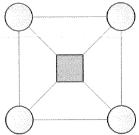

Bir doğru parçası ile birbirine bağlanan iki şeklin içinde yazan sayıların aralarında asal olduğu biliniyor.

Buna göre, karenin içine yazılabilecek sayıların toplamı kaçtır?

A) 1 B) 4 C) 5 D) 6 E) 7

&lt;div style="text-align: center;"&gt;&lt;div style="text-align: center;"&gt;TIP-12&lt;/div&gt; &lt;/div&gt;

Aşağıda bir yüzünde bir adet birbirinden farklı tam sayı yazılı olan A, B, C ve D kartlarının görünmü verilmiştir.

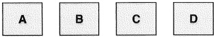

Bu kartlarda yazan sayılarla ilgili.

B ile D aynı işaretli ve aralarında asal değil,

• A asal sayıdır ve A ile D aralarında asal.

• Kartlar üzerinde yazan sayıların çarpımı –24 olduğu biliniyor.

Buna göre, C'nin alabileceği değerler toplamı kaçtır?

A) -7          B) -6          C) -4          D) -3          E) -1

### MATEMATIK

Tanim: Ardişik iki terimi arasındaki fark 1 dir.

* a ile b ardışık sayılar ise

1. a = b + 1

 $$ \mathrm{II}.\mathrm{~b}=a+1 $$ 

#### Ardışık tek sayılar: Ardışık iki terimi arasındaki fark 2 dir.

Örnek; 1, 3, 5, 7,...

n, n+2, n+4,...

 $$ \begin{array}{l}2n+1,2n+3,2n+5,\ldots\end{array} $$ 

Ardışık çift sayılar: Ardışık iki terimi arasındaki fark 2 dir.

Örnek: 0, 2, 4,...

 $$ n,n+2,n+4,\ldots $$ 

 $$ \begin{array}{l}2n,2n+2,2n+4,\ldots\end{array} $$ 

##### NOT

1. Ardışık iki sayı arasındaki fark 1 dir.

II. Ardişik tek ve çift sayılar arasındaki fark 2 dir.

#### tip-1

a, b ve c ardışık çift sayılar ve a &lt; b &lt; c'dir.

Buna göre,  $ \frac{(a-c)^{2}+(c-b)^{3}}{c-a} $ ifadesinin sonucu kaçtır?

A) -2 B) 2 C) 4 D) 6 E) 8

#### TIP-2

 $$ (2n+1)\operatorname{ve}(n-3) $$ 

ifadeleri ardışık sayılar ise n'nin alabileceği değerler çarpımı kaçtır?

A) 3 B) 5 C) 15 D) 20 E) 25

#### tip-3

x, y ve z ardişık sayılar ve x &lt; y &lt; z dir.

 $$ 2x=6\cdot(z-x)\cdot(x-y) $$ 

esitliği sağlandığına göre x + y + z toplamı kaçtır?

A) -20 B) -15 C) 0 D) 15 E) 20

#### tip-4

a, b ve c ardışık sayılar ve a &lt; b &lt; c dir.

 $$ \left(1-\frac{1}{a}\right)\cdot\left(1-\frac{1}{b}\right)\cdot\left(1-\frac{1}{c}\right)=\frac{4}{5} $$ 

olduğuna göre, a + b + c toplamı kaçtir?

A) 14 B) 26 C) 32 D) 42 E) 48

#### Ardisik Sayilarin Formülleri

1.  $ 1 + 2 + 3 + \ldots + n = \frac{n(n+1)}{2} $

2.  $ 2 + 4 + 6 + \ldots + 2n = n \cdot (n+1) $

3.  $ 1 + 3 + 5 + \ldots + (2n - 1) = n^2 $

##### Genel Toplam Formülü

Toplam = Ortadaki sayı · Terim sayı

#### Terim Sayisi

Ardışık sonlu sayı dizilerinde,

 $$  Terim sayi s=\frac{(Son terim)-(ilk terim)}{Ortak fark}+1 $$ 

Ortadaki sayı =  $ \frac{\text{Son terim + İlk terim}}{2} $

Toplam = Ortadaki sayı · Terim sayısı

Ardışık toplam =  $ \frac{(\mathrm{lik}\ \mathrm{terim}+\mathrm{Son}\ \mathrm{terim})}{2} $ · (Terim sayısı)

#### Tip-5

 $$ 1+2+3+\ldots\ldots+29 $$ 

toplaminin sonucu kaçtir?

A) 420 B) 430 C) 435 D) 450 E) 465

##### TIP-6

Ardışık beş doğal sayının toplamı 75 ise bu sayılardan  $ \underline{\text{en küçüğü}} $ kaçtır?

A) 12 B) 13 C) 14 D) 15 E) 16

#### TIP-7

Ardışık 11 tek doğal sayının toplamı 143 ise bu sayılardan  $ \underline{\text{en büyükü kaçtır}} $?

A) 17 B) 19 C) 21 D) 23 E) 25

Tip-8

Ardışık 43 tek sayının toplamı 43 ise bu sayılardan  $ \underline{\text{en küçüğü}} $ kaçtir?

A) -43 B) -41 C) -39 D) -37 E) -35

Tip-9

Ardışık 6 çift sayının toplamı 66 ise bu sayılardan  $ \underline{\text{en büyüğü}} $ kaçtır?

A) 11 B) 14 C) 16 D) 18 E) 20

Ardışık 5 doğal sayının toplamı A ise bu sayılardan  $ \underline{\text{en küçüğü}} $ nedir?

A)  $ \frac{A-15}{5} $ B)  $ \frac{A-10}{5} $ C)  $ \frac{A-5}{5} $ D)  $ \frac{A}{5} $ E)  $ \frac{A+5}{5} $

#### TiP-11

1 den n'e kadar olan ardışık doğal sayıların toplamı x, 10 dan n'e kadar olan ardışık doğal sayıların toplamı y dir.

 $ x + y = 145 $

olduğuna göre, x kaçtır?

A) 95 B) 100 C) 115 D) 120 E) 125

#### TIP-12

Bir öğrenci 3'ün katı olan ardışık pozitif doğal sayıları sırasıyla defterine yazıyor.

Buna göre, öğrencinin yazdığı 100. sayı kaçtır?

A) 100 B) 150 C) 200 D) 260 E) 300

Tip-13

 $ A = 2 \cdot 3 + 3 \cdot 4 + \ldots + 11 \cdot 12 $

ifadesinin her bir termininin birinci çarpanı 1 artırılırsa toplamın sonuçı kaç artar?

A) 60 B) 65 C) 70 D) 75 E) 80

TiP-14

 $$ 2027-2026+2025-2024+...+1001 $$ 

işleminin sonucu kaçtır?

A) 1407 B) 1469 C) 1512 D) 1513 E) 1514

Bir öğrenci 1'den başlayıp belirli bir doğal sayıya kadar olan ardişik sayıları sırasıyla yazıp toplayıp sonucu 70 buluyor. İşlemi kontrol ederken bir sayıyı iki kez yazdığını fark ediyor.

Buna göre, hangi sayıyı iki kez yazmıştır?

A) 2 B) 3 C) 4 D) 5 E) 6

Tip-16

1'den başlayıp 100'e kadar numaralandırılmış toplar bir torbaya atılıyor.

Torbadan çekilen bir topun üzerinde yazan sayının 5 ile bölünebilmesi için torbadan  $ \underline{\text{en az}} $ kaç top çekilmelidir?

A) 20 B) 21 C) 75 D) 80 E) 81

tip-17

1'den 120'ye kadar numaralandırılmış bir kitapta toplam kaç tane rakam kullanılmıştır?

A) 240 B) 245 C) 246 D) 252 E) 258

&lt;div style="text-align: center;"&gt;&lt;div style="text-align: center;"&gt;Tip-18&lt;/div&gt; &lt;/div&gt;

A sayisi 1'den 80'e kadar sayıların yan yana yazılması ile oluşmaktadır. Bu sayının soldan 92. basamağidaki rakam kaçtır?

A) 2 B) 3 C) 4 D) 5 E) 6

&lt;div style="text-align: center;"&gt;&lt;div style="text-align: center;"&gt;tip-19&lt;/div&gt; &lt;/div&gt;

Elinde yeterince kutu bulunan Hale'nin her bir adında kutuları üstüste koyarak yaptığı kulelerin bazılarının görünmü aşağıdaki gibidir.

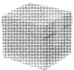

1.adim

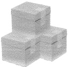

2.adim

&lt;div style="text-align: center;"&gt;&lt;div style="text-align: center;"&gt;3.adim&lt;/div&gt; &lt;/div&gt;

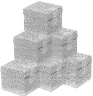

Hale her bir adında aynı düzende ve ardışık olacak biçimde tek sıra hâlinde kutuları üst üste diziyor.

Buna göre, Hale'nin 15. adında yaptığı kulede kullandığı kutu sayıı kaçtır?

A) 105 B) 110 C) 120 D) 124 E) 136

##### Tip-20

Aşağıdaki şekilde belirli bir kurala göre bir ipe dizilmiş turuncu ve beyaz boncukların görünmü verilmiştir.

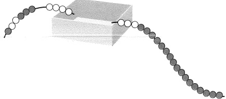

Bu ip içi boş olan kutuya konulduğunda ip üzerindeki bazı boncuklar şekilde gibi dışarda kalıyor.

Buna göre, kutu içerisinde kalan  $ \underline{\text{görünmeyen}} $ beyaz boncuk sayısı  $ \underline{\text{görünmeyen}} $ turuncu boncuk sayısından kaç fazladır?

A) 3 B) 4 C) 5 D) 6 E) 7

#### Tip-21

A3 sayfalarından bir kitap oluştururken bu sayfalar üst üste konulup ortadan katlanarak A4 boyutunda bir kitap oluşturulur. Aşağıda A3 sayfalarından oluşturulan n sayfalık bir kitabın sayfa numaraları verilmiştir.

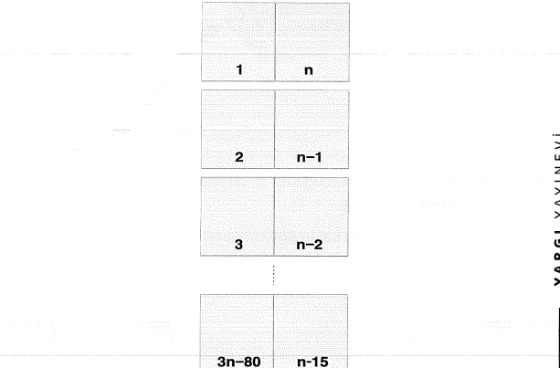

Buna göre, bu kitap kaç sayfadır?

A) 30 B) 31 C) 32 D) 33 E) 34

&lt;div style="text-align: center;"&gt;&lt;div style="text-align: center;"&gt;TIP-22&lt;/div&gt; &lt;/div&gt;

&lt;table border=1 style='margin: auto; word-wrap: break-word;'&gt;&lt;tr&gt;&lt;td style='text-align: center; word-wrap: break-word;'&gt;1. satir&lt;/td&gt;&lt;td style='text-align: center; word-wrap: break-word;'&gt;$ \rightarrow $&lt;/td&gt;&lt;td style='text-align: center; word-wrap: break-word;'&gt;1&lt;/td&gt;&lt;td style='text-align: center; word-wrap: break-word;'&gt;2&lt;/td&gt;&lt;td style='text-align: center; word-wrap: break-word;'&gt;3&lt;/td&gt;&lt;td style='text-align: center; word-wrap: break-word;'&gt;&lt;/td&gt;&lt;td style='text-align: center; word-wrap: break-word;'&gt;&lt;/td&gt;&lt;td style='text-align: center; word-wrap: break-word;'&gt;&lt;/td&gt;&lt;td style='text-align: center; word-wrap: break-word;'&gt;&lt;/td&gt;&lt;td style='text-align: center; word-wrap: break-word;'&gt;&lt;/td&gt;&lt;/tr&gt;&lt;tr&gt;&lt;td style='text-align: center; word-wrap: break-word;'&gt;2. satir&lt;/td&gt;&lt;td style='text-align: center; word-wrap: break-word;'&gt;$ \rightarrow $&lt;/td&gt;&lt;td style='text-align: center; word-wrap: break-word;'&gt;4&lt;/td&gt;&lt;td style='text-align: center; word-wrap: break-word;'&gt;5&lt;/td&gt;&lt;td style='text-align: center; word-wrap: break-word;'&gt;6&lt;/td&gt;&lt;td style='text-align: center; word-wrap: break-word;'&gt;7&lt;/td&gt;&lt;td style='text-align: center; word-wrap: break-word;'&gt;8&lt;/td&gt;&lt;td style='text-align: center; word-wrap: break-word;'&gt;&lt;/td&gt;&lt;td style='text-align: center; word-wrap: break-word;'&gt;&lt;/td&gt;&lt;td style='text-align: center; word-wrap: break-word;'&gt;&lt;/td&gt;&lt;/tr&gt;&lt;tr&gt;&lt;td style='text-align: center; word-wrap: break-word;'&gt;3. satir&lt;/td&gt;&lt;td style='text-align: center; word-wrap: break-word;'&gt;$ \rightarrow $&lt;/td&gt;&lt;td style='text-align: center; word-wrap: break-word;'&gt;9&lt;/td&gt;&lt;td style='text-align: center; word-wrap: break-word;'&gt;10&lt;/td&gt;&lt;td style='text-align: center; word-wrap: break-word;'&gt;11&lt;/td&gt;&lt;td style='text-align: center; word-wrap: break-word;'&gt;12&lt;/td&gt;&lt;td style='text-align: center; word-wrap: break-word;'&gt;13&lt;/td&gt;&lt;td style='text-align: center; word-wrap: break-word;'&gt;14&lt;/td&gt;&lt;td style='text-align: center; word-wrap: break-word;'&gt;15&lt;/td&gt;&lt;td style='text-align: center; word-wrap: break-word;'&gt;&lt;/td&gt;&lt;/tr&gt;&lt;tr&gt;&lt;td style='text-align: center; word-wrap: break-word;'&gt;$ \vdots $&lt;/td&gt;&lt;td style='text-align: center; word-wrap: break-word;'&gt;&lt;/td&gt;&lt;td style='text-align: center; word-wrap: break-word;'&gt;$ \vdots $&lt;/td&gt;&lt;td style='text-align: center; word-wrap: break-word;'&gt;$ \vdots $&lt;/td&gt;&lt;td style='text-align: center; word-wrap: break-word;'&gt;$ \vdots $&lt;/td&gt;&lt;td style='text-align: center; word-wrap: break-word;'&gt;$ \vdots $&lt;/td&gt;&lt;td style='text-align: center; word-wrap: break-word;'&gt;$ \vdots $&lt;/td&gt;&lt;td style='text-align: center; word-wrap: break-word;'&gt;$ \vdots $&lt;/td&gt;&lt;td style='text-align: center; word-wrap: break-word;'&gt;$ \vdots $&lt;/td&gt;&lt;td style='text-align: center; word-wrap: break-word;'&gt;&lt;/td&gt;&lt;/tr&gt;&lt;/table&gt;

Ardışık sayılar 1 den başlayarak şekildeki gibi 1. satırda 3, 2. satırda 5, 3. satırda 7 sayı olmak üzere her satırda bir önceki satırdan 2 fazla sayı olacak şekilde yazılıyor.

Aşağıdaki sayılardan hangisi 160 ile aynı satırdadır?

A) 130 B) 142 C) 146 D) 169 E) 170

### VIDEO DERS NOTU

## yarqi yayinevi

1'den n'e kadar olan doğal sayıların çarpımına n faktöriyel denir ve "n!" şeklinde gösterilir.

 $ 1\cdot2\cdot3\cdot4\cdots n=n! $

1.  $ 0! = 1 $

1! = 1

2! = 2

3! = 6

4! = 24

5! = 120

5! den sonraki tüm sayilarin sonunda sifir vardır.

n! = n(n - 1)(n - 2) ... 1

II.  $ n! = n(n - 1)! $

 $ 10! = 10 \cdot 9! = 10 \cdot 9 \cdot 8! $

 $ (2n + 1)! = (2n + 1) \cdot (2n)! $

 $ (2n)! = 2n \cdot (2n - 1)! $

#### Tip-1

 $$ 0!+1!+2!+\ldots+99! $$ 

sayisinin birler basamağindaki rakam kaçtir?

A) 0 B) 1 C) 2 D) 3 E) 4

TİP - 2

 $$ \frac{8!+7!}{6!} $$ 

ifadesinin sonucu kaçtır?

A) 56 B) 63 C) 70 D) 72 E) 80

tip-3

$\frac{10!+9!}{10!-9!}$

ifadesinin sonucu kaçtır?

A) $\frac{11}{9}$ B) $\frac{10}{9}$ C) $\frac{8}{9}$ D) $\frac{7}{9}$ E) $\frac{5}{9}$

TIP-4

 $$ \frac{4!^{2}-3!^{2}}{4!^{2}+3!^{2}} $$ 

işleminin sonucu kaçtır?

A) $\frac{13}{17}$ B) $\frac{15}{17}$ C) $\frac{16}{17}$ D) $1$ E) $2$

#### tip-5

$$\frac{(n+1)!}{n!}+\frac{(n-2)!}{(n-3)!}=27\text{ise }n\text{kactir?}$$

A) 10 B) 11 C) 12 D) 13 E) 14

#### TIP-6

 $$ \frac{(n-3)!+(5-n)!}{(3-n)!+(7-n)!} $$ 

ifadesinin sonucu kaçtır?

A) $\frac{1}{25}$ B) $\frac{2}{25}$ C) $\frac{3}{25}$ D) $\frac{4}{25}$ E) $\frac{6}{25}$

#### TIP-7

47!

sayisinin sondan kaç basamağı sifirdir?

A) 8 B) 9 C) 10 D) 11 E) 12

x! sayisinin sonundaki sifir sayisini bulmak için ya da x! - 1 sayisinin sonundaki dokuz sayısını bulmak için faktöriyeli sürekli sürekli 5'e böl.

#### Tip-8

40! - 1

1) Sayılar ardışık ise çarpım durumuna getirilip içindeki tüm 5 sayısına bakılır.

sayısının sondan kaç basamağı dokuzdur?

A) 6 B) 7 C) 8 D) 9 E) 10

II) Sayılar ardışık değilse küçük sayıya bakilir.

x! + y! sayisinin sonundaki sifir sayisini bulmak için;

#### NOT

#### tip-9

47! + 63!

sayisinin sondan kaç basamağı sifirdir?

A) 10 B) 14 C) 18 D) 20 E) 24

&lt;div style="text-align: center;"&gt;&lt;div style="text-align: center;"&gt;TIP-10&lt;/div&gt; &lt;/div&gt;

23! + 24!

toplaminin sondan kaç basamağı sifirdir?

A) 2 B) 3 C) 4 D) 5 E) 6

&lt;div style="text-align: center;"&gt;&lt;div style="text-align: center;"&gt;Tip-11&lt;/div&gt; &lt;/div&gt;

47!-123

sayisinin sondan beş basamağindaki rakamlar toplamı kaçtir?

A) 37 B) 38 C) 39 D) 40 E) 41

#### Tip-12

x, y ve A doğal sayıdır.

27! = 3^{x} \cdot 2^{y} \cdot A

ifadesinde x + y toplaminin alabilecegi  $ \underline{\text{en büyük}} $ değer kaçtır?

A) 36 B) 37 C) 38 D) 39 E) 40

#### TIP-13

x ve A doğal sayılardır.

23!=6^{x}\cdot A

ifadesinde x'in alabilecegi kaç farklı değer vardır?

A) 10 B) 9 C) 8 D) 7 E) 6

#### TIP-14

n ve A doğal sayılardır.

17!=8^{n}\cdot A

ifadesinde n'in alabilecegi  $ \underline{\text{en büyük}} $ değer kaçtır?

A) 3 B) 4 C) 5 D) 6 E) 7

#### Tip-15

n ve A doğal sayılardır.

 $$ 22!=12^{n}\cdot A $$ 

ifadesinde n'in alabilecegi  $ \underline{\text{en büyük}} $ değer kaçtır?

A) 5 B) 6 C) 7 D) 8 E) 9

#### TIP-16

n doğal sayı

17!

2^{n}

ifadesinin sonucu çift tam sayı ise n'in alabileceği  $ \underline{\text{en büyük}} $ değer kaçtır?

A) 13 B) 14 C) 15 D) 16 E) 17

&lt;div style="text-align: center;"&gt;&lt;div style="text-align: center;"&gt;TIP-17&lt;/div&gt; &lt;/div&gt;

8·8!-7!=63·(x-2)!

olduğuna göre x kaçtır?

A) 6 B) 7 C) 8 D) 9 E) 10

#### tip-18

a ve b doğal sayılardır.

a! = 6 ⋅ b!

esitliğini sağlayan kaç farklı (a,b) ikilisi vardır?

A) 1 B) 2 C) 3 D) 4 E) 5

##### TIP-19

111

sayısı  $ \underline{\text{en küçük}} $ hangi pozitif tam sayı ile çarpılırsa sonuç bir tam sayının karesi olur?

A) 7 B) 11 C) 33 D) 66 E) 77

#### TIP-20

x!

sayısının sondan 6 ardışık basamağındaki sayılar sifir ise x kaç farklı değer alır?

A) 2 B) 3 C) 4 D) 5 E) 6

#### TIP-21

Bir proje kapsamında deprem bölgesinde bulunan 13 ilde konutlar yapılacaktır. Bu 13 ilin her birinin 11 ilçesine, her bir ilçede her katında 4 daire bulunan 21 katlı 30 konut yapılacaktır.

Buna göre, bu proje kapsamında yapılan toplam daire sayısı kaçtır?

A)  $ \frac{13!}{10!} $ B)  $ \frac{14!}{10!} $ C)  $ \frac{14!}{9!} $ D)  $ \frac{15!}{10!} $ E)  $ \frac{15!}{9!} $

## yarqi yayinevi

Bir doğal sayının rakamlarının bulunduğu yere basamak denir.

Rakamların bulunduğu basamaklara göre aldığı değere basamak değeri denir.

Her rakamin kaç birlikten meydana geldiğini gösteren değere de bu rakamin sayı değeri denir.

2214 Basamak Basamak Değeri Sayı Değeri

10^{0} = birler  $ \longrightarrow $ 4  $ \cdot $ 1 = 4  $ \longrightarrow $ 4

10^{1} = onlar  $ \longrightarrow $ 1  $ \cdot $ 10 = 10  $ \longrightarrow $ 1

10^{2} = yüzler  $ \longrightarrow $ 2  $ \cdot $ 100 = 200  $ \longrightarrow $ 2

10^{3} = binler  $ \longrightarrow $ 2  $ \cdot $ 1000 = 2000  $ \longrightarrow $ 2

 $ ^{*}ab = 10a + b $

* abc = 100a + 10b + c

abcd = 1000a + 100b + 10c + d

 $ ^{*}ab + ba = 11 (a + b) $

*ab - ba = 9 (a - b)

#### tip-1

Dört farklı doğal sayının toplamı 120 ise bu sayılardan  $ \underline{\text{en büyükü en çok}} $ kaçtır?

A) 117 B) 116 C) 115 D) 90 E) 87

tip-2

Beş tane iki basamaklı doğal sayının toplamı 430 ise bu sayılardan  $ \underline{\text{en küçüğü}} $  $ \underline{\text{en az}} $ kaçtir?

A) 30 B) 34 C) 40 D) 42 E) 50

Tip-3

iki basamaklı üç farklı doğal sayının toplamının alabileceği kaç farklı değer vardır?

A) 200 B) 249 C) 260 D) 262 E) 270

#### Tip-4

iki basamaklı rakamları farklı dört farklı doğal sayının toplamı 112 ise bu sayılardan  $ \underline{\text{en büyüğü}} $  $ \underline{\text{en çok}} $ kaçtır?

A) 47 B) 75 C) 76 D) 77 E) 78

Tip-5

iki tanesi 20 den büyük dört farklı doğal sayının toplamı 80 ise bu sayılardan  $ \underline{\text{en büyüğü}} $  $ \underline{\text{en çok}} $ kaçtır?

A) 55 B) 56 C) 57 D) 58 E) 59

Dört farklı doğal sayının toplamı 43 ise bu sayılardan  $ \underline{\text{en küçüğü en çok kaçtır}} $?

A) 9 B) 10 C) 11 D) 12 E) 13

TIP-6

tip-7

Beş farklı doğal sayının toplamı 100 ise bu sayılardan  $ \underline{\text{en büyükü}} $ en az kaçtır?

A) 18 B) 19 C) 20 D) 21 E) 22

TİP - 8

rakamları birer kez kullanılarak yazilabilecek üç basamaklı rakamları

farklı üç farklı doğal sayının toplamı  $ \underline{\text{en çok}} $ kaçtır?

A) 1756 B) 1985 C) 2556

D) 2700 E) 2786

0,1,2,...,9

#### Tip-9

ab ve ba iki basamaklı doğal sayılardır.

ab + ba = 44

denklemini sağlayan kaç farklı ab sayısı vardır?

A) 1 B) 2 C) 3 D) 4 E) 5

abc ve cba üç basamaklı doğal sayılardır.

abc - cba = 297

denklemini sağlayan kaç farklı abc sayısı vardır?

A) 6 B) 10 C) 20 D) 46 E) 60

#### TIP-11

İki basamaklı bir doğal sayının rakamları yer değiştirildiğinde sayı 36 küçülüyor.

Buna göre, bu koşula uyan kaç farklı sayı vardır?

A) 3 B) 4 C) 5 D) 6 E) 7

#### TIP-12

abc üç basamaklı doğal sayı, x reel sayıdır.

 $ a \cdot x = 1,5 $

 $ b \cdot x = 2,6 $

 $ c \cdot x = 12 $

olduğuna göre (abc) · x ifadesinin değeri kaçtır?

A) 150 B) 168 C) 178 D) 188 E) 196

#### TIP-13

ab ve cd iki basamaklı doğal sayılardır.

ab · cd çarpımında a sayısı 2 azaltılıp, c sayısı 2 artırılırsa çarpımının sonucu 200 azalıyor.

Buna göre, ab – cd kaçtır?

A) 10 B) 15 C) 20 D) 25 E) 30

#### Tip-14

Tersten yazılışları ve okunuşları olan sayılara "palindromal sayı" denir. Örneğin; 101, 2112, ...

Bu tanıma uyan üç basamaklı kaç farklı palindromal doğal sayı vardır?

A) 100 B) 90 C) 80 D) 70 E) 60

#### Tip-15

Birler basamağı A olan iki basamaklı tüm farklı doğal sayıların toplamı 495 ise A kaçtır?

A) 11 B) 9 C) 7 D) 5 E) 3

#### MATEMATIK

#### Tip-16

ab iki basamaklı doğal sayısı rakamları toplamının x+1 katı, ba iki basamaklı doğal sayısı rakamları toplamının x katı olduğunu göre, x kaçtır?

A) 8 B) 7 C) 6 D) 5 E) 4

#### TIP-17

AB ve CB iki basamaklı, DDD üç basamaklı doğal sayılardır.

AB · CB = DDD

olduğuna göre, A + B + C + D toplamı kaçtir?

A) 19 B) 20 C) 21 D) 22 E) 23

Bir doğal sayının karesi olan abc üç basamaklı sayısının rakamları birer artırıldığında oluşan sayı yine başka bir doğal sayının karesi oluyor.

Buna göre, a + b + c toplamı kaçtır?

A) 15 B) 16 C) 17 D) 18 E) 19

#### Tip-18

#### tip-19

A, B ve C birer rakam olmak üzere,

AB5

+ CAB

1008

Buna göre, A + B + C toplamı kaçtır?

A) 9 B) 10 C) 11 D) 12

toplama işlemi veriliyor.

#### TIP-20

A, B ve C birer rakam olmak üzere,

 $$ \begin{aligned}A&amp;2B\\-&amp;C A4\\&amp;B38\end{aligned} $$ 

olduğuna göre, A + B + C toplamı kaçtir?

A) 13 B) 14 C) 15 D) 16 E) 17

&lt;div style="text-align: center;"&gt;&lt;div style="text-align: center;"&gt;TIP-21&lt;/div&gt; &lt;/div&gt;

ab iki basamaklı, cde üç basamaklı doğal sayılardır.

 $$ \begin{aligned}&amp;\underline{x\quad a b}\\&amp;\underline{c d e}\\&amp;+---\\&amp;\underline{4212}\end{aligned} $$ 

olduġuna gõre, a + b + c + d + e toplami kaċtir?

A) 18 B) 19 C) 20 D) 21 E) 22

&lt;div style="text-align: center;"&gt;&lt;div style="text-align: center;"&gt;TIP-22&lt;/div&gt; &lt;/div&gt;

ab iki basamaklı bir doğal sayıdır.

&lt;table border=1 style='margin: auto; word-wrap: break-word;'&gt;&lt;tr&gt;&lt;td style='text-align: center; word-wrap: break-word;'&gt;a b&lt;/td&gt;&lt;/tr&gt;&lt;tr&gt;&lt;td style='text-align: center; word-wrap: break-word;'&gt;x 37&lt;/td&gt;&lt;/tr&gt;&lt;tr&gt;&lt;td style='text-align: center; word-wrap: break-word;'&gt;---&lt;/td&gt;&lt;/tr&gt;&lt;tr&gt;&lt;td style='text-align: center; word-wrap: break-word;'&gt;+ --&lt;/td&gt;&lt;/tr&gt;&lt;tr&gt;&lt;td style='text-align: center; word-wrap: break-word;'&gt;200&lt;/td&gt;&lt;/tr&gt;&lt;/table&gt;

Yukaridaki çarpma işleminde basamaklar alt alta gelecek biçimde hatalı yazılarak sonuç 200 bulunmuştur.

Buna göre, işlemin doğru sonucu kaçtır?

A) 520 B) 600 C) 640 D) 740 E) 860

##### Tip-23

Ela abc üç basamaklı doğal sayısı ile 42 sayısını aşağıdaki gibi yanlaşarıyor.

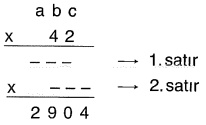

Ela, çarpma işlemi yaparken işlemin ikinci satırındaki sayının yüzler basamağını yanlışlıkla birinci satırdaki sayının onlar basamağının altına gelecek şekilde yukarıdaki gibi yazıyor.

Buna göre, a + b + c toplamı kaçtır?

A) 3 B) 4 C) 5 D) 6 E) 7

#### Tip-24

a, b ve c rakamdır.

Buna göre, a &lt; b &lt; c koşulunu sağlayan kaç farklı cba üç basamaklı doğal sayısı vardır?

A) 196 B) 120 C) 105 D) 100 E) 96

#### Tip-25

Rakamlari birbirinden farklı dört basamaklı bir doğal sayının, birler basamağındaki rakam diğer basamaklarında bulunan rakamların toplamına eşitse bu sayıya etkileşimli sayı denir.

Örneğin; 1236 sayısında 6 = 1 + 2 + 3 olduğunudan 1236 bir etkileşimli sayıdır.

Buna göre,  $ \underline{\text{en büyük}} $ etkileşimli sayı ile  $ \underline{\text{en küçük}} $ etkileşimli sayının farkı kaçtır?

A) 5034 B) 5916 C) 6086 D) 7086 E) 8826

#### TIP-26

ABC üç basamaklı ve AC iki basamaklı doğal sayılar olmak üzere,

ABC = 11 · AC

eşitliğini sağlayan üç basamaklı ABC sayılarına ayrışık sayı denir. Örneğin;

132 = 11 12

olduğundan, 132 bir ayrıışık sayıdır.

ABA bir ayrıışık sayı olduğunu göre, A rakamının alabileceği farklı değerlerin toplamı kaçtır?

A) 3 B) 6 C) 10 D) 15 E) 21

#### TIP-27

Furkan, beşer yıl arayla boyunu duvarın hizasında ölçüyor ve duvara şekildeki gibi işaretleyip santimetre cinsinden üç basamaklı doğal sayılar olarak yazıyor.

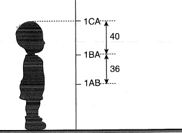

Furkan'ın boyunun ilk beş yıl 36 cm, ikinci beş yıl 40 cm uzadığı biliniyor.

A, B ve C sifirdan farklı rakamlar olduğuna göre, A + B + C toplamı kaçtir?

A) 15 B) 14 C) 13 D) 11 E) 10

## yarqi yayinevi

Tanim: x, 1'den büyük tam sayı olmak üzere;

 $$ \mathbf{e})_{x}=\mathbf{a}\cdot\mathbf{x}^{2}+\mathbf{b}\cdot\mathbf{x}^{1}+\mathbf{c}\cdot\mathbf{x}^{0}+\mathbf{d}\cdot\mathbf{x}^{-1}+\mathbf{e}\cdot\mathbf{x}^{-2} $$ 

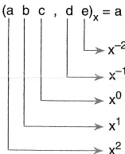

x^{-2} ler basama $ \underset{\cdot}{g} $i

x^{-1} ler basamağı

x^{0} ler basamağı

x¹ ler basamağı

 $ x^{2} $ ler basama $ gi $

biçiminde çözülenir.

&lt;div style="text-align: center;"&gt;&lt;div style="text-align: center;"&gt;Tip - 1&lt;/div&gt; &lt;/div&gt;

a ve b, 7'lik sayma sisteminde birbirinden farklı birer rakamdır.

Buna göre, a + b toplamının alabileceği  $ \underline{\text{en büyük}} $ değerin 10 tabanındaki değeri kaçtır?

A) 9 B) 10 C) 11 D) 12 E) 13

##### Tip-2

3 sayı tabani olmak üzere,

(2101) $ _{3} $

sayisinin 10 tabanindaki değeri kaçtır?

A) 36 B) 54 C) 64 D) 72 E) 90

#### Tip-3

x sayı tabani olmak üzere,

(204) $ _{x} $ + (12x) $ _{6} $

toplaminin 10 tabanındaki değeri kaçtır?

A) 103 B) 104 C) 105 D) 106 E) 107

10 Tabanından Farklı Bir Tabana Geçiş

On tabanında verilen bir sayıyı hangi tabana çevirmek istiyorsak, bu sayı o tabana sürekli bölünür ve her bir işlemde bölümlere aynı işlem uygulanır. En sondaki bölümden başlanarak, kalanların sondan başla doğru yazılması istenen sayı bulunur.

#### ORNEK

21 sayısının 4 tabanındaki eşiti kaçtır?

 $$ \begin{array}{c|c}{{{21}}}&amp;{{{4}}} \\{{{\hline20}}}&amp;{{{5}}}&amp;{{{4}}} \\{{{\hline\textcircled{1}}}}&amp;{{{\frac{4}{\textcircled{1}}}} \\\end{array} $$ 

 $$ (21)_{10}=(111)_{4} $$ 

##### Tip-4

5 sayı tabanıdır.

71 = (abc) $ _{5} $

olduğuna göre, a + b + c toplamı kaçtir?

A) 4 B) 5 C) 6 D) 7 E) 8

##### tip-5

x &gt; 4 olmak üzere,

 $$ 3x^{2}+2x+3 $$ 

sayısının x tabanındaki eşiti aşağıdakilerden hangisidir?

A) 3023 B) 3203 C) 323 D) 321 E) 320

#### TIP-6

&lt;table border=1 style='margin: auto; word-wrap: break-word;'&gt;&lt;tr&gt;&lt;td colspan="6"&gt;2 $ ^{{8}} $ doğal sayısı 4 tabanına göre yazıldığında kaç basamaklı bir sayı elde edilir?&lt;/td&gt;&lt;/tr&gt;&lt;tr&gt;&lt;td style='text-align: center; word-wrap: break-word;'&gt;A) 4&lt;/td&gt;&lt;td style='text-align: center; word-wrap: break-word;'&gt;B) 5&lt;/td&gt;&lt;td style='text-align: center; word-wrap: break-word;'&gt;C) 6&lt;/td&gt;&lt;td style='text-align: center; word-wrap: break-word;'&gt;D) 7&lt;/td&gt;&lt;td style='text-align: center; word-wrap: break-word;'&gt;E) 8&lt;/td&gt;&lt;td style='text-align: center; word-wrap: break-word;'&gt;&lt;/td&gt;&lt;/tr&gt;&lt;/table&gt;

### Taban Aritmetiğinde Dört işlem

Aynı tabanda verilen iki sayının toplamı, farklı ve çarpımı on tabanındakine benzer biçimde yapılır. İşlem sırasında iki rakamın toplamı veya çarpımı tabandan büyük çıkarsa sonuç tabana bölünür, kalan sonuç olarak yazılır ve bölüm bir sonraki basamağa eklenir.

#### tip-7

5 sayı tabanıdır.

$$(23)_{5}+(42)_{5}$$

toplaminin 5 tabanindaki degeri kaçtır?

A) 40 B) 120 C) 130 D) 210 E) 220

#### Tip-8

&lt;table border=1 style='margin: auto; word-wrap: break-word;'&gt;&lt;tr&gt;&lt;td colspan="5"&gt;3 sayı tabani olmak üzere,&lt;/td&gt;&lt;/tr&gt;&lt;tr&gt;&lt;td colspan="5"&gt;$ (210)_{3} - (22)_{3} $&lt;/td&gt;&lt;/tr&gt;&lt;tr&gt;&lt;td colspan="5"&gt;farkının 3 tabanındaki karşılığı kaçtır?&lt;/td&gt;&lt;/tr&gt;&lt;tr&gt;&lt;td style='text-align: center; word-wrap: break-word;'&gt;A) 101&lt;/td&gt;&lt;td style='text-align: center; word-wrap: break-word;'&gt;B) 102&lt;/td&gt;&lt;td style='text-align: center; word-wrap: break-word;'&gt;C) 111&lt;/td&gt;&lt;td style='text-align: center; word-wrap: break-word;'&gt;D) 112&lt;/td&gt;&lt;td style='text-align: center; word-wrap: break-word;'&gt;E) 121&lt;/td&gt;&lt;/tr&gt;&lt;/table&gt;

#### tip-9

5 sayı tabani olmak üzere,

(123) $ _{5} $ · (42) $ _{5} $

çarpiminin 5 tabanındaki karşılığı kaçtır?

A) 11321 B) 11231 C) 11031 D) 1132 E) 1301

Tabanda Teklik - Ċiftlik

x &gt; 1 olmak üzere (abc)_x ifadesinde,

1) x çift ise birler basamağındaki rakamı tek olan sayılar tek, çift olan sayılar çifttir.

2) x tek ise rakamların toplamı tek olan sayılar tek, çift olan sayılar çifttir.

##### Tip-10

(1103)_{4}, (2112)_{3}, (301)_{5}, (1001)_{6}, (2342)_{7}

sayilarindan kaç tanesi tek sayıdır?

A) 1 B) 2 C) 3 D) 4 E) 5

Tip-11

Taner 0, 1, 2, 3, 4 ve 5 rakamlarını kullanarak kitabın sayfalarını numaralandırmıştır. Kitabın sayfalarının numaralandırılma işlemi 1'den başlayıp 1, 2, 3, 4, 5, 10, 11 ... 2025 şeklinde devam ederek son sayfasına 2025 yazılmıştır.

Buna göre, bu kitap gerçekte kaç sayfadır?

A) 448 B) 449 C) 450 D) 451 E) 452

# MATEMATIK

#### A, B, C doğal sayılar ve B  $ \neq $ 0 olmak üzere

 $$ \begin{array}{c}\mathrm{A}\\\hline\mathrm{K}\end{array}\begin{array}{c}\mathrm{B}\\\hline\mathrm{C}\end{array} $$ 

Bölme işleminde

➢ A ya bölünen

C ye bölüm

➢ B ye bōlen

➢ K ya kalan denir.

##### Bu işlemde

 $$ 1,\quad0\leq K&lt;B $$ 

Ⅱ.  $ A = B \cdot C + K $

III. K = 0 ise kalansız bölme veya A sayısı B sayısına tam bölünür denir.

IV. Eğer K &lt; C ise B ile C yer değiştirebilir. Yani

 $ \frac{A}{K}\left|\frac{B}{C}\right| $ veya  $ \frac{A}{K}\left|\frac{C}{B}\right| $

#### Tip-1

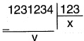

Yukaridaki bölme işlemine göre, x + y toplamı kaçtır?

A) 1001 B) 1005 C) 10010

D) 10014 E) 10020

#### Tip-2

112233 ... 99  $ \underline{11} $

Yukaridaki bölme işleminde elde edilen bölümde kaç tane sifir vardır?

A) 6 B) 7 C) 8 D) 9 E) 10

Tip-3

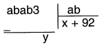

Yukaridaki bölme işlemine göre, x + y toplamı kaçtır?

A) 918 B) 921 C) 896 D) 987 E) 889

#### TIP-4

A doğal sayıdır.

 $$  A\mid\frac{12}{} $$ 

Yukaridaki bölme işleminde kalanın alabileceği değerler toplamı kaçtır?

A) 55 B) 60 C) 66 D) 70 E) 75

Tip - 5

A ve x doğal sayıdır.

 $$ \begin{array}{c|c}A&amp;\begin{array}{c}x+4\\ \hline x\end{array}\\\hline11\end{array} $$ 

Yukaridaki bölme işlemine göre, A'nın  $ \underline{\text{en küçük}} $ değeri kaçtır?

A) 103 B) 104 C) 105 D) 106 E) 107

#### Tip-6

A5 iki basamaklı doğal sayı

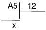

olduğuna göre, x'in alabileceği kaç farklı değer vardır?

A) 3 B) 4 C) 5 D) 6 E) 7

Tip-7

Bir bölme işleminde bölünen ile bölenin toplamı 364 tür.

Bölüm 14, kalan 4 olduğuna göre, bölünen sayı kaçtır?

A) 24 B) 80 C) 120 D) 340 E) 380

TİP - 8

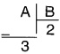

 $$ \begin{array}{r} B \\  \hline 4\end{array}\begin{array}{r} C \\  \hline 3 \end{array} $$ 

Yukaridaki bölme işlemlerine göre A'nın C cinsinden ifadesi aşağıdakilerden hangisidir?

A) 2C + 5

B) 3C + 2

C) 6C + 5

D) 6C + 11

E) 6C + 13

TIP-9

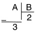

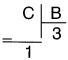

A'nin C cinsinden ifadesi nedir?

A)  $ \frac{C-5}{3} $ B)  $ \frac{2C+1}{3} $ C)  $ \frac{C+7}{3} $

D)  $ \frac{2C+7}{3} $ E)  $ \frac{C-1}{3} $

Tip-10

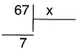

ifadesini sağlayan kaç farklı x değeri vardır?

A) 6 B) 7 C) 8 D) 9 E) 10

&lt;div style="text-align: center;"&gt;&lt;div style="text-align: center;"&gt;Tip-11&lt;/div&gt; &lt;/div&gt;

111222...999 | 111

ifadesinde elde edilen bölüm kaç basamaklıdır?

A) 25 B) 26 C) 27 D) 28 E) 29

&lt;div style="text-align: center;"&gt;&lt;div style="text-align: center;"&gt;Tip-12&lt;/div&gt; &lt;/div&gt;

112233 … 99 | 111

Yukaridaki bölme işleminde elde edilen bölüm kaç basamaklı bir sayıdır?

A) 14 B) 15 C) 16 D) 17 E) 18

&lt;div style="text-align: center;"&gt;&lt;div style="text-align: center;"&gt;Tip-13&lt;/div&gt; &lt;/div&gt;

İki basamaklı AB ve BA doğal sayıları 17 ile bölündüğünde sırasıyla 13 ve 4 kalanıni veriyor.

Buna göre, A · B çarpımı kaçtır?

A) 36 B) 42 C) 56 D) 72 E) 80

#### Tip-14

Berke bir bölme işlemi yaparken işlemi soldan sağa doğru yapacağına sağdan sola doğru yaparak işlemi tamamlıyor.

Örneğin;

 $$ \begin{array}{r} 28 \quad 7 \\-7 \quad 13 \\ \hline 21 \\ \hline 21 \\ \hline 0 \end{array} $$ 

 $$ \begin{array}{r} 28 \\ - \quad 28 \hline \end{array} \quad \begin{array}{r} 7 \\ \hline 4 \end{array} $$ 

(Berke'nin işlemi)

&lt;div style="text-align: center;"&gt;&lt;div style="text-align: center;"&gt;(Gerçek sonuç)&lt;/div&gt; &lt;/div&gt;

Buna göre,

 $$ 27\left|\begin{array}{c}3\\ -\end{array}\right. $$ 

işleminde Berke'nin elde ettiği bölüm ile gerçek bölümün toplamı kaçtır?

A) 34 B) 35 C) 36 D) 37 E) 38

### BÖLÜNEBİLME KURALLARI

### 2 ile Bölünebilme

Birler basamağı çift olan sayılar 2 ile tam bölünür.

### 3 ile Bölünebilme

Sayının rakamları toplamı 3 ün katı ise sayı 3 ile tam bölünür.

Rakamlar toplaminin 3 ile bölümünden artan, kalandır.

### 4 ile Bölünebitme

Sayının son iki basamağı 4 ün katı ise sayı 4 ile tam bölünür.

Sayının son iki basamağını oluşturan sayının 4 ile bölümünden artan, kalandır.

### 5 ile Bölünebilme

Birler basamağı 0 veya 5 olan sayılar, 5 ile tam bölünür.

### 8 ile Bölünebilme

Birler basamağının 5 ile bölümünden artan, kalandır.

Sayının son üç basamağı 8 in katı ise sayı 8 ile tam bölünür.

Sayının son üç basamağını oluşturan sayının 8 ile bölümünden artan, kalandır.

### 9 ile Bölünebilme

Sayının rakamları toplamı 9 un katı ise sayı 9 ile tam bölünür.

Rakamlar toplaminin 9 ile bölümünden artan, kalandır.

### 10 ile Bölünebilme

Birler basamağındaki rakamı 0 olan sayılar 10 ile tam bölünür.

Bir sayının birler basamağındaki rakam, o sayının 10 ile bölümünden kalındır.

### 11 ile Bölünebilme

Sayının rakamları sağdan sola doğru, +,-, +,-, ... ile işaretlenerek toplanır. Toplamin 11 ile bölümünden artan, kalandır.

#### ARALARINDA ASAL CARPANLARA BÖLÜNEBİLME

Aralarında asal çarpanların her birine tam bölünen sayı, bunların çarpımına da tam bölünür.

6 = 2 · 3 (2 ile 3 aralarında asaldır.) 2 ve 3 ile tam bölünen sayılar 6 ile tam bölünür.

12 = 3 · 4 (3 ile 4 aralarında asaldır.) 4 ve 9 ile tam bölünen sayılar 36 ile tam bölünür.

60 = 3 · 4 · 5 (3, 4, 5 ikişer ikişer aralarında asaldır.) 3, 4 ve 5 ile tam bölünen sayılar 60 ile tam bölünür.

##### TIP-1

1273 sayısının

3 ile bölümünden kalan x,

5 ile bölümünden kalan y,

9 ile bölümünden kalan z'dir.

A) -3 B) -2 C) 0 D) 3 E) 4

 $$ (174)^{2}-(73)^{3}-(1907)^{2} $$ 

sayisinin 5 ile bölümünden kalan kaçtir?

A) 0 B) 1 C) 2 D) 3 E) 4

##### TIP-4

 $$ 0!+1!+2!+3!+\ldots\ldots+100! $$ 

sayisinin 5 ile bölümünden kalan kaçtir?

A) 0 B) 1 C) 2 D) 3 E) 4

TIP-5

2! + 4! + 6! + ..... + 80!

sayisinin 42 ile bölümünden kalan kaçtir?

A) 26 B) 28 C) 30 D) 32 E) 35

TiP-3

232323 ... 2

17 basamaklı doğal sayısının 9 ile bölümünden kalan kaçtir?

A) 2 B) 3 C) 5 D) 6 E) 7

#### TIP-6

x sayisinin 3 ile bölümünden kalan 2'dir.

Buna göre,  $ x^{2} + 3x - 1 $ sayısının 3 ile bölümünden kalan kaçtır?

A) 0 B) 1 C) 2 D) 3 E) 4

#### tip-7

2x3y dört basamaklı doğal sayısının 15 ile bölümünden kalan sifirdir.

Buna göre x + y toplamının  $ \underline{\text{en büyük}} $ değeri kaçtır?

A) 10 B) 11 C) 12 D) 13 E) 14

#### Tip-8

a21b dört basamaklı sayısının 5 ile bölümünden kalan 2, 9 ile bölümünden kalan 2 ise a + b toplamının  $ \underline{\text{en büyük}} $ değeri kaçtır?

A) 3 B) 5 C) 8 D) 10 E) 12

#### TIP-9

x23y dört basamaklı sayının 5 ile bölümünden kalan 2'dir.

Bu sayının 11 ile tam bölünebilmesi için x'in alabileceği  $ \underline{\text{en büyük}} $ değer kaçtır?

A) 1 B) 4 C) 5 D) 6 E) 9

#### TIP-10

Bir pazarcı tanesi 45 liradan çift sayıda gömlek alıyor ve parasını ödiyor. Aldığı faturada iki rakam silik çıkarak dört basamaklı -17- sayısı yazıyor.

Buna göre, silik çıkan iki rakamın farkı kaçtır?

A) 4 B) 3 C) 2 D) 1 E) 0

#### Tip-11

Birden fazla ardışık pozitif tam sayının çarpımı olarak yazılabilen doğal sayılara faktörsel sayı denir.

Buna göre, 5 ile tam bölünen iki basamaklı faktörsel sayıların toplamı kaçtır?

A) 140 B) 160 C) 180 D) 200 E) 220

#### TIP-12

Üç basamaklı ABA doğal sayısı 5 ile BAB doğal sayısı 12 ile tam bölünebilmektedir.

Buna göre, A + B toplamı kaçtır?

A) 7 B) 8 C) 9 D) 10 E) 11

#### TIP-13

A, B ve C sıfırdan ve birbirinden farklı rakamlar olmak üzere,

ABC, ACB, BAC, BCA

üç basamaklı doğal sayılarından ikisi 4'e, diğer ikisi 5'e tam bölümektedir.

Buna göre, A + B + C toplamı kaçtır?

A) 10 B) 11 C) 12 D) 13 E) 14

#### TIP-14

p ve r birbirinden farklı asal sayılar olmak üzere,

300 · r

sayısı p sayısının bir tam sayı katıdır.

Buna göre, p asal sayısı aşağıdaki sayılardan hangisini  $ \underline{\text{kesinlikle}} $ tam böler?

A) 12·r B) 18·r C) 20·r D) 30·r E) 45·r

#### TIP-15

&lt;table border=1 style='margin: auto; word-wrap: break-word;'&gt;&lt;tr&gt;&lt;td style='text-align: center; word-wrap: break-word;'&gt;x bir doğal sayı olmak üzere,&lt;/td&gt;&lt;td style='text-align: center; word-wrap: break-word;'&gt;A) 10&lt;/td&gt;&lt;td style='text-align: center; word-wrap: break-word;'&gt;B) 11&lt;/td&gt;&lt;td style='text-align: center; word-wrap: break-word;'&gt;C) 12&lt;/td&gt;&lt;td style='text-align: center; word-wrap: break-word;'&gt;D) 13&lt;/td&gt;&lt;td style='text-align: center; word-wrap: break-word;'&gt;E) 14&lt;/td&gt;&lt;/tr&gt;&lt;tr&gt;&lt;td colspan="6"&gt;$ \frac{10^{x}-22}{3} $ dçoğal sayısının rakamları toplamı 38&amp;#x27;dir. Buna göre, x kaçtır?&lt;/td&gt;&lt;/tr&gt;&lt;/table&gt;

#### Tip-16

Bir T.C. vatandaşının kimlik numarasının son rakamı soldan 10 basamağı toplamının 10 ile bölümünden kalan ile bulunur.

&lt;table border=1 style='margin: auto; word-wrap: break-word;'&gt;&lt;tr&gt;&lt;td colspan="6"&gt;Son rakami 4 olan bir vatandaşın T.C. kimlik numarasının toplama aşağıdakilerden hangisi olabilir?&lt;/td&gt;&lt;/tr&gt;&lt;tr&gt;&lt;td style='text-align: center; word-wrap: break-word;'&gt;A) 98&lt;/td&gt;&lt;td style='text-align: center; word-wrap: break-word;'&gt;B) 84&lt;/td&gt;&lt;td style='text-align: center; word-wrap: break-word;'&gt;C) 78&lt;/td&gt;&lt;td style='text-align: center; word-wrap: break-word;'&gt;D) 74&lt;/td&gt;&lt;td style='text-align: center; word-wrap: break-word;'&gt;E) 64&lt;/td&gt;&lt;td style='text-align: center; word-wrap: break-word;'&gt;&lt;/td&gt;&lt;/tr&gt;&lt;/table&gt;

&lt;div style="text-align: center;"&gt;&lt;div style="text-align: center;"&gt;tip-17&lt;/div&gt; &lt;/div&gt;

Gözde 1'den 100'e kadar olan doğal sayıları sırasıyla aşağıdaki gibi defterine yazıyor.

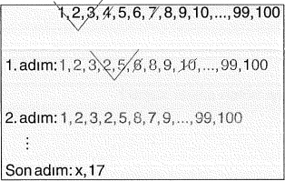

Sonrasında bu listeden her bir adında rastgele iki sayıyı seçip topluyor ve 9 ile kalanıni defterine yazıp topladığı iki sayıyı siliyor. Bu işlemi son adında iki sayı kalana kadar devam ettiriyor.

Gözde'nin yaptığı bu işlemlerin sonunda listede bıraktığı sayılardan biri 17, diğerisi x'tir.

Buna göre, son adında listede kalan x sayısı  $ \underline{\text{en az}} $ kaçtır?

A) 1 B) 2 C) 3 D) 4 E) 5

##### Tip-18

Aşağıda boyunun uzunluğu üç basamaklı a3b cm olan iki eşit uzunluğun ayı ayı 3 ve 5 cm'lik parçalara ayrılmasının görünmü verilmiştir.

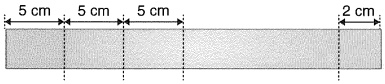

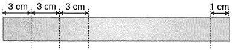

Buna göre, a + b toplaminin  $ \underline{\text{en büyük}} $ değeri kaçtır?

A) 10 B) 12 C) 14 D) 16 E) 18

#### Asal Çarpanlar

x, y, z pozitif tam sayılar ve a, b, c birbirinden farklı asal sayılar olmak üzere,  $ A = a^x \cdot b^y \cdot c^z $ ifadeseine  $ A' $nın asal çarpanlarına ayrılması denir.

### NOT

x, y ve z pozitif tam sayılar ve a, b ve c birbirinden farklı asal sayılar olmak üzere,

 $ A = a^{X} \cdot b^{Y} \cdot c^{Z} $

şeklinde asal çarpanlarına ayrılmış olan A doğal sayısının,

1. Pozitif tam sayı bölenlerinin sayısı

P·b·s = (x + 1)(y + 1)(z + 1)

2. Negatif tam sayı bölenlerinin sayısı

N·b·s = (x + 1)(y + 1)(z + 1)

3. Tam sayi bölenlerinin sayısı

T·b·s = 2·(p·b·s)

4. Asal olmayan pozitif tam sayı bölenlerin sayısı A·O·P·B·S = P·B·S - {asal sayı adedi}

##### tip-1

60 sayisini tam bōlen kaç tane doğal sayı vardır?

A) 12 B) 13 C) 15 D) 17 E) 19

#### Tip-2

120 sayisinin,

a) Pozitif tam sayı bölen sayısı kaçtır?

b) Negatif tam sayı bölen sayısı kaçtır?

CEVAP: (16)

c) Tam sayı bölenlerinin sayısı kaçtır?

CEVAP: (16)

CEVAP: (32)

d) Asal olmayan pozitif tam bölen sayısı kaçtır?

CEVAP: (13)

e) Pozitif tam sayı bölenlerinden kaç tanesi çift sayıdır?

CEVAP: (12)

f) 15'in katı olan kaç tane pozitif tam sayı böleni vardır?

CEVAP: (4)

&lt;div style="text-align: center;"&gt;&lt;div style="text-align: center;"&gt;Tip-3&lt;/div&gt; &lt;/div&gt;

60 sayisinin,

a) Pozitif bölenlerinden kaç tanesi çifttir?

A) 8 B) 7 C) 6 D) 5 E) 4

b) Pozitif bölenlerinden kaç tanesi 3 ile tam bölünür?

A) 2 B) 4 C) 6 D) 8 E) 10

c) Pozitif bölenlerinin kaç tanesi 15'in katıdır?

A) 4 B) 6 C) 5 D) 2 E) 3

&lt;div style="text-align: center;"&gt;&lt;div style="text-align: center;"&gt;TIP-4&lt;/div&gt; &lt;/div&gt;

 $$ 111^{2}+222^{2}+333^{2} $$ 

sayisinin  $ \underline{\text{en büyük}} $ asal çarpanı ile  $ \underline{\text{en küçük}} $ asal çarpanının toplamı kaçtir?

A) 37 B) 39 C) 41 D) 43 E) 47

#### Tip - 5

A'nin 3 tane pozitif böleni olduğuna göre A kaç farklı değer alır?

A) 1 B) 2 C) 3 D) 4 E) 5

 $$ 8\cdot6^{x} $$ 

sayısının 18 tane pozitif tam sayı böleni olduğuna göre x kaçtır?

A) 2 B) 3 C) 4 D) 5 E) 6

#### TIP-7

x ve y pozitif doğal sayıdır.

 $$ 36\cdot x=y^{2} $$ 

ifadesini sağlayan  $ \underline{\text{en küçük}} $ x + y toplamı kaçtır?

A) 7 B) 10 C) 16 D) 20 E) 32

#### Tip-8

a ve b pozitif doğal sayıdır.

60 $ \cdot $a = b $ ^{2} $

denklemini sağlayan  $ \underline{\text{en küçük}} $ a + b toplamı kaçtır?

A) 15 B) 30 C) 45 D) 50 E) 60

#### tip-9

a ve b sifirdan farklı tam sayıdır.

 $ 24 \cdot a = b^{2} $

denklemini sağlayan a + b toplamının  $ \underline{\text{en küçük}} $ değeri kaçtır?

A) -6 B) 6 C) 12 D) 18 E) 24

#### Tip-10

x doğal sayıdır.

 $ \frac{60}{x} $

ifadesinin sonucu asal sayı ise x in alabileceği değerler toplamı kaçtır?

A) 10 B) 20 C) 44 D) 62 E) 76

##### Tip-11

x pozitif bir tam sayı olmak üzere, x ten büyük en küçük asal sayıya “x in asal komşusu” denir ve A[x] ile gösterilir.

Örneğin:

A[4] = 5

A[11] = 13 gibi

Buna göre,

A[x] + A[y] = 13

esitliğini sağlayan kaç tane (x, y) sıralı ikilisi vardır?

A) 6 B) 7 C) 8 D) 9 E) 10

#### TIP-12

n bir pozitif tam sayı olmak üzere, ⓘ gösterimi ile n sayısının farklı asal bölenlerinin sayısı gösteriliyor. Ayrıca, m bir doğal sayı olmak üzere, ⬛ gösterimi ile m sayısının basamak sayısı gösteriliyor.

x pozitif tam sayısı için,

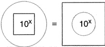

esitliği sağlanıyor.

Buna göre, x sayısı aşağıdakilerden hangisi olabilir?

A) 9 B) 11 C) 13 D) 15 E) 17

#### EBOB: En büyük ortak bölen demektir.

Örnek:

 $$ \begin{array}{r|r}20&amp;\quad50&amp; \textcircled{10} \quad \rightarrow\text{EBOB}=10\\2&amp;\quad5&amp; \\ \hline \end{array} $$ 

EBOB (3, 9) = 3

EBOB (8, 10) = 2

➢ EBOB (a, b) = k ise

 $ \frac{a}{k} $ ve  $ \frac{b}{k} $ tam sayıdır.

EBOB (a, b) = 2 ise

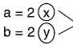

aralarında asaldır.

EKOK: En küçük ortak kat demektir.

 $$ \begin{array}{|c|c|c|}\hline{{\underline{{\mathcal{O r n e k}}}}:}}&amp;{{20}}&amp;{{15}}\\ \hline{{4}}&amp;{{3}}&amp;{{3}}\\ {{4}}&amp;{{1}}&amp;{{4}}\\ {{1}}&amp;{{}}&amp;{{}}\end{array} $$ 

1) EBOB (a, b) ≤ a, b ≤ EKOK (a, b)

EKOK = 5.3.4 = 60

Özellikler

2)  $  \mathbf{a} \cdot \mathbf{b} = \text{EBOB} \, (\mathbf{a}, \mathbf{b}) \cdot \text{EKOK} \, (\mathbf{a}, \mathbf{b})  $

3) EKOK  $ \left(\frac{a}{b}, \frac{c}{d}, \frac{e}{f}\right) = \frac{Ekok(a, c, e)}{Ebob(b, d, f)} $

4) Aralarında asal ya da ardışık sayıların EBOB'ları 1, EKOK'ları sayıların çarpımıdır.

5)  $ \underline{\text{Problem sorularinda}} $;

1. Parçadan bütüne gidiliyorsa

- Tuğlalandan küp yapma

– Sayının bölenlerini verip sayıyı bulma gibi

yani birleştirme, birlikte zil çalma gibi yapım olayı varsa sorunun

çözümü EKOK'tur.

##### II. Bütün eşit parçalanıyorsa,

– Tarla etrafina eșit aralikli ağaç dikme

- Çuvallardaki ürünleri esit ayırma

- Ēubuklari eşit bölme

gibi eşit parçalama, bölme, kesme, ayırma gibi yıkım olayları varsa sorunun çözümünde EBOB kullanılır.

#### MATEMATIK

#### TIP-1

EKOK'ları 12 olan iki doğal sayının toplamının  $ \underline{\text{en büyük}} $ değeri kaçtır?

A) 12 B) 18 C) 24 D) 36 E) 48

&lt;div style="text-align: center;"&gt;&lt;div style="text-align: center;"&gt;TIP-2&lt;/div&gt; &lt;/div&gt;

EKOK'ları 36 olan farklı iki doğal sayının toplamı en çok kaçtır?

A) 36 B) 54 C) 72 D) 80 E) 108

&lt;div style="text-align: center;"&gt;&lt;div style="text-align: center;"&gt;Tip-4&lt;/div&gt; &lt;/div&gt;

EKOK'ları 45 olan farklı iki doğal sayının toplamının  $ \underline{\text{en küçük}} $ değerik  $ \underline{\text{kaçtır?}} $

A) 10 B) 11 C) 12 D) 13 E) 14

EKOK'ları 50 olan üç farklı doğal sayının toplamının  $ \underline{\text{en büyük}} $ değerik  $ \underline{\text{kaçtır}} $?

A) 50 B) 75 C) 80 D) 85 E) 90

&lt;div style="text-align: center;"&gt;&lt;div style="text-align: center;"&gt;Tip-3&lt;/div&gt; &lt;/div&gt;

Tip-5

EBOB'lari 5 olan farklı iki pozitif doğal sayının toplamı  $ \underline{\text{en az}} $ kaçtır?

A) 5 B) 15 C) 20 D) 30 E) 45

&lt;div style="text-align: center;"&gt;&lt;div style="text-align: center;"&gt;TIP-6&lt;/div&gt; &lt;/div&gt;

EBOB'lari 4 olan beş farklı doğal sayının toplamı  $ \underline{\text{en az}} $ kaçtır?

A) 40 B) 50 C) 60 D) 70 E) 80

&lt;div style="text-align: center;"&gt;&lt;div style="text-align: center;"&gt;TIP-7&lt;/div&gt; &lt;/div&gt;

a ve b ardişik doğal sayilardır.

EKOK (a, b) + EBOB (a, b) = 133

olduğuna göre, a + b toplamı kaçtır?

A) 10 B) 11 C) 23 D) 25 E) 36

#### Tip-8

a ve b aralarında asaldır.

EKOK (a,b) = 300

 $ b + \frac{36}{a} = 28 $

olduğuna göre, a + b toplamı kaçtr?

A) 12 B) 15 C) 25 D) 37 E) 45

#### Tip-9

x doğal sayı ve x &lt; 27 veriliyor.

EBOB (x,4) = 2

koşulunu sağlayan kaç farklı x doğal sayısı vardır?

A) 4 B) 5 C) 6 D) 7 E) 8

#### Tip-10

 $$ \mathsf{A}=2^{3}\cdot3^{4}\cdot5^{1} $$ 

 $$ \mathsf{B}=2^{2}\cdot3^{3}\cdot5^{2} $$ 

 $$ \mathsf{C}=2\cdot3^{2} $$ 

olduġuna gõre,  $ \frac{EKOK(A,B,C)}{EBOB(A,B,C)} $ ifadesinin sonucu kaçtir?

A) 800 B) 850 C) 900 D) 950 E) 1000

&lt;div style="text-align: center;"&gt;&lt;div style="text-align: center;"&gt;TIP-11&lt;/div&gt; &lt;/div&gt;

&lt;table border=1 style='margin: auto; word-wrap: break-word;'&gt;&lt;tr&gt;&lt;td colspan="5"&gt;A, B ve C farklı doğal sayılardır.&lt;/td&gt;&lt;/tr&gt;&lt;tr&gt;&lt;td colspan="5"&gt;EBOB (A, B) = 2&lt;/td&gt;&lt;/tr&gt;&lt;tr&gt;&lt;td colspan="5"&gt;EBOB (A, C) = 3&lt;/td&gt;&lt;/tr&gt;&lt;tr&gt;&lt;td colspan="5"&gt;EBOB (B, C) = 5&lt;/td&gt;&lt;/tr&gt;&lt;tr&gt;&lt;td colspan="5"&gt;ifadesini sağlayan  $ \underline{\text{en küçük}} $ A + B + C toplamı kaçtır?&lt;/td&gt;&lt;/tr&gt;&lt;tr&gt;&lt;td style='text-align: center; word-wrap: break-word;'&gt;A) 21&lt;/td&gt;&lt;td style='text-align: center; word-wrap: break-word;'&gt;B) 25&lt;/td&gt;&lt;td style='text-align: center; word-wrap: break-word;'&gt;C) 30&lt;/td&gt;&lt;td style='text-align: center; word-wrap: break-word;'&gt;D) 31&lt;/td&gt;&lt;td style='text-align: center; word-wrap: break-word;'&gt;E) 40&lt;/td&gt;&lt;/tr&gt;&lt;/table&gt;

&lt;div style="text-align: center;"&gt;&lt;div style="text-align: center;"&gt;TIP-12&lt;/div&gt; &lt;/div&gt;

&lt;table border=1 style='margin: auto; word-wrap: break-word;'&gt;&lt;tr&gt;&lt;td style='text-align: center; word-wrap: break-word;'&gt;Boyutları sırasıyla 3, 4 ve 5 m olan tuğlalardan içi dolu bir küp yapılacaktır. Bunun için  $ \underline{\text{en az}} $ kaç tuğla gerekir?&lt;/td&gt;&lt;/tr&gt;&lt;tr&gt;&lt;td style='text-align: center; word-wrap: break-word;'&gt;A) 36 B) 360 C) 720 D) 260 E) 3600&lt;/td&gt;&lt;/tr&gt;&lt;/table&gt;

&lt;div style="text-align: center;"&gt;&lt;div style="text-align: center;"&gt;TIP-13&lt;/div&gt; &lt;/div&gt;

Bir sepetteki güller 2 şer, 3 er ve 5 er sayıldığında her seferinde 1 gül artmaktadır.

Sepetteki gül sayısı 200'den fazla olduğuına göre, bu sepette  $ \underline{\text{en az}} $ kaç gül vardır?

A) 211 B) 212 C) 215 D) 220 E) 230

#### tip-14

Üç farklı zil sırayla  $ \frac{2}{3} $,  $ \frac{4}{5} $ ve  $ \frac{6}{7} $ saatte bir çalmaktadır.

Üçü aynı anda saat 13.00'te çaldıktan sonra tekrar saat kaçta  $ \underline{\text{ilk kez}} $

birlikte çalar?

A) 13.00 B) 15.00 C) 17.00

D) 23.00 E) 01.00

#### Tip-15

A iki basamaklı bir doğal sayıdır.

A = 3x + 1 = 4y + 2 = 6z - 2

olduğuna göre, bu koşula uygun  $ \underline{\text{en büyük}} $ A sayısının rakamlar toplamı kaçtır?

A) 11 B) 12 C) 13 D) 14 E) 15

#### Tip-16

Boyutlari 40 m ye 60 m olan dikdörtgen şeklindeki bir bahçenin etrafına esit aralıklarla ağaçlar dikilecektir.

Her bir köşeye bir ağaç gelmek şartıyla  $ \underline{\text{en az}} $ kaç ağaç dikilir?

A) 8 B) 10 C) 12 D) 14 E) 16

#### Tip-17

Boyutlari 60 m ye 90 m olan dikdörtgen şeklindeki bir bahçenin içi eşit karesel parsellere ayrılacaktır.

Bunun için  $ \underline{\text{en az}} $ kaç tane parsel gerekir?

A) 3 B) 4 C) 6 D) 9 E) 18

Tip-18

Boyutlari 60 m ye 40 m olan bir bahçenin içi karesel parselere ayrılacaktır.

Bunun için  $ \underline{\text{en az}} $ kaç tane parsel gerekir?

A) 1 B) 2 C) 3 D) 5 E) 12

#### Tip-19

Üç farklı çubuğun uzunluğu sırasıyla 15, 30, 50 metredir. Bu çubuklar ayrı ayrı eşit uzunlukta kesilecektir.

a) Kesim sonucunda  $ \underline{\text{en az}} $ kaç parça oluşur?

A) 16 B) 17 C) 18 D) 19 E) 20

b)  $ \underline{\text{En az}} $ kaç kesim yapılmalıdır?

A) 16 B) 17 C) 18 D) 19 E) 20

#### Tip-20

Üç farklı çuvaldaki 60, 80, 100 kg lik mercimekler birbiriyle karıştırılmadan eşit ağırlıkta torbalara ayrılacaktır.

Bunun için  $ \underline{\text{en az}} $ kaç tane torba gerekir?

A) 9 B) 10 C) 11 D) 12 E) 13

#### TIP-21

&lt;table border=1 style='margin: auto; word-wrap: break-word;'&gt;&lt;tr&gt;&lt;td colspan="5"&gt;a ve b pozitif tam saylardır.&lt;/td&gt;&lt;/tr&gt;&lt;tr&gt;&lt;td colspan="5"&gt;EKOK(a, b) = 84 ve EBOB(a, b) = 4\na + b = 40&lt;/td&gt;&lt;/tr&gt;&lt;tr&gt;&lt;td colspan="5"&gt;olduğu biliniyor.&lt;/td&gt;&lt;/tr&gt;&lt;tr&gt;&lt;td colspan="5"&gt;Buna göre, la - bl kaçtır?&lt;/td&gt;&lt;/tr&gt;&lt;tr&gt;&lt;td style='text-align: center; word-wrap: break-word;'&gt;A) 12&lt;/td&gt;&lt;td style='text-align: center; word-wrap: break-word;'&gt;B) 14&lt;/td&gt;&lt;td style='text-align: center; word-wrap: break-word;'&gt;C) 16&lt;/td&gt;&lt;td style='text-align: center; word-wrap: break-word;'&gt;D) 18&lt;/td&gt;&lt;td style='text-align: center; word-wrap: break-word;'&gt;E) 20&lt;/td&gt;&lt;/tr&gt;&lt;/table&gt;

#### TIP-22

m ve n pozitif tam sayılar olmak üzere,

EBOB(m, n) + EKOK(m, n) = 289

m + n ≠ 289

olduğu biliniyor.

Buna göre, m + n toplamı kaçtır?

A) 41 B) 43 C) 45 D) 47 E) 49

&lt;div style="text-align: center;"&gt;&lt;div style="text-align: center;"&gt;TIP-23&lt;/div&gt; &lt;/div&gt;

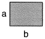

Boyutlari tam sayi cinsinden a cm ve b cm olan yukaridaki fayansla bir kenarının uzunluğu 80 cm olan duvar aşağıdaki gibi Şekil - I'de sadece yatay biçimde Şekil - II'de ise sadece dikey olacak biçimde boşluk kalmadan kaplanıyor.

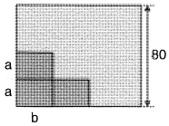

$ekil - 1

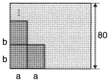

$ekil-11

Fayanslar Şekil - İl'deki gibi dizildiğinde Şekil - İ'dekine göre yatay sırada kullanılan fayans sayısı 4 artarken yükseklikte kullanılan fayans sayısı 4 azalmaktadır.

Buna göre, a'b çarpımı  $ \underline{\text{en az}} $ kaçtir?

A) 12 B) 15 C) 20 D) 24 E) 42

#### TIP-24

a ve b pozitif tam sayıları arasında;

a = EBOB(2020, b)

bağıntısı vardır.

#### Buna göre;

1. a tek sayı ise b çift sayıdır.

II. a çift sayı ise b de çift sayıdır.

III. a tek sayı ise b de tek sayıdır.

#### ifadelerinden hangileri doğrudur?

A) Yalnız I

B) Yalnız II

C) Yalnız III

D) II ve III

E) I, II ve III

### MATEMATIK

Tanim: a ve b tam sayı olmak üzere (b ≠ 0),  $ \frac{a}{b} $ şeklindeki ifadelerdir.

 $$ \star\frac{a}{b}=\frac{1}{2},\frac{3}{5},\frac{-7}{9},\frac{0}{7},\left(\frac{7}{0}\right),-3,-7 $$ 

 $ ^{*} $ Paydayi sifir yapan ifade kesiri tanımsız yapar.

a. Kesir Çeşitleri

1- Basit Kesir

Payi paydasindan mutlak değerce küçük olan kesirlerdir.

 $$ \frac{a}{b}=\frac{1}{2},\frac{-1}{7},\frac{-3}{5} $$ 

2- Bileşik Kesir

Payi paydasindan mutlak değerce büyük ya da eşit olan kesirlerdir.

 $$ \frac{a}{b}=\frac{7}{3},\frac{-2}{1},5,1 $$ 

3- Tam Sayiti Kesir

 $$ a\frac{b}{c}=a+\frac{b}{c}=\frac{c\cdot a+b}{c} $$ 

Örnek;  $ 2\frac{3}{5} = 2 + \frac{3}{5} = \frac{2 \cdot 5 + 3}{5} = \frac{13}{5} $

 $$ \ast-a\frac{b}{c}=-\left(a+\frac{b}{c}\right) $$ 

 $$ \begin{aligned}\ddot{Ornek};-2\frac{3}{7}&amp;=-\left(2+\frac{3}{7}\right)\\&amp;=-\left(\frac{2\cdot7+3}{7}\right)\\&amp;=\frac{-17}{7}\end{aligned} $$ 

4- Sabit Kesir

 $$ \frac{a x+b}{c x+d}\Rightarrow\frac{a}{c}=\frac{b}{d} $$ 

Örnek;  $ \frac{2x-k}{-6x+3} $ sabit kesir ise k kaçtır?

 $$ \frac{2}{-6}\times\frac{-k}{3}\Rightarrow6k=6\Rightarrow k=1\text{dir}. $$ 

### NOT

Sayının üstünde eksi varsa ters çevir.

 $$ \left(\frac{a}{b}\right)^{-x}=\left(\frac{b}{a}\right)^{x}=\frac{b^{x}}{a^{x}} $$ 

Örnekler  $ 2^{-1} = \frac{1}{2} $

 $$ *\left(\frac{3}{2}\right)^{-2}=\left(\frac{2}{3}\right)^{2}=\frac{2^{2}}{3^{2}}=\frac{4}{9} $$ 

## b. Rasyonel Sayilarda Dört işlem

1- Toplama - Çıkarma

Toplama çıkarma işlemi yapılırken paydalar eşitlenir.

 $$ \frac{\mathbf{a}}{\mathbf{b}}(\mathbf{d})+\frac{\mathbf{c}}{\mathbf{d}}(\mathbf{b})=\frac{\mathbf{a}\cdot\mathbf{d}+\mathbf{c}\cdot\mathbf{b}}{\mathbf{b}\cdot\mathbf{d}} $$ 

Örnek;  $ \frac{1}{3} + \frac{2}{7} - \frac{1}{2} = \frac{14 + 12 - 21}{3 \cdot 7 \cdot 2} = \frac{5}{42} $

### 2- Carpma işlemi

Çarpma işleminde pay ile pay, payda ile payda çarpılır.

 $ \frac{a}{b} \cdot \frac{c}{d} = \frac{a \cdot c}{b \cdot d} $

3- Bölme işlemi

Bölme işlemi yapılırken birinci sayı aynen durur, ikinci sayı ters çevrilerek çarpım durumuna getirilir.

I)  $ \frac{a}{b} : \frac{c}{d} = \frac{a}{b} \cdot \frac{d}{c} = \frac{a \cdot d}{b \cdot c} $

II)  $ \frac{\frac{a}{b}}{\frac{c}{d}} = \frac{a}{b} \cdot \frac{d}{c} = \frac{a \cdot d}{b \cdot c} $

III)  $ \frac{a}{b} = a \cdot \frac{c}{b} = \frac{a \cdot c}{b} $

1) Varsa parantez ici

c. İşlem Önceliği

2) Carpma, bölme

3) Toplama, çıkarma

tip-1

 $$ \frac{5-x}{x+2} $$ 

ifadesini tanimsiz yapan x değeri kaçtır?

A) -1 B) -2 C) -3 D) -4 E) -5

TIP-2

$\frac{1}{1-\frac{1}{x-2}}$

kesrini tanimsiz yapan x değerler toplamı kaçtır?

A) 3 B) 4 C) 5 D) 6 E) 7

tip-3

 $$ \frac{x-2}{7} $$ 

ifadesini basit kesir yapan kaç farklı x doğal sayısı vardır?

A) 3 B) 5 C) 7 D) 9 E) 11

TIP-4

$\frac{\frac{1}{3}-\frac{1}{2}}{\frac{1}{4}+\frac{1}{3}}$

işleminin sonucu kaçtır?

A) $\frac{-2}{7}$ B) $\frac{1}{5}$ C) $\frac{1}{7}$ D) $\frac{2}{7}$ E) $\frac{1}{3}$

Tip-5

 $ \frac{2\frac{1}{3}-1\frac{2}{5}}{4\frac{1}{2}+1\frac{1}{3}} $

işleminin sonucu kaçtır?

A) $\frac{2}{5}$ B) $\frac{3}{25}$ C) $\frac{1}{6}$ D) $\frac{2}{15}$ E) $\frac{4}{25}$

 $$ \frac{1453\frac{7}{5}-1451\frac{2}{5}}{1907\frac{7}{3}-1905\frac{1}{3}} $$ 

Tip-6

işleminin sonucu kaçtır?

A) $\frac{4}{3}$ B) $\frac{1}{5}$ C) $\frac{4}{15}$ D) $\frac{3}{4}$ E) $\frac{2}{35}$

Tip - 7

 $$ \left(\frac{8}{3}-\frac{1}{2}+\frac{5}{11}\right)-\left(\frac{1}{2}-\frac{4}{3}-\frac{6}{11}\right) $$ 

işleminin sonucu kaçtır?

A) 4 B) 5 C) 6 D) 7 E) 8

Tip-8

$$1+\frac{1}{1-\frac{1}{1+\frac{1}{2}}}:3$$

işleminin sonucu kaçtır?

A) 1 B) 2 C) 3 D) 4 E) 5

tip - 9

 $ \frac{8}{3+\frac{4}{x-1}}=2 $

işleminde x kaçtır?

A) 1 B) 3 C) 5 D) 7 E) 9

&lt;div style="text-align: center;"&gt;&lt;div style="text-align: center;"&gt;TIP-10&lt;/div&gt; &lt;/div&gt;

 $$ \frac{10}{3+\frac{8}{1+\frac{4}{x+1}}}=2 $$ 

isleminde x kaçtir?

A) $\frac{1}{3}$ B) $\frac{2}{5}$ C) $\frac{1}{4}$ D) $1$ E) $\frac{1}{5}$

#### Tip-11

 $ \frac{\frac{2}{3}-\frac{1}{7}+\frac{5}{11}}{-\frac{3}{7}+2+\frac{15}{11}} $

işleminin sonucu kaçtır?

A) $\frac{1}{3}$ B) $\frac{1}{2}$ C) $\frac{2}{3}$ D) $1$ E) $2$

#### Tip-12

A =  $ \frac{5}{7} - \frac{2}{3} + \frac{1}{2} $ ifades i verilior.

 $ \frac{9}{7}+\frac{8}{3}-\frac{5}{2} $

ifadesinin A cinsinden değeri nedir?

A) 2 - A          B) 1 - A          C) A          D)  $ A + 1 $      E)  $ A + 2 $

#### Tip-13

 $$ \left(1-\frac{71}{2}\right)\cdot\left(1-\frac{70}{2}\right)\cdot\left(1-\frac{69}{2}\right)\ldots\left(1-\frac{1}{2}\right) $$ 

işleminin sonucu kaçtır?

A) 0 B) 1 C) 2 D) 3 E) 4

#### Tip-14

a ve b tam sayıdır.

 $$ \frac{1}{a+b-6}+\frac{1}{a-b-2}=1 $$ 

ifadesini sağlayan, a b çarpımı kaçtır?

A) 4 B) 6 C) 12 D) 16 E) 18

#### TIP-15

a, b ve c doğal sayıdır.

 $$ a+\frac{1}{b+\frac{1}{c}}=\frac{21}{17} $$ 

olduğuna göre, a + b + c toplamı kaçtir?

A) 1 B) 3 C) 5 D) 7 E) 9

d. Rasyonel Sayilarda Siralama

Pozitif kesirlerde;

1) Payları eşit olan kesirlerde, paydası büyük olan kesir küçüktür.

 $ \frac{11}{7} &lt; \frac{11}{5} &lt; \frac{11}{4} $

2) Paydası eşit olan kesirlerde, payı büyük olan büyükktür.

 $ \frac{5}{7} &lt; \frac{11}{7} &lt; \frac{19}{7} $

3) Pay ile payda arasındaki farkları eşit olan basit kesirlerde payı büyük olan kesir büyüktür.

 $ \frac{7}{8} &lt; \frac{11}{12} &lt; \frac{17}{18} $

* Kesir birleşik kesir ise bu durum tam tersidir.

* Kesirler negatif ise pozitif gibi sırala en son yön değiştir. Örnek:

 $ \frac{-7}{8}, \frac{-11}{12} $ ve  $ \frac{-5}{6} $ kesirlerini sıralayalım.

 $ \frac{-7}{8}, 1, \frac{-11}{12}, 1, \frac{-5}{6}, 1 $

 $$ \mathrm{P o z i t i f}\to\frac{5}{6}&lt;\frac{7}{8}&lt;\frac{11}{12} $$ 

 $$  Negatif\to\frac{-5}{6}&gt;\frac{-7}{8}&gt;\frac{-11}{12} $$ 

TIP-16

 $$ x=\frac{-71}{73},y=\frac{-75}{77},z=\frac{-43}{45} $$ 

olduğuna göre x, y ve z'nin küçükten büyükte doğru sıralaması aşağıdakilerden hangisidir?

A) x &lt; y &lt; z

B) x &lt; z &lt; y

C) y &lt; x &lt; z

D) y &lt; z &lt; x

E) z &lt; y &lt; x

##### TIP-17

$$a + b = \frac{11}{13}$$

$$b + c = \frac{17}{19}$$

$$a + c = \frac{23}{25}$$

olduğuna göre a, b ve c'nin sıralaması nedir?

A) a &lt; b &lt; c

B) c &lt; a &lt; b

C) b &lt; c &lt; a

D) b &lt; a &lt; c

E) a &lt; c &lt; b

Tip - 18

$\frac{1}{7} \mathrm{~ve~}\frac{2}{3}$

sayılarına esit uzaklıktaki rasyonel sayı kaçtir?

A) $\frac{3}{21}$ B) $\frac{10}{21}$ C) $\frac{17}{42}$ D) $\frac{19}{42}$ E) $\frac{14}{21}$

tip-19

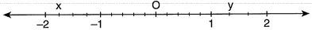

Yukaridaki sayı doğrusunda -2 ile -1 arası dört eşit parçaya, 1 ile 2 arası üç eşit parçaya ayrılıyor.

Buna göre,  $ \frac{x}{y} $ oranı kaçtır?

A)  $ \frac{-7}{4} $ B)  $ \frac{-2}{5} $ C)  $ -\frac{4}{3} $ D)  $ -\frac{17}{16} $ E)  $ \frac{-21}{16} $

&lt;div style="text-align: center;"&gt;&lt;div style="text-align: center;"&gt;Tip-20&lt;/div&gt; &lt;/div&gt;

 $$ \begin{array}{r} \frac{21}{71}+\frac{15}{83} \\ 2-\frac{64}{71}-\frac{78}{83} \end{array} $$ 

işleminin sonucu kaçtır?

A) $\frac{1}{3}$ B) $\frac{1}{2}$ C) $1$ D) $2$ E) $3$

#### TIP-21

Aşağıda, dört eş dilime ayrılmış 400 gram ağırliğindaki küçük pizza ve altı eş dilime ayrılmış 600 gram ağırliğindaki büyük pizza gösterilmiştir.

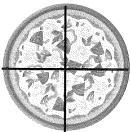

&lt;div style="text-align: center;"&gt;&lt;div style="text-align: center;"&gt;400 gram&lt;/div&gt; &lt;/div&gt;

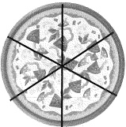

&lt;div style="text-align: center;"&gt;&lt;div style="text-align: center;"&gt;600 gram&lt;/div&gt; &lt;/div&gt;

Ali ve Özge bu iki pizzayi eşit olarak paylaşacaktır.

Ali küçük pizzanın tamamını aldığına göre, büyük pizzanın kaçta kaçını almıştır?

A)  $ \frac{1}{2} $ B)  $ \frac{1}{3} $ C)  $ \frac{1}{4} $ D)  $ \frac{1}{5} $ E)  $ \frac{1}{6} $

Emel, içtiği su miktarını hesaplayabilmek için şekilde verilen su işişesinin dik dairesel silindir biçimindeki 2 litrelik kısmını önce 4 eşit parçaya, sonra da her bir parçayı 5 eşit parçaya bölerek ölçeklendirmiştir.

##### Tip-22

Emel, içinde 2 litre su bulunan șișesindeki suyun bir kısmını içtikten sonra șișede oluşan görünüm aşağıda verilmiştir.

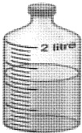

Buna göre, Emel bu işseden kaç litre su içmiştir?

A)  $ \frac{1}{4} $ B)  $ \frac{3}{4} $ C)  $ \frac{2}{5} $ D)  $ \frac{3}{5} $ E)  $ \frac{4}{5} $

### MATEMATIK

Tanim:  $ \frac{1}{10} $,  $ \frac{1}{100} $,  $ \frac{1}{1000} $, ..... gibi ifadelerdir.

 $$ \frac{1}{10}=0,1 $$ 

 $$ ^{*}1,32=\frac{132}{100} $$ 

 $$ \frac{1}{100}=0,01 $$ 

 $$ ^{*}0,007=7\cdot10^{-3} $$ 

 $$ ^{*}2,765=\frac{2765}{1000} $$ 

 $$ \frac{13}{10}=1,3 $$ 

 $$ 1,275=1275\cdot10^{-3} $$ 

##### ORNEK SORU

 $$ 0,1+0,01+0,003=? $$ 

#### QOZUM

1. Yol

 $$ \frac{1}{10}+\frac{1}{100}+\frac{3}{1000}\tag{100} $$ 

2. Yol

 $$ =\frac{100+10+3}{1000} $$ 

0,100

0,010

+0,003

0,113

 $$ =\frac{113}{1000}=0,113 $$ 

#### tip-1

 $$ \frac{0,25}{0,5}+\frac{3,6}{12}-\frac{2,4}{0,2} $$ 

işleminin sonucu kaçtır?

A) 8 B) 8.5 C) -9.2

 $$ D)\;-10,2 $$ 

tip-2

 $$ \frac{0,018}{0,09}-\frac{1,2}{0,03}+\frac{1,8}{0,3} $$ 

işleminin sonucu kaçtır?

 $$  A)-34,8 $$ 

B) -33,8 C) -32 D) -30,4

#### tip-3

xy iki basamaklı bir doğal sayıdır.

 $$ \frac{x,y}{0,xy}-\frac{xy}{0,xy}+\frac{0,xy}{0,0xy} $$ 

işleminin sonucu kaçtır?

A) -70 B) -80 C) -90 D) -100 E) -110

&lt;div style="text-align: center;"&gt;&lt;div style="text-align: center;"&gt;Tip-4&lt;/div&gt; &lt;/div&gt;

 $$ 0,5+\frac{1}{0,5-\frac{1}{1-0,5}} $$ 

işleminin sonucu kaçtır?

A)  $ -\frac{1}{6} $ B)  $ -\frac{1}{5} $ C)  $ -\frac{1}{4} $ D)  $ \frac{1}{3} $ E)  $ \frac{1}{2} $

#### Tip-5

x pozitif tam sayıdır.

 $$ x+\frac{1}{4} $$ 

ifadesinin sonucu bir tam sayı ise x'in virgülden sonraki kısmı kaçtır?

A) 15 B) 20 C) 25 D) 50 E) 75

Devirli Ondalıklı Sayılar

 $$ ^{*}0,23232323\ldots\ldots=0,\overline{23} $$ 

 $$ 0,~7525252.....=0,7~{\overline{{52}}} $$ 

 $$ ^{*}0,3+0,03+0,003=\cdots\cdots=0,33333\cdots\cdots=0,\overline{3} $$ 

Devirli Ondalıkı Sayıyı Rasyonel Yapma

Sayinin Tamami – Devretmeyen Kisim

Virgülden sonra

Örnek: 0,

Devreden sayi kadar 9

Devretmeyen sayi kadar 0

 $$ \overline{15}=\frac{15-0}{99}=\frac{15}{99} $$ 

Örnek: 2,

 $$ \overline{72}=\frac{272-2}{99} $$ 

Örnek: 32,

 $$ 1\overline{3}\;=\frac{3213-321}{90} $$ 

Örnek: 2,

 $$ \overline{7}=2+\frac{7}{9} $$ 

Örnek: 1.

 $$ \overline{32}=1+\frac{32}{99} $$ 

#### TIP-6

 $$ \frac{1,\overline{3}}{0,4\overline{9}}+1,2 $$ 

işleminin sonucu kaçtır?

A) $\frac{27}{10}$ B) $\frac{13}{5}$ C) $\frac{49}{15}$ D) $\frac{58}{15}$ E) $\frac{71}{15}$

#### Tip-7

 $$ \begin{aligned}\frac{0,4}{0,\overline{1}+0,\overline{2}+0,\overline{3}+.....+0,\overline{9}}\end{aligned} $$ 

işleminin sonucu kaçtır?

A) 0,08 B) 0,06 C) 0,04 D) 0,02 E) 0,8

#### TIP-8

 $$ a=0,3\overline{75} $$ 

b=0, $ \overline{375} $

sayilarinin küçükten büyüğe doğru sıralaması nedir?

A) a &lt; b &lt; c B) b &lt; a &lt; c C) c &lt; a &lt; b

D) b &lt; c &lt; a E) a &lt; c &lt; b

#### tip-9

 $$ \frac{2}{7}=0,x_{1}x_{2}x_{3}\ldots\ldots x_{2026} $$ 

ifadesinde 2026'nci basamaktaki sayı kaçtir?

A) 1 B) 2 C) 5 D) 7 E) 8

#### Tip-10

a, b ve c sifirdan ve birbirinden farklı rakamlar olmak üzere, ondalık gösterimleri

 $$ K=a,b $$ 

 $$ \mathsf{L}=\mathsf{b},\mathsf{c} $$ 

 $$ \mathsf{M}=\mathsf{c},a $$ 

biçiminde olan üç sayı veriliyor.

Ondalık gösterimi verilen sayılarda sıralama sorusunu yanlış öğrenen Alican, bu üç sayının sıralamasının, birler basamağı yerine onda birler basamağındaki değerin büyüklüğüne göre yapılacağını düşünerek  $ K &lt; L &lt; M $ sıralamasını elde ediyor.

Buna göre, bu sayıların doğru sıralaması aşağıdakilerden hangisidir?

A) K &lt; M &lt; L          B) L &lt; K &lt; M          C) L &lt; M &lt; K

D) M &lt; K &lt; L          E) M &lt; L &lt; K

&lt;div style="text-align: center;"&gt;&lt;div style="text-align: center;"&gt;TIP-11&lt;/div&gt; &lt;/div&gt;

Her iki tarafında da 0,5 cm mesafe olan 10 cm'lik bir cetvelin altına, her iki tarafında da 0,3 cm mesafe olan 6 cm'lik özdeş iki cetvel, aralarında boşluk birakılmadan üç uca birleştirilerek şekilde gibi soldan hızalanmıştır.

&lt;table border=1 style='margin: auto; word-wrap: break-word;'&gt;&lt;tr&gt;&lt;td style='text-align: center; word-wrap: break-word;'&gt;0&lt;/td&gt;&lt;td style='text-align: center; word-wrap: break-word;'&gt;1&lt;/td&gt;&lt;td style='text-align: center; word-wrap: break-word;'&gt;2&lt;/td&gt;&lt;td style='text-align: center; word-wrap: break-word;'&gt;3&lt;/td&gt;&lt;td style='text-align: center; word-wrap: break-word;'&gt;4&lt;/td&gt;&lt;td style='text-align: center; word-wrap: break-word;'&gt;5&lt;/td&gt;&lt;td style='text-align: center; word-wrap: break-word;'&gt;6&lt;/td&gt;&lt;td style='text-align: center; word-wrap: break-word;'&gt;7&lt;/td&gt;&lt;td style='text-align: center; word-wrap: break-word;'&gt;8&lt;/td&gt;&lt;td style='text-align: center; word-wrap: break-word;'&gt;9&lt;/td&gt;&lt;td style='text-align: center; word-wrap: break-word;'&gt;10&lt;/td&gt;&lt;/tr&gt;&lt;tr&gt;&lt;td style='text-align: center; word-wrap: break-word;'&gt;0&lt;/td&gt;&lt;td style='text-align: center; word-wrap: break-word;'&gt;1&lt;/td&gt;&lt;td style='text-align: center; word-wrap: break-word;'&gt;2&lt;/td&gt;&lt;td style='text-align: center; word-wrap: break-word;'&gt;3&lt;/td&gt;&lt;td style='text-align: center; word-wrap: break-word;'&gt;4&lt;/td&gt;&lt;td style='text-align: center; word-wrap: break-word;'&gt;5&lt;/td&gt;&lt;td style='text-align: center; word-wrap: break-word;'&gt;6&lt;/td&gt;&lt;td style='text-align: center; word-wrap: break-word;'&gt;0&lt;/td&gt;&lt;td style='text-align: center; word-wrap: break-word;'&gt;&lt;/td&gt;&lt;td style='text-align: center; word-wrap: break-word;'&gt;&lt;/td&gt;&lt;td style='text-align: center; word-wrap: break-word;'&gt;6&lt;/td&gt;&lt;/tr&gt;&lt;/table&gt;

Buna göre, 10 cm'lik cetvelin sağ kenarı 6 cm'lik cetvelin hangi noktasıyla hızalanmıştır?

A) 4 B) 4,1 C) 4,2 D) 4,5 E) 4,8

##### TIP-12

Aşağıda eş karelerden oluşan bir şeklin içindeki bazı karelerin boyanması ile oluşan şeklin görünümü verilmiştir.

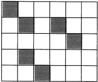

Bu şekilde içerisinden  $ \underline{\text{en az}} $ kaç tane kare daha boyanmalı ki boyanan parçaların tüm parçalara oranı 0,36 olsun?

A) 3 B) 4 C) 5 D) 6 E) 8

#### Tip-13

Her bir bölmesi 4 eşit parçaya ayrılmış özel bir termometre ile günün aynı saatinde A, B ve C şehirlerinin sıcaklık ölçümleri santigrad cinsinden aşağıdaki gibidir.

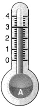

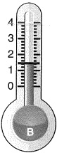

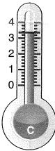

Yapılan ölçümlerde A ile B şehirlerinin sıcaklık farkı 4,8°C'dir.

Buna göre, C şehrinin sıcaklığı kaç santigrad derecedir?

A) 9,8 B) 10 C) 10,2 D) 10,6 E) 11,4

### BASIT EŞİTSİZLIKLER

a ve b sifirdan farklı reel sayılar olmak üzere,

 $$ \begin{aligned}ax+b&amp;&gt;0\\&amp;&lt;0\\&amp;\geq0\\&amp;\leq0\end{aligned} $$ 

şeklindeki ifadelerdir.

Örneğin: x &gt; 2 ise

Örneğin:  $ x \leq 4 $ ise

#### Özellikler

1) Bir eşitsizliğin her tarafına aynı sayı eklenir ya da çıkarılırsa eşitsizlik bozulmaz.

a &gt; b ise  $ a + c &gt; b + c $

Örneğin: 5 &gt; 2 ise  $ \underbrace{5+3}_{8}&gt;\underbrace{2+3}_{5} $

2) Eşitsizlik pozitif bir sayı ile çarpılır ya da bölünürse yön değiştirmez.

a &lt; b ve c &gt; 0 olsun.

I) a  $ \cdot $ c &lt; b  $ \cdot $ c

Örn: 5/2&lt;3 ise 10&lt;15

II)  $ \frac{a}{c} &lt; \frac{b}{c} $

Örn:  $ \frac{8}{2} &lt; \frac{16}{2} $ ise 4&lt;8

Eşitsizlik negatif bir sayı ile çarpılır ya da bölünürse yön değiştirir.

a &lt; b ve c &lt; 0 olsun.

I) a ⋅ c &gt; b ⋅ c

Örn: -2 / 4 &lt; 8 ise -8 &gt; -16

II)  $ \frac{a}{c} &gt; \frac{b}{c} $ Örn:  $ \frac{4}{-2} &lt; \frac{8}{-2} $ ise -2 &gt; -4

♦ y negatif bir sayı olsun.

x · y &lt; y · z ise x &gt; z

(Eşitsizlik negatif bir sayı ile sadeleşirse yön değiştirir.)

♢ x·z &lt; y·z ve x &gt; y ise z &lt; 0 dir.

4) Eşitsizlik ters çevrildiğinde yön değiştirir.

x &lt; y &lt; 0 ya da 0 &lt; x &lt; y ise

 $$ \frac{1}{x}&gt;\frac{1}{y}dir. $$ 

Örn: 2 &lt; 4 ise  $ \frac{1}{2} &gt; \frac{1}{4} $ tür.

Eşitsizlik sorularında paydada değişken varsa bunu ters çevirerek üste al.

Örn:  $ \frac{1}{x-1} &lt; 5 $ ise  $ \frac{x-1}{1} &gt; \frac{1}{5} $ olur.

5)  $ x^{2}&lt;x $ ise 0&lt;x&lt;1 dir.

6)  $ x &lt; x^{3} &lt; x^{2} $ ise -1 &lt; x &lt; 0 dir.

#### tip-1

 $$ 2x-7&lt;x-6 $$ 

ifadesini sağlayan farklı iki tam sayının toplamının  $ \underline{\text{en büyük}} $ değerikaçtır?

A) -1 B) -2 C) -3 D) -4 E) -5

#### TIP-2

 $$ \frac{x-1}{3}&gt;4 $$ 

ifadesini sağlayan iki farklı tam sayının toplamının  $ \underline{\text{en küçük}} $ değerik açtır?

A) 27 B) 28 C) 29 D) 30 E) 31

#### Tip-3

 $$ \frac{x+2}{-2}\geq-3 $$ 

ifadesini sağlayan kaç farklı doğal sayı vardır?

A) 1 B) 2 C) 3 D) 4 E) 5

TiP-4

 $$ &lt;\frac{x+2}{-2}&lt;4 $$ 

esitsizliğini sağlayan kaç farklı x tam sayı değeri vardır?

A) 3 B) 4 C) 5 D) 6 E) 7

#### TIP-5

 $$ \frac{1}{7}&lt;\frac{1}{x-3}&lt;\frac{1}{2} $$ 

ifadesini sağlayan kaç farklı x doğal sayısı vardır?

A) 1 B) 2 C) 3 D) 4 E) 5

#### tip -6

 $$ \frac{1}{x-2}&gt;\frac{1}{7} $$ 

esitsizliğini sağlayan kaç farklı x tam sayı değeri vardır?

A) 5 B) 6 C) 7 D) 8 E) 9

#### tip-7

 $$ 2x+7&lt;3x-2&lt;2x+11 $$ 

esitsizliğini sağlayan kaç farklı x doğal sayısı vardır?

A) 1 B) 2 C) 3 D) 4 E) 5

##### tip-8

a ve b tam sayıdır.

 $$ 2&lt;a&lt;5 $$ 

 $$ -3&lt;b&lt;4 $$ 

eşitsizlikleri veriliyor.

Buna göre, 2a – b ifadesinin  $ \underline{\text{en büyük}} $ değeri nedir?

A) 3 B) 10 C) 13 D) 15 E) 18

##### tip-9

&lt;table border=1 style='margin: auto; word-wrap: break-word;'&gt;&lt;tr&gt;&lt;td colspan="5"&gt;a ve b reel sayi&lt;/td&gt;&lt;/tr&gt;&lt;tr&gt;&lt;td colspan="5"&gt;2 &amp;lt; a &amp;lt; 5&lt;/td&gt;&lt;/tr&gt;&lt;tr&gt;&lt;td colspan="5"&gt;-3 &amp;lt; b &amp;lt; 4&lt;/td&gt;&lt;/tr&gt;&lt;tr&gt;&lt;td colspan="5"&gt;eşitsizlikleri veriliyor.&lt;/td&gt;&lt;/tr&gt;&lt;tr&gt;&lt;td colspan="5"&gt;Buna göre, 2a – b ifadesinin  $ \underline{\text{en büyük}} $ tam sayı değeri kaçtır?&lt;/td&gt;&lt;/tr&gt;&lt;tr&gt;&lt;td style='text-align: center; word-wrap: break-word;'&gt;A) 9&lt;/td&gt;&lt;td style='text-align: center; word-wrap: break-word;'&gt;B) 10&lt;/td&gt;&lt;td style='text-align: center; word-wrap: break-word;'&gt;C) 11&lt;/td&gt;&lt;td style='text-align: center; word-wrap: break-word;'&gt;D) 12&lt;/td&gt;&lt;td style='text-align: center; word-wrap: break-word;'&gt;E) 13&lt;/td&gt;&lt;/tr&gt;&lt;/table&gt;

tip-10

1 &lt; x &lt; 7

-6 ≤ y ≤ 9

eşitsizlikleri veriliyor.

Buna göre, x·y çarpımının  $ \underline{\text{en büyük}} $ ve  $ \underline{\text{en küçük}} $ tam sayı değerini toplamı kaçtır?

A) 21 B) 22 C) 25 D) 27 E) 30

&lt;div style="text-align: center;"&gt;&lt;div style="text-align: center;"&gt;TIP-11&lt;/div&gt; &lt;/div&gt;

 $ \frac{1}{3} &lt; y &lt; \frac{1}{2} $

eşitsizlikleri veriliyor.

Buna göre,  $ \frac{x+y}{x\cdot y} $ ifadesinin alabileceği tam sayı değerler toplamı kaçtır?

A) 18 B) 20 C) 22 D) 25 E) 30

&lt;div style="text-align: center;"&gt;&lt;div style="text-align: center;"&gt;Tip-12&lt;/div&gt; &lt;/div&gt;

 $$ 3&lt;y&lt;5 $$ 

Buna göre, x^{2} + y^{2} ifadesinin  $ \underline{\text{en büyük}} $ ve  $ \underline{\text{en küçük}} $ tam sayı değerler toplamı kaçtır?

A) 40 B) 41 C) 42 D) 43 E) 44

##### Tip-13

 $$ -3&lt;a&lt;5 $$ 

 $$ 2b+a=3 $$ 

denklemi veriliyor.

Buna göre, bınin aralığı nedir?

A) b &lt; 0 B) 1 &lt; b &lt; 2 C) -1 &lt; b &lt; 3

D) 0 &lt; b &lt; 5 E) 3 &lt; b &lt; 4

a, b ve c negatif sayılardır.

 $ \frac{a+c}{b} &lt; \frac{a}{b} + 1 $ ifadesi veriliyor.

Buna göre, aşağıdakilerden hangisi  $ \underline{\text{daima}} $ doğrudur?

A) b &lt; c

B) a &lt; c

C) c &lt; b

D) b &lt; a

E) a &lt; b

#### TIP-15

a, b ve c tam sayıdır.

a &lt; b &lt; c  ve  ab - ac &lt; b - c

olduğuna göre, aşağıdakilerden hangisi  $ \underline{\text{daima}} $ doğrudur?

A) a &lt; -1 B) a &lt; 1 C) 0 &lt; a &lt; 1

D) a &gt; -1 E) a &gt; 1

#### TIP-16

x &lt; y &lt; 0 eşitsizliği veriliyor.

 $$ z=\frac{2x-y}{x} $$ 

olduğuna göre, z’nin aralığı aşağıdakilerden hangisidir?

A) 0 &lt; z &lt; 1 B) 1 &lt; z C) 1 &lt; z &lt; 2 D) 2 &lt; z &lt; 3 E) -1 &lt; z &lt; 1

#### TIP-17

a ve b tam sayıdır.

 $$ 0&lt;a&lt;10 $$ 

 $$ 0&lt;b&lt;10 $$ 

eşitsizlikleri veriliyor.

Buna göre, a + b toplamını iki basamaklı yapan kaç farklı (a, b) ikilisi vardır?

A) 20 B) 25 C) 30 D) 36 E) 45

Tip-18

a, b ve c gerçek sayıları için

 $$ \boldsymbol{b}+\boldsymbol{c}=\boldsymbol{0} $$ 

 $$ a\cdot b\cdot c&lt;0 $$ 

 $$ a\cdot b-b\cdot c&lt;0 $$ 

olduğuna göre, aşağıdaki sıralamalardan hangisi doğrudur?

A) a &lt; b &lt; c

B) a &lt; c &lt; b

C) b &lt; a &lt; c

D) b &lt; c &lt; a

E) c &lt; a &lt; b

&lt;div style="text-align: center;"&gt;&lt;div style="text-align: center;"&gt;TIP-19&lt;/div&gt; &lt;/div&gt;

a, b ve c gerçel sayıları için

a·b^{2}&lt;0&lt;a+c&lt;2·a-b

olduğuna göre, aşağıdaki sıralamalardan hangisi doğrudur?

A) b &lt; a &lt; c

B) a &lt; b &lt; c

C) a &lt; c &lt; b

D) b &lt; c &lt; a

E) c &lt; a &lt; b

#### Tip-20

a, b ve c gerçel sayıları için a &lt; b &lt; 0 &lt; c olduğuna göre,

1.  $ (c + b)^2 &lt; (c - b)^2 $

II. ac &lt; bc

Ⅲ.  $ \frac{a}{b} &lt; \frac{b}{a} $

ifadelerinden hangileri doğrudur?

A) Yalnız II B) Yalnız III C) I ve II

D) I ve III E) II ve III

&lt;div style="text-align: center;"&gt;&lt;div style="text-align: center;"&gt;TIP-21&lt;/div&gt; &lt;/div&gt;

Aşağıdaki sayı doğrusunda  $ \frac{1}{A} $ sayısının bulunduğu aralık gösterilmiştir.

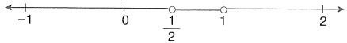

Buna göre, A sayısının bulunduğu aralık aşağıdakilerden hangisidir?

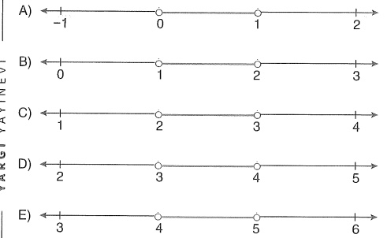

##### TIP-22

Başlangıçta içlerinde belirli miktarlarda su bulunan özdeş A, B ve C bardaklarına birbirinden bağımsız olarak uygulanan işlemler ve sonuçları aşağıda verilmiştir:

• A'da bulunan suyun tamamı C'ye eklenirse C'nin bir kısmı boş kalıyor.

• A'da bulunan suyun tamamı B'ye eklenirse B taşmadan tam doluyor.

C'de bulunan suyun tamamı B'ye eklenirse bir miktar su taşıyor.

Başlangıçta A, B ve C bardaklarında bulunan su miktarları sırasıyla

S&lt;sub&gt;A&lt;/sub&gt;, S&lt;sub&gt;B&lt;/sub&gt;, S&lt;sub&gt;C&lt;/sub&gt; olduğuna göre, aşağıdaki siralamalardan hangisi doğrudur?

A) S&lt;sub&gt;C&lt;/sub&gt; &lt; S&lt;sub&gt;B&lt;/sub&gt; &lt; S&lt;sub&gt;A&lt;/sub&gt;

B) S&lt;sub&gt;B&lt;/sub&gt; &lt; S&lt;sub&gt;A&lt;/sub&gt; &lt; S&lt;sub&gt;C&lt;/sub&gt;

C) S&lt;sub&gt;A&lt;/sub&gt; &lt; S&lt;sub&gt;B&lt;/sub&gt; &lt; S&lt;sub&gt;C&lt;/sub&gt;

D) S&lt;sub&gt;A&lt;/sub&gt; &lt; S&lt;sub&gt;C&lt;/sub&gt; &lt; S&lt;sub&gt;B&lt;/sub&gt;

 $$ \mathsf{E})\;\mathsf{S}_{\mathsf{C}}&lt;\mathsf{S}_{\mathsf{A}}&lt;\mathsf{S}_{\mathsf{B}} $$ 

#### TIP-23

A, B, C ve D bilyeleri iki kollu bir terazide tartılıyor.

• Üç bilyenin ağırlığı aynıdır.

Bununla ilgili şu bilgiler veriliyor.

• A ile B bir kolda, B ile C diğer kolda tartıldığında A tarafı yukarı kalkıyor.

• A ile C bir kolda, B ile D diğer kolda tartıldığında D tarafı aşağı iniyor.

#### Buna göre,

I. B ile D nin ağırlığı aynıdır.

II. A bilyesi ağır bir bilyedir.

III. C bilyesi hafif bir bilyedir.

#### ifadelerinden hangileri  $ \underline{\text{kesinlikle}} $ doğrudur?

A) Yalnız I B) Yalnız II C) I ve II

D) I ve III E) I, II ve III

Tanim: Bir sayının başlangıç noktasına olan uzaklığıdır. Uzaklık negatif olamaz.

|x| ≥ 0 dir.

↓

uzaklik

x in a ya olan uzaklığı lx – aldır.

x in 5 e olan uzaklığı |x-5|dır.

x in -3 e uzaklığı 4 olan noktalar kümesi

|x - (-3)| = 4

|x + 3| = 4

Özellikler

1)  $ |x| = \begin{cases} x &amp; , &amp; x \geq 0 \\ -x &amp; , &amp; x &lt; 0 \end{cases} $

Örn:  $ \overbrace{-2}^{-1} = +2 $

Örn:  $ \overbrace{7}^{+} = +7 $

#### ÖRNEK SORU

x &lt; 0 ise

|x| + |-2x|

işleminin sonucu nedir?

A) -3x B) -2x C) x D) 2x E) 3x

E) 3x

CEVAP: A

#### tip-1

2 noktasına olan uzaklığı 3 birim ya da 3 birimden küçük olan noktalar kümesinin ifadesi nedir?

A) |x-2|&lt;3

B) |x+2|&lt;3

C) |x-2|\leq3

D) |x+2|\leq3

E) |x-3|&lt;2

##### Tip-2

1 noktasına olan uzaklığı, 3 noktasına olan uzaklığının yarısı olan noktalar kümesinin ifadesi nedir?

A) |x-1|= |x-3| B) |x+1|= |x-3| C) |x-1|= |2x-6|

D) |2x-2|= |x-3| E) |x-3|= |x+2|

#### TIP-3

a noktasına olan uzaklığı ile b noktasına olan uzaklığının toplamı 7 olan noktalar kümesinin gösterimi nedir?

A) |x-al+|x-bl=7 B) |x+a+bl=7 C) |x+al+|x+bl=7

D) |x+al+|x-bl=7 E) |x-al-|x-bl=7

##### TIP-4

x &lt; 0 olmak üzere

|-x| + |-x + 3| + |2x - 3|

ifadesinin sonucu nedir?

A) -x B) 2x C) -3x + 2

D)  $ -4x + 6 $ E)  $ -2x - 1 $

#### Tip-5

x &lt; 0 &lt; y olmak üzere

 $ |x - y| - |-x| + |-y - 2| - y + x $

ifadesinin sonucu nedir?

A) x B) y C) x + y - 2

D)  $ x + y + 2 $ E)  $ -x - y + 2 $

|x - 1| = 7

esitliğini sağlayan x değerler çarpımı kaçtır?

A) -16 B) -48 C) 12 D) 24 E) 48

#### TIP-6

 $$ |x|=3 $$ 

esitliğini sağlayan x değerler toplamı kaçtır?

A) -1 B) -2 C) -3 D) -4 E) -5

2) |x| = a (a doğal sayı)

x = a x = -a dir.

|xl| = -7 (negatif olamaz)

#### Tip-7

||x+2|+4|=7

Örnek:

##### tip-8

 $$ \left|2x-6\right|=\frac{7}{8}+\frac{8}{9}+\frac{10}{11}+\frac{11}{12}+\frac{12}{13} $$ 

ifadesinde x'in alabilecegi değerler toplamı kaçtır?

A) 6 B) 8 C) 10 D) 12 E) 14

3) lx! &lt; a → Pozitif doğal sayı

Örn: |x| &lt; 3 $\Rightarrow$ -3 &lt; x &lt; 3

$\downarrow$

Negatif olamaz.

Örn:  $ |x| &lt; -7 $  $ \Rightarrow $  $ CK = \varnothing $

##### Tip-9

|x - 2| &lt; 4

ifadesini sağlayan x tam sayı değerler toplamı kaçır?

A) 12 B) 14 C) 16 D) 18 E) 20

#### Tip-10

 $ \left|\frac{x+3}{2}\right|&lt;1 $

ifadesini sağlayan kaç farklı x tam sayı değeri vardır?

A) 1 B) 2 C) 3 D) 4 E) 5

##### Tip-11

 $$ \left|\frac{3}{x-2}\right|&gt;\frac{1}{3} $$ 

koşulunu sağlayan kaç farklı x tam sayı değeri vardır?

A) 13 B) 14 C) 15 D) 16 E) 17

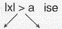

x &gt; a  ve x &lt; -a dir.

Örnek:

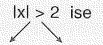

#### Tip-12

|x-1|&gt;3

eşitsizliğini sağlayan x tam sayılar toplamı kaçtır?

A) -3 B) -4 C) -5 D) -6 E) -7

#### MATEMATIK

5) |x| = |-x|

|x - y| = |y - x|

|x - 2| = |2 - x|

|2x| = 2 |x|

|2x + 6| = 2 |x + 3|

##### TIP-13

 $ |2x - 4| + |8 - 4x| = 12 $

olduğuna göre, x'in alabileceği değerler çarpımı kaçtır?

A) 0 B) 1 C) 2 D) 3 E) 4

6)  $ |x| = |y| $ ise

 $ x = y $  $ x = -y $ dir.

#### Tip-14

 $ |2x - 3| = |x - 2| $

denklemini sağlayan x değerler toplamı kaçtır?

A) 1 B) 2 C)  $ \frac{5}{3} $ D)  $ \frac{7}{3} $ E)  $ \frac{8}{3} $

##### tip-15

 $ |x + y - 4| + |x - y - 6| = 0 $

denklemini sağlayan x·y çarpımı kaçtır?

A) -5 B) -4 C) -3 D) -2 E) -1

### NOT

Mutlağın karşısı değişken ise bulduğun x leri yerine yaz. Karşı taraf negatif olmaz.

TIP-16

|2x - 1| = x

sağlayan kaç farklı x değeri vardır?

A) 0 B) 1 C) 2 D) 3 E) 4

#### Tip-17

|x-1|-2x=1

sağlayan x değerler toplamı kaçtır?

A) 0 B) 1 C) 2 D) 3 E) 4

##### NOT

Sorunun içi ile dışındaki ifade birbirine benziyorsa mutlağın tanımını kullan.

#### TIP-18

|x-2|=x-2

|x-7|=7-x

denklemini sağlayan x tam sayı değeri toplamı kaçtır?

A) 24 B) 25 C) 26 D) 27 E) 28

##### NOT

Mutlak değer içini sifir yapan değerlerde en küçüktür.

Mutlaklar sirali ise ortadaki sayıyı sifir yapan değere bak.

##### Tip-19

 $ A = |x + 1| + |x + 2| + |x + 3| $

A'nin alabilecegi  $ \underline{\text{en küçük}} $ degeri kaçtir?

A) 1 B) 2 C) 3 D) 4 E) 5 TiP - 2O

 $$ \frac{18}{\left|x-1\right|+\left|x-2\right|+\left|x-3\right|} $$ 

ifadesinin  $ \underline{\text{en büyük}} $ değeri kaçtır?

A) 7 B) 8 C) 9 D) 10 E) 11

Tip-21

A = |x - 2| - |x - 7|

A nın kaç farklı tam sayı değeri vardır?

A) 8 B) 9 C) 10 D) 11 E) 12

#### TIP-22

 $ |x + 2| + |x - 5| $

ifadesinin alamayacağı doğal sayılar toplamı kaçtır?

A) 21 B) 20 C) 15 D) 17 E) 7

##### MATEMATIK

##### TIP-23

|x - 1| + |x - 5| = 4

ifadesini sağlayan kaç farklı x tam sayı değeri vardır?

A) 5 B) 4 C) 3 D) 2 E) 1

##### TIP-24

|x - 1| + |x - 5| = 6

denklemini sağlayan kaç farklı x tam sayı değeri vardır?

A) 0 B) 1 C) 2 D) 3 E) 4

##### TIP-25

|x-1|+|x-5|=2

denklemini sağlayan kaç farklı x tam sayı değeri vardır?

A) 0 B) 1 C) 2 D) 3 E) 4

##### TIP-26

 $$ \frac{x^{2}+4}{\left|x+2\right|-3}\leq0 $$ 

esitsizliğini sağlayan kaç farklı x tam sayı değeri vardır?

A) 1 B) 2 C) 3 D) 4 E) 5

#### tip-27

 $ \frac{5}{4} $ kesrinin sayı doğru üzerinde  $ \frac{4}{3} $,  $ \frac{6}{5} $ ve  $ \frac{7}{6} $ kesirlerine olan uzaklıkları sırasıyla A, B ve C birimdir.

Buna göre, aşağıdaki sıralamalardan hangisi doğrudur?

A) A &lt; B &lt; C B) A = B &lt; C C) B &lt; A &lt; C

D) B &lt; A = C E) B &lt; C &lt; A

#### TIP-28

x, y ve z tam sayılar için

 $$ \left|x+y\right|=2 $$ 

 $$ \left|y+z\right|=1 $$ 

 $$ \left|z+3\right|=0 $$ 

esitlikleri veriliyor.

Buna göre, x aşağıdakilerden hangisi  $ \underline{\text{olamaz}} $?

A) -6 B) -4 C) -2 D) 0 E) 2

#### TIP-29

a bir gerçel sayı olmak üzere,

|x - a| = a + 2

eşitliğini sağlayan x gerçel sayılarının çarpımının -12 olduğu biliniyor.

Buna göre, a kaçtır?

A) 2 B) 3 C) 4 D) 5 E) 6

#### Tip-30

a &lt; 0 &lt; b olmak üzere,

|a| + |a - b| = 6

|b| + |b - a| = 5

esitlikleri veriliyor.

Buna göre, a + b toplamı kaçtır?

A) -2 B) -1 C) 0 D) 1 E) 2

#### Tip-31

x bir tam sayı olmak üzere,

|2x² - 5x - 7|

ifadesi bir asal sayıya eşittir.

Buna göre, x'in alabileceği değerlerin toplamı kaçtır?

A) 2 B) 4 C) 6 D) 8 E) 10

#### Tip-32

Sayı doğrusu üzerinde pozitif bir A sayısı şekilde gibi gösterilmiştir.

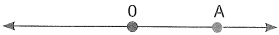

Sonra, bu sayı doğrusu üzerinde; O'a olan uzaklığı, A sayısının 0'a olan uzaklığının yarısına eşit olan sayılar işaretleniyor.

isaretlenen sayılardan birinin A sayısına uzaklığı 6 birim olduğunu göre, A sayısının alabileceği değerler toplamı kaçtır?

A) 15 B) 16 C) 18 D) 20 E) 21

&lt;table border=1 style='margin: auto; word-wrap: break-word;'&gt;&lt;tr&gt;&lt;td style='text-align: center; word-wrap: break-word;'&gt;Tetkik adi&lt;/td&gt;&lt;td style='text-align: center; word-wrap: break-word;'&gt;Sonuc&lt;/td&gt;&lt;td style='text-align: center; word-wrap: break-word;'&gt;$ \text{Unite} $&lt;/td&gt;&lt;td style='text-align: center; word-wrap: break-word;'&gt;Referans Aralik&lt;/td&gt;&lt;/tr&gt;&lt;tr&gt;&lt;td style='text-align: center; word-wrap: break-word;'&gt;Demir&lt;/td&gt;&lt;td style='text-align: center; word-wrap: break-word;'&gt;86&lt;/td&gt;&lt;td style='text-align: center; word-wrap: break-word;'&gt;Ng/dL&lt;/td&gt;&lt;td style='text-align: center; word-wrap: break-word;'&gt;33 - 193&lt;/td&gt;&lt;/tr&gt;&lt;tr&gt;&lt;td style='text-align: center; word-wrap: break-word;'&gt;Eritrosit&lt;/td&gt;&lt;td style='text-align: center; word-wrap: break-word;'&gt;70 $ \times $&lt;/td&gt;&lt;td style='text-align: center; word-wrap: break-word;'&gt;fL&lt;/td&gt;&lt;td style='text-align: center; word-wrap: break-word;'&gt;75 - 100&lt;/td&gt;&lt;/tr&gt;&lt;tr&gt;&lt;td style='text-align: center; word-wrap: break-word;'&gt;Trombosit&lt;/td&gt;&lt;td style='text-align: center; word-wrap: break-word;'&gt;- $ \times $&lt;/td&gt;&lt;td style='text-align: center; word-wrap: break-word;'&gt;NL&lt;/td&gt;&lt;td style='text-align: center; word-wrap: break-word;'&gt;200 - 300&lt;/td&gt;&lt;/tr&gt;&lt;/table&gt;

Özel bir hastanede kan değerlerini ölçüren İsa'nın test sonuçları yukarıda verilmiştir. Bu sonuçların altında "★" işareti varsa, bu o sonucun referans aralığı dışında olduğu anlamına gelmektedir. İsa'nın kan sonucu kâğındaki trombosit sayısı tam olarak okunamamıştır.

Buna göre, İsa'nın kanındaki trombosit sayısını gösteren ifade aşağıdakilerden hangisidir?

 $$ A)\quad50&lt;\left|x-250\right|&lt;180 $$ 

 $$ \mathrm{B})\quad|x-250|&lt;50 $$ 

 $$  C)\ \left|x-250\right|&gt;50 $$ 

 $$ D)\ \left|x-200\right|&gt;150 $$ 

 $$ \mathsf{E})\ \left|x-250\right|=50 $$ 

Bir seminar için Roma'ya giden Sevtap gitmeden önce hava durumu açıklamalarına bakmıştır. Salı günü hava sıcaklığının (-4) derece olduğu, çarşambadan itibaren ise havanın ışınarak sıcaklığın biraz artacağı belirtilmiştir. Çarşamba günü kent genelinde hava sıcaklığı bir önceki güne göre 10 ila 14 derece artış gösterecektir.

Bu bilgilere göre çarşamba günü kentteki sıcaklıkların alabileceği değer aralığını ifade eden şitsizlik aşağıdakilerden hangisidir?

 $$ A)\mid x-4\mid\leq10 $$ 

 $$ \mathrm{B})\ |x+4|\leq14 $$ 

 $$  C)\left|x-4\right|\leq14 $$ 

 $$ \mathsf{E})~|x+8|\leq2 $$ 

x ve y gerçel sayıları için

 $$ \left|x\right|=x+2=\frac{\left|y\right|}{3-y} $$ 

olduğuna göre, x + y toplamı kaçtir?

A) $\frac{1}{2}$ B) $\frac{2}{3}$ C) $\frac{3}{4}$ D) $1$ E) $2$

Tanim: a ve b tam sayi

 $$ \underbrace{a\cdot a\cdot a\cdot\ldots\cdot a}_{b\text{tane}}=\underset{\text{taban}}{a^{b}\to\text{kuvvet}} $$ 

Örnek:  $ \underbrace{2\cdot2\cdot\ldots2}_{8\text{ tane}} = 2^8 $

Örnek:  $ \underbrace{(-5)\cdot(-5)\ldots(-5)}_{10\text{tane}} = (-5)^{10} $

Örnek:  $ \underbrace{a + a + a + \ldots + a}_{n\text{tane}} = n \cdot a $

Örnek:  $ \underbrace{2+2+\ldots+2}_{8\text{tane}} = 2\cdot8 = 16 $

1) Sifir harị tìm sayílarń sifirinć kuvvetí 1 dir.

Özellikler

Örnek:  $ 2^0 = 1, (-5)^0 = 1, (-7)^0 = 1 $

Örnek:  $ \left(\frac{\sqrt{7}-\sqrt{5}}{2^8}\right)^0=1 $

Örnek:  $ (-2)^4 = 2^4 = 16 $

2) Negatif bir tam sayının çift kuvveti pozitiftir.

Örnek:  $ (-3)^2 = 3^2 = 9 $

Parantezin ônemi

Örnek:

 $$ (-2)^{2}=2^{2}=4 $$ 

 $$ -2^{2}=-4 $$ 

3) Toplama ve çıkarma işlemi yapılırken aynı üssün parantezine al. Veya en küçük üssün parantezine al.

Örnek:  $ 2^6 + 2^7 + 2^8 = 2^6 (1 + 2^1 + 2^2) $

 $ = 2^6 \cdot (1 + 2 + 4) = 2^6 \cdot 7 $

Örnek:  $ 5^{-4} + 5^{-5} + 5^{-6} = 5^{-6}(5^{2} + 5^{1} + 1) $

 $ =5^{-6}\cdot(25+5+1)=5^{-6}\cdot31 $

Örnek:  $ 2^{-7} + 2^{-9} + 2^{-11} = 2^{-11}(2^4 + 2^2 + 1) $

 $$ 2^{-11}\cdot(16+4+1)=2^{-11}\cdot21 $$ 

4) Üslú ifadelerde, tabanları aynı olan üslü ifadeler çarpılırken üsler toplanır.

 $$ \mathbf{a}^{x}\cdot\mathbf{a}^{y}=\mathbf{a}^{x+y} $$ 

Örnek:  $ 2^{x-2} \cdot 2^{-x+5} = 2^{x-2-x+5} = 2^3 = 8 $

Örnek:

 $$ 2^{-2}\cdot2^{-3}\cdot2^{-4}=2^{-2-3-4}=2^{-9} $$ 

Örnek:  $ 2^{x+2} = 2^x \cdot 2^2 = 4 \cdot 2^x $

Örnek:  $ 3^{x-1} = 3^x \cdot 3^{-1} = 3^x \cdot \frac{1}{3} = \frac{3^x}{3} $

5) Bölme işlemi yapılırken, tabanlar aynı ise üstler çıkarılır.

 $ \frac{a^x}{a^y} = a^{x-y} $

Örnek:  $ \frac{2^7}{2^5} = 2^{7-5} = 2^2 = 4 $

Örnek:  $ \frac{3^{-2}}{3^{-1}} = 3^{-2+1} = 3^{-1} = \frac{1}{3} $

6)  $ \left(\frac{a}{b}\right)^{x} = \frac{a^{x}}{b^{x}} $

Örnek:  $ \left(\frac{2}{3}\right)^{-2}=\left(\frac{3}{2}\right)^{2}=\frac{3^{2}}{2^{2}}=\frac{9}{4} $

7)  $  (a^x)^y = (a^y)^x = \underbrace{a^x \cdot y}_{|}  $ pozitiftir

Örnek:  $ (2^3)^{-2} = 2^{-6} $

Örnek:  $ (2^x)^{-3} \cdot (2^{x+1})^{-2} $

 $ = 2^{-3x} \cdot 2^{-2x-2} = 2^{-5x-2} $

8) Tabanları aynı olan üslü denklemlerin üsleri birbirine eşittir.

 $$ \left|\begin{array}{l}{a^{x}=a^{y}\Rightarrow x=y}\end{array}\right| $$ 

Örnek:  $ 2^{x-1} = 8^x $ ise x kaçtır?

 $$ 2^{x-1}=2^{3x}\Rightarrow\widehat{x-1}=3x $$ 

 $$ -1=3x-x $$ 

 $$ \frac{-1}{2}=\frac{2x}{2}\Rightarrow x=-\frac{1}{2} $$ 

9) Üsler eşitse

a^{x} = b^{x} ifadesinde

1. x tek sayı ise a = b

II. x Ịift sayi ise a = b ya da a = -b dir.

##### ÖRNEK SORU

 $$ (x-1)^{4}=(2x+4)^{4} $$ 

ise x'in alabileceği değerler toplamı kaçtır?

A) -4 B) -5 C) -6 D) -7 E) -8

E)-8

CEVAP: C

10)  $ a^{x} = b^{y} $ (a \neq b  ve  aralarında asal ise)

 $$ \boxed{x=y=0} $$ 

#### ÖRNEK SORU

 $$ 5^{x}+y-3=7^{x}-y+10\quad is $$ 

x·y çarpımı kaçtır?

A) $\frac{-91}{4}$ B) $\frac{-70}{4}$ C) $\frac{42}{4}$ D) $\frac{67}{4}$ E) $\frac{83}{4}$

CEVAP: A

#### ORNEK SORU

 $ 2^{x+1} = 6 $ veriliyor.

Buna göre,  $ 8^{x} $ kaçtır?

A) 8 B) 16 C) 18 D) 27 E) 81

11)  $ a^{b} = 1\ \text{ise} $

1. b = 0 ancak a  $ \neq $ 0

II. a = 1

III. a = -1 ancak b çift olmalı

### 2 ORNEK SORU

 $$ (x-2)^{x-1}=1 $$ 

sağlayan farklıxdegerlertoplamıkaçtır?

A) 1 B) 2 C) 3 D) 4 E) 5

CEVAP: D

12)  $ a^x = b^y $,  $ a^k = b^m $ is  $ \left\{\frac{x}{k} = \frac{y}{m}\right\} $

#### ORNEK SORU

$$2^{x-1} = 27^2$$

$$8^x = 9$$

ise x kaçtır?

A) $\frac{-1}{8}$ B) $\frac{-1}{4}$ C) $\frac{-1}{2}$ D) $\frac{1}{4}$ E) $\frac{1}{8}$

CEVAP: A

Tip-1

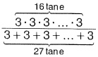

işleminin sonucu kaçtır?

A) $3^{6}$ B) $3^{9}$ C) $3^{11}$ D) $3^{12}$ E) $3^{14}$

Tip-2

 $$ \frac{2^{x+2}\cdot2^{x-1}}{8^{x-2}\cdot8^{x-3}} $$ 

işleminin sonucu kaçtır?

A) 1 B) 2 C) 3 D) 4 E) 8

#### TIP-3

 $$ \frac{5}{1-3^{x-y}}+\frac{5}{1-3^{y-x}} $$ 

işleminin sonucu kaçtır?

A) 3 B) 5 C) 10 D) 15 E) 21

#### TIP-4

 $$ \frac{5^{3}+5^{4}+5^{5}}{5^{-7}+5^{-8}+5^{-9}} $$ 

işleminin sonucu kaçtır?

A)  $ 5^{10} $ B)  $ 5^{11} $ C)  $ 5^{12} $ D)  $ 5^{13} $ E)  $ 5^{14} $

#### tip-6

$$(-x^{3})^{-2}\cdot(-x^{5})^{-3}\cdot(-x^{4})^{-2}\cdot(-x^{4})$$

isleminin sonucu nedir?

A) $x^{-25}$ B) $x^{-23}$ C) $x^{-20}$ D) $x^{-15}$ E) $x^{-10}$

TIP-7

olduğuna göre, x kaçtır?

A) 1 B) 2 C) 3 D) 4 E) 5

 $$ 2^{x+2}-2^{x}+2^{x-1}=56 $$ 

ifadesinin sonucu nedir?

A)  $ -a^{3} $ B)  $ -a^{4} $ C)  $ -a^{5} $ D)  $ a^{4} $ E)  $ a^{5} $

#### tip-5

 $ (-a)^{4} \cdot (-a)^{7} \cdot (a^{2})^{-3} $

#### tip-8

 $$ 2^{x}\cdot3^{y}=72 $$ 

 $$ 2^{y}\cdot3^{x}=108 $$ 

olduġuna gõre, x + y toplami kaċtir?

A) 4 B)  $ \frac{9}{2} $ C) 5 D)  $ \frac{11}{2} $ E) 6

#### Tip - 9

 $$ \frac{1}{2^{4}+1}+\frac{1}{2^{3}+1}+\ldots+\frac{1}{2^{-4}+1} $$ 

işleminin sonucu kaçtır?

A) 4 B)  $ \frac{9}{2} $ C) 5 D)  $ \frac{7}{2} $ E) 6

#### TIP-10

 $$ 2^{x}=10 $$ 

olduğuna göre x, y ve z nin sıralaması nedir?

A) x &lt; y &lt; z

B) x &lt; z &lt; y

C) z &lt; x &lt; y

D) y &lt; x &lt; z

E) z &lt; y &lt; x

#### Tip-11

$$2^{x}=3$$

$$3^{y}=5$$

$$5^{z}=16$$

olduġuna gõre, x·y·z ġarpimi kaċċir?

A) 3 B) 4 C) 5 D) 6 E) 7

#### Tip-12

 $$ a=2^{75} $$ 

 $$ \mathrm{b}=5^{45} $$ 

 $$ c=6^{30} $$ 

olduğuna göre a, b ve c'nin sıralaması nedir?

A) a &lt; b &lt; c

B) a &lt; c &lt; b

C) b &lt; c &lt; a

D) c &lt; b &lt; a

E) c &lt; a &lt; b

#### Tip-13

 $$ 2^{x}+2^{y}=17 $$ 

 $$ 2^{y}+2^{z}=33 $$ 

 $$ 2^{x}+2^{z}=45 $$ 

olduğuna göre x, y ve z'nin siralaması nedir?

A) x &lt; y &lt; z

B) y &lt; x &lt; z

C) z &lt; x &lt; y

D) y &lt; z &lt; x

E) z &lt; y &lt; x

#### TIP-14

 $$ \frac{3^{8}-5\cdot3^{6}}{3^{n}}=36 $$ 

esitliğini sağlayan n gerçel sayısı kaçtır?

A) 2 B) 3 C) 4 D) 5 E) 6

 $$ \frac{2^{6}+2^{8}+2^{10}}{8^{3}-8^{2}} $$ 

işleminin sonucu kaçtır?

A) 3 B) 4 C) 6 D) 7 E) 9

&lt;div style="text-align: center;"&gt;&lt;div style="text-align: center;"&gt;TIP-16&lt;/div&gt; &lt;/div&gt;

 $$ \frac{2^{-2}}{4^{-1}+\frac{1}{m^{-1}}}=13^{-1} $$ 

olduğuna göre, m kaçtir?

A) 3 B) 4 C) 5 D) 6 E) 7

&lt;table border=1 style='margin: auto; word-wrap: break-word;'&gt;&lt;tr&gt;&lt;td colspan="6"&gt;işleminin sonucu kaçtır?&lt;/td&gt;&lt;/tr&gt;&lt;tr&gt;&lt;td style='text-align: center; word-wrap: break-word;'&gt;A) 25&lt;/td&gt;&lt;td style='text-align: center; word-wrap: break-word;'&gt;B) 125&lt;/td&gt;&lt;td style='text-align: center; word-wrap: break-word;'&gt;C) 250&lt;/td&gt;&lt;td style='text-align: center; word-wrap: break-word;'&gt;D) 500&lt;/td&gt;&lt;td style='text-align: center; word-wrap: break-word;'&gt;E) 750&lt;/td&gt;&lt;td style='text-align: center; word-wrap: break-word;'&gt;&lt;/td&gt;&lt;/tr&gt;&lt;tr&gt;&lt;td colspan="6"&gt;TİP - 18&lt;/td&gt;&lt;/tr&gt;&lt;tr&gt;&lt;td colspan="6"&gt;$ 9^{{x}} = 2 $&lt;/td&gt;&lt;/tr&gt;&lt;tr&gt;&lt;td colspan="6"&gt;olduğuna göre,  $ 18^{\frac{{3}}{{x+1}}} $ kaçtır?&lt;/td&gt;&lt;/tr&gt;&lt;tr&gt;&lt;td style='text-align: center; word-wrap: break-word;'&gt;A)  $ 3^{{2}} $&lt;/td&gt;&lt;td style='text-align: center; word-wrap: break-word;'&gt;B)  $ 3^{{3}} $&lt;/td&gt;&lt;td style='text-align: center; word-wrap: break-word;'&gt;C)  $ 3^{{5}} $&lt;/td&gt;&lt;td style='text-align: center; word-wrap: break-word;'&gt;D)  $ 3^{{6}} $&lt;/td&gt;&lt;td style='text-align: center; word-wrap: break-word;'&gt;E)  $ 3^{{8}} $&lt;/td&gt;&lt;td style='text-align: center; word-wrap: break-word;'&gt;&lt;/td&gt;&lt;/tr&gt;&lt;/table&gt;

&lt;div style="text-align: center;"&gt;&lt;div style="text-align: center;"&gt;Tip-19&lt;/div&gt; &lt;/div&gt;

 $$ 3^{x}=4^{y}=5^{z} $$ 

olduğuna göre,  $ 3^{\frac{x}{y}} + 4^{\frac{y}{z}} $ toplamının sonucu kaçtır?

A) 3 B) 6 C) 9 D) 12 E) 15

#### Tip-20

Birinci adında 9 sayısının karesini alan Deren, bu adım sonunda 9² sayısını elde ediyor. Deren, bundan sonraki her bir adımda, bir önceki adım sonunda elde ettiği sayının karesini alarak yeni bir sayı elde ediyor.

Buna göre, Deren kaçıncı adım sonunda 81 $ ^{64} $ sayısını elde eder?

A) 5 B) 6 C) 7 D) 8 E) 9

##### TIP-21

Internet üzerinden yapılan 6 turluk bir yarışmanın ilk turuna 1.000.000 yarışmacı katılıyor. Her turun sonunda, o tura katılan yarışmacıların 5'te 1'i eleniyor ve sadece kalan yarışmacıların tamamı bir sonraki tura katılıyor.

Buna göre, 6. turun sonunda kalan yarışmacı sayısı kaçtır?

A)  $ 2^{16} $ B)  $ 2^{18} $ C)  $ 2^{20} $ D)  $ 2^{22} $ E)  $ 2^{24} $

#### TIP-22

İki mercekle çalışan mikroskoplar; nesnelerin görüntüsünü, merceklerin büyütme oranlarının çarpımı kadar büyük gösterir.

Örneğin merceklerinden birinin büyütme oranı 4 kat, diğerinin büyütme oranı ise 25 kat olan iki mercekle çalışan bir mikroskop, bakılan nesnenin görüntüsünü 100 kat büyük gösterir.

Büyükluğü 6,25 x 10^{-4} mm olan bir nesnenin görüntüsü, büyükme oranları 8 kat ve 50 kat olan iki mercekli bir mikroskopta kaç mm görünür?

A) 0,12 B) 0,25 C) 1 D) 5 E) 10

Bir televizyon kanalında yayımlanan kamu spotu aşağıda gösterilmiştir.

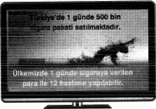

Bu kamu spotuna göre, kaç tane sigara paketine verilen para yerine yardım yapılırsa Türkiye'deki 81 ilin her birine 1 hastane yapılabilir?

A)  $ 50^{4} $ B)  $ 75^{3} $ C)  $ 90^{6} $ D)  $ 150^{3} $ E)  $ 180^{2} $

&lt;div style="text-align: center;"&gt;&lt;div style="text-align: center;"&gt;TIP-24&lt;/div&gt; &lt;/div&gt;

Eline bir oyun hamuru alan Burak, şekilde gösterildiği gibi her adında elindeki her bir oyun hamurunu 2 parçaya ayırıyor ve 3. adım sonunda 8 parça oyun hamuru elde ediyor.

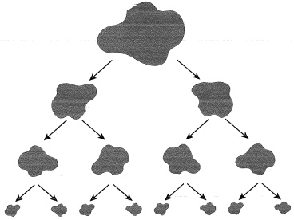

Burak başlangıçtan itibaren her adında, elindeki her bir oyun hamurunu 2 parçaya ayırarak 6. adım sonunda duruyor.

Buna göre, bu oyunun  $ \underline{\text{son}} $ üç adımında elde edilen toplam oyun hamurunun  $ \underline{\text{ilk}} $ üç adımda elde edilen toplam oyun hamuru sayısına oranı kaçtir?

A) 2 B) 4 C) 8 D) 16 E) 32

## yarqi yayinevi

Tanim: n &gt; 1 doğal sayı a =  $ \sqrt{x} $ şeklindeki ifadelerdir.

Örnek:  $ \sqrt[2]{2} $,  $ \sqrt[3]{3} $

 $$ \sqrt{0}=0 $$ 

 $$ \sqrt{36}=6 $$ 

 $$ \sqrt{1}=1 $$ 

 $$ \sqrt{49}=7 $$ 

 $$ \sqrt{4}=2 $$ 

 $$ \sqrt{144}=12 $$ 

 $$ \sqrt{169}=13 $$ 

 $$ \sqrt{64}=8 $$ 

 $$ \sqrt{9}=3 $$ 

 $$ \sqrt{196}=14 $$ 

 $$ \sqrt{81}=9 $$ 

 $$ \sqrt{16}=4 $$ 

 $$ \sqrt{100}=10 $$ 

 $$ \sqrt{225}=15 $$ 

 $$ \sqrt{25}=5 $$ 

 $$ \sqrt{121}=11 $$ 

Özellikler

1)  $ \sqrt[n]{x} = \begin{cases} x \text{ reel} \text{ sayi}, &amp; n \text{ tek ise} \\ x \geq 0, &amp; n \text{ çift ise} \end{cases} $

Örnek:  $ \sqrt[3]{-8} = \sqrt[3]{(-2)^3} = -2 $ Örnek:  $ \sqrt[2]{-4} \to bu $ şekilde olmaz. Örnek:  $ \sqrt{(-2)^2} = |-2| = 2 $

TẬP - 1

 $$ \sqrt{x-3} $$ 

ifadesinin sonucu reel sayı belirttiğine göre x'in çözüm aralığı nedir?

A) x ≥ 3

B) x &gt; 3

C) 17 &gt; x &gt; 1

D) x &gt; 10

E) x &gt; -3

TiP - 2

 $$ \sqrt{x-2}+\sqrt{7-x}+\sqrt[3]{x-5} $$ 

ifadesinin sonucu reel sayı belirttiğine göre x'in alabileceği farklı doğal sayıların toplamı kaçtır?

A) 23 B) 25 C) 27 D) 24 E) 30

#### TIP-3

 $$ \frac{\sqrt[4]{x-1}+\sqrt[6]{5-x}}{\sqrt[3]{x-4}} $$ 

ifadesinin sonucu reel sayı belirttiğine göre, x kaç farklı tam sayı değerini alır?

A) 3 B) 4 C) 5 D) 6 E) 7

#### TIP-4

 $$ \frac{\sqrt{x-2}+\sqrt{4-2x}+3x+5}{x+4} $$ 

ifadesinin sonucu reel sayı belirttiğine göre işlemin sonucu kaçtır?

A)  $ \frac{10}{3} $ B)  $ \frac{11}{6} $ C) 2 D) 3 E) 4

2)  $ \sqrt[n]{x^n} = \begin{cases} x, &amp; n \text{ tek sayi ise} \\ |x|, &amp; n \text{ çift sayi ise} \end{cases} $

Örnek:  $ \sqrt[3]{-8} = \sqrt[3]{(-2)^3} = -2 $

Örnek:

Örnek:

 $$ \sqrt{(-2)^{2}}=|-2|=2 $$ 

Örnek:

 $$ \sqrt{(-4)^{2}}=|-4|=4 $$ 

Örnek:  $ \sqrt{(x-y)^2} = |x-y| $

 $$ \sqrt{x^{2}}=|\boldsymbol{x}| $$ 

TIP-5

 $$ \sqrt[3]{-27}-\sqrt{\left(-4\right)^{2}}+\sqrt{\left(-5\right)^{4}}-2\cdot\sqrt[3]{-8} $$ 

işleminin sonucu kaçtır?

A) 20 B) 21 C) 22 D) 23 E) 24

TIP-6

 $$ \sqrt{i}\sqrt[n]{\sim\sqrt[4]{-3\sqrt{8}}} $$ 

işleminin sonucu kaçtır?

A) 5 B) $2\sqrt{3}$ C) $5-2\sqrt{3}$

D) $5-\sqrt{3}$ E) $\sqrt{3}$

##### TIP-7

x &lt; 0 &lt; y olmak üzere

 $$ \sqrt{(x-y)^{2}}+\sqrt{x^{2}}-\sqrt[3]{y^{3}}+x $$ 

ifadesinin sonucu nedir?

A) x B) -x C) x + y D) 2x E) x - y

#### 3) Toplama - Çıkarma işlemi

Köklü sayılarda toplama çıkarma işlemi yapılırken kök içerisinin ve kök derecelerinin aynı olması gerekir.

 $$ \boldsymbol{a}\sqrt{\boldsymbol{x}}+\boldsymbol{b}\sqrt{\boldsymbol{x}}=(\boldsymbol{a}+\boldsymbol{b})\sqrt{\boldsymbol{x}} $$ 

Örnek:  $ 2\sqrt{5}-3\sqrt{5}=(2-3)\sqrt{5}=-1\cdot\sqrt{5}=-\sqrt{5} $

Örnek:  $ 2\sqrt{3} + 3\sqrt{3} - 2\sqrt{3} = (2 + 3 - 2)\sqrt{3} = 3\sqrt{3} $

ek:  $ 2\sqrt{2} + 3\sqrt{2} - 5\sqrt{3} - \sqrt{3} = $

 $ =(2+3)\sqrt{2}+(-5-1)\sqrt{3} $

 $ =5\sqrt{2}-6\sqrt{3} $

4) Kök içinden Sayı Çıkarma

Kökün derecesine ulaşan sayı dışarı çıkar.

 $$ \sqrt[n]{a^{n}\cdot b}=a\sqrt[n]{b} $$ 

Örnek:  $ \sqrt{8} = \sqrt{2 \cdot 4} = \sqrt{2^2 \cdot 2} = 2\sqrt{2} $

Örnek:  $ \sqrt{27} = \sqrt{3 \cdot 9} = 3\sqrt{3} $

Örnek:  $ \sqrt{32} = \sqrt{2 \cdot 16} = 4\sqrt{2} $

Örnek:  $ \sqrt{75} = \sqrt{3 \cdot 25} = 5\sqrt{3} $

#### Tip-8

 $$ \sqrt{75}+\sqrt{300}-2\sqrt{48}+2\sqrt{12} $$ 

işleminin sonucu kaçtır?

A) $9\sqrt{3}$ B) $10\sqrt{3}$ C) $11\sqrt{3}$ D) $12\sqrt{3}$ E) $13\sqrt{3}$

tip-9

 $$ \frac{\sqrt{27}-\sqrt{48}+2\sqrt{3}}{\sqrt{12}-\sqrt{75}} $$ 

isleminin sonucu kaçtır?

A)  $ \sqrt{3} $ B) 1 C)  $ -\frac{1}{3} $ D) -1 E)  $ -\frac{3}{2} $

5) Köklüyü Üslüye Çevirme

 $$ \sqrt[b]{x^{a}}=x^{\frac{a}{b}} $$ 

Örnek:

 $$ \sqrt{2^{3}}=2^{\frac{3}{2}} $$ 

Örnek:

 $$ \sqrt[5]{2^{7}}=2^{\frac{7}{5}} $$ 

Örnek:  $ 2^{\frac{2}{3}} = \sqrt[3]{2^2} $

Örnek:  $ 2^{\frac{1}{3}} = 3\sqrt{2} $

#### TIP-10

 $ \sqrt{2}\cdot\sqrt[3]{2}\cdot\sqrt[6]{2} $

işleminin sonucu kaçtır?

A) 1 B) 2 C)  $ \sqrt{2} $ D)  $ 2\sqrt{2} $ E)  $ 3\sqrt{2} $

#### Tip-11

 $$ \sqrt{60+\sqrt{11+\sqrt{29-\sqrt{16}}}} $$ 

işleminin sonucu kaçtır?

A) 2 B) 4 C) 6 D) 8 E) 10

##### tip-12

 $$ \frac{\sqrt[6]{2^{4}+2^{4}+2^{4}+2^{4}}}{\sqrt{2^{2}+2^{2}+2^{2}+2^{2}}} $$ 

isleminin sonucu kaçtır?

A) $\frac{1}{2}$ B) 1 C) $\frac{3}{2}$ D) 2 E) 4

#### TIP-13

 $$ 5\cdot\sqrt{1-\frac{9}{25}}-3\cdot\sqrt{1-\frac{5}{9}}+2\sqrt{2+\frac{1}{4}} $$ 

işleminin sonucu kaçtır?

A) 1 B) 2 C) 3 D) 4 E) 5

#### 6) Kök Derecelerini Eşitleme

 $$ \begin{aligned}\mathbf{a}\cdot\mathbf{b}\sqrt{\mathbf{x}^{\mathbf{b}}}\cdot\mathbf{b}\cdot\mathbf{a}\sqrt{\mathbf{y}^{\mathbf{a}}}&amp;=\mathbf{a}\cdot\mathbf{b}\sqrt{\mathbf{x}^{\mathbf{b}}}\cdot\mathbf{a}\cdot\mathbf{b}\sqrt{\mathbf{y}^{\mathbf{a}}}\\&amp;=\mathbf{a}\cdot\mathbf{b}\sqrt{\mathbf{x}^{\mathbf{b}}\cdot\mathbf{y}^{\mathbf{a}}}\end{aligned} $$ 

Örn:  $ 2\cdot4\sqrt{3^4} = 8\sqrt{3^4} $

Kök derecesi eşitleme çarpma işleminde kullanılır.

Kök derecesi eşitleme siralama sorularında kullanılır.

#### tip-15

 $$ a=12\sqrt{2} $$ 

 $$ \mathbf{b}=36\sqrt{5} $$ 

 $$ c=\sqrt[6]{3} $$ 

a, b ve c nin siralaması nedir?

A) a &lt; b &lt; c B) b &lt; a &lt; c C) c &lt; b &lt; a

D) b &lt; c &lt; a E) c &lt; a &lt; b

#### tip-14

 $$ \sqrt{\frac{4}{25}+\frac{9}{49}-\frac{12}{35}} $$ 

işleminin sonucu kaçtır?

A) $\frac{3}{5}$ B) $\frac{1}{7}$ C) $\frac{1}{15}$ D) $\frac{1}{35}$ E) $\frac{1}{40}$

#### TIP-16

 $$ \sqrt[3]{x}&gt;\sqrt[5]{4} $$ 

eşitsizliğini sağlayan  $ \underline{\text{en küçük}} $ x doğal sayısı kaçtır?

A) 1 B) 2 C) 3 D) 4 E) 5

#### Tip-17

 $$ \sqrt{2}\cdot\sqrt[3]{x}=6\sqrt{4} $$ 

denklemini sağlayan x değeri kaçtır?

A)  $ \frac{1}{\sqrt{2}} $ B)  $ \sqrt{2} $ C)  $ 2\sqrt{2} $ D)  $ \frac{3}{\sqrt{2}} $ E)  $ \frac{5}{\sqrt{2}} $

#### Tip-18

 $$ \sqrt[3]{9^{x-1}}=\sqrt{27^{x+1}} $$ 

denklemini sağlayan x değeri kaçtır?

A)  $ -\frac{1}{5} $ B)  $ -\frac{7}{5} $ C)  $ -\frac{9}{5} $ D)  $ -\frac{13}{5} $ E)  $ -\frac{17}{5} $

Tip-19

 $$ \sqrt{2\cdot\sqrt[3]{4}}=2^{1-x} $$ 

esitiliğini sağlayan x değeri kaçtır?

A)  $ \frac{1}{2} $ B)  $ \frac{1}{4} $ C)  $ \frac{1}{6} $ D)  $ \frac{1}{8} $ E)  $ \frac{1}{16} $

7) Çarpma işlemi

♦ Carpma işlemi yapılırken kök dereceleri eşit olmalı

Örnek:  $ \sqrt{2} \cdot \sqrt{2} = \sqrt{4} = 2 $

 $ \sqrt{a} \cdot \sqrt{b} = \sqrt{a \cdot b} $ (a ve b pozitif)

♢  $ \boldsymbol{x}^{2}-\boldsymbol{y}^{2}=(\boldsymbol{x}-\boldsymbol{y})\cdot(\boldsymbol{x}+\boldsymbol{y}) $

♢  $ \left(\sqrt{x} + \sqrt{y}\right) \cdot \left(\sqrt{x} - \sqrt{y}\right) = \sqrt{x^2} - \sqrt{y^2} = x - y $

Örnek:  $ (\sqrt{7} - \sqrt{3}) \cdot (\sqrt{7} + \sqrt{3}) = \sqrt{7^2} - \sqrt{3^2} = 7 - 3 = 4 $

TiP-20

 $$ (2+\sqrt{3})\cdot(3-\sqrt{3}) $$ 

işleminin sonucu kaçtır?

A) 3

B) 2

C) $\sqrt{3}$

D) $2+\sqrt{3}$

E) $3+\sqrt{3}$

#### TIP-21

 $$ (2-3\sqrt{2})\cdot(2+3\sqrt{2}) $$ 

işleminin sonucu kaçtır?

A) -8 B) -10 C) -14 D) -16 E) -18

TIP-22

 $$ \sqrt{2}\cdot\sqrt{3}\cdot\sqrt{4}\cdots\sqrt{a}=12\sqrt{5} $$ 

olduğuna göre, a değeri kaçtır?

A) 3 B) 4 C) 5 D) 6 E) 7

TIP-23

 $$ \sqrt{5}-\sqrt{3}\cdot\sqrt[3]{\sqrt{5}}+\sqrt{3}\cdot\sqrt[6]{\sqrt{5}}+\sqrt{3} $$ 

işleminin sonucu kaçtır?

A) $\sqrt{2}$ B) $2\sqrt{2}$ C) 1 D) 2 E) 5

TIP-24

a ≥ 3 olmak üzere

 $$ \sqrt{a-1}+\sqrt{a-3}=8 $$ 

olduġuna gõre,  $ \sqrt{a-1}-\sqrt{a-3} $ ifadesinin sonucu kaçtır?

A) 8 B) 6 C) 4 D)  $ \frac{1}{2} $ E)  $ \frac{1}{4} $

8) Bölme

♦ Paydada kök varsa rasyonel yapılmalı

♦ Paydayi rasyonel yapma (eşlenik ifadeler)

 $$ \begin{array}{ccc}E\xi len i\ddot{o}i&amp; &amp; \\ \sqrt{2}&amp;\longrightarrow&amp;\sqrt{2} \\ \sqrt{5}&amp;\longrightarrow&amp;\sqrt{5} \\ 2+\sqrt{3}&amp;\longrightarrow&amp;2-\sqrt{3} \\ 5-\sqrt{2}\quad&amp;\longrightarrow&amp;5+\sqrt{2} \\ 7-2\sqrt{3}&amp;\longrightarrow&amp;7+2\sqrt{3} \\ \sqrt{7}-4&amp;\longrightarrow&amp;\sqrt{7}+4 \\ 3\sqrt{2}&amp;\longrightarrow&amp;3\sqrt{2^{2}}\end{array} $$ 

 $$ Tip-25 $$ 

 $$ 2+\sqrt{3} $$ 

sayisinin çarpma işlemine göre tersi nedir?

A)  $ \sqrt{3} $ B) 2 C)  $ 2-\sqrt{3} $

D)  $ 2\sqrt{3} $ E)  $ 2\sqrt{3} $

TIP-26

 $$ \frac{\sqrt{12}}{\sqrt{3}}-\frac{2}{\sqrt{3}+2}-\frac{1}{\sqrt{3}-2} $$ 

işleminin sonucu kaçtır?

A)  $ \sqrt{3} $ B)  $ 3\sqrt{3} $ C)  $ 5\sqrt{3} $ D)  $ 7\sqrt{3} $ E)  $ 8\sqrt{3} $

&lt;div style="text-align: center;"&gt;&lt;div style="text-align: center;"&gt;Tip-27&lt;/div&gt; &lt;/div&gt;

 $$ \frac{\sqrt{1,21}-\sqrt{0,25}}{\sqrt{3,6}} $$ 

işleminin sonucu kaçtır?

A) $\sqrt{10}$ B) $\frac{\sqrt{10}}{2}$ C) $\frac{\sqrt{10}}{5}$ D) $\frac{\sqrt{10}}{7}$ E) $\frac{\sqrt{10}}{10}$

&lt;div style="text-align: center;"&gt;&lt;div style="text-align: center;"&gt;TIP-28&lt;/div&gt; &lt;/div&gt;

 $$ \frac{1}{\sqrt{2}+\sqrt{3}}+\frac{1}{\sqrt{3}+\sqrt{4}}+\ldots+\frac{1}{\sqrt{13}+\sqrt{14}}=\frac{x}{\sqrt{14}+\sqrt{2}} $$ 

işleminde x'in değeri kaçtır?

A) 4 B) 6 C) 8 D) 10 E) 12

TIP-29

 $$ \frac{1}{\sqrt{4}+\sqrt{5}}+\frac{1}{\sqrt{5}+\sqrt{6}}+\ldots+\frac{1}{\sqrt{35}+\sqrt{36}} $$ 

işleminin sonucu kaçtır?

A)  $ \sqrt{3} $ B)  $ \sqrt{5} $ C) 4 D) 2 E) 1

9) ic - ice ve Sonsuz Kokler

 $$ \sqrt[x]{a^{y}\sqrt{b}}={\sqrt[x{\cdot}y]{a^{y}\cdot b}} $$ 

Örnek:

 $$ \sqrt{2^{3}\sqrt{2}}=2\cdot3\sqrt{2^{3}}\cdot2 $$ 

Örnek:  $ \sqrt{3\sqrt{3^{4}\sqrt{3}}}=2\cdot2\cdot4\sqrt{3^{2}\cdot4\cdot3^{4}\cdot3} $

II) Sonsuz Kökler

 $$ \sqrt{x+\sqrt{x+\sqrt{x+\cdots}}}=k $$ 

Not: Sonsuz köklerde ilk tekrar eden ne ise sonuç odur.

Örnek:

 $$ \sqrt{12+\sqrt{12+\sqrt{12+\cdots}}}=k $$ 

 $$ \begin{array}{c}\sqrt{12+k}=k\\\downarrow\quad\downarrow\\\textcircled{4}\quad\textcircled{4}\end{array} $$ 

##### NOT

Sonsuz köklerde içerideki sayıyı ardışık çarpanlarına ayır. Toplamada cevap büyük çarpan, çıkarmada cevap küçük çarpardır.

TIP-30

 $$ A=\sqrt{20+\sqrt{20+...}} $$ 

 $$ \mathsf{B}=\sqrt{42-\sqrt{42-...} $$ 

ifadesinde A – B farki kaçtir?

A) 4 B) 3 C) 2 D) 1 E) -1

#### TIP-31

 $ \sqrt[3]{3\cdot\sqrt[3]{3\cdot\sqrt[3]{3\cdot\cdots}}} $

ifadesinin sonucu kaçtır?

A) $\sqrt{3}$ B) 3 C) $3\sqrt{3}$ D) 9 E) $9\sqrt{3}$

##### TIP-32

 $$ \sqrt[3]{2}\cdot\sqrt{2}=\sqrt{2}\cdot\sqrt[3]{x} $$ 

ifadesinde x'in degeri kaçtır?

A) 1 B) 3 C) 5 D) 7 E) 9

##### TIP-33

 $ \frac{\sqrt{3}\cdot\sqrt[3]{3}\cdot\sqrt[4]{3}}{\sqrt{3}\cdot\sqrt[3]{9}\cdot\sqrt{3}} $

işleminin sonucu kaçtır?

A)  $ \sqrt{3} $ B)  $ \sqrt[3]{3} $ C)  $ \sqrt[4]{3} $ D)  $ \sqrt[5]{3} $ E)  $ \sqrt[6]{3} $

10) Özel Kök

 $ \sqrt{a+2\sqrt{b}} $ ve  $ \sqrt{a-2\sqrt{b}} $ şeklindeki ifadelerdir.

b = x ⋅ y

a = x + y

x &gt; y olsun ve şartlar sağlanıyorsa

 $ \sqrt{a+2\sqrt{b}}=\sqrt{x}+\sqrt{y} $  $ \sqrt{a-2\sqrt{b}}=\sqrt{x}-\sqrt{y} $ dir

TIP-34

 $$ \sqrt{8+2\sqrt{7}}-\sqrt{8-2\sqrt{7}} $$ 

işleminin sonucu kaçtır?

A) 1 B) 2 C)  $ \sqrt{7} $ D)  $ 2\sqrt{7} $ E) 5

##### Tip-35

 $$ \sqrt{5+2\sqrt{6}}-\sqrt{5-2\sqrt{6}} $$ 

işleminin sonucu kaçtır?

A) 1 B) 2 C) 5 D)  $ \sqrt{2} $ E)  $ 2\sqrt{2} $

&lt;div style="text-align: center;"&gt;&lt;div style="text-align: center;"&gt;Tip-36&lt;/div&gt; &lt;/div&gt;

 $$ \sqrt{2-\sqrt{3}}+\sqrt{2+\sqrt{3}} $$ 

işleminin sonucu kaçtır?

A) $\sqrt{2}$ B) $\sqrt{3}$ C) $2\sqrt{2}$ D) $\sqrt{6}$ E) $2\sqrt{6}$

#### TIP-37

 $$ \frac{1}{2+\sqrt{3}}+\frac{1}{\sqrt{3}+\sqrt{2}}+\frac{x}{\sqrt{2}+1}=2 $$ 

olduğuna göre, x kaçtır?

A) $1+\sqrt{2}$ B) $1+2\sqrt{2}$ C) $2+\sqrt{2}$ D) $2+\sqrt{3}$ E) $3\sqrt{2}$

#### Tip-38

Köklü sayılarla işlem yapan Mert,  $ \sqrt{15} + \sqrt{10} $ sayısını eşleniği olan  $ \sqrt{15} - \sqrt{10} $ ile çarpmak yerine yanlışlıkla bölmüştür.

Buna göre, Mert'in bulduğu sayı bulması gereken sayıdan kaç fazladır?

A)  $ \sqrt{12} $ B)  $ \sqrt{24} $ C)  $ \sqrt{32} $ D)  $ \sqrt{48} $ E)  $ \sqrt{54} $

#### TIP-39

a ve b gerçek sayıları için,

 $$ \sqrt{a^{2}\cdot b}=\frac{3\sqrt{5}}{5} $$ 

 $$ \sqrt{a\cdot b}=\frac{\sqrt{30}}{5} $$ 

olduġuna gõre, a + b toplami kaċtir?

A)  $ \frac{7}{5} $ B)  $ \frac{11}{5} $ C)  $ \frac{23}{10} $ D)  $ \frac{19}{15} $ E)  $ \frac{29}{20} $

#### TIP-40

 $$ 1&lt;\frac{\sqrt{a-1}}{2}&lt;\frac{5}{\sqrt{a-1}} $$ 

esitsizligini sağlayan a tam sayılarının toplamı kaçtır?

A) 13 B) 15 C) 24 D) 30 E) 40

Aşağıda Şekil - I ve Şekil - II'de iç içe yerleştirilmiş aynı bardakların görünümü verilmiştir.

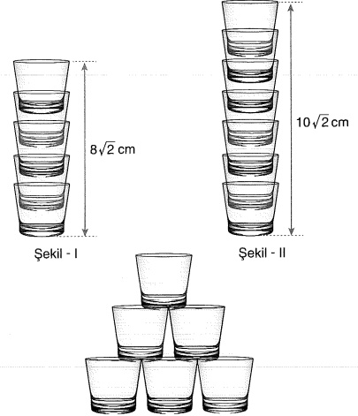

$ekil - 1

$ekil - ll

Buna göre, yukarıdaki gibi altı bardak ile oluşturulan şeklin yüksekliği kaç cm'dir?

A)  $ 6\sqrt{2} $ B)  $ 8\sqrt{2} $ C)  $ 10\sqrt{2} $ D)  $ 12\sqrt{2} $ E)  $ 14\sqrt{2} $

#### Tip-42

n kenarlı bir çokgenin içerisine yazılan bir x sayısı için ifadenin eşiti  $ \sqrt[n]{x} $ olmaktadır.

Örneğin;

 $$ \boxed{\mathbf{x}}=\sqrt[4]{\mathbf{x}} $$ 

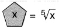

Buna göre,

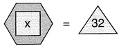

eşitliğini sağlayan x değeri için,

#### ifadesinin eşiti kaçtır?

A)  $ \frac{1}{4} $ B)  $ \frac{1}{2} $

C) 1

D)2

E) 4

#### CARPANLARA AYIRMA

 $  \mathrm{A}(x) \mp \mathrm{B}(x) = \mathrm{C}(x) \cdot \mathrm{D}(x)  $

C(x) ve D(x) ifadenin çarpanlarıdır.

Ifadeler ortak bir ifadenin parantezine alını.

şeklindeki ifadeler

1) Ortak Paranteze Alma

Örnek:  $ 2x + 6 = 2x + 2 \cdot 3 = 2 \cdot (x + 3) $

 $ 3x - 3x^2y = 3x - 3x \cdot x \cdot y $

 $ = 3x(1 - xy) $

Örnek:  $ a^{3} + a^{2} - a = a(a^{2} + a - 1) $

#### Tip-1

 $$ \frac{x^{3}y^{2}-xy}{x^{2}y-1} $$ 

ifadesinin  $ \underline{\text{en sade}} $ hâli nedir?

A) x B) y C) x·y D) x + y E) x - y

#### TIP-2

 $$ (a+b)\cdot(a-b)-(a+b)^{2} $$ 

ifadesinin çarpanlarından biri aşağıdakilerden hangisidir?

A) a - b

B) 2a

C) 2b

D) 2a + b

E) 2a - b

İfadelerin hepsi aynı anda paranteze alınamıyorsa kendi içlerinde gruplandırma yapılarak çarpanlarına ayrılır.

2) Gruplandirarak Carpanlara Ayirma

$$\begin{array}{l}\uparrow\quad\overbrace{ax+bx+ay+by}\quad\overbrace{x+y}\end{array}$$

$$=\quad x(a+b)+y(a+b)$$

$$=(a+b)(x+y)$$

#### Tip-3

 $$ a^{3}+a^{2}-a-1 $$ 

ifadesinin çarpanlarından biri aşağıdakilerden hangisidir?

A) a           B)  $ a + 1 $          C) 2a

D) 2a-1        E) 2a-2

#### Tip-4

 $$ x+y=5 $$ 

 $$ y+z=6 $$ 

olduğuna göre, x·y + x·z + y² + y·z ifadesinin sonucu kaçtır?

A) 15 B) 20 C) 30 D) 45 E) 50

 $$ (x-y)^{3}\cdot(a-b)^{2}-(y-x)^{2}\cdot(b-a)^{3} $$ 

ifadesinin çarpanlarından biri aşağıdakilerden hangisidir?

A)  $ x + y $ B)  $ a + b $ C) 2a - b

D)  $ 2x + y $ E)  $ x - y - b + a $

#### TIP-6

 $$ \frac{\sqrt{10}+\sqrt{15}}{2+\sqrt{6}} $$ 

ifadesinin sonucu nedir?

A)  $ \frac{\sqrt{5}}{3} $ B)  $ \frac{\sqrt{10}}{2} $ C)  $ \frac{\sqrt{5}}{2} $ D)  $ \frac{\sqrt{10}}{3} $ E)  $ \frac{\sqrt{5}}{\sqrt{6}} $

tip-7

 $$ \frac{2+\sqrt{2}+\sqrt{10}+\sqrt{5}}{\sqrt{2}+1} $$ 

işleminin sonucu kaçtır?

A) $\sqrt{2}+1$ B) $\sqrt{5}+1$ C) $\sqrt{2}+\sqrt{5}$

D) $2+\sqrt{5}$ E) $\sqrt{2}+2$

3) $ax^{2}+bx+c$ Şeklindeki ifadeler

#### ? ORNEK SORU

 $$ x^{2}+3x+2 $$ 

ifadesinin çarpanları nelerdir?

#### QÖZÜM

 $$ x^{2}+3x+2 $$ 

 $$ \begin{array}{l}\downarrow\\\left.\begin{array}{l}\left.x\right.\end{array}\right.\\\left.\begin{array}{l}\left.\begin{array}{l}\downarrow\\2\\1\end{array}\right.\end{array}\right\}\left.x+2x=\right.\\\left.\begin{array}{l}\textcircled{3x}\end{array}\right.\\=\left(x+2\right)\left(x+1\right)\end{array} $$ 

##### ÖRNEK SORU

 $$ x^{2}+6x-7 $$ 

ifadesinin çarpanları nelerdir?

#### ÇÖZÜM

 $$ x^{2}+3x+2 $$ 

 $$ \begin{array}{l}\downarrow\\\left.\begin{array}{l}x\\\end{array}\right|_{\begin{array}{l}7\\-1\end{array}}\left.\begin{array}{l}\\\end{array}\right\}-x+7x=\textcircled{6}x\\=(x+7)(x-1)\end{array} $$ 

##### ÖRNEK SORU

 $$ x^{2}+6x+5 $$ 

ifadesinin çarpanları nelerdir?

#### QÖZÜM

 $$ \begin{aligned}&amp;x^{2}+6x+5\\&amp;\quad5\quad1\\=(x+5)(x+1)\end{aligned} $$ 

##### ÖRNEK SORU

 $$ x^{2}-8x+7 $$ 

ifadesinin çarpanları nelerdir?

#### QÖZÜM

 $$ \begin{array}{c}x^{2}-8x+7\\-1\quad-7\\=(x-1)(x-7)\end{array} $$ 

#### ? ORNEK SORU

 $$ 2x^{2}+7x+3 $$ 

ifadesinin çarpanları nelerdir?

#### QÖZÜM

 $$ 2x^{2}+7x+3 $$ 

 $$ \begin{array}{l}\downarrow\\\left.\begin{array}{l}2x\\x\end{array}\right.\left.\begin{array}{l}\downarrow\\1\\3\end{array}\right\}\\\underline{\quad\quad\quad\quad}\quad(2x+1)(x+3)\end{array}\left\{\begin{array}{l}6x+x=\textcircled{7}x\\\end{array}\right. $$ 

##### ÖRNEK SORU

 $$ 3x^{2}-8x-3 $$ 

ifadesinin çarpanları nelerdir?

#### ÇÖZÜM

 $$ 3x^{2}-8x-3 $$ 

 $$ \begin{array}{l}\downarrow\\\left.\begin{array}{l}3x\\x\end{array}\right.\left.\begin{array}{l}\downarrow\\1\\-3\end{array}\right\}\\-9x+x=\textcircled{-8x}\\=\left(3x+1\right)\cdot\left(x-3\right)\end{array} $$ 

 $$ \frac{x^{2}+3x+2}{x+1}+\frac{x^{2}-2x+1}{x-1} $$ 

ifadesinin en sade hâli nedir?

A)  $ x + 5 $ B) x - 3 C)  $ 2x + 1 $ D) x E) -x

4) Özdeşlikler

1) iki Kare Farkı

 $ x^{2} - y^{2} = (x - y)(x + y) $

Örnek:  $ x^2 - 9 = x^2 - 3^2 = (x - 3)(x + 3) $

Örnek: $4x^2 - 16 = (2x)^2 - 4^2 = (2x - 4) \cdot (2x + 4)$

Örnek:  $ x^2 - 3 = x^2 - (\sqrt{3})^2 = (x - \sqrt{3}) \cdot (x + \sqrt{3}) $

##### tip-9

 $$ 25x^{2}-16y^{2} $$ 

ifadesinin çarpanları nelerdir?

A)  $ (5x - 4y) \cdot (2x + y) $

B)  $ (5x + 4y) \cdot (2x - y) $

C)  $ (5x - 4y) \cdot (5x + 4y) $

D)  $ (25x - 16y) \cdot (25x + 16y) $

E)  $ (5x - y) \cdot (5x + y) $

##### TIP-10

 $$ (x+y-2)^{2}-(x-y-2)^{2} $$ 

carpanlari nelerdir?

A)  $ 4y \cdot (x-2) $ B)  $ y \cdot (x+2) $ C)  $ 4y \cdot (x+2) $

D)  $ 2y \cdot (x+2) $ E)  $ (x-2) \cdot (x+2) $

TIP-11

 $$ \frac{(298^{2}-98^{2})-200\cdot392}{4a}=16 $$ 

olduğuna göre, a kaçtir?

A) 10 B)  $ \frac{15}{2} $ C)  $ \frac{25}{2} $ D)  $ \frac{15}{4} $ E)  $ \frac{25}{4} $

##### Tip-12

 $$ \frac{x^{2}-2x-y^{2}+2y}{x-y} $$ 

ifadesinin  $ \underline{\text{en sade}} $ hâli nedir?

A) x B) y C) x + y

D) x - y E) x + y - 2

&lt;div style="text-align: center;"&gt;&lt;div style="text-align: center;"&gt;Tip-13&lt;/div&gt; &lt;/div&gt;

 $$ x^{4}-y^{2}=21 $$ 

 $$ x^{2}+y=3 $$ 

olduğuna göre,  $ x^{2} - y^{2} $ ifadesinin sonucu kaçtır?

A) 1 B) 2 C) 3 D) 4 E) 5

#### TIP-14

9⁴ -1 ifadesi aşağıdakilerden hangisine tam  $ \underline{\text{bölünemez}} $?

A) 4 B) 16 C) 41 D) 70 E) 82

II) Tam Kare ifadeter

 $$ (x+y)^{2}=x^{2}+2xy+y^{2} $$ 

 $$ (x-y)^{2}=x^{2}-2xy+y^{2} $$ 

 $$ (x+y-z)^{2}=x^{2}+y^{2}+z^{2}+2(x y-x z-y z) $$ 

Örnek:  $ (x-3)^2 = x^2 - 2 \cdot x^3 + 3^2 = x^2 - 6x + 9 $

Örnek:  $ (x+2)^2 = x^2 + 2 \cdot x \cdot 2 + 2^2 = x^2 + 4x + 4 $

 $$ \begin{aligned}\left(\mathbf{x}-\frac{1}{\mathbf{x}}\right)^{2}&amp;=\mathbf{x}^{2}-2\cdot\mathbf{x}\cdot\frac{1}{\mathbf{x}}+\left(\frac{1}{\mathbf{x}}\right)^{2}\\&amp;=\mathbf{x}^{2}-2+\frac{1}{\mathbf{x}^{2}}\end{aligned} $$ 

Örnek:  $ x^2 + 6x + 9 = (x + 3) \cdot (x + 3) = (x + 3)^2 $

Örnek:  $ x^2 - 4x = (x - \frac{2}{4})^2 - 4 $

### NOT

Tam kare yapmak için ortadaki sayının yarısının karesi parantezine al.

Örnek:  $ x^2 + 6x = (x + \frac{3}{1})^2 - 9 $

Örnek:  $ x^{2} - 8x = (x - 4)^{2} - 16 $

Örnek:  $ x^{2} + 2x + 7 $ ifadesinı tam kare yapımaz.

 $$ (x+{\tiny\begin{array}{c}{1}\\ {1}\end{array}})^{2}+6 $$ 

Örnek:  $ x^{2} - 4x + 11 $ ifadesini tam kare yapınız.

 $ =(x-2)^{2}+7 $

##### NOT

Sorularda ifadenin en büyük ya da en küçük değeri sorulursa tam kare yapmalıyız.

#### tip-15

 $$ x^{2}+6x+13 $$ 

ifadesinin  $ \underline{\text{en küçük}} $ degeri kaçtir?

A) 1 B) 2 C) 3 D) 4 E) 5

##### Tip-16

 $$ x^{2}+4x+y^{2}-6y+11 $$ 

ifadesinin  $ \underline{\text{en küçük}} $ değeri kaçtır?

A) -2 B) -1 C) 0 D) 1 E) 2

#### tip-17

x - y = 12  ve  x \cdot y = 3

olduğuna göre,  $ x^{2} + y^{2} $ toplamının değeri kaçtır?

A) 144 B) 148 C) 150 D) 156 E) 182

TIP-18

 $ a^2 + b = b^2 + a $ ve  $ a \cdot b = -1 $

olduğuna göre  $ a^{2} + b^{2} $ toplamının değeri kaçtır?

A) -1 B) 0 C) 1 D) 2 E) 3

##### tip-19

 $$ 4a^{2}+12ab+(k-2)\cdot b^{2} $$ 

ifadesi tam kare ifade ise k kaçtir?

A) 8 B) 9 C) 10 D) 11 E) 12

#### TIP-20

 $$ x^{2}+4x+1=0 $$ 

olduğuna göre  $ x^{2} + \frac{1}{x^{2}} $ ifadesinin değeri kaçtır?

A) 10 B) 11 C) 12 D) 13 E) 14

III) iki Küp Toplamı ve Farkı

•  $ x^3 - y^3 = (x - y)(x^2 + xy + y^2) $ ya da  $ x^3 + y^3 = (x + y)(x^2 - xy + y^2) $

•  $ x^3 - y^3 = (x - y)^3 + 3 \cdot x \cdot y \cdot (x - y) $ ya da  $ x^3 + y^3 = (x + y)^3 - 3 \cdot x \cdot y \cdot (x + y) $

Örnek:  $ x^3 - 8 = x^3 - 2^3 = (x - 2)(x^2 + 2x + 2^2) $

Örnek:  $ x^3 + 27 = x^3 + 3^3 = (x + 3)(x^2 - 3x + 3^2) $

##### tip-21

x + y = 3  ve    x \cdot y = 1

olduğuna göre,  $ x^{3} + y^{3} $ ifadesinin sonucu kaçtır?

A) 17 B) 18 C) 19 D) 20 E) 21

#### TIP-22

 $$ x-\frac{1}{x}=5 $$ 

olduġuna gõre, x^{3} —$\frac{1}{x^{3}}$ ifadesinin deġeri kaċċir?

A) 140 B) 145 C) 150 D) 155 E) 160

#### Tip-23

 $$ x^{2}+1=x $$ 

olduğuna göre,  $ x^{3} + 3x^{2} + 1 $ ifadesinin sonucu nedir?

A) 3x B) 3x - 1 C) 3x - 2 D) 3x - 3 E) 3x - 4

IV) Tam Kúp ifadeler

(x+y)^3 = x^3 + 3x^2 \cdot y + 3xy^2 + y^3 \quad (x-y)^3 = x^3 - 3x^2 \cdot y + 3xy^2 - y^3

 $ \underline{\text{TiP-24}} $

 $$ x^{3}+3x^{2}\cdot y=11 $$ 

 $$ y^{3}+3x y^{2}=16 $$ 

olduğuna göre, x + y toplamının değeri kaçtır?

A) 2 B) 3 C) 4 D) 5 E) 6

#### TIP-25

a ve b gerçel sayılar olmak üzere,

a^{3}+b^{3}=44

a+b=2

olduğuna göre, a·b çarpımı kaçtır?

A) -6 B) -5 C) -4 D) -3 E) -2

TiP-26

 $$ x-\frac{1}{x}=3 $$ 

olduğuna göre,  $ x^{3}-\frac{1}{x^{3}} $ ifadesinin değeri kaçtır?

A) 6 B) 9 C) 12 D) 18 E) 36

5. Hayyam Üçgeni

$(x \mp y)^n$ ifadesinin açılımının katsayları

Örn: $(x + y)^5 = x^5 + 5x^4y + 10x^3y^2 + 10x^2y^3 + 5xy^4 + y^5$

#### TIP-27

x = 3, y = -1 olmak üzere,

 $$ x^{4}+4x^{3}y+6x^{2}y^{2}+4x y^{3}+y^{4} $$ 

ifadesinin sonucu kaçtır?

A) 8 B) 12 C) 16 D) 20 E) 27

#### TíP - 28

x =  $ \sqrt[5]{7} + 1 $ veriliyor.

 $$ x^{5}-5x^{4}+10x^{3}-10x^{2}+5x $$ 

ifadesinin sonucu kaçtır?

A) 5 B) 6 C) 7 D) 8 E) 9

##### Tip-29

 $$ (2+1)\cdot(2^{2}+1)\cdot(2^{4}+1)\cdot(2^{8}+1)=2^{x}-1 $$ 

olduğuna göre x kaçtır?

A) 4 B) 8 C) 16 D) 32 E) 64

##### Tip-30

 $$ \frac{x^{3}-27}{(x+3)^{2}-3x}:\frac{x^{2}-9}{x+3} $$ 

ifadesinin sadeleştirilmiş biçimi aşağıdakilerden hangisidir?

A)  $ x + 3 $ B) 3 - x C) x - 3

D) 1 E) 3

#### TiP - 31

## a ve b pozitif tam sayıları için

 $$ a^{2}-2b=41 $$ 

 $$ 2a+b^{2}=30 $$ 

olduğuna göre, a · b çarpımı kaçtır?

A) 24 B) 28 C) 30 D) 36 E) 42

#### tip-32

#### Birbirinden farklı pozitif x ve y gerçel sayıları için

 $$ \frac{x^{2}-y^{2}}{\sqrt{x}-\sqrt{y}}=40\quad ve\quad x+y=10 $$ 

olduğuna göre, x·y çarpımı kaçtır?

A) 9 B) 10 C) 12 D) 14 E) 15

&lt;div style="text-align: center;"&gt;&lt;div style="text-align: center;"&gt;Tip-33&lt;/div&gt; &lt;/div&gt;

 $ \frac{2^{12}-1}{1+2^{3}+2^{6}+2^{9}} $

işleminin sonucu kaçtır?

A) 5 B) 7 C) 9 D) 11 E) 13

&lt;div style="text-align: center;"&gt;&lt;div style="text-align: center;"&gt;Tip-34&lt;/div&gt; &lt;/div&gt;

Şehir turu yapmak isteyen bir grup turist, her birinde x kişi olacak biçimde x tane minibüse binerek sabah otelden ayrılmıştır. Öğleden sonra, turistlerin bir kısmı yoruldukları için turu tamamlamak istememiştir. Turu tamamlamak isteyenler her birinde y kişi olacak biçimde y tane minibüse birerek tura devam etmiş, yorulanlar ise diğer minibüslere eşit sayıda paylaştırılarak otele geri dönmüştür.

Buna göre, otele geri dönen minibüslerin her birinde kaç turist vardır?

A)  $ x + y $ B)  $ x - y $ C)  $ x \cdot y $ D)  $ x^{2} - y^{2} $ E)  $ x^{2} + y^{2} $

Tip - 35

 $$ \frac{x^{2}-ax+b}{x^{2}-3x+2} $$ 

ifadesinin sadeleştirilmiş biçimi  $ \frac{x-3}{x-2} $ olduğunu göre, a·b çarpımı kaçtır?

A) 2 B) 4 C) 6 D) 8 E) 12

Tip-36

Bir kenarının uzunluğu 8a birim olan kare şeklindeki bir kâğıt aşağıdaki gibi orta kısımlarından döride katlanarak köşelerinden b ürim uzunluklarında kareler kesilerek çıkartılıyor.

&lt;div style="text-align: center;"&gt;&lt;div style="text-align: center;"&gt;8a&lt;/div&gt; &lt;/div&gt;

Buna göre, son durumdaki kesilen kâğıt katlandığı yerlerden açıldığında, kâğıdın alanını veren ifade aşağıdakilerden hangisidir?

A)  $ 8(a - b) \cdot (a + b) $ B)  $ 8(2a - b) \cdot (2a + b) $ C)  $ 16(a - b) \cdot (a + b) $

D)  $ 16(2a - b) \cdot (2a + b) $ E)  $ 64(2a - b) \cdot (2a + b) $

##### I. DERECEDEN DENKLEMLER

a sifirdan farklı bir reel sayı ve b reel sayı olmak üzere,

 $$ a x+b=0 $$ 

şeklindeki denklemlere x değişkenine bağlı birinci dereceden bir bilinmeyenli denklemler denir. Burada x denklemin köküdür.

§ ax + b = 0 ⇒ x = - $ \frac{b}{a} $  Çözüm kümesi: Ç.K =  $ \left\{-\frac{b}{a}\right\} $

0 = 0, 1 = 1, 2 = 2 gibi ifadelerde çözüm kümesi sonsuz elemanlıdır.

Yani Ç.K. = R'dir.

0 = 1, 3 = 5 gibi ifadelerde ise çözüm kümesi boş kümedir. Yani Ç.K = O TİP - 1

a ve b birer tam sayı olmak üzere,

 $$ (a-3)x^{2}+2x^{b-2}+4=0 $$ 

denklemi birinci dereceden bir bilinmeyenli denklem olduğuna göre, + b toplamı kaçtır?

A) 4 B) 5 C) 6 D) 7 E) 8

tip-2

 $$ \frac{3x-1}{2}-\frac{4x-3}{3}=\frac{x+4}{4} $$ 

olduğuna göre, x gerçel sayısı kaçtir?

A) -7 B) -6 C) -5 D) -4 E) -3

##### TIP-3

 $$ \frac{x+a}{2}+\frac{x-a}{3}=2x+1 $$ 

denkleminin kökü x = 1 olduğunu göre, a kaçtır?

A) 10 B) 11 C) 12 D) 13 E) 14

tip-4

 $$ \frac{2}{x-1}-\frac{1}{x}+\frac{2}{x+1}=\frac{k}{x-2} $$ 

denkleminin bir kökü {−1, 0, 1, 2, 3} kümesinin bir elemanıdır.

denkleminin bir kökü {-1, 0, 1, 2, 3} kümesinin bir elemanıdır.

Buna göre, k değeri kaçtır?

A)  $ \frac{1}{6} $ B)  $ \frac{3}{4} $ C)  $ \frac{5}{6} $ D)  $ \frac{7}{6} $ E)  $ \frac{11}{3} $

#### TIP-5

 $$ (2a-4)x+4b+20=0 $$ 

denklemi, x'in bütün değerleri için sağlanmaktadır.

Buna göre, a + b toplamı kaçtır?

A) -5 B) -4 C) -3 D) -2 E) -1

#### Birinci Dereceden iki Bilinmeyentli ifadeler

a ve b sifirdan farklı reel sayılar ve c reel sayı olmak üzere,

 $ ax + by + c = 0 $

şeklindeki denklemlerdir. Bu denklem x ve y'nin bütün değerleri için sağlanıyorsa a = b = c = 0 olmalıdır.

#### TIP-6

(a - 1)x + (b - 2)y + c + 3 = 0

denklemi her x ve y değeri için sağlandığına göre, a · b · c çarpımı kaçtır?

A) -6 B) -3 C) 0 D) 3 E) 6

Denkle Sistemi

ax + by + c = 0

dx + ey + f = 0

şeklinde en az iki tane bilinmeyenli denklemden oluşan sisteme iki bilinmeyenli denklem sistemi denir. Burada,

 $ \frac{a}{d} = \frac{b}{e} = \frac{c}{f} $ ise çözüm kümesi sonsuz elemanlidir. Yani reel sayilardır.

 $ \frac{a}{d} \neq \frac{b}{e} $ ise çözüm kümesi tek elemanlidir.

 $ \frac{a}{d} = \frac{b}{e} \neq \frac{e}{f} $ ise çözüm kümesi boş kümedir.

##### TIP-7

$(a-1)x+2y=4$

3x-by=2

denklem sisteminin çözüm kümesi sonsuz elemanlidir.

Buna göre, a + b toplamı kaçtır?

A) 4 B) 5 C) 6 D) 7

#### Tip-8

 $$ x=\frac{4y+8}{y-3} $$ 

esitliğinde x'in hangi değeri için y  $ \underline{\text{bulunamaz}} $?

A) 1 B) 2 C) 3 D) 4 E) 5

#### TIP-9

a ve b gerçek sayıları için

 $$ \frac{a+2}{b+1}=\frac{2}{3} $$ 

 $$ \frac{a-1}{b-2}=\frac{1}{3} $$ 

olduğuna göre, a  b çarpımı kaçtır?

A) 9 B) 10 C) 12 D) 15

#### TIP 10

 $$ \frac{1}{a}+\frac{1}{b}=\frac{1}{3} $$ 

 $$ \frac{1}{b}+\frac{1}{c}=\frac{1}{4} $$ 

 $$ \frac{1}{a}+\frac{1}{c}=\frac{1}{6} $$ 

&lt;table border=1 style='margin: auto; word-wrap: break-word;'&gt;&lt;tr&gt;&lt;td style='text-align: center; word-wrap: break-word;'&gt;A) 4&lt;/td&gt;&lt;td style='text-align: center; word-wrap: break-word;'&gt;B) 6&lt;/td&gt;&lt;td style='text-align: center; word-wrap: break-word;'&gt;C) 8&lt;/td&gt;&lt;td style='text-align: center; word-wrap: break-word;'&gt;D) 10&lt;/td&gt;&lt;td style='text-align: center; word-wrap: break-word;'&gt;E) 12&lt;/td&gt;&lt;/tr&gt;&lt;/table&gt;

&lt;div style="text-align: center;"&gt;&lt;div style="text-align: center;"&gt;TIP-11&lt;/div&gt; &lt;/div&gt;

a, b ve c pozitif geçel sayıları için

 $$ 5a-2b-2c=0 $$ 

 $$ 5ab+5ac=8 $$ 

eşitlikleri sağlanmaktadır.

Buna göre, a + b + c toplamı kaçtır?

A) 5 B)  $ \frac{7}{5} $ C)  $ \frac{11}{5} $ D)  $ \frac{14}{5} $ E)  $ \frac{17}{5} $

##### TIP-12

&lt;table border=1 style='margin: auto; word-wrap: break-word;'&gt;&lt;tr&gt;&lt;td colspan="5"&gt;x + 2y + 3z = 7&lt;/td&gt;&lt;/tr&gt;&lt;tr&gt;&lt;td colspan="5"&gt;2x + y + 4z = 11&lt;/td&gt;&lt;/tr&gt;&lt;tr&gt;&lt;td colspan="5"&gt;3x + y + 3z = 22&lt;/td&gt;&lt;/tr&gt;&lt;tr&gt;&lt;td colspan="5"&gt;olduğuna göre, x + y + z toplamı kaçtir?&lt;/td&gt;&lt;/tr&gt;&lt;tr&gt;&lt;td style='text-align: center; word-wrap: break-word;'&gt;A) 6&lt;/td&gt;&lt;td style='text-align: center; word-wrap: break-word;'&gt;B) 7&lt;/td&gt;&lt;td style='text-align: center; word-wrap: break-word;'&gt;C) 8&lt;/td&gt;&lt;td style='text-align: center; word-wrap: break-word;'&gt;D) 9&lt;/td&gt;&lt;td style='text-align: center; word-wrap: break-word;'&gt;E) 10&lt;/td&gt;&lt;/tr&gt;&lt;/table&gt;

x ve y reel sayı olmak üzere:

 $$ (2x+y-6)^{2}+|3x-y-14|=0 $$ 

denklemini sağlayan x ve y değerleri için x·y çarpımı kaçtır?

A) -10 B) -8 C) -6 D) 6 E) 8

&lt;div style="text-align: center;"&gt;&lt;div style="text-align: center;"&gt;TiP-14&lt;/div&gt; &lt;/div&gt;

a ve b gerçel sayılar olmak üzere,

a + 2b = 16

 $ \frac{b-a}{a}=\frac{1}{2} $

olduğuna göre, a + b toplamı kaçtir?

A) 10 B) 12 C) 14 D) 16 E) 18

&lt;div style="text-align: center;"&gt;&lt;div style="text-align: center;"&gt;Tip-15&lt;/div&gt; &lt;/div&gt;

 $$ \frac{x+2}{2}+\frac{2}{x+2}=\frac{2x+5}{4} $$ 

esitliğini sağlayan x değeri kaçtır?

A) 2 B) 4 C) 6 D) 8 E) 10

#### Tip-16

x gerçek sayısı için

 $$ \frac{x-1}{\sqrt{x}+1}=\frac{x}{\sqrt{x}-1} $$ 

olduğuna göre, x kaçtır?

A) $\frac{1}{2}$ B) $\frac{1}{3}$ C) $\frac{1}{4}$ D) $\frac{1}{5}$ E) $\frac{1}{6}$

TIP-17

Şekilde verilen dairesel hücrenin içindeki sayı, ok ile gösterilen hücrelerdeki ifadelere eşittir.

Buna göre, a kaçtır?

A) 7 B) 9 C) 12 D) 14 E) 16

#### tip-18

x, y ve z birbirinden farklı pozitif tam sayılar olmak üzere,

esitlikleri veriliyor.

Buna göre, x + y + z toplamı kaçtır?

A) 6 B) 7 C) 8 D) 9 E) 10

&lt;div style="text-align: center;"&gt;&lt;div style="text-align: center;"&gt;TIP-19&lt;/div&gt; &lt;/div&gt;

Aşağıdaki tabloda bazı hücrelere sayılar yazılmıştır.

Bu tabloda yan yana olan her iki hücredeki sayının toplamı, bu iki hücre ile ortak noktası olan bir üst satırdaki hücreye yazılacaktır.

Buna göre, n kaçtır?

A) 4 B) 6 C) 8 D) 10 E) 12

##### Tip-20

Bir boy cetvelinde; Enes'in boyu 143,6 cm, kardeşi Burak'ın ise ayaklarının altına küp biçiminde bir kutu koyularak kutunun yüksekliği ile boyunun toplamı 122,8 cm olarak ölçülmüştür.

Enes'in boyu Burak'ın boyundan 28,2 cm  $ \underline{\text{daha fazla}} $ olduğuna göre, kutunun yüksekliği kaç cm'dir?

A) 7 B) 7,2 C) 7,4 D) 7,6 E) 7,8

# yarqi yayinevi

Oran: İki ifadenin birbirine bölünmesidir.

Oranti: Birden fazla oranın bir araya gelmesinden oluşur.

 $$ \frac{a}{b}=\frac{c}{d} $$ 

Özellikler

 $ \frac{a}{b} = \frac{c}{d} = k \rightarrow \text{oranti sabiti} $

1)  $ \frac{a+c}{b+d}=k \rightarrow \frac{1}{2}=\frac{2}{4}=\frac{1+2}{2+4}=\frac{3}{6} $

2)  $ \frac{2a + 3c}{2b + 3d} = k \rightarrow \frac{3}{2} = \frac{2}{4}^{15} \frac{3 \cdot 1 + 2 \cdot 5}{2 \cdot 3 + 4 \cdot 5} = \frac{13}{26} $

3)  $ \frac{a^{2}}{b^{2}} = \frac{c^{2}}{d^{2}} = k^{2} \rightarrow \frac{a^{2} + c^{2}}{b^{2} + d^{2}} = k^{2} $

TIP-1

a, b ve c pozitif doğal sayılardır.

 $$ \frac{a}{b}=\frac{2}{3}\qquad\frac{b}{c}=\frac{3}{5} $$ 

olduğuna göre, a + b + c toplamının  $ \underline{\text{en küçük}} $ değeri kaçtır?

A) 6 B) 8 C) 10 D) 12 E) 14

#### TIP-2

a ve b pozitif tam sayılardır.

 $$ \frac{2a+b}{3a-b}=\frac{5}{3} $$ 

olduġuna gõre,  $ \frac{a}{b} $ ifadesinin sonucu kaçtir?

A)  $ \frac{5}{3} $ B)  $ \frac{8}{9} $ C)  $ \frac{11}{6} $ D)  $ \frac{13}{9} $ E)  $ \frac{17}{9} $

TiP-3

 $$ \frac{a}{b}=\frac{c}{d}=\frac{e}{f}=\frac{2}{5} $$ 

olduġuna gõre,  $ \frac{a \cdot d \cdot f}{b \cdot c \cdot e} $ ifadesinin sonucu kaçtır?

A)  $ \frac{1}{2} $ B) 1 C)  $ \frac{5}{2} $ D)  $ \frac{25}{4} $ E)  $ \frac{36}{5} $

TIP-4

a ve b pozitif doğal sayılardır.

 $$ \frac{a}{4}=\frac{b}{9}=k $$ 

olduğuna göre,  $ \sqrt{a} + \sqrt{b} $ ifadesinin sonucu nedir?

A) 3k B) 5k C)  $ 3\sqrt{k} $ D)  $ 5\sqrt{k} $ E)  $ 7\sqrt{k} $

#### Tip-5

x, y ve z pozitif doğal sayıdır.

&lt;table border=1 style='margin: auto; word-wrap: break-word;'&gt;&lt;tr&gt;&lt;td style='text-align: center; word-wrap: break-word;'&gt;A) 16&lt;/td&gt;&lt;td style='text-align: center; word-wrap: break-word;'&gt;B) 17&lt;/td&gt;&lt;td style='text-align: center; word-wrap: break-word;'&gt;C) 18&lt;/td&gt;&lt;td style='text-align: center; word-wrap: break-word;'&gt;D) 19&lt;/td&gt;&lt;td style='text-align: center; word-wrap: break-word;'&gt;E) 20&lt;/td&gt;&lt;/tr&gt;&lt;/table&gt;

#### TIP-6

 $ a \cdot x = b \cdot y = c \cdot z = 2 $

 $$ \frac{1}{x}+\frac{1}{y}-\frac{1}{z}=4 $$ 

olduğuna göre, a + b -c ifadesinin sonucu kaçtır?

A) 4 B) 5 C) 6 D) 7 E) 8

 $$ 2a+3c+e=26 $$ 

TIP-8

olduğuna göre, f kaçtir?

A) 10 B) 11 C) 12 D) 13 E) 14

 $$ \frac{2a+k\cdot c}{2b-3d}=3 $$ 

 $$ \frac{a}{b}=\frac{c}{d}=3 $$ 

olduğuna göre, k kaçtır?

A) -3 B) -2 C) 0 D) 2 E) 3

##### TIP-7

 $$ \frac{a}{b}=\frac{c}{d}=\frac{e}{f}=2 $$ 

TIP-9

 $$ \frac{x+y}{x}=\frac{2x+y}{y}=\frac{3z+y}{z}=k $$ 

olduğuna göre, k kaçtır?

A) 1 B) 2 C) 3 D) 4 E) 5

Tip-10

 $$ \frac{a-1}{2}=\frac{b}{3}=\frac{c-1}{7} $$ 

 $$ a+b+c=20 $$ 

olduğuna göre, a kaçtir?

A) 1 B) 2 C) 3 D) 4 E) 5

#### ORANTI CESITLERI

1) Doğru Orantı: İki ifadeden biri artarken diğer artıyorsa ya da biri azalırken diğer de azalıyorsa doğru orantı vardır.

Örn: İşçi sayısı artarsa yapılan iş artır.

Doğru orantıda içler dışlar çarpımı yapılır.

a ile b doğru orantılı ise  $ \frac{a}{b} = k \Rightarrow a = b \cdot k $

Bölüm durumundaki ifadeler doğru orantılıdır.

Örn:  $ \frac{a}{b} = 2 \Rightarrow \frac{4}{2} = \frac{8}{4} = 2 $

a, 3 ile doğru orantılı ise;  $ \frac{a}{3} = k \Rightarrow a = 3k $

 $ \underline{\text{Not}} $: a: b = x; y  $ \Rightarrow $  $ \boxed{a = x \cdot k, b = y \cdot k} $  $ \boxed{\frac{a}{x} = \frac{b}{y}} $

Tip-11

a, b ve c doğal sayılardır.

a : b : c = 2 : 3 : 5

2a + b - c = 24

olduğuna göre, c kaçtir?

A) 60 B) 65 C) 70 D) 75 E) 80

TİP - 12

(a - 3) ile (b + 2) ifadeleri doğru orantılıdır.

a = 5  odługunda b = 1  ise a = 1  odługunda b kaçtır?

A) -1 B) -2 C) -3 D) -4 E) -5

TIP-13

240 lira, yaşları 2, 3 ve 5 olan üç kardeşe yaşları ile orantılı olacak şekilde paylaştırılıyor.

Buna göre, büyük kardeş kaç lira almıştır?

A) 60 B) 80 C) 100 D) 120 E) 140

Tip-14

Bir aracın duruş mesafesi frene basıldığı andaki hizinin karesi ile doğru orantılıdır. Araç 60 km hızla giderken frene basıldığında 20 m de duruyor.

Buna göre 90 km hızla giderken frene basıldığında kaç m de durur?

A) 15 B) 30 C) 45 D) 60 E) 90

Tip-15

Bir çubuk 6 parçaya 60 dakikada ayrılıyorsa 4 parçaya kaç dakikada ayrılır?

A) 30 B) 36 C) 40 D) 45 E) 50

#### TIP-16

Bir yarışmada 720 TL'lik para ödülü ilk üç dereceyi alan yarışmacılar arasında 3:2:1 oranında paylaştırılacaktır.

Para ödüllerini almaya giden bu yarışmacılardan her biri ödüllerinin 50 TL'lik banknotlar hâlinde ödenebilen kısmını alabilmiştir.

Buna göre, yarışmacıların alabildiği toplam ödül miktarı kaç TL'dir?

A) 550 B) 600 C) 650 D) 700 E) 720

2) Ters Oranti: iki ifadeden biri artarken diğeriz azaliyorsa ya da biri azalırken diğeriz artıyorsa burada ters oranti vardır.

Örn: İşçi sayısı ile bitirme süresi ters orantılıdır.

Ters orantıda karşılıkı çarpım yapılır.

a  $ \rightarrow $ b

 $ \times $ c  $ \rightarrow $ d

 $ (a \cdot b = c \cdot d) $

a ile b ters orantılı ise

$a\cdot b=k\Rightarrow a=\frac{k}{b}$ dir.

♦ Çarpım durumundaki ifadeler ters orantılıdır.

Örn: a·b = 8

↓ ↓

8·1

4·2

2·4

1·8

♢ a sayisi 4 ile ters orantılı ise a·4 = k  $ \Rightarrow $  $ \boxed{a=\frac{k}{4}} $ tür.

#### tip-17

a, b ve c sayıları sırasıyla 2, 3 ve 5 ile ters orantılıdır.

a + b + c = 62

olduğuna göre, b kaçtır?

A) 10 B) 15 C) 20 D) 25 E) 30

#### Tip-18

(2a + 1) ile (b - 1) ifadeleri ters orantılıdır.

a = 3 olduğunda b = 6 ise, a = 7 olduğunda b kaçtır?

A)  $ \frac{1}{3} $ B)  $ \frac{7}{3} $ C)  $ \frac{8}{5} $ D)  $ \frac{10}{3} $ E)  $ \frac{11}{3} $

#### TIP-19

a, b ve c sayıları sırasıyla 2, 3 ve 5 ile doğru orantılıdır.

Bu ifadeler hangi sayılar ile ters orantılıdır?

A) 6, 8, 10

B) 4, 6, 10

C) 15, 10, 6

D) 5, 6, 8

E) 4, 8, 12

#### TIP-20

Bir grup işçinin 15 günde yaptığı bir iş, işçi sayısı 3 azaltılırsa 20 günde bitiyor.

Buna göre, grupta kaç işçi vardır?

A) 6 B) 8 C) 10 D) 12 E) 14

#### TIP-21

540 koyunun bulunduğu bir çiftlikte 180 gün yetecek kadar yem vardır.

60 gün sonra çiftliğe 60 koyun daha alınırsa kalan yem, koyunlara kaç gün yeter?

A) 100 B) 108 C) 110 D) 120 E) 130

#### Tip-22

520 m uzunluğundaki odun parçası 2 ve 3 ile doğru, 5 ile ters orantılı olacak şekilde üç parçaya ayrılıyor.

Buna göre,  $ \underline{\text{en uzun}} $ parçanın uzunluğu kaç metredir?

A) 300 B) 400 C) 500 D) 600 E) 700

#### TIP-23

Üç dişli çarktan birincisi 3 tur attığında ikincisi 2 tur, üçüncüsü 5 tur atmaktadır.

Üç çarktaki toplam dış sayısı 620 ise  $ \underline{\text{en küçük}} $ çarktaki dış sayısı kaçtır?

A) 60 B) 80 C) 100 D) 120 E) 140

3) Bileşik Orantı: Ters ve doğru orantı içeren orantı çeşitidir.

✧ a, b ile doğru c ile ters orantılı ise

 $$ \frac{\boldsymbol{a}\cdot\boldsymbol{c}}{\boldsymbol{b}}=\boldsymbol{k} $$ 

Problem sorularinda

1. is 2. is

Yapilan is = Yapilan is formülü kullanılır.

Diğer verilenler

#### Tip-24

300 parça işi 8 işçi günde 4 saat çalışarak 5 günde bitiriyorsa aynı işin üçte birini 6 işçi günlük çalışma süresini iki katına çıkararak kaç günde bitirir?

A)  $ \frac{10}{9} $ B) 1 C)  $ \frac{8}{9} $ D)  $ \frac{7}{9} $ E)  $ \frac{5}{9} $

#### TIP-25

 $ (a+1) $,  $ (b-2) $ ile doğru  $ (c+3) $ ile ters orantılıdır.

a = 2, b = 3  

olduğunda c = 1  

ise a = 4, b = 1  

olduğunda c kaçtir?

A)  $ \frac{-27}{5} $ B)  $ \frac{-17}{5} $ C)  $ \frac{-9}{5} $ D)  $ \frac{7}{5} $ E)  $ \frac{9}{5} $

#### ORTALAMALAR

1) Aritmetik Orta

A.O =  $ \frac{\text{Sayilar toplami}}{\text{Sayiadedi}} $

a, b ve c nin ortalamasi

=  $ \frac{a+b+c}{3} $

2) Geometrik Orta (Orta oranti)

Sayi

G.O = adedj/Sayilar çarpımı

a ile b nin G.O =  $ \sqrt{a \cdot b} $

♢ a, b ve c nin G.O =  $ \sqrt[3]{a \cdot b \cdot c} $

Örn: 2, 2  $ \xrightarrow{A.O = \frac{2 + 2}{2} = \frac{4}{2}} 2 $

G.O =  $ \sqrt{2 \cdot 2} = \sqrt{4} = 2 $

3) Harmonik Orta

 $$ \frac{1}{H\cdot O}=\frac{1}{n}\cdot\left(\frac{1}{a}+\frac{1}{b}+\cdots\right) $$ 

 $$ \textcircled{&lt;}\mathrm{~a~i~l~e~}b^{\prime}\mathrm{n i n} $$ 

4) Dördüncü Orantı

a, b ve c nin dördüncü orantısı x olsun.

 $$ \frac{a}{b}=\frac{c}{x} $$ 

##### TIP-26

- a ile b nin aritmetik ortası 6

b ile c nin aritmetik ortası 4

• a ile c nin aritmetik ortası 8

olduğuna göre, c kaçtir?

A) 6 B) 7 C) 8 D) 9 E) 10

#### TIP-27

a, b ve c tam sayıdır.

6, 7, 10, a, 12, b ve c sayıları küçüken büyüğde doğru sirali yazılmıştır.

Bu 7 sayının aritmetik ortalaması 11 ise a + b toplaminin  $ \underline{\text{en büyük}} $ değeri kaçtır?

A) 24 B) 25 C) 26 D) 27 E) 28

#### tip-28

Bir sınıftaki erkeklerin yaş ortalaması 12, kızların yaş ortalaması 18 dir.

Siniftaki erkeklerin sayısı kızların sayısının 2 katı ise tüm sinifin yaş ortalaması kaçtır?

A) 13 B) 14 C) 15 D) 16 E) 17

( $ \sqrt{7}-2 $) ile ( $ \sqrt{7}+2 $)

sayilarinin geometrik ortası kaçtır?

A) $\sqrt{3}$ B) $\sqrt{5}$ C) 3 D) 5 E) 7

#### Tip-30

a ile b nin aritmetik ortası 6 dır.

a ile geometrik ortası 2$\sqrt{3}$, b ile geometrik ortası 3$\sqrt{2}$ olan sayı kaçtır?

A) $\frac{1}{2}$ B) 1 C) $\frac{3}{2}$ D) 2 E) $\frac{5}{2}$

#### Tip-31

1'den 65'e kadar numaralandırılmış 65 top, A ve B kutularına dağıtılıyor. Bu durumda A ve B kutularındaki topların numaralarının aritmetik ortalaması sırasıyla 30 ve 35 oluyor.

Buna göre, A kutusundaki top sayısı kaçtır?

A) 24 B) 26 C) 28 D) 30 E) 32

#### TIP-32

Bir şirkette çalışan 75 yaşındaki Metin Bey ve diğer çalışanların yaşlarının ortalaması 1 Ocak 2019 tarihinde 45 olarak hesaplanmıştır. Metin Bey, 2019 yılının sonunda emekli olup işten ayrıldıktan sonra bu şirkette çalışanların yaş ortalaması 1 Ocak 2020 tarihinde yine 45 olarak hesaplanmıştır.

Metin Bey'den başka işten ayrılan veya işe yeni alınan biri olmadığını göre, 1 Ocak 2019 tarihinde bu şirketteki toplam çalışan sayısı kaçtır?

A) 25 B) 28 C) 31 D) 34 E) 37

#### Tip-33

Bir tezgâhta bulunan elma, mandalina ve portakalın kilogram türünden toplam ağırlıkları sırasıyla 5, 3 ve 2 sayılarıyla; bu meyvelerin kilogram satış fiyatları ise sırasıyla 1, 2 ve k sayılarıyla doğru orantılıdır.

Bu meyvelerin bir kısmı satıldıktan sonra;

• tezgâhta kalan elma, mandalina ve portakalın toplam ağırlıklarının birbirine eşit olduğu,

- bu üç çeşit meyvenin her birinin satışından elde edilen gelirlerin birbirine eşit olduğu görülüyor.

Buna göre, k kaçtır?

A) 4 B) 5 C) 6 D) 7 E) 8

Sıcaklık ölçü birimleri olan

Fahrenheit (°F) ve Celcius (°C)

arasindaki dönüşümler

 $ F = \frac{9}{5} \cdot C + 32 $ formülü

kullanılarak hesaplanmaktadır.

Anil, okula gittikleri beş gün boyunca her gün aynı saatte sınıfın sıcaklığını Celsius olarak ölçüp bu beş günün ortalama sıcaklığını Celsius türünden bulması için görevlendirilmiştir. Bu ölçme işlemi için o anki havanın sıcaklığını hem Fahrenheit hem de Celsius türünden gösteren şekilde teromometre kullanılmıştır. Anil bu beş günün birinde okula gitmemiş, o günün ölçümünü sınıf arkadaşı Beril yapmıştır. Ancak Beril, o günün sıcaklığı için C değeri yerine yanlışlıkla F değerini listeye kaydetmiştir. Anil, listedeki değerlere göre bu beş günün ortalama sıcaklığına 26,4°C olarak hesaplamıştır.

Beril'in ölçüm yaptığı günün sıcaklık değeri Celsius'a çevrildikten sonra bu beş günlük ölçümün listedeki değerleri yukarıdaki gibi olduğuna göre, Anil hangi gün okula gitmemiştir?

A) Pazartesi B) Sal C) Çarşamba D) Perşembe E) Cuma

&lt;table border=1 style='margin: auto; word-wrap: break-word;'&gt;&lt;tr&gt;&lt;td style='text-align: center; word-wrap: break-word;'&gt;&lt;/td&gt;&lt;td style='text-align: center; word-wrap: break-word;'&gt;Pazartesi&lt;/td&gt;&lt;td style='text-align: center; word-wrap: break-word;'&gt;Sali&lt;/td&gt;&lt;td style='text-align: center; word-wrap: break-word;'&gt;Çarşamba&lt;/td&gt;&lt;td style='text-align: center; word-wrap: break-word;'&gt;Perşembe&lt;/td&gt;&lt;td style='text-align: center; word-wrap: break-word;'&gt;Cuma&lt;/td&gt;&lt;/tr&gt;&lt;tr&gt;&lt;td style='text-align: center; word-wrap: break-word;'&gt;Sıcaklık (°C)&lt;/td&gt;&lt;td style='text-align: center; word-wrap: break-word;'&gt;23&lt;/td&gt;&lt;td style='text-align: center; word-wrap: break-word;'&gt;17&lt;/td&gt;&lt;td style='text-align: center; word-wrap: break-word;'&gt;5&lt;/td&gt;&lt;td style='text-align: center; word-wrap: break-word;'&gt;20&lt;/td&gt;&lt;td style='text-align: center; word-wrap: break-word;'&gt;31&lt;/td&gt;&lt;/tr&gt;&lt;/table&gt;

#### Tip-35

0 ile 100 arasında puan verilen bir sinava giren 10 öğrenciden 6 öğrencinin 50'den fazla, 70'ten az puan aldığı bilinmektedir.

Buna göre, bu 10 öğrencinin sinavdan aldıkları puanların aritmetik ortalaması;

1. 25

II. 55

III. 85

#### değerlerinden hangileri  $ \underline{\text{olamaz}} $?

A) Yalnız I B) Yalnız III C) I ve II

D) I ve III E) II ve III

Bir sayının 2 fazlası = x + 2

Bir sayının 2 katının 3 eksiği = 2x - 3

Bir sayının yarısı ile kendisi toplanırsa =  $ \frac{x}{2} + x $

Bir sayının karesinin 5 eksiği =  $ x^2 = 5 $

Bir sayının 2 fazlasının yarısının 4 eksiği =  $ \frac{x + 2}{2} - 4 $

Bir sayının 1 fazlasının karesinin yarısı =  $ \frac{(x + 1)^2}{2} $

#### Denklemleri tek değişken üzerine kurun.

I) İki sayının toplamı 20'dir.

 $$ \frac{1.sayi}{x}\quad\frac{2.sayi}{20-x} $$ 

♦ Neyi soruyorsa ona x deyin.

II) Ủc sayının toplamı 20'dir. Birinci sayı ikinci sayıya eşittir.

 $$ \begin{array}{l}\underline{\text{1.sayi}}\quad\underline{\text{2.sayi}}\quad\underline{\text{3.sayi}}\\ \times\quad x\quad x\quad20-2x\end{array} $$ 

Ardışık Sayılar: Ardışık iki terimi arasındaki farkı 1 olan sayılardır.

n, n + 1, n + 2 şeklinde yazılabilir.

Ardişik Tek Sayılar: Ardişik iki terimi arasındaki farkı 2 olan sayıldır.

n, n + 2, n + 4 şeklinde yazılabilir.

Ardışık Çift Sayılar: Ardışık iki terimi arasındaki farkı 2 olan sayılardır.

n, n + 2, n + 4, ... şeklinde yazılabilir.

#### Tip-1

Ardışık üç çift doğal sayının toplamı, küçük sayının 2 katının 22 fazlasına eşittir.

Buna göre, küçük sayı kaçtır?

A) 14 B) 16 C) 18 D) 20 E) 22

#### TIP-2

Ủc sayıdan birincisi ikincisinin 3 katı, üçüncüsünün ise yarısıdır.

Bu üç sayının toplamı 60 olduğunu göre, üçüncü sayı kaçtır?

A) 12 B) 18 C) 24 D) 30 E) 36

#### TIP-3

Bir markette bir kısmı 2 kg'lık, diğerleri ise 5 kg'lık paketler hâlinde olan toplam 30 paket pirinç vardır.

Markette toplam 99 kg pirinç olduğuna göre, 2 kg'lık kaç paket vardır?

A) 14 B) 15 C) 16 D) 17 E) 18

#### TIP-4

Bir araç şehir içi yollarda km başına 0,2 TL, şehirler arası yollarda km başına 0,15 TL benzin yakıyor.

Bu araç şehir içi ve şehirler arası yollarda toplam 300 km gittiğinde 52 TL'lik benzin yakıtına göre, şehir içi yolda kaç km gitmiştir?

A) 120 B) 130 C) 140 D) 150 E) 160

#### Tip - 5

Bir sınıftaki öğrenciler sıralara 3'er kişi otururlarsa 5 kişi ayakta kalıyor.

Sıralara 5'er kişi otururlarsa 3 sıra boş kalıyor.

Buna göre bu sınıfta kaç öğrenci vardır?

A) 35 B) 38 C) 45 D) 48 E) 55

#### TIP-6

Bir sınıftaki öğrenciler sıralara 2'ser kişi otururlarsa 4 kişi ayakta kalıyor. 5'er kişi otururlarsa 2 Sıra boş kalıyor ve 1 Sıradı da 1 Kışlı oturuyor.

Buna göre, bu sınıfta kaç öğrenci vardır?

A) 16 B) 18 C) 20 D) 26 E) 32

##### TIP-7

Kâmil bir merdiven basamaklarını 2'ser 2'ser çıkıp, 3'er 3'er iniyor.

Kâmil'in iniş ve çıkışta toplam attığı adım sayısı basamak sayısından 10 eksik ise merdiven kaç basamaklıdır?

A) 40 B) 50 C) 60 D) 65 E) 70

Tip-8

Bir merdivenin basamaklarını 2'ser 2'ser çıkıp, 3'er 3'er inen Alper inişte ve çıkışta toplam 35 adım atmıştır.

Buna göre, Alper iniste kaç adım atmıştır?

A) 10 B) 14 C) 16 D) 20 E) 25

#### tip-9

Bir palyaço 5 adım ileri 1 adım geri giderek ilerliyor.

Palyaço 44 adim attiginda bulunduğu noktadan kaç adim ilerlemiş olur?

A) 27 B) 28 C) 29 D) 30 E) 31

##### Tip-10

Bir mehter takımı 3 adım ileri, 1 adım geri giderek kortejde ilerliyor.

Bu mehtir takımı bulunduğu noktadan 27 adım ileri gittiğine göre,  $ \underline{\text{en az}} $ kaç adım atmıştır?

A) 30 B) 32 C) 46 D) 48 E) 51

#### TIP-11

Birlikte yemeğe giden 15 öğrenci hesabı aralarında eşit olarak bölüşmeyi planlıyorlar.

Öğrencilerden 5 tanesinin parası olmadığı için, diğerleri 3'er TL daha fazla verdiğine göre, hesap kaç TL'dir?

A) 70 B) 75 C) 80 D) 85 E) 90

#### Tip-12

Bir davette konuklara kuru pasta ikram edildiğinde kişi başına 10 tane kuru pasta düşmektedir. Bu davete 3 konuk daha gelirse kişi başına 9 kuru pasta düşsecektir.

Buna göre, bu davette toplam kaç kuru pasta ikram edilmiştir?

A) 150 B) 200 C) 270 D) 300 E) 350

#### Tip-13

Bir miktar şeker bir grup çocuğa esit olarak paylaştırıldığında çocuk başına 15 şeker düşüyor. Eğer iki çocuk 9'ar şeker alırsa diğer çocuklara 16'şar şeker kalıyor.

Buna göre, grupta kaç çocuk vardır?

A) 12 B) 13 C) 14 D) 15 E) 16

#### TiP-14

Temel elindeki fındıkları kendisine ve arkadaşlarına eşit miktarda dağıttığında kişi başına 20 fındık düşüyor. Eğer arkadaşlarına 15 fındık verirse kendisine 55 fındık kalıyor.

Buna göre, Temel'in kaç fındığı vardır?

A) 120 B) 130 C) 150 D) 160 E) 180

#### Tip-15

Bir oyunda kurallara göre oyuncular her doğru cevap için 30 puan kazanıyor, her yanlış cevaptan 40 puan kaybediyor.

20 soruya cevap veren bir oyuncu 320 puan kazandığına göre, doğru cevapların sayısı kaçtır?

A) 15 B) 16 C) 17 D) 18 E) 19

#### TIP-16

Doğru yapılan her soruya 5 puanın verildiği, 4 yanlışın da bir doğruyu götürdüğü 80 soruluk bir sınava katılan bir öğrenci 225 puan alıyor.

Öğrenci bütün soruları işaretlediğine göre, doğru yaptığı soru sayıkaçtır?

A) 52 B) 56 C) 60 D) 63 E) 65

Kuyruk: Baş + son – ikili sayılanlar

1) Kuyruk 1 kişi üzerine kurulu ise

#### KUYRUK SORULARI

kuyruk = x + y - 1

2) Kuyruk 2 kịi üzerine kurulu ise

Kuyruk = x + y - k - 2  $ \Rightarrow $ en az

Kuyruk = x + y + k  $ \Rightarrow $ en çok

#### TiP-17

Bir bilet kuyruğunda Seher baştan (2n + 6). sırada, sondan (n + 2). sıradadır.

Kuyrukta toplam 85 kişi olduğunu göre, Seher baştan kaçinci sıradadır?

A) 56 B) 57 C) 58 D) 59 E) 60

#### TIP-18

Bir kuyrukta Hakan baştan 30. sırada, Emre sondan 20. sıradadır. Aralarında 5 kişi vardır ve Emre başı daha yakındır.

Buna göre, kuyrukta kaç kişi vardır?

A) 42 B) 43 C) 44 D) 45 E) 46

#### tip-19

Bir yemek kuyruğunda Selim baştan 13. sırada, Mert sondan 20. sıradadır. İkisi arasında 3 kişi olduğunu göre, kuyrukta  $ \underline{\text{en az}} $ kaç kişi vardır?

A) 24 B) 25 C) 26 D) 27 E) 28

Kesir Problemlerinin Çözümü

Kesir problemlerinde soruda verilen kesirlerin paydalarını çarparak bütün oluşturulur.

Örnek: Bir ürünün önce  $ \frac{1}{3} $'ü, sonra  $ \frac{1}{2} $'si en son  $ \frac{1}{4} $'ü satılıyor.

Ürün = 3 2 4 x = 24 x alınır.

#### Tip-20

Bir yay sıkıştırıldığında boyu  $ \frac{1}{4} $ oranında azalıyor, çekip uzatıldığında ise boyu  $ \frac{2}{5} $ oranında artiyor.

Buna göre, çekilip uzatılmış hâldeki boyu 168 cm olan bu yayın sıkıştırılmış hâldeki boyu kaç cm'dir?

A) 70 B) 78 C) 80 D) 90 E) 98

#### TIP-21

 $ \frac{3}{7} $'si dolu olan bir depoya 15 m $ ^{3} $ su eklenince deponun  $ \frac{2}{3} $'ü dolmuş oluyor.

Buna göre, depo tam dolu iken kaç m $ ^{3} $ su alır?

A) 56 B) 63 C) 66 D) 72 E) 80

#### Tip-22

Bir manav elindeki limonların ilk gün  $ \frac{1}{4} $'ünü, ikinci gün kalanın  $ \frac{1}{5} $'ini, üçüncü gün de kalanın  $ \frac{1}{3} $'ünü satıyor.

Geriye 64 tane limon kaldığına göre, manav ikinci gün kaç tane limon satmıştır?

A) 24 B) 26 C) 28 D) 40 E) 44

#### TIP-23

Uzunlukları aynı olan iki mum aynı anda yanmaya başladığında biri 3 saatte, diğer 4 saatte tamamen yanarak bitmektedir.

Bu iki mum aynı anda yakıldıktan kaç saat sonra birinin boyu diğerinin boyunun  $ \frac{1}{3} $'ü olur?

A)  $ \frac{1}{3} $ B)  $ \frac{4}{3} $ C)  $ \frac{5}{3} $ D) 2 E)  $ \frac{8}{3} $

#### TIP-24

Ismail kumbarasina 1. gün 5 kr, 10kr, 25 kr, 50 kr ve 1 TL madenî paralarin her birinden bir adet, 2. gün her birinden iki adet ve benzer biçimde devam ederek n. gün her birinden n adet atmıştır.

Ismail kumbarasinda 104.5 TL biriktirdiğine göre, n kaçtir?

A) 7 B) 8 C) 9 D) 10 E) 11

#### TIP-25

1'den 8'e kadar numaralandırılmış 8 adet top, iki kutuda dört top bulunacak biçimde aşağıdaki kurallara göre yerleştirilecektir.

• Kutulardaki topların numaraları toplamı birbirine eşittir.

• Kutularda numaraları 3 ile bölünebilen birer top bulunmaktadır.

Buna göre, 2 numaralı topun bulunduğu kutudaki toplarin

numaralarının çarpımı kaçtir?

A) 180 B) 200 C) 240 D) 250 E) 260

Tel sorularinda orta nokta kayması

Orta nokta kayma =  $ \frac{Kesilen tel}{2} $

1) Tel bir ucundan kesilirse ___ x

kayma =  $ \frac{x}{2} $

 $$  kayma=\frac{x+y}{2} $$ 

3) Farklı uçlardan kesilirse

kayma =  $ \frac{|x-y|}{2} $

##### TIP-26

Bir parça telin  $ \frac{1}{3} $'ü kesilirse telin orta noktası eski durumundan 9 m kayıyor.

Buna göre, telin tamamı kaç metredir?

A) 36 B) 45 C) 54 D) 63 E) 72

TIP-27

Homojen bir telin bir ucundan  $ \frac{2}{5} $'i kesilirse orta noktası eski konumuna göre 12 cm kayıyor.

Buna göre, telin  $ \underline{ilk} $ boyu kaç cm'dir?

A) 50 B) 60 C) 70 D) 72 E) 80

#### TIP-28

Homojen bir telin bir ucundan  $ \frac{1}{3} $'ü diğer ucundan  $ \frac{2}{5} $'i kesilirse telin orta noktası ilk duruma göre 6 cm kayıyor.

Buna göre, telin  $ \underline{ilk} $ boyu kaç cm'dir?

A) 180 B) 120 C) 210 D) 230 E) 250

#### Tip-29

Bir traktörün arka tekerleğinin yarıçapı, ön tekerleğinin yarıçapının iki katıdır.

120 metrelik bir mesafede arka tekerlek ön tekerlekten 30 devir  $ \underline{\text{daha az}} $ yaptığına göre, ön tekerleğin çevresi kaç metredir?

A) 1 B) 2 C) 3 D) 4 E) 5

#### TíP - 30

Bir otomotiv fabrikasında üretilen araç çeşitleri aşağıdaki semada gösterilmiştir.

&lt;div style="text-align: center;"&gt;&lt;div style="text-align: center;"&gt;(15)&lt;/div&gt; &lt;/div&gt;

&lt;div style="text-align: center;"&gt;&lt;div style="text-align: center;"&gt;(12)&lt;/div&gt; &lt;/div&gt;

Bu fabrikada bir günde toplam 120 adet araç üretilmektedir. Binek araçların 15 adedi dizel ve 12 adedi elektriklidir.

Bu fabrikada bir günde üretilen toplam dizel araç sayısı, toplam benzinli araç sayısının 2 katı olduğuna göre, kaç adet ticari dizel araç üretilmiştir?

A) 36 B) 45 C) 52 D) 57 E) 63

##### Tip-31

Bir okuldaki her kadın öğretmenin, okuldaki kadın meslektaşlarının sayısı, erkek meslektaşlarının sayısının 2 katından 6 fazla, her erkek öğretmenin de okuldaki kadın meslektaşlarının sayısı, erkek meslektaşlarının sayısının 3 katından 1 eksiktir.

Buna göre, okulda kaç öğretmen vardır?

A) 40 B) 46 C) 52 D) 60 E) 70

#### Tip-32

Iki durak arası Ahmet'in adımları ile 150, Tarık'ın adımları ile 100 ve Kezban'ın adımları ile 60 adım gelmektedir. Ahmet durakların birinden diğerine doğru xadım, Tarık Ahmet'in kaldığı yerden başlayarak xadım ve Kezban da Tarık'ın kaldığı yerden başlayarak xadım giderek mesafeyi tamamlıyor.

Buna göre, x kaçtır?

A) 20 B) 25 C) 30 D) 40 E) 45

#### Tip-33

Alanı 14 m² olan bir duvar kısa kenarı 14 cm, uzun kenarı 20 cm olan dikdörtgen biçimindeki fayanslarla kaplanmak isteniyor. Bu işi yapacak usta fayansların kısa kenar uzunluğunu yanlış anlıyor ve kaplama işi için gerekenden 200 adet fazla fayans kullanıyor.

Buna göre, ustanın kullandığı fayansların kısa kenarı kaç cm'dir?

A) 6 B) 8 C) 10 D) 11 E) 12

#### TIP-34

Kırmızı ve beyaz topların bulunduğu bir torbadaki kırmızı topların sayısı beyaz topların sayısının 5 katıdır. Torbadaki bu topların dörtte üçü torbadan çıkarıldığında ilk duruma göre; torbadaki beyaz topların sayısının yarıya düşüğü, kırmızı topların sayısının ise 64 azaldığı hesaplanmıştır.

Buna göre,  $ \underline{ilk} $ durumda torbada toplam kaç top vardır?

A) 96 B) 108 C) 120 D) 132 E) 144

#### Tip-35

iki vagondan oluşan bir trenin birinci vagonunda her sırada 4 koltuk, ikinci vagonunda ise her sırada 6 koltuk olmak üzere, trende toplam 130 koltuk bulunmaktadır. Birinci vagonda 1 sırının, ikinci vagonda 5 sırının tamamının boş kaldığı ve diğer sıraların tamamen dolu olduğu bir seferde, birinci vagondaki dolu koltuk sayısı ikinci vagondaki dolu koltuk sayısının 3 katdır.

Buna göre, bu trende bulunan toplam sira sayısı kaçtır?

A) 25 B) 26 C) 27 D) 28 E) 29

##### TIP-36

&lt;table border=1 style='margin: auto; word-wrap: break-word;'&gt;&lt;tr&gt;&lt;td colspan="4"&gt;Bir okuldaki 135 öğrenci, bir bayram tatilinde evlerine gidiş ve evlerinden dönüş için A veya B otobüs firmaları ile seyahat etmiştir. Öğrencilerin 75 tanesi gidişte A firmasını, 90 tanesi dönüşte B firmasını tercih ederken 86 öğrenci gidiş ve dönüşte farklı firmalar ile seyahat etmiştir.&lt;/td&gt;&lt;/tr&gt;&lt;tr&gt;&lt;td colspan="4"&gt;Buna göre, B firması ile gidiş A firması ile dönen toplam öğrenci sayı kaçtır?&lt;/td&gt;&lt;/tr&gt;&lt;tr&gt;&lt;td style='text-align: center; word-wrap: break-word;'&gt;A) 22&lt;/td&gt;&lt;td style='text-align: center; word-wrap: break-word;'&gt;B) 25&lt;/td&gt;&lt;td style='text-align: center; word-wrap: break-word;'&gt;C) 28&lt;/td&gt;&lt;td style='text-align: center; word-wrap: break-word;'&gt;D) 31&lt;/td&gt;&lt;/tr&gt;&lt;/table&gt;

Her gün mesainin olduğu bir iş yerinde esnek çalışma sistemine geçilmiştir. Bu iş yerinin sahibi, çalışanların bir kısmından iki günde bir, diğerlerinden ise üç günde bir iş yerine gelmelerini istemiştir. Bu sisteme geçildikten sonra ilk dört günde bir iş yerine gelen çalışan sayılarının sırasıyla 22, 19, 28 ve 26 olduğu görülmüştür.

Buna göre, bu sisteme geçildikten sonra beşinci gün bu iş yerine kaç çalışan gelmiştir?

A) 12 B) 15 C) 18 D) 21 E) 24

##### Tip-38

Ceren doğum günü partisine eşit sayıda kız ve erkek arkadaşını davet ediyor. Ceren kendisi ve davet ettiği her bir arkadaşı için 3'er tane meyve suyu sipariş ediyor. Ceren'in davet ettiği tüm arkadaşları partiye katılmıştır. Partide Ceren ve davetlilerden 10 kişi 4'er tane, kalan davetliler ise 1'er tane meyve suyu içmişledir. Böylece parti sonunda başlangıçta sipariş edilen meyve sularının  $ \frac{1}{3} $'ü kalmıştır.

Buna göre, başlangıçta sipariş edilen meyve suyu sayısı kaçtır?

A) 81 B) 87 C) 93 D) 99 E) 105

#### TiP-39

Mete, kış ve yaz olmak üzere; iki dönem yüzme kursuna gitmiştir. Bu kurstan;

kiş döneminde haftada 2 saat olmak üzere, 8 hafta boyunca,

• yaz döneminde haftada 3 saat olmak üzere, 4 hafta boyunca ders almıştır.

Bu kursta verilen 1 saatlik yüzme dersi ücreti; yaz döneminde kış dönemindekine göre %60 daha fazla olacak şekilde belirlenmiştir.

Mete'nin bu kursa kış döneminde ödediği toplam ücret 400 TL olduğunu göre, yaz döneminde ödediği toplam ücret kaç TL'dir?

A) 360 B) 400 C) 450 D) 480 E) 500

##### Tip-40

Bir emlakçının internet sitesinde yer alan 6 kiralık ve belirli sayıda satılık ev ilanlarına bir günde; her bir kiralık daire için 3 başvuru, her bir satılık daire için ise 4 başvuru yapılmıştır. Bu başvuruların 8 tanesini aynı kişi yaparken diğer tüm başvuruları yapan kişiler birer başvuru yapmıştır.

Bu daireler için aynı gün toplam 47 kişi başvuru yaptığına göre, emlakçının internet sitesinde yer alan satılık ev ilanlarının sayısı kaçtır?

A) 6 B) 7 C) 8 D) 9 E) 10

#### TIP-41

5 kişiden oluşan bir araştırma ekibinde, her bir araştırmacı farklı projeler hazırlamış ve hazırladığı her bir projeyi ekipteki diğer araştırmacılardan herhangi 3'üne denetlemiştir. Bir süre sonra, bu araştırmacıların;

hazırladıkları projelerin sayısının birbirine eşit olduğu,

denetledikleri projelerin sayısının birbirine eşit olduğu,

- her birinin hazırladığı proje sayısı ile denetmediği proje sayısının toplamının 12 olduğu

görülmüştür.

Buna göre, bu araştırma ekibinin hazırladığı projelerin toplam sayısı kaçtır?

A) 10 B) 15 C) 20 D) 30 E) 40

• Turuncu renkli kartonları tek sıra hâlinde ve aynı doğrultıda, gri renkli kartonun uzun kenarına paralel olacak biçimde yapıştırılacaktır.

Ayşe, dikdörtgen biçiminde olan gri renkli kartona, sağında ve solunda 16'şar birim boşluk bıraktıktan sonra kare biçiminde olan turuncu renkli eş kartonları aşağıdaki kuralları uygulayarak şekilde gibi yapıştıracaktır.

Yan yana olan iki turuncu renkli karton arasında 2 birim boşluk bulunacaktır.

Ayşe, bu yapıştırma işlemini gri renkli kartonun sağında ve solunda 1'er birim boşluk biraktıktan sonra aynı kuralları uygulayarak yapsaydı fazladan 5 tane turuncu renkli karton yapıştırmış olacaktır.

&lt;table border=1 style='margin: auto; word-wrap: break-word;'&gt;&lt;tr&gt;&lt;td colspan="5"&gt;Buna göre, turuncu kartonun bir kenar uzunluğu kaç birimdir?&lt;/td&gt;&lt;/tr&gt;&lt;tr&gt;&lt;td style='text-align: center; word-wrap: break-word;'&gt;A) 2&lt;/td&gt;&lt;td style='text-align: center; word-wrap: break-word;'&gt;B) 2,5&lt;/td&gt;&lt;td style='text-align: center; word-wrap: break-word;'&gt;C) 3&lt;/td&gt;&lt;td style='text-align: center; word-wrap: break-word;'&gt;D) 3,5&lt;/td&gt;&lt;td style='text-align: center; word-wrap: break-word;'&gt;E) 4&lt;/td&gt;&lt;/tr&gt;&lt;tr&gt;&lt;td style='text-align: center; word-wrap: break-word;'&gt;22) Sayı - Kesir Problemleri&lt;/td&gt;&lt;td style='text-align: center; word-wrap: break-word;'&gt;&lt;/td&gt;&lt;td style='text-align: center; word-wrap: break-word;'&gt;&lt;/td&gt;&lt;td style='text-align: center; word-wrap: break-word;'&gt;&lt;/td&gt;&lt;td style='text-align: center; word-wrap: break-word;'&gt;&lt;/td&gt;&lt;/tr&gt;&lt;/table&gt;

&lt;div style="text-align: center;"&gt;&lt;div style="text-align: center;"&gt;TIP-43&lt;/div&gt; &lt;/div&gt;

Bir otobüste her bir sırada biri tekli koltuk, diğeriki koltuk olmak üzere toplam 24 koltuk bulunmaktadır.

Bu otobüsteki ikili koltuklardan 3 tanesinde birer koltuk dolu, diğerlerinde ise her iki koltuk da doludur.

Otobüsteki toplam dolu koltuk sayısı 17 olduğunu göre, dolu teklik koltuk sayısı kaçtır?

A) 4 B) 5 C) 6 D) 7 E) 8

1) Ali'nin yaşı = x olsun.

3 yıl sonraki yaşı = x + 3

3 yıl önceki yaşı = x - 3

2) İki kişinin yaş toplamı = x olsun.

3 yıl sonra yaş toplamı = x + 2 ⋅ 3 = x + 6

3 yıl önceki yaş toplamı = x − 6

3) İki kişinin yaş farkı değişmez.

 $$ \begin{array}{c}\text{A}\\ \\ a\end{array} $$ 

 $$ \frac{B}{b} $$ 

a - b = x - y → yaş farkı

x - a = y - b → geçen zaman

4) Doğum tarihi büyük olan kişi küçüktür.

5) Ali 10 yaşındayken kardeşinin doğmasına 3 yıl var ise,

 $ \frac{A}{10} $  $ \frac{K}{-3} $ olur.

#### Tip-1

Bir baba ile kızının yaşları toplamı 60'tir.

Buna göre, kaç yıl sonra ikisinin yaşları toplamı 76 olur?

A) 5 B) 6 C) 7 D) 8 E) 9

#### TIP-2

Ahmet ile Hakan'ın yaşları toplamı 36'dır.

9 yıl sonra Ahmet'in yaşı, Hakan'ın yaşının 2 katı olacağına göre, Hakan'ın bugünkü yaşı kaçtır?

A) 4 B) 6 C) 8 D) 9 E) 10

#### TIP-3

Bir babanın yaşı iki çocuğunun yaşları toplamından 33 yaş büyüktür.

3 yil sonra babanın yaşı, çocukların yaşları toplaminin 2 katı olacağına göre, baba bugün kaç yaşındadır?

A) 55 B) 56 C) 57 D) 58 E) 59

#### TiP-4

Bir babanın yaşı iki çocuğun yaşları farkının 3 katıdır. 12 yıl sonra, babanın yaşı çocukların yaşları farkının 4 katı olacaktır.

Buna göre, baba bugün kaç yaşındadır?

A) 24 B) 26 C) 30 D) 32 E) 36

#### MATEMATIK

#### Tip-5

Ahmet ile Burak'ın yaşları toplamı 48'dir. Ahmet 5 yıl önce, Burak 3 yıl sonra doğmuş olsaydı yaşları esit olacaktı.

Buna göre, Burak şimdi kaç yaşındadır?

A) 18 B) 24 C) 26 D) 28 E) 32

#### Tip-6

Ahmet ile Hasan'ın bugünkü yaşları toplamı 56'dır. Hasan, kendisinden daha yaşlı olan Ahmet'in yaşına geldiğinde ise yaşları toplamı 88 olacaktır.

Buna göre, Ahmet'in bugünkü yaşı kaçtır?

A) 30 B) 32 C) 36 D) 38 E) 40

2006 yılında Recep ile Salih'in yaşları toplamı 51 olduğunu göre, Serhat kaç yılında doğmuştur?

A) 1975 B) 1976 C) 1980 D) 1984 E) 1985

#### tip-8

Recep, Serhat'tan 2 yaş büyük, Salih'ten 5 yaş küçüktür.

#### tip-9

1998 yılında bir matematikçi doğum yılını soran arkadaşına; “Yaşadığımız yılın rakamları toplamı kadar yıl önce doğum.” diye cevap veriyor.

Buna göre, bu matematikçi 2005 yılında kaç yaşındaydı?

A) 30 B) 31 C) 32 D) 33 E) 34

Kızı annenin bugünkü yaşına geldiğinde ikisinin yaşları toplamı 85 olacağına göre, annenin bugünkü yaşı kaçtır?

A) 25 B) 30 C) 32 D) 36 E) 40

Bir annenin bugünkü yaşı, kızının yaşının 6 katıdır.

##### tip-7

#### TIP-10

Ahmet doğduğunda, Emre 8 yaşındaydı. Hasan doğduğunda Emre 2 yaşındaydı.

Üçünün bugünkü yaşları toplamı 104 olduğunu göre, Ahmet bugün kaç yaşındadır?

A) 30 B) 32 C) 34 D) 38 E) 42

&lt;div style="text-align: center;"&gt;&lt;div style="text-align: center;"&gt;TIP-11&lt;/div&gt; &lt;/div&gt;

48 yaşındaki bir baba kızının yaşında iken, kızının doğmasına daha 4 yıl vardı.

Buna göre, kızının 3 yıl sonraki yaşı kaçtır?

A) 20 B) 22 C) 23 D) 25 E) 27

#### Tip-12

Ramazan arkadaşına "5 yıl sonra yaşım, doğum yılının rakamları toplamın eşit olacak" diyor.

Bu konuşma 2000 yılında geçtiğine göre, Ramazan hangi yıl doğmuştur?

A) 1975 B) 1977 C) 1979 D) 1981 E) 1982

#### Tip-13

Bir iş yerinde beşer kişinin çalıştığı A ve B odaları vardır. Her bir odanın yaş ortalaması 36'dır. A odasında çalışan Tolga B odasına taşındığında, A odasının yaş ortalaması, B odasının yaş ortalamasından 5 fazla oluyor.

Buna göre, Tolga'nın yaşı kaçtır?

A) 20 B) 21 C) 22 D) 23 E) 24

#### TIP-14

Bir annenin yaşı, iki çocuğunun yaşları toplamından 19 fazladır.

5 yıl önce bu annenin yaşı iki çocuğunun yaşları toplaminin 4 katı

olduğuna göre, bugün büyük çocuk  $ \underline{\text{en az}} $ kaç yaşındadır?

A) 7 B) 8 C) 9 D) 10 E) 11

#### TiP-15

Bir ailenin bütün bireylerinin bugünkü yaşları toplamı 150, üç yıl önceki yaş ortalaması 27'dir.

3 yıl içinde birey sayısında değişiklik olmayan bu ailede kaç birey vardır?

A) 2 B) 3 C) 4 D) 5 E) 6

#### Tip-16

Bir ailede annenin yaşının babanın yaşına oranı ilk çocukları doğduğunda

 $ \frac{9}{10} $, ikinci çocukları doğduğunda ise  $ \frac{12}{13} $'tür.

Bu iki çocuğun yaşları farkı 9 olduğunu göre, baba ile annenin yaşları

farkı kaçtır?

A) 2 B) 3 C) 4 D) 5 E) 6

#### MATEMATIK

#### Tip-17

Arda'nın 2020 yılında iyi, babasının 2011 yılında iyi yağın yarısına eşittir.

Arda doğduğunda babası 33 yaşında olduğuena göre, Arda hangi yılda doğmuştur?

A) 1993 B) 1994 C) 1995 D) 1996 E) 1997

#### TIP-18

Ự̀ cợụú olan anne ve baba arasında aşağıdaki konuşma geçmiştir:

Baba: "İkimizin bugünkü yaşları toplamı, üç çocuğumuzun bugünkü yaşları toplamının 2 katına eşit."

Anne: "Ne tesadüf, 10 yıl önce; benim yaşım, üç çocuğumuzun yaşları toplamının 2 katına eşitti."

Buna göre, babanın bugünkü yaşı kaçtır?

A) 48 B) 50 C) 54 D) 56 E) 60

&lt;div style="text-align: center;"&gt;&lt;div style="text-align: center;"&gt;Tip-19&lt;/div&gt; &lt;/div&gt;

Üniversitede tanışan üç arkadaşın, tanıştıkları zamanki yaş ortalaması

20'dir. Belirli bir süre geçtikten sonra, bu üç arkadaş birer çocuğuyla

birlikte bir araya gelmiş ve bu altı kişinin yaş ortalarmasının yine 20 olduğu

görülmüştür.

Bu üç arkadaşın, çocuklarıyla aralarındaki yaş farklarının 28, 30 ve 32 olduğu bilinmektedir.

Buna göre, bu üç arkadaş tanıştıktan kaç yıl sonra bir araya gelmiştir?

A) 15 B) 16 C) 18 D) 20 E) 21

#### TIP-20

Faruk, 2020 yılında ziyaret ettiği bir müzede gördüğü bir vazoya ait bilgileri okurken vazonun bulunduğu yıl ile kendi doğduğu yılın aynı olduğunu ve vazonun, bulunduğunda 300 yaşında olduğuğuru öğrenmiştir.

Ayrıca bu ziyareti sırasında kendi yaşının 39 katının vazonun yapıldığı yıla eşit olduğunu hesaplamıştır.

Buna göre, 2020 yılında Faruk kaç yaşındadır?

A) 41 B) 42 C) 43 D) 44 E) 45

## yarqi yayinevi

1) Oran oranti kullanılarak çözüm yapılır.

 $$ \begin{array}{c|c|c}{{{\hline Karisim}}}&amp;{{{\hline}}}&amp;{{{Miktar}}} \\{{{\hline a}}}&amp;{{{\times}}}&amp;{{{b}}} \\{{{\hline100}}}&amp;{{{x}}} \\{{{\hline a\cdot x=100\cdot b}}}\end{array} $$ 

2)

 $$ \begin{array}{|c|c|c|c|}\hline\hline{\%x}&amp;{}&amp;{\%y}&amp;{}\\{\hline{a\mathrm{~g r}}&amp;{+}&amp;{b\mathrm{~g r}}&amp;{=}\\ \hline{}\\ \end{array}\quad=\quad\begin{array}{|c|c|}\hline{}&amp;{}\\{}&amp;{}\\{}&amp;{}\\{}&amp;{c\mathrm{~g r}}\\{}\\ \hline{}\\ \end{array} $$ 

Yüzde - miktar + yüzde - miktar = yüzde - miktar

x \cdot a + y \cdot b = z \cdot c

Karişima su ekleniyorsa yüzdesi sıfır alınır.

Karişima tuz, şeker, alkol gibi maddeler ekleniyorsa yüzdesi 100 alını.

Tuzlu suya  $ \rightarrow $ Tuz

Şekerli suya  $ \rightarrow $ Şeker gibi.

Karişım döküldüğünde yüzdesi değişmez. Değişen madde miktarıdır.

Örnek: Şekerli suyun şeker oranı %30 ise su oranı %70 dir.

14 gr tuz ile 6 gr su bir kapta kariştiriliyor.

#### Tip-1

Buna göre, karışımın tuz oranı yüzde kaçtır?

A) 45 B) 50 C) 55 D) 65 E) 70

##### Tip-2

13 kg findik ile 27 kg badem bir kapta homojen olarak karıştırılıyor.

Buna göre, karışımın badem oranı yüzde kaçtır?

A) 65 B) 67,5 C) 70 D) 75 E) 825

TIP-3

Alkol oranı %60 olan 40 İt karışımdan kaç It su buharlaştırılırsa alkol oranı %80 olur?

A) 5 B) 10 C) 15 D) 20 E) 25

#### Tip-4

%13'ü şeker olan 25 gr şekerli su karışımı ile %39'u şeker olan 40 gr şekerli su karışımı bir kapta karıştırılıyor.

Buna göre, yeni karışımın su yüzdesi kaçtır?

A) 27 B) 71 C) 38 D) 73 E) 29

#### MATEMATIK

#### TIP-5

Asit orani %60 olan 80 litre sirkeye, asit orani %70 olan 10 litre sirkete ve 10 litre saf su eklenirse karışımın asit oranı yüzde kaç olur?

A) 45 B) 50 C) 55 D) 60 E) 65

#### TIP-6

Tuzluluk oranı %60 olan 20 litre tuzlu suyun 5 litre dökülerek yerine aynı miktarda saf su konuluyor.

Buna göre, karışımın tuzluluk oranı yüzde kaç olur?

A) 55 B) 40 C) 45 D) 50 E) 60

#### tip-7

Şeker oranı %40 olan şekerli suyun  $ \frac{1}{3} $’ü dökülerek, yerine dökülen miktar kadar şeker ekleniyor.

Buna göre, yeni karışımın su oranı yüzde kaçtır?

A) 10 B) 20 C) 30 D) 40 E) 50

#### TIP-8

Tuz orani %50 olan 60 gr tuzlu suya 20 gr tuz ve 20 gram su eklenirse karişimin tuz oranı yüzde kaç olur?

A) 50 B) 49 C) 53 D) 55 E) 47

#### tip-9

10 gr 15 ayar altın karışımın ayarını 20'ye yükseltmek için karışma kaç gr saf altın eklenmelidir? (Saf altın 24 ayardır.)

A) 10 B) 12,5 C) 15 D) 17,5 E) 20

#### TIP-10

A kabında 10 gr şeker ve 30 gr sudan oluşan bir şekerli su karışımı, B kabında ise şeker oranı %18 olan x gr şekerli su karışımı vardır.

A kabinin yarısı B'ye aktarıldığında, B kabında oluşan karışımın şeker oranı %20 olduğunu göre, x kaçtır?

A) 45 B) 60 C) 75 D) 25 E) 50

&lt;div style="text-align: center;"&gt;&lt;div style="text-align: center;"&gt;tip-11&lt;/div&gt; &lt;/div&gt;

A karişimından 20 gr, B karişimından 30 gr alınıp kariştirildiğında oluşan yeni karişimin şeker oranı yüzde kaçtır?

A) 20 B) 21 C) 22 D) 23 E) 24

&lt;div style="text-align: center;"&gt;&lt;div style="text-align: center;"&gt;Tip-12&lt;/div&gt; &lt;/div&gt;

Şekerli su karışımının %32'si şekerdir.

Karişimdaki suyun yarısı kadar şeker ve karışımdaki şekerin yarısı kadar su eklenirse yeni karışımın şeker oranı yüzde kaç olur?

A) 56 B) 40 C) 60 D) 44 E) 54

##### Tip-13

%36'sı su olan 23 kg yaş üzüm bir süre bekletildikten sonra %8'inin su olduğu belirleniyor.

Buna göre, son durumda elde edilen üzüm kaç kg'dır?

A) 8 B) 10 C) 12 D) 14 E) 16

#### tip-14

Boş bir havuzu iki musluktan biri %30'luk tuzlu su akitarak 10 saatte, diğer 40'lik tuzlu su aktilarak 15 saatte dolduruyor. Havuz boş iken iki musluk birden açılıyor ve havuzun  $ \frac{2}{3} $'ü dolduğunda ikisi birden kapatılıyor.

Buna göre, havuzda oluşan karışımın tuz yüzdesi kaçtır?

A) 44 B) 34 C) 47 D) 66 E) 53

# MATEMATIK

1. İş tanımı yaparak çözüm yapılır.

2. Rasyonel çözüm

Ali bir işin tamamını 4 günde yaparsa 1 günde 1/4'ünü yapar.

Fatma bir işin  $ \frac{2}{3} $'ünü 8 günde yaparsa, tamamını kaç günde yapar?

Tamamını =  $ \frac{3}{2} \cdot 8 = 12 $ günde

#### ORNEK

Eda bir işin tamamını 4 günde, Büşra da işin tamamını 2 günde yapıyor.

1. Eda 3 gùn, Büşra 1 gün çalışırsa işin ne kadarı yapılır?

 $$ \begin{array}{r} E \\ \hline 4 \end{array} $$ 

 $$ \begin{array}{r} B \\ - \quad 2 \\ \hline  2 \end{array} $$ 

 $ \frac{1}{4} \cdot 3 + \frac{1}{2} \cdot 1 \rightarrow \text{işin yapılan} $

2. İkisi birlikte işin tamamını kaç günde yapar?

 $ \left(\frac{1}{4}+\frac{1}{2}\right)\cdot x=1 $ (İşin yapılanı)

3. İkisi birlikte 2 gün çalıştıktan sonra Eda işi birakıyor. Kalan işi Büşra kaç günde yapar?

 $ \left(\frac{1}{4}+\frac{1}{2}\right)\cdot2+\frac{1}{2}\cdot x=1 $

Havuz Problemleri

Üç musluk birlikte açılırsa havuz kaç saatte dolar?

 $ \left(\frac{1}{x}+\frac{1}{y}-\frac{1}{k}\right)\cdot t=1 $

TỈP - 1

Hakan bir işin  $ \frac{3}{4} $'ünü 12 günde bitirebildiğine göre, aynı işin tamamını kaç günde bitirebilir?

A) 14 B) 16 C) 18 D) 20 E) 22

#### tip-2

Esra bir işin  $ \frac{1}{3} $'ünü 6 saatte, Hayri ise işin  $ \frac{1}{4} $'ünü 3 saatte bitirebiliyor.

Buna göre, Esra ve Hayri aynı işin tamamını birlikte kaç saatte bitirebilir?

A)  $ \frac{32}{5} $ B)  $ \frac{36}{5} $ C)  $ \frac{38}{5} $ D)  $ \frac{42}{5} $ E)  $ \frac{47}{5} $

&lt;div style="text-align: center;"&gt;&lt;div style="text-align: center;"&gt;Tip-3&lt;/div&gt; &lt;/div&gt;

Esra bir işi tek başına 21 saatte, Ahmet aynı işi tek başına 24 saatte bitirebilmektedir.

Esra 7 saat, Ahmet 4 saat çalışırsa için kaçta kaçını bitirebilirler?

A)  $ \frac{1}{2} $ B)  $ \frac{1}{3} $ C)  $ \frac{1}{4} $ D)  $ \frac{1}{5} $ E)  $ \frac{1}{6} $

&lt;div style="text-align: center;"&gt;&lt;div style="text-align: center;"&gt;TIP-4&lt;/div&gt; &lt;/div&gt;

Hakan bir işi  $ \frac{x}{5} $ günde, Derya aynı işi  $ \frac{3x}{2} $ günde bitiriyor.

Hakan ile Derya bu işi birlikte 6 günde bitirebildiğine göre, x kaçtır?

A) 34 B) 36 C) 38 D) 40 E) 42

#### Tip-5

iki musluktan birincisi boş bir havuzu 8 saatte, diğer 10 saatte dolduruyor.

Buna göre, iki musluk birlikte açılırsa havuzun  $ \frac{9}{10} $'u kaç saatte dolar?

A) 1 B) 2 C) 3 D) 4 E) 5

#### TIP-6

Levent bir işi 4 günde, Kübra ise aynı işi 6 günde bitirebilmektedir. İkisi birlikte 2 gün çalıştıktan sonra Levent işi bırakıyor.

Buna göre, geriye kalan işi Kübra kaç günde bitirebilir?

A) 1 B) 2 C) 3 D) 4 E) 5

Tip-7

Mihriban bir işi 20 günde bitirebilmektedir.

Buna göre, çalışma hizini %25 oranında arttırırsa aynı işi kaç günde

bitirir?

A) 8 B) 10 C) 12 D) 14 E) 16

ibrahim'in çalışma hızı, Fatma'nın çalışma hızının iki katıdır.

İkisininin birlikte 9 günde bitirebildiği bir işi Fatma kaç günde bitirir?

A) 27 B) 24 C) 13,5 D) 12 E) 10

#### tip-9

Bir usta 3 günde 2 çift ayakkabı, bir kalfa ise 5 günde 2 çift ayakkabı yapmaktadır.

ikisi birlikte 48 çift ayakkabıyı kaç günde yaparlar?

A) 25 B) 30 C) 35 D) 40 E) 45

&lt;div style="text-align: center;"&gt;&lt;div style="text-align: center;"&gt;Tip-10&lt;/div&gt; &lt;/div&gt;

Özdeş A, B ve C muslukları bir havuzu 20 günde dolduruyor.

A musluğunun kapasitesi 3 kat artırılır, B musluğunun kapasitesi 4 kat artırılır ve C musluğunun kapasitesi 3 katına çıkarsa boş havuz kaç günde dolar?

A) 3 B) 5 C) 4 D) 6 E) 7

#### Tip-11

Eşit güçte 4 erkek birlikte bir işi 20 günde, eşit güçteki 6 kız aynı işi birikte 12 günde bitirebiliyor.

Buna göre, 2 erkek ve 3 kız aynı işi birlikte kaç günde bitirebilir?

A) 12 B) 13 C) 14 D) 15 E) 16

&lt;div style="text-align: center;"&gt;&lt;div style="text-align: center;"&gt;TIP-12&lt;/div&gt; &lt;/div&gt;

Yukaridaki sistemde fiskiyeden akan su ile önce I. havuz oradan taşan su ile II. ve III. havuzlar sırasıyla dolmaktadır.

Şekildeki havuzların hacimleri sırasıyla verilmiştir.

I numarali havuz 3 saatte dolduğuna göre, fiskiyeden 15 saat su aktiğında III. havuzun kaçta kaçi dolar?

A)  $ \frac{1}{3} $ B)  $ \frac{2}{3} $ C)  $ \frac{1}{4} $ D)  $ \frac{3}{5} $ E)  $ \frac{1}{2} $

## yarqi yayinevi

1. Vüzde Problemi

Bir sayının %10'u  $ \rightarrow x \cdot \frac{10}{100} $

Bir sayının %30'u ile %40'ının toplamı →  $ \frac{x \cdot 30}{100} + x \cdot \frac{40}{100} $

Bir sayının %15'i

sayi = 100 x olsun sayinin %15'i = 100x ·  $ \frac{15}{100} $ = 15x

2. Kār - Zarar Problemleri

Kãr = Satis - Alış

 $$ \mathrm{Z a r a r}=\mathrm{A l i}_{\upharpoonright}\mathrm{S a t i}_{\upharpoonright} $$ 

Kâr ya da zarar alış (maliyet) üzerinden yapılır.

Örn: Bir ürün %20 kârlı satılıyor.

 $$ \frac{\mathrm{Sati}\mathrm{s}}{120\times} $$ 

 $$  kar=\quad100\cdot\frac{20}{100}=20x $$ 

##### ORNEK SORU

Bir ürün %20 kârlı satılıyor. Sonra geri %20 indirim yapılıyor. Son durumda kârlı-zarar durumu nedir?

### QÖZÜM

%20 kã

%20 indirim

 $$ \mathrm{\frac{Maliyet}{100\times}} $$ 

 $$ \mathrm{\frac{Sati s}{120\times}} $$ 

 $$ \mathrm{\frac{i.Sati}{96x}} $$ 

 $$ 120x\cdot\frac{20}{100}=24x $$ 

%4 zarar vardır.

Ürünler parça parça kârlı ya da zararlı satılırsa;

 $$ \begin{array}{r}{\mathsf{P a r c a}\cdot\mathsf{K}\bar{\mathsf{a r}}+\mathsf{P a r c a}\cdot\mathsf{K}\bar{\mathsf{a r}}=\mathsf{T o p l a m~P a r c a}\cdot\mathsf{K}\bar{\mathsf{a r}}}\end{array} $$ 

##### ÖRNEK SORU

Bir ürünün %20'si %10 kārla, %60'1 %20 zararla, geri kalanı da %30 kārla satılıyor.

Son durumdaki kâr-zarar durumu nedir?

#### QÖZÜM

 $$ \frac{20}{100}\cdot110+\frac{60}{100}\cdot80+\frac{20}{100}\cdot130=22+48+26=\boxed{96} $$ 

(100'ün altında ise zarar, 100'ün üstünde ise kâr)

96  $ \Rightarrow $ %4 zarar vardır.

3. Faiz Problemleri

I. Basit Faiz: Sadece paraya faz gelir.

F = Faiz

A = Anapara (kapital)

n = Faiz oranı (yıllik)

t = Zaman

tyl ise  $ \rightarrow F = \frac{A \cdot n \cdot t}{100} $

t ay ise  $ \rightarrow F = \frac{A \cdot n \cdot t}{1200} $

t gũn ise  $ \rightarrow F = \frac{A \cdot n \cdot t}{36000} $

II. Bileşik Faiz: Para + faize faiz gelir.

Örn: 100 TL %20'den 2 yıllığına bileşik faize yatırılırsa kaç TL olur?

TiP-1

Hangi sayinin %40'i 1,6'dir?

A) 4 B) 6 C) 8 D) 10 E) 12

##### tip-2

A sayisi B sayisinin %15 ine ve B sayisi da C sayisinin %40'ina eşittir.

Buna göre, A sayisi, C sayisinin yüzde kaçına eşittir?

A) 6 B) 8 C) 10 D) 12 E) 14

#### TIP-3

Buğdaydan ağırlığının %60'ı kadar un, undan da ağırlığının %130'u kadar hamur elde edilmektedir.

Buna göre, 312 kg hamur elde etmek için kaç kg buğday kullanılır?

A) 320 B) 340 C) 360 D) 400 E) 500

#### Tip-4

Bir dikdörtgenin kısa kenarı %30 arttırılıp, uzun kenarı %20 azaltılsıba bu dikdörtgenin alanındaki değişim yüzde kaç olur?

A) %4 azalır. B) %6 artar. C) %4 artar.

D) Değişmez. E) %6 azalır.

#### Tip - S

Bir mal 20 TL'ye alınıp 27 TL'ye satılıyor.

Buna göre, satış sonrası bu maldan yüzde kaç kârlı elde edilmiştir?

A) 30 B) 35 C) 40 D) 45 E) 50

#### TIP-6

Bir gömlek %30 zararla x TL'ye, %20 kârlı y TL'ye satılacaktır.

Buna göre,  $ \frac{y}{x} $ oranı kaçtır?

A)  $ \frac{8}{7} $ B)  $ \frac{9}{7} $ C)  $ \frac{10}{7} $ D)  $ \frac{11}{7} $ E)  $ \frac{12}{7} $

#### TIP-7

Bir malın satış fiyatının %16'sı alış fiyatının %24'üne eşittir.

Buna göre, bu malın satışından elde edilen kâr yüzde kaçtır?

A) 30 B) 35 C) 40 D) 45 E) 50

#### Tip-8

%20 zararla 120 liraya satilan bir ürün, %10 kârlı kaç liraya satılır?

A) 160 B) 165 C) 170 D) 175 E) 180

#### tip-9

Bir satıcı bir ürünün  $ \frac{3}{5} $'ini %30 kārla, geri kalanını ise %20 zararla satıyor.

Bu ürünün tamamı satıldığında,  $ \underline{\text{son}} $ durumdaki kār-zarar durumu nedir?

A) %10 kār

B) %10 zarar

C) Ne kār ne zarar

D) %5 kār

E) %5 zarar

#### TIP-10

Bir mağaza %30 indirim yapınca müşterisi 3 katına çıkıyor.

Bu mağazanın bir günlük satışından kasaya giren para yüzde kaç değişir?

A) %20 azalır B) %40 azalır C) %50 artar

D) %100 artar E) %110 artar

#### Tip-11

Bir manav tanesini 80 kuruştan aldığı 100 tane limonun bir kısımin çürüdüğünü görür. Sağlam limonların tanesini 100 kuruştan satınca %20 kâr elde ediyor.

Buna göre, limonların kaç tanesı çürümüştür?

A) 2 B) 4 C) 6 D) 8 E) 10

#### Tip-12

Bir ürün a liraya alınıp b liraya satılıyor. a ile b arasında

b = 2a - 120 bağıntısı vardır.

Bu satıştan %20 kâr elde edildiğine göre, bu ürünün alış fiyatı kaç liradir?

A) 120 B) 150 C) 30 D) 50 E) 80

Bir satıcı 40 kuruştan aldığı 600 bardağın bir kısmını taşıma sırasında kırmıştır.

Kalan bardakların tanesini 55 kuruştan satarak %10 kâr elde ettiğine göre, kaç bardak kırılmıştır?

A) 60 B) 80 C) 100 D) 120 E) 150

##### TIP-14

#### Tip-15

Bir sütçü litresini 2,5 liraya aldığı bir sütün her 4 litresine 1 litre su ilave ederek, litresini 3,2 liradan satıyor.

Buna göre, sütçünün bu satıştan kâri yüzde kaçtır?

A) 40 B) 50 C) 60 D) 70 E) 80

#### Tip-13

Yillik enflasyonun %4 olduğu bir ülkede memur maaşlarına %17 zam yapılıyor.

Buna göre, memurun alım gücü yüzde kaç artar?

A) 12,5 B) 13 C) 15 D) 17 E) 17,5

#### tip-16

Bir bakkal aldığı bir malı %40 kārla satmaktadır.

Bakkalin terazisi 250 gr'lik bir ağızlığı 300 gr gösterdiğine göre, bakkalin geçek kâri yüzde kaçtır?

A) 50 B) 56 C) 60 D) 68 E) 72

&lt;div style="text-align: center;"&gt;&lt;div style="text-align: center;"&gt;Tip-17&lt;/div&gt; &lt;/div&gt;

Bir malın satış fiyati maliyet üzerinden %30 kârlı hesaplanıyor. Bu mal satış fiyati üzerinden %25 indirimle satıldığında 80 lira zarar ediyor.

Buna göre, bu mal indirimsiz satılırsa kaç lira kâr elde edilir?

A) 850 B) 900 C) 940 D) 960 E) 1000

#### Tip-18

x liraya alinan bir malın satış fiyati %30 kârlı y liraya, etiket fiyati y lira olan bir başka mal da %30 indirimle z liraya satılıyor.

Buna göre, x, y ve z arasındaki ilişki nedir?

A) x &lt; y &lt; z B) z &lt; x &lt; y C) y &lt; x &lt; z

D) z &lt; y &lt; x E) x &lt; z &lt; y

##### TiP-19

1 dolarin 2 lira olduğur bir zamanda bir bankaya lira olarak yatırılan paraya %30, dolar olarak yatırılan paraya ise %4 faz uygulanmaktadır. 1000 dolar olan bir kişi parasını lira olarak bankaya yatırıyor.

Buna göre, yıl sonunda zarar etmemesi için 1 dolarin  $ \underline{\text{en çok}} $ kaç lira olması gerekir?

A) 1,5 B) 2 C) 2,5 D) 3 E) 3,5

#### TIP-20

Biri diğerinin 3 katı olan iki paradan büyük olanı yıllık %25'ten 8 ay, diğerli yıllık %40'dan 6 ay fazide bırakılarak toplam 70 bin lira faiz alınıyor.

Buna göre, bankaya yatırılan büyük para kaç bin liradır?

A) 300 B) 200 C) 100 D) 50 E) 25

#### MATEMATIK

#### TIP-21

Bir seracının elinde özdeş 30 adet boş tahta kasa ve özdeş 20 adet boş plastik kasa bulunmaktadır. Seracı, sadece tahta kasaları kullanarak bu kasaların tamamını doldurduğunda topladığı domateslerin %60'ını, sadece plastik kasaları kullanarak bu kasaların tamamını doldurduğunda ise topladığı bu domateslerin %65'ini kasalara koymuş oluyor.

Dolu bir tahta kasada 8 kilogram domates olduğuna göre, dolu bir plastik kasada kaç kilogram domates vardır?

A) 9 B) 10 C) 11 D) 12 E) 13

#### TIP-22

Bir bakkalda bir kilogram kuru üzümün satış fiyati 8 TL'dir. Bu bakkal terazisinin yanlış tartması sonucunda, gerçekte 4 kilogram olan kuru üzümü 20 TL'ye satmıştır.

Buna göre, terazi bir kilogramda kaç gram eksik tartmıştır?

A) 325 B) 350 C) 375 D) 400 E) 425

#### TIP-23

Bir market alışverişini tamamladıktan sonra ödeme yapmak için kasaya gelen Arda'ya kasadaki görevli, aldığı ürünlerin toplam 45 TL tuttuğunu, fakat 50 TL ve üzeri alışverişlerde bazı ürünleri 2'ser TL daha ucuza alabileceğini söylுyor.

Bunun üzerine son bir ürün daha alan Arda, yalnızca önceden almış olduğu ürünlerden beş tanesine uygulanan bu indirimle görevliye toplam 43 TL ödüyor.

Buna göre, Arda'nın  $ \underline{\text{son}} $ aldığı ürünün fiyatı kaç TL'dir?

A) 5 B) 6 C) 7 D) 8 E) 9

#### TIP-24

Bir bakkalda satılan bir șiše meyve suyunun fiyati bir șiše maden suyunun fiyatının iki katı, bir șiše maden suyunun fiyati ise bir șiše suyun fiyatının iki katı kadardır.

Bir gün içerisinde bu işceklerden; 60 işe su, 40 işe maden suyu ve bir miktar meyve suyu satan bakkal elde ettiği gelirin %30'unu su satışından sağlamıştır.

Buna göre, bakkal gün içerisinde kaç işe meyve suyu satmıştır?

A) 10 B) 15 C) 20 D) 25 E) 30

##### Tip-25

Elinde 20 kilogram çilek bulunan bir manav, çileğin kilogram satış fiyatını "9,a TL" olarak belirlemiş ve çırağına, çileğin etiketine "1 kg çilek 9,a TL" yazmasını söylemiştir. Çırak, etikete yazması gerekeni yanlışlıkla "1 kg çilek a,9 TL" olarak yazmış ve çileğin tamamını bu etiket fiyatından satmıştır.

Eğer çileğin kilogram satış fiyati 9,a TL olsaydı, çileğin tamamının satışından elde edilen gelir 90 TL daha fazla olacaktı.

Buna göre, a kaçtır?

A) 4 B) 5 C) 6 D) 7 E) 9

#### TiP-26

Dönem içerisinde öğrencilerine iki snav yapan bir öğretmen, her bir öğrencisinin 1. snav puanının %40'ı ile 2. snav puanının %60'ını toplayarak o öğrencisine ait dönem sonu puanını oluşturmak istemektedir. Ancak hesaplamada yaptığı bir hata sonucu öğrencilerinden Zeynep'in dönem sonu puanını, 1. snav puanının %60'ı ile 2. snav puanının %40'ını toplayarak hesaplamıştır. Öğretmen bu hatayı düzelttiğinde Zeynep'in dönem sonu puanı 2 artarak 81 olmuştur.

Buna göre, Zeynep'in 2. sınav puanı kaçtır?

A) 85 B) 88 C) 90 D) 92 E) 95

##### Tip-27

Bir havaalanından, belirlenen bir günde, her biri farklı saatte kalkacak 5 uçak ile ilgili aşağıdakiler bilinmektedir.

• Uçaklardan her biri için eşit sayıda bilet satışa sunulmuştur.

Kalkacak ilk üç uçak için satışa sunulan biletlerin tamamı satılmıştır.

Kalkacak ilk dört uçak için toplam satışa sunulan biletlerin %95'i, son dört uçak için toplam satışa sunulan biletlerin ise %85'i satılmıştır.

Buna göre, kalkacak  $ \underline{\text{son}} $ uçak için satışa sunulan biletlerin yüzde kaçı satılmıştır?

A) 80 B) 75 C) 70 D) 65 E) 60

&lt;div style="text-align: center;"&gt;&lt;div style="text-align: center;"&gt;TIP-28&lt;/div&gt; &lt;/div&gt;

Bir pizza dükkânının internet sitesinden seçtiği pizzaları sipariş etmek isteyen bir müşteri, ödeme ekranına geldiğinde aşağıdaki mesaj ile karşılaşır:

Bu mesajdan sonra aynı pizzalar için mobil uygulama üzerinden sipariş veren bu müşteri, internet sitesinden sipariş verdiğinde ödemesi gereken toplam tutara göre %15 daha az ödeme yapmıştır.

Buna göre, son durumda müşterinin pizzalar için ödediği toplam tutarı kaç TL'dir?

A) 47 B) 48 C) 49 D) 50 E) 51

##### TIP-29

Nevzat bilgisayarındaki bir dosyayı, her saniyede 32 MB dosya yüklenebilen ve içi boş olan 64 GB'lık bir belleğe yüklemek istiyor. Nevzat, yükleme işleminin %80'i tamamlandığı an bilgisayarında aşağıdaki görselle karşılaşıyor.

&lt;table border=1 style='margin: auto; word-wrap: break-word;'&gt;&lt;tr&gt;&lt;td style='text-align: center; word-wrap: break-word;'&gt;%80 tamamlandi&lt;/td&gt;&lt;/tr&gt;&lt;tr&gt;&lt;td style='text-align: center; word-wrap: break-word;'&gt;Dosyalarım Belleğe Kopyalanıyor...&lt;/td&gt;&lt;/tr&gt;&lt;tr&gt;&lt;td style='text-align: center; word-wrap: break-word;'&gt;Hedef : Belleğ&lt;/td&gt;&lt;/tr&gt;&lt;tr&gt;&lt;td style='text-align: center; word-wrap: break-word;'&gt;Kalan Süre : 3 dakika 12 saniye&lt;/td&gt;&lt;/tr&gt;&lt;tr&gt;&lt;td style='text-align: center; word-wrap: break-word;'&gt;Hız : 32 MB/saniye&lt;/td&gt;&lt;/tr&gt;&lt;tr&gt;&lt;td style='text-align: center; word-wrap: break-word;'&gt;%80&lt;/td&gt;&lt;/tr&gt;&lt;tr&gt;&lt;td style='text-align: center; word-wrap: break-word;'&gt;İptal&lt;/td&gt;&lt;/tr&gt;&lt;/table&gt;

Buna göre, dosya yüklemesi tamamlandığında bu bellekte kaç GB'lik boş yer kalır? (1 GB = 1024 MB)

A) 25 B) 27 C) 32 D) 34 E) 36

1.

♦ 1 km = 1000 metre

1 saat = 60 dk = 3600 sn

 $$ x=v\cdot t\quad\Rightarrow\quad\boxed{\frac{x}{v}=t} $$ 

Bir araç bir yolda farklı hızlarla ilerliyorsa aldığı yolu hızına bölerseniz o yoldaki süreyi bulursunuz.

2. Zit yönde hareket

AB =  $ (v_{1} + v_{2}) \cdot t \rightarrow $ karşılaşma süresi

 $$ AC=v_{1}\cdot t $$ 

 $$ +\underbrace{CB=v_{2}\cdot t} $$ 

 $$ \mathsf{AC}+\mathsf{CB}=\mathsf{v}_{1}\cdot\mathsf{t}+\mathsf{v}_{2}\cdot\mathsf{t} $$ 

 $$ \mathsf{A}\mathsf{B}=(\mathsf{V}_{1}+\mathsf{V}_{2})\cdot\mathsf{t} $$ 

Dairesel Pist

 $$ \mathrm{C e v r e}=(v_{1}+v_{2})\cdot t $$ 

3. Aynı Yönde Hareket

AB =  $ (v_1 - v_2) \cdot t $ (yakalama süresi)

Dairesel pist

Çevre =  $ (v_{1} - v_{2}) \cdot t $ (yakalama süresi)

4. Tren - Tünel Sorutarı

#### ♦ Bu sorularda dikkat edeceğiniz olay birimlerdir.

5. Nehir - Rüzgâr - Yürüyen Merdiven

A1 ___ IB

Kayık  $ \rightarrow $ v

Akıntı  $ \rightarrow $ a

Kayık akıntı yönünde giderse;

AB = (v + a) · t₁ ⇒ t₁ =  $ \frac{AB}{v + a} $

Kayık akıntıya ters yönde giderse;

AB = (v - a) · t_{2} \Rightarrow t_{2} = \frac{AB}{v - a}

6. Ortalama Hiz

 $$ V_{\mathrm{o r t}}=\frac{\mathrm{T o p l a m~y o l}}{\mathrm{T o p l a m~z a m a n}} $$ 

Alinan yollar�ise

 $ v_{ort} = \frac{2 \cdot v_{1} \cdot v_{2}}{v_{1} + v_{2}} $

#### tip-1

Bir aracın saatte 60 km hızla 5 saatte gittiği yolu, 1 saat daha geçitmesi için, aracın hızla saatte kaç km olmalıdır?

A) 30 B) 40 C) 50 D) 60 E) 70

#### tip-2

Aralarında 200 km mesafe olan A ve B kentlerinden, saatteki hızları sırasıyla 60 km ve V km olan iki araç aynı anda birbirine doğru harekete başlıyor.

İki araç hareketlerinden 2 saat sonra karşılaştıklarına göre, V kaçtır?

A) 30 B) 40 C) 50 D) 60 E) 70

#### tip-3

Bir araç, A kentinden B kentine saatte 60 km hızla gidip saatte 80 km hızla geri dönüyor.

Gidiş-dönüş toplam 14 saat sürdüğüne göre, AB kentleri arasındaki uzaklık kaç km dir?

A) 350 B) 380 C) 420 D) 440 E) 480

#### TIP-4

Bir araç, A kentinden B kentine sabit bir hızla 8 saatte gidiyor. B kentinden A kentine hızını saatte 20 km artırarak 6 saatte geri dönüyor.

Buna göre, AB arası uzaklık kaç km'dir?

A) 420 B) 440 C) 460 D) 480 E) 500

#### TiP-5

A ve B'den saatteki hızları sırasıyla  $ v_{1} $ km ve  $ v_{2} $ km olan iki araç aynı anda C'ye doğru hareketle başlıyor. A'dan hareket eden araç, B'den hareket eder araca 7 saat sonra yetişiyor.

AB = 490 km ise  $ v_{1} - v_{2} $ kaçtır?

A) 50 B) 60 C) 70 D) 80 E) 90

#### tip-6

Saatteki hızı 108 km olan bir tren 400 m uzunluğundaki bir tüneli 24 saniyede geçiyor.

Buna göre, trenin boyu kaç m dir?

A) 300 B) 320 C) 340 D) 360 E) 380

TỘP - 7

130 km'lik bir yolun bir kısmını 20 km/sa, diğer kısmını 45 km/sa hızla giden bir araç tüm yolu 4 saatte bitirebildiğine göre 45 km/sa hızla gittiği yol kaç km dir?

A) 80 B) 90 C) 100 D) 110 E) 120

#### TíP - 8

Sabit hızla hareket eden bir tren 120 metre uzunluğundaki tüneli 2 dakikada, 20 metrelik köprüyü 40 saniyede geçiyor.

Buna göre, trenin uzunluğu kaç metredir?

A) 10 B) 15 C) 20 D) 25 E) 30

tip-9

Şekildeki A ve C kentlerinden aynı anda harekete başlayan iki araç birbirlerine doğru gittiklerinde B kentinde, aynı yöne gittiklerinde D kentinde karşılaşıyorlar.

Buna göre |CD| arası uzaklık kaç km'dir?

A) 120 B) 130 C) 140 D) 150 E) 160

Çevresi 420 m olan bir çember üzerinde AB çapının üç noktalarından aynı anda harekete başlayan iki araç 9 dk sonra ikinci kez karşılaşıyorlar.

Bu araçlardan birinin dakikada hızı 20 m olduğunu göre, diğerinin hızı� dakikada kaç metredir?

A) 40 B) 45 C) 50 D) 55 E) 60

&lt;div style="text-align: center;"&gt;&lt;div style="text-align: center;"&gt;TIP-11&lt;/div&gt; &lt;/div&gt;

ABCD karedir. Hızları şekilde gibi olan iki araç A noktasından hareketle başlıyorlar.

iki araç ilk kez E noktasında karşılaştıklarına göre, ABCD karesinin bir kenarının uzunluğu kaç metredir?

A) 25 B) 30 C) 35 D) 40 E) 50

#### TIP-12

Üç atlet aynı anda, aynı noktadan, aynı yöne doğru koşuyorlar. Birinci olan yarışı bitirdiğinde ikincinin 50 m, üçüncünün 110 m yolu kalıyor. İkinci atlet yarışı bitirdiğinde üçüncünün 70 m yolu kalıyor.

Buna göre, koşulan pistin uzunluğu kaç m'dir?

A) 350 B) 180 C) 300 D) 410 E) 380

Tip-13

Sabit hızla giden A ve B hareketlilerinin yol-zaman grafifi şekildeki gibi verilmiştir.

Bu iki hareketli çevre uzunluğu 110 m olan dairesel bir pistte aynı noktadan aynı yöne grafikteki hızlarıyla hareket ettikten kaç dakika sonra yan yana gelirler?

A) 13 B) 12 C) 11 D) 10 E) 9

#### TIP-14

Bir alişveriş merkezindeki yürüyen merdiven saatte 6 km hızla hareket etmektedir.

Bir çocuk saatte 10 km hızla koşarak bu merdiveni 18 saniyede çıkıp indiğine göre, merdivenin boyu kaç metredir?

A) 12 B) 21 C) 16 D) 19 E) 15

#### Tip-15

Hakan okulunda saat 09.00'da başlayacak olan dersine evden bir saat önceden çıkarak yürüme hizini 1 saatte okulda olacak şekilde planlıyor. Yolun yarısına geldiğinde ödev dosyasını evde unuttuğunu fark eden Hakan sabit hızla eve doğru koşarak dosyasını alıyor ve hiç durmadan aynı hızla koşarak tam zamanında dersine yetişiyor.

Hakan, tüm hareketi boyunca ev ile okul arasında aynı yolu kullandığına göre, dosyasını evden saat kaçta almıştır?

A) 8.30 B) 8.40 C) 8.45 D) 8.48 E) 8.50

#### Tip-16

Bir dairesel pistteki iki yar rabasından biri saatte 8 tur atarken diğer 1 turu 6 dakikada atmaktadır. Arabalar aynı noktadan aynı anda yarışa başladıktan bir müddet sonra başlangıç noktasından beraber geçiyorlar.

Bu ana kadar hızlı olan araba 70 km yol aldığına göre, yavaş olan arabanın hızı saatle kaç km'dir?

A) 104 B) 112 C) 110 D) 113 E) 117

#### Tip-17

Bir kenar uzunluğu 100 metre olan kare biçimindeki koşu parkurunun A köşesinde bulunan Aysun ve B köşesinde bulunan Bahar, parkur etrafında koşu yapacaktır.

Aysun ve Bahar sabit hızlarla aynı anda birbirlerine doğru AB kenar üzerinde koşmaya başlıyor. Aysun B noktasına ilk kez ulaştığı anda Bahar toplam 300 metre koşuyor.

Buna göre, Aysun ve Bahar'ın dördüncü kez karşılaştıkları noktanın Anoktasına olan uzaklığı kaç metredir?

A) 50 B) 75 C) 100 D) 125 E) 175

#### Tip-18

Dairesel bir parkurda hep aynı yönde sabit hızla hareket eden bir araç; Anoktasından harekete başladıktan

• 3 dakika sonra B noktasından 3. kez,

• 8 dakika sonra B noktasından 7. kez

Buna göre, bu araç A noktasından hareketle başladıktan kaç saniye sonra B noktasından  $ \underline{\text{ilk kez}} $ geçmiştir?

A) 30 B) 35 C) 40 D) 45 E) 50

#### Tip-19

Aynı evde oturan Aslı ve Beril, evlerinden bisikletleriyle farklı zamanlarda yola çıkıp aynı yolu kullanarak sabit hızlarla okula gitmişlerdir. Aslı, evden 08.00'de çıkıp 09.00'da okula ulaşmış, Beril ise evden 08.10'da çıkmasına rağmen 08.55'te okula ulaşmıştır.

Buna göre, Aslı ile Beril saat kaçta karşılaşmıştır?

A) 08.25 B) 08.30 C) 08.35

D) 08.40 E) 08.45

#### Tip-20

Aralarında 60 km mesafe bulunan A ve B araçları sabit hızlarla birbirlerine doğru harekete başladıktan 20 dakika sonra karşılaşıyor. A aracı karşılaştıkları noktada dururken B aracı aynı hızla yoluna devam ediyor ve araçlar karşılaştıktan 45 dakika sonra aralarındaki mesafe yine 60 km oluyor.

Buna göre, A aracının başlangıçtaki hızı saatte kaç km'dir?

A) 90 B) 100 C) 105 D) 110 E) 120

#### TIP-21

A şehrinde yaşayan Kerem, B. Şehrindeki Asılı'yı ziyaret etmek istemektedir. Haritadan bu iki şehir arasındaki yolu belirleyen Kerem, planladığı bir saatlyola çıkış aracıyla saatle 100 km hızla giderse saat 09.00'da, saatle 60 km hızla giderse aynı gün saat 11.00'de B.şehrine varacağını hesapliyor.

Buna göre, Kerem'in planladığı bu saatte yola çıkıp aynı gün saat 10.00'da B şehrine varması için aracının saatteki hızlı kaç km olmalıdır?

A) 72 B) 75 C) 80 D) 85 E) 88

Aşağıda görünümleri verilen A, B, C ve D isimli koşu pistlerinin uzunlukları sırasıyla 1, 2, 4 ve 8 sayıları ile doğru orantılıdır. Arzu sabit hızla koşarak A pistinde bir tam turu 36 dakikada, Deniz sabit hızla koşarak D pistinde bir tam turu 96 dakikada tamamlamıştır.

Sonra, Arzu hizini iki katına çıkararak C pistinde sabit hızla, Deniz ise hizini yarıya düşürerek B pistinde sabit hızla koşmaya başlamıştır.

Buna göre, son durumda bu iki kişinin bulundukları pistlerde bir tam turu tamamlama süreleri arasındaki fark kaç dakikadır?

A) 24 B) 28 C) 32 D) 36 E) 40

##### TIP-23

Aşağıdaki şekilde, merkezleri ortak olan ve her birinin üzerinde eşit aralıklarla işaretlenmiş beş nokta bulunan dairesel iki koşu parkurundan büyük olanın yarıçapı, küçük olanın yarıçapının 2 katdır.

Aylin küçük koşu parkurunda A noktasından, Kemal ise büyük koşu parkurunda K noktasından aynı anda harekete başlayarak şekilde gösterilen oklar yönünde aynı sabit hızla koşuyor.

Buna göre, Kemal  $ \underline{\text{ilk kez}} $ M noktasına geldiğinde Aylin hangi noktada olur?

A) A B) B C) C D) D E) E

1. Çizgi Grafiği

### 2. Sütun Grafiği

3. Daire Grafičí

 $$ a+b+c+a=360^{\circ}d i r. $$ 

### 4. Doğrusal Grafikler

&lt;div style="text-align: center;"&gt;&lt;div style="text-align: center;"&gt;Tip-1&lt;/div&gt; &lt;/div&gt;

Aşağıdaki grafikte, bir aracın aldığı yol ve deposunda kalan akaryakit miktarı verilmiştir.

Akaryakitin litresi 5 TL'dir.

1. Bu araç 1 Litre akaryakit ile kaç km yol alır?

A) 10 B) 15 C) 20 D) 25 E) 30

2. Verilen grafişe göre, 800 km yol alan bir araç kaç TL'lik akaryakitharcar?

A) 40 B) 100 C) 120 D) 200 E) 240

3. Aracin deposou 80 litre akaryakit aliyor.

Depo doldurulup yola çıkılırsa kaç km yol alınır?

A) 1200 B) 1400 C) 1600 D) 1800 E) 2000

&lt;div style="text-align: center;"&gt;&lt;div style="text-align: center;"&gt;Tip-2&lt;/div&gt; &lt;/div&gt;

&lt;div style="text-align: center;"&gt;&lt;div style="text-align: center;"&gt;'. Grafik&lt;/div&gt; &lt;/div&gt;

&lt;div style="text-align: center;"&gt;&lt;div style="text-align: center;"&gt;II. Grafik&lt;/div&gt; &lt;/div&gt;

Yukaridaki I. grafikte undan elde edilen hamur miktari, II. grafikte ise hamurdan elde edilen ekmek miktarı gösterilmektedir.

Buna göre 2100 adet ekmek üretmek için kaç kg un gereklidir?

A) 300 B) 280 C) 250 D) 210 E) 200

&lt;div style="text-align: center;"&gt;&lt;div style="text-align: center;"&gt;Tip-3&lt;/div&gt; &lt;/div&gt;

Bir kişinin günlere göre uyuma sürelerini gösteren tablo aşağıda verilmiştir.

1. Buna göre, bu kişinin 7 gün boyunca uyuduğu toplam süre daire grafişle gösterildiğinde, çarşamba günü uyuduğu süreyi gösteren daire diliminin merkez açısı kaç derecedir?

A) 60 B) 70 C) 72 D) 75 E) 80

2. Bu kişinin salı günü uyuduğu süre, cuma günü uyuduğu sürenin yüzde kaçıdır?

A) 75 B) 70 C) 67,5 D) 65 E) 62,5

&lt;div style="text-align: center;"&gt;&lt;div style="text-align: center;"&gt;TIP-4&lt;/div&gt; &lt;/div&gt;

Yukaridaki grafik A, B, C, D, E ürünlerinin satıldığı bir mağazada bu ürünlerin bir günün başlangıcındaki sayısını göstermektedir.

Gün sonunda ürünlerin her birinden eşit sayıda kalması için toplam  $ \underline{\text{en}} $  $ \underline{\text{az}} $ kaç adet ürün satılması gerekir?

A) 18 B) 20 C) 23 D) 26 E) 29

&lt;div style="text-align: center;"&gt;&lt;div style="text-align: center;"&gt;Tip-5&lt;/div&gt; &lt;/div&gt;

Bir yörede yetiştirilen ürün miktarının dağıtımı aşağıdaki grafikte verilmiştir.

1. Arpa üretimi, tüm üretimin yüzde kaçidir?

A) 15 B) 20 C) 25 D) 30 E) 35

2. Bu yörede yetiştirilen buğday miktarı nohut miktarından 150 ton fazlade arpa miktarı pirinç miktarından kaç ton fazladır?

A) 10 B) 20 C) 25 D) 30 E) 45

Tip - 6

Yukaridaki grafik sabit hızla hareket eden bir aracın aldığı yola göre deposunda kalan benzin miktarını göstermektedir.

1. Bu araç, deposunda bulunan 48 litre benzin ile kaç km yol alır?

A) 240 B) 230 C) 200 D) 180 E) 170

2. Bu araç 360 km'lik bir mesafede kaç litre benzin harcar?

A) 98 B) 86 C) 75 D) 72 E) 69

#### TIP-7

Bir mağazanın deposunda A, B, C ve D olmak üzere dört çeşit ürün vardır.

Aşağıdaki dairesel grafiklerin birincisinde depodaki ürünlerin toplam sayısını ikincisinde ise depodaki ürünlerin toplam ağırlığının ürün çeşidine göre dağıtımı gösterilmiştir.

&lt;div style="text-align: center;"&gt;&lt;div style="text-align: center;"&gt;1. Grafik&lt;/div&gt; &lt;/div&gt;

&lt;div style="text-align: center;"&gt;&lt;div style="text-align: center;"&gt;2. Gratik&lt;/div&gt; &lt;/div&gt;

1. Bu depoda toplam 1200 tane ürün varsa bunların kaçı C ürünüdür?

A) 250 B) 235 C) 190 D) 180 E) 175

2. D ürünlerinin toplam ağırlığı 100 kg ise bu depoda toplam kaç kg ürün vardır?

A) 1050 B) 950 C) 800 D) 760 E) 710

3. Bir B ürünün ağırlığı, bir A ürünün ağırlığının kaç katıdır?

A) 2 B) 3 C) 4 D) 5 E) 6

#### TIP-8

Aşağıda bir arsanın dört kardeş arasındaki pay dağılımını gösteren daire grafiği verilmiştir.

1. Hakan ve Burcu paylarından vazgeçmişlerdir ve bu paylar diğer kardeşler arasında eşit olarak paylaşılmıştır.

Buna göre, Murat'ın payı yüzde kaç artııştır?

A) 55 B) 60 C) 65 D) 70 E) 75

2. Toplam 3600 m² olan arsadaki kendi paylarının tamamını satan Burcu ve Doruk bu satıştan eşit miktarda para elde etmiştir.

Burcu kendi payının m² sini 120 TL'ye sattığına göre, Doruk kendi payının m² sini kaç TL'ye satmıştır?

A) 150 B) 180 C) 195 D) 200 E) 210

&lt;div style="text-align: center;"&gt;&lt;div style="text-align: center;"&gt;Tip-9&lt;/div&gt; &lt;/div&gt;

Yukaridaki grafikte, A ve B bitkilerinin boy-zaman grafigi verilmiştir.

Buna göre, B bitkisi ayda kaç cm büyükmektedir?

A) 6 B) 7 C) 8 D) 9 E) 10

##### Tip-10

Yukaridaki grafik, aynı yönde hareket eden A ve B hareketlilerinin zamana bağlı olarak aldıkları yolları göstermektedir.

1. Karşılaşmadan kaç saat sonra A ve B hareketlileri arasındaki mesafe 60 km olur?

A) 3 B) 4 C) 5 D) 6 E) 7

2. İlk hareketten 12 saat sonra aralarındaki mesafe kaç km olur?

A) 65 B) 78 C) 80 D) 83 E) 92

3. A hareketlisinin B hareketlisini 2 saat sonra yakalaması için A hizini kaç km artırmalıdır?

A) 10 B) 15 C) 20 D) 25 E) 30

&lt;div style="text-align: center;"&gt;&lt;div style="text-align: center;"&gt;tip-11&lt;/div&gt; &lt;/div&gt;

Mihriban okula gitmek için evden çıkıyor. Bir süre sonra ödev dosyasını evde unuttuğunu fark ediyor. Eve dönüp dosyasını evde bir süre arıyor. Dosyasını bulduktan sonra tekrar okula doğru yola çıkıyor.

Bu öyküde anlatılan olayın kahramanı Mihriban'ın eve olan uzaklığının değişimini, zamana bağlı olarak gösteren grafik aşağıdakilerden hangisidir?

&lt;div style="text-align: center;"&gt;&lt;div style="text-align: center;"&gt;A)&lt;/div&gt; &lt;/div&gt;

&lt;div style="text-align: center;"&gt;&lt;div style="text-align: center;"&gt;B)&lt;/div&gt; &lt;/div&gt;

&lt;div style="text-align: center;"&gt;&lt;div style="text-align: center;"&gt;C)&lt;/div&gt; &lt;/div&gt;

&lt;div style="text-align: center;"&gt;&lt;div style="text-align: center;"&gt;TIP-12&lt;/div&gt; &lt;/div&gt;

Bir bölgedeki tarım arazisinin ne kadarının hangi ürün için kullanıldığını gösteren daire grafiği aşağıdadır.

Narenciye ürünlerinin çeşitlerini göstermek için ayrıca başka bir daire grafik çizilmiştir.

1. Bu bölgedeki mandalına için kullanılan arazi 250 dönüm ise misir için kullanılan alan kaç dönümdür?

A) 810 B) 850 C) 900 D) 920 E) 950

2. Bu bölgede kullanılan greyfurt için kullanılan arazi limon için kullanından 200 dönüm fazlaysa buğday için kullanılan arazi kaç dönümdür?

A) 1300 B) 1440 C) 1740 D) 2000 E) 2400

#### Tip-13

Özdeş oksijen tüpleri kullanan Cihan ve Levent isimli dalgıçların denizde bulundukları derinliğin zamana göre değişimi ve oksijen tüplerinin doluluk yüzdelerinin zamana göre değişimi aşağıdaki doğrusal grafiklerde verilmiştir.

&lt;div style="text-align: center;"&gt;&lt;div style="text-align: center;"&gt;(dk)&lt;/div&gt; &lt;/div&gt;

&lt;div style="text-align: center;"&gt;&lt;div style="text-align: center;"&gt;(dk)&lt;/div&gt; &lt;/div&gt;

1. Levent 15 metre derinlikte iken oksijen tüpünün yüzde kaçını kullanmıştır?

A) 10 B) 12 C) 15 D) 18 E) 20

2. 4. dakika sonunda Levent, Cihan'a göre kaç metre daha derindedir?

A) 12 B) 10 C) 8 D) 6 E) 4

### 3. Buna göre,

1. Levent'in dalış hızı çıkış hızından büyüktür.

II. Cihan, Levent'ten daha çok oksijen tüketmektedir.

III. Cihan ile Levent'in dalış hızları arasındaki fark 1m/dk'dır.

#### ifadelerinden hangileri doğrudur?

A) Yalnız I

B) Yalnız II

C) I ve III

D) II ve III

E) I, II ve III

#### Tip-14

Tuna'nin A, B ve C adlarında sırasıyla 90, 120 ve 150 sayfa olan üç kitabı vardır. Bu üç kitabı farklı günlerde okumaya başlayan Tuna, her bir kitabı okumaya başladığı günden bitirdiği güne kadar her gün o kitaptan 30 sayfa okuyarak bitirmiştir.

Yukaridaki grafikte Tuna'nin bu kitapları okumaya başladığı ilk günden itibaren her gün okuduğu toplam sayfası verilmiştir.

Buna göre, Tuna'nın 1. gün ve 7. gün okuduğu kitaplar aşağıdakilerden hangisinde doğru olarak verilmiştir?

&lt;table border=1 style='margin: auto; word-wrap: break-word;'&gt;&lt;tr&gt;&lt;td style='text-align: center; word-wrap: break-word;'&gt;&lt;/td&gt;&lt;td style='text-align: center; word-wrap: break-word;'&gt;1. gün&lt;/td&gt;&lt;td style='text-align: center; word-wrap: break-word;'&gt;7. gün&lt;/td&gt;&lt;/tr&gt;&lt;tr&gt;&lt;td style='text-align: center; word-wrap: break-word;'&gt;A)&lt;/td&gt;&lt;td style='text-align: center; word-wrap: break-word;'&gt;A&lt;/td&gt;&lt;td style='text-align: center; word-wrap: break-word;'&gt;C&lt;/td&gt;&lt;/tr&gt;&lt;tr&gt;&lt;td style='text-align: center; word-wrap: break-word;'&gt;B)&lt;/td&gt;&lt;td style='text-align: center; word-wrap: break-word;'&gt;B&lt;/td&gt;&lt;td style='text-align: center; word-wrap: break-word;'&gt;A&lt;/td&gt;&lt;/tr&gt;&lt;tr&gt;&lt;td style='text-align: center; word-wrap: break-word;'&gt;C)&lt;/td&gt;&lt;td style='text-align: center; word-wrap: break-word;'&gt;B&lt;/td&gt;&lt;td style='text-align: center; word-wrap: break-word;'&gt;C&lt;/td&gt;&lt;/tr&gt;&lt;tr&gt;&lt;td style='text-align: center; word-wrap: break-word;'&gt;D)&lt;/td&gt;&lt;td style='text-align: center; word-wrap: break-word;'&gt;C&lt;/td&gt;&lt;td style='text-align: center; word-wrap: break-word;'&gt;B&lt;/td&gt;&lt;/tr&gt;&lt;tr&gt;&lt;td style='text-align: center; word-wrap: break-word;'&gt;E)&lt;/td&gt;&lt;td style='text-align: center; word-wrap: break-word;'&gt;C&lt;/td&gt;&lt;td style='text-align: center; word-wrap: break-word;'&gt;A&lt;/td&gt;&lt;/tr&gt;&lt;/table&gt;

&lt;div style="text-align: center;"&gt;&lt;div style="text-align: center;"&gt;Tip-15&lt;/div&gt; &lt;/div&gt;

Fatih'in belirli bir günde evden çıkış saatine göre işe varış süresinin gösterildiği aşağıdaki grafikte, 07.00 - 08.00 ve 08.00 - 09.00 saatleri arasındaki grafik gösterimleri doğrusaldır.

08.00 ile 09.00 arasında bir saatte evden çıkan Fatih, tam bir saat önce evden çıksaydı işe varma süresi yine aynı olacaktı.

&lt;table border=1 style='margin: auto; word-wrap: break-word;'&gt;&lt;tr&gt;&lt;td style='text-align: center; word-wrap: break-word;'&gt;A) 09.12&lt;/td&gt;&lt;td style='text-align: center; word-wrap: break-word;'&gt;B) 09.15&lt;/td&gt;&lt;td style='text-align: center; word-wrap: break-word;'&gt;C) 09.18&lt;/td&gt;&lt;/tr&gt;&lt;tr&gt;&lt;td style='text-align: center; word-wrap: break-word;'&gt;D) 09.21&lt;/td&gt;&lt;td style='text-align: center; word-wrap: break-word;'&gt;E) 09.24&lt;/td&gt;&lt;td style='text-align: center; word-wrap: break-word;'&gt;&lt;/td&gt;&lt;/tr&gt;&lt;/table&gt;

&lt;div style="text-align: center;"&gt;&lt;div style="text-align: center;"&gt;TIP-16&lt;/div&gt; &lt;/div&gt;

Aşağıdaki grafikte, bir sporcunun üç saat boyunca yürüyerek ve koşarak aldığı mesafelerle ilgili bazı bilgiler verilmiştir.

Bu sporcu, sabah saat 07.00'de başlayıp saatte 6 km sabit hızla yürümüş, sonra belirli bir anda hızını %50 artırarak sabit hızla saat 10.00'a kadar koşmuştur.

Buna göre, sporcunun yürüyerek aldığı mesafe ile koşarak aldığı mesafenin toplamı kaç km'dir?

A) 17 B) 18 C) 19 D) 20 E) 21

&lt;div style="text-align: center;"&gt;&lt;div style="text-align: center;"&gt;tip-17&lt;/div&gt; &lt;/div&gt;

Bir markette bir dondurma markasına ait çikolatalı, meyveli ve sade olmak üzere üç çeşit dondurma satılmaktadır. Aşağıda, belirli bir haftanın başında bu markette bulunan bu üç çeşit dondurmanın sayılarıyla ilgili bilgiler sütun grafişinde, belirlenen bu haftanın sonunda markette kalan bu üç çeşit dondurmanın sayıla dağıtımı ise daire grafişinde gösterilmiştir.

Belirenen haftanın sonunda kalan bu üç çeşit dondurmanın toplam sayısının, bu hafta boyunca satılan bu üç çeşit dondurmanın toplam sayısına oranı  $ \frac{2}{3} $'tür.

Buna göre, bu hafta boyunca çıkolatalı dondurma çeşidinden kaç adet satılmıştır?

A) 45 B) 50 C) 60 D) 75 E) 80

# MATEMATIK

1.  $ \epsilon = elemanidir $.

Elemanidir ifadeleri olduğu gibi gösterilir.

2. ⊂ = Alt küme

Alt küme ifadeleri { } içinde gösterilir.

3. s(A): A kümesinin eleman sayıdır.

tip-1

## A = {1, 2, {3, 4}, 5} kümesi için

1.  $ 1 \in A $

II. {1, 2} ∈ A

V. 1 ÁA

VI. {1,2} Á A

Ⅲ. {3, 4} ∈ A

VII. {3, 4} Á A

IV. {5} ∈ A

VIII. s(A) = 5

#### ifadelerinden kaç tanesi doğrudur?

A) 3 B) 4 C) 5 D) 6 E) 7

Alt küme: Bir kümenin elemanları ile yazılabilecek tüm kümeridir.

n elemanli bir kümenin 2 $ ^{n} $ tane alt kümesi vardır.

#### ORNEK

A = {1, 2, 3} kümesinin alt kümeleri nelerdir?

Not: Boş küme, {} , Ø, her kümenin alt kümesidir.

{} , {1} , {2} , {3} , {1, 2} , {1, 3} , {2, 3} , {1, 2, 3}

Alt küme =  $ 2^{3} = 8 $

#### ORNEK

A = {a, b, c, d} alt kümeleri nelerdir?

{ }

{a},{b},{c},{d}

{a,b}, {a,c}, {a,d}, {b,c}, {b,d}, {c,d}

{a,b,c}, {a,c,d}, {b,c,d}, {a,b,d}

{a,b,c,d}

16

 $$ Alt\ kü m e=2^{4}=16 $$ 

##### Kümeşer için kombinasyon

(n) : n elemanli bir kümenin r elemanli alt küme sayıdır.

#### ORNEK

5 elemanlı bir kümenin 2 elemanlı alt küme sayısı kaçtır?

 $$ \begin{align*}\binom{5}{2}&amp;=\frac{5\cdot4}{2\cdot1}=10\\\binom{7}{2}&amp;=\frac{7\cdot6}{2\cdot1}=21\\\left(\frac{9}{3}\right)&amp;=\frac{9\cdot8\cdot7}{3\cdot2\cdot1}=84\end{align*} $$ 

 $ \begin{pmatrix}5\\3\end{pmatrix}=\frac{5\cdot4\cdot3}{2\cdot1}=10,\begin{pmatrix}7\\0\end{pmatrix}=1,\begin{pmatrix}11\\1\end{pmatrix}=11 $

♢  $ \begin{pmatrix} \mathbf{n} \\ \mathbf{x} \end{pmatrix} = \begin{pmatrix} \mathbf{n} \\ \mathbf{y} \end{pmatrix} $ ise  $ \mathbf{n} = \mathbf{x} + \mathbf{y} $

#### ORNEK

$$

\begin{pmatrix}

11 \\

7

\end{pmatrix}

=

\begin{pmatrix}

11 \\

4

\end{pmatrix}

\quad

\begin{pmatrix}

17 \\

16

\end{pmatrix}

=

\begin{pmatrix}

17 \\

1

\end{pmatrix}

\quad

\begin{pmatrix}

8 \\

8

\end{pmatrix}

=

\begin{pmatrix}

8 \\

0

\end{pmatrix}

$$

$$

\begin{pmatrix}

n \\

0

\end{pmatrix}

+

\begin{pmatrix}

n \\

1

\end{pmatrix}

+

\begin{pmatrix}

n \\

2

\end{pmatrix}

+

\begin{pmatrix}

n \\

3

\end{pmatrix}

+

\ldots +

\begin{pmatrix}

n \\

n

\end{pmatrix}

= 2^n

$$

$$

0 \text{ elemanli} \quad 1 \text{ elemanli} \quad 2 \text{ elemanli} \\

\text{alt küme} \quad \text{alt küme} \quad \text{alt küme}

$$

Özalt küme: Kendisi hariç tüm alt kümerine denir.

n elemanlı bir kümenin özalt küme sayısı = 2^{n} - 1 dir.

A kümesinin alt küme sayısı B kümesinin alt küme sayısının 32 kat olduğunu göre, s(A) - s(B) farkı kaçtır?

A) 1 B) 2 C) 3 D) 4 E) 5

&lt;div style="text-align: center;"&gt;&lt;div style="text-align: center;"&gt;Tip-3&lt;/div&gt; &lt;/div&gt;

A kümesinin özalt küme sayısı ile B kümesinin öz alt küme sayılarının toplamı 32 olduğunu göre s(A) + s(B) toplamı kaçtır?

A) 3 B) 5 C) 6 D) 7 E) 8

#### TIP-4

A = {1, 2, 3, 4, 5}

kümesinin alt kümelerinin kaç tanesinde

1. 1 eleman olarak bulunur?

##### II. 3 eleman olarak  $ \underline{\text{bulunmaz}} $?

&lt;div style="text-align: center;"&gt;&lt;div style="text-align: center;"&gt;CEVAP: (16)&lt;/div&gt; &lt;/div&gt;

&lt;div style="text-align: center;"&gt;&lt;div style="text-align: center;"&gt;CEVAP: (16)&lt;/div&gt; &lt;/div&gt;

III. 1 ve 2 eleman olarak bulunur?

&lt;div style="text-align: center;"&gt;&lt;div style="text-align: center;"&gt;CEVAP: (8)&lt;/div&gt; &lt;/div&gt;

IV. 2 ve 3 eleman olarak bulunur, 5 eleman olarak  $ \underline{\text{bulunmaz}} $?

CEVAP: (4)

#### tip-5

&lt;table border=1 style='margin: auto; word-wrap: break-word;'&gt;&lt;tr&gt;&lt;td colspan="2"&gt;A = {a, b, c, d, e}&lt;/td&gt;&lt;/tr&gt;&lt;tr&gt;&lt;td colspan="2"&gt;kümesinin 3 elemanlı alt kümelerinin kaç tanesinde&lt;/td&gt;&lt;/tr&gt;&lt;tr&gt;&lt;td style='text-align: center; word-wrap: break-word;'&gt;I. a eleman olarak bulunur?&lt;/td&gt;&lt;td style='text-align: center; word-wrap: break-word;'&gt;CEVAP: (6)&lt;/td&gt;&lt;/tr&gt;&lt;tr&gt;&lt;td style='text-align: center; word-wrap: break-word;'&gt;II. a ve b eleman olarak  $ \underline{\text{bulunmaz}} $?&lt;/td&gt;&lt;td style='text-align: center; word-wrap: break-word;'&gt;CEVAP: (1)&lt;/td&gt;&lt;/tr&gt;&lt;tr&gt;&lt;td style='text-align: center; word-wrap: break-word;'&gt;III. a bulunur, c  $ \underline{\text{bulunmaz}} $?&lt;/td&gt;&lt;td style='text-align: center; word-wrap: break-word;'&gt;CEVAP: (3)&lt;/td&gt;&lt;/tr&gt;&lt;tr&gt;&lt;td style='text-align: center; word-wrap: break-word;'&gt;IV. c ve d bulunur, e  $ \underline{\text{bulunmaz}} $?&lt;/td&gt;&lt;td style='text-align: center; word-wrap: break-word;'&gt;CEVAP: (2)&lt;/td&gt;&lt;/tr&gt;&lt;/table&gt;

#### tip-6

n elemanlı bir kümenin 2 elemanlı alt küme sayısı ile 5 elemanlı alt

küme sayısı eşit olduğunu göre, bu kümenin 4 elemanlı kaç alt kümesi

vardır?

A) 26 B) 35 C) 28 D) 32 E) 36

Evrensel Küme ve Tümleme

A',  $ \overline{A} $: A'nın tümleyeni (yani A'nın dışindakiler)

 $$ +\frac{\mathbf{s}(\mathsf{A})^{\prime}=\mathbf{y}}{\mathbf{s}(\mathsf{A})+\mathbf{s}(\mathsf{A})^{\prime}=\mathbf{x}+\mathbf{y}=\mathbf{s}(\mathsf{E})} $$ 

 $$ \diamond\;\boxed{\mathbf{s}(\mathbf{A})+\mathbf{s}(\mathbf{A})^{\prime}=\mathbf{s}(\mathbf{E})} $$ 

 $$ { \tiny \begin{array}{l l} { \mathsf{ s } ( \mathsf{ A } \cup \mathsf{ B } ) ^ { \prime } = \mathsf { s } ( \mathsf{ A } ^ { \prime } \cap \mathsf{ B } ^ { \prime } ) } \end{array} } $$ 

 $$ \diamondsuit\ \mathsf{s}(\mathsf{A}\cap\mathsf{B})^{\prime}=\mathsf{s}(\mathsf{A}^{\prime}\cup\mathsf{B}^{\prime}) $$ 

 $$ { \diamondsuit } \operatorname { s } ( A ^ { \prime } \cup \operatorname{B } ^ { \prime } ) = \operatorname {s } ( \operatorname {A } \cap \operatorname{B } ) ^ { \prime } $$ 

 $$  ↳\mathbf{s}(\mathbf{A}^{\prime}\cap\mathbf{B}^{\prime})=\mathbf{s}(\mathbf{A}\cup\mathbf{B})^{\prime} $$ 

#### tip-7

&lt;table border=1 style='margin: auto; word-wrap: break-word;'&gt;&lt;tr&gt;&lt;td colspan="5"&gt;A, B ve C boş olmayan kümelerdir.&lt;/td&gt;&lt;/tr&gt;&lt;tr&gt;&lt;td style='text-align: center; word-wrap: break-word;'&gt;&lt;/td&gt;&lt;td style='text-align: center; word-wrap: break-word;'&gt;s(A) + s(B)&amp;#x27; = 12&lt;/td&gt;&lt;td style='text-align: center; word-wrap: break-word;'&gt;&lt;/td&gt;&lt;td style='text-align: center; word-wrap: break-word;'&gt;&lt;/td&gt;&lt;td style='text-align: center; word-wrap: break-word;'&gt;&lt;/td&gt;&lt;/tr&gt;&lt;tr&gt;&lt;td style='text-align: center; word-wrap: break-word;'&gt;&lt;/td&gt;&lt;td style='text-align: center; word-wrap: break-word;'&gt;s(B) + s(A)&amp;#x27; = 14&lt;/td&gt;&lt;td style='text-align: center; word-wrap: break-word;'&gt;&lt;/td&gt;&lt;td style='text-align: center; word-wrap: break-word;'&gt;&lt;/td&gt;&lt;td style='text-align: center; word-wrap: break-word;'&gt;&lt;/td&gt;&lt;/tr&gt;&lt;tr&gt;&lt;td style='text-align: center; word-wrap: break-word;'&gt;&lt;/td&gt;&lt;td style='text-align: center; word-wrap: break-word;'&gt;s(C) = 6&lt;/td&gt;&lt;td style='text-align: center; word-wrap: break-word;'&gt;&lt;/td&gt;&lt;td style='text-align: center; word-wrap: break-word;'&gt;&lt;/td&gt;&lt;td style='text-align: center; word-wrap: break-word;'&gt;&lt;/td&gt;&lt;/tr&gt;&lt;tr&gt;&lt;td colspan="5"&gt;olduğuna göre, s(C)&amp;#x27; kaçtir?&lt;/td&gt;&lt;/tr&gt;&lt;tr&gt;&lt;td style='text-align: center; word-wrap: break-word;'&gt;A) 5&lt;/td&gt;&lt;td style='text-align: center; word-wrap: break-word;'&gt;B) 7&lt;/td&gt;&lt;td style='text-align: center; word-wrap: break-word;'&gt;C) 9&lt;/td&gt;&lt;td style='text-align: center; word-wrap: break-word;'&gt;D) 11&lt;/td&gt;&lt;td style='text-align: center; word-wrap: break-word;'&gt;E) 13&lt;/td&gt;&lt;/tr&gt;&lt;/table&gt;

Kümelerde işlemler

A\B = Sadece A'da bulunanlar

B\A = Sadece B'de bulunanlar

##### Tip-8

 $ A \cap B = A $ ve  $ B' $ nin ortak elemanları

A∪B = A ve B'nin tüm elemanları

(Ancak aynı elemanlar 1 kez yazılır.)

A = {1, 2, 3, 4}

B = {1, 2, 7, 11, 13}

kümeleri için

a) A \ B nedir?

b) B\A nedir?

CEVAP: {3, 4}

c) A ∩ B nedir?

CEVAP: {7, 11, 13}

d) A ∪ B nedir?

CEVAP: {1, 2}

CEVAP: {1, 2, 3, 4, 7, 11, 13}

#### NOT

veya → s(A ∪ B) = s(A) + s(B) - s(A ∩ B)

s(A ∪ B) = s(A ∕ B) + s(A ∩ B) + s(B ∩ A) demektir.

#### tip - 9

## A = {1, 2, 3, 4, 5}

kümesinin 4 elemanlı alt kümelerinin kaç tanesinde 1 veya 2 eleman olarak bulunur?

A) 3 B) 4 C) 5 D) 8 E) 11

#### Tip-10

iki basamaklı doğal sayıların kaç tanesi 3 ve 5 ile tam bölünür?

A) 4 B) 5 C) 6 D) 7 E) 8

#### TIP-11

iki basamaklı doğal sayıların kaç tanesi 2 ile bölündüğü hâde 3 ile bölünmez?

A) 30 B) 45 C) 35 D) 40 E) 50

#### tip-12

A = {x | 10 &lt; x &lt; 120, x = 3k, k ∈ N}

B = {y | 5 &lt; y &lt; 90, y = 5m, m ∈ N}

olduğuna göre, S(A ∩ B) kaçtir?

A) 5 B) 6 C) 9 D) 12 E) 15

&lt;div style="text-align: center;"&gt;&lt;div style="text-align: center;"&gt;Tip-13&lt;/div&gt; &lt;/div&gt;

&lt;table border=1 style='margin: auto; word-wrap: break-word;'&gt;&lt;tr&gt;&lt;td style='text-align: center; word-wrap: break-word;'&gt;A = [2, 11)&lt;/td&gt;&lt;td style='text-align: center; word-wrap: break-word;'&gt;ve&lt;/td&gt;&lt;td style='text-align: center; word-wrap: break-word;'&gt;B = (-1, 4] kümeleri için&lt;/td&gt;&lt;/tr&gt;&lt;tr&gt;&lt;td colspan="3"&gt;a) A \ B nedir?&lt;/td&gt;&lt;/tr&gt;&lt;tr&gt;&lt;td style='text-align: center; word-wrap: break-word;'&gt;&lt;/td&gt;&lt;td style='text-align: center; word-wrap: break-word;'&gt;&lt;/td&gt;&lt;td style='text-align: center; word-wrap: break-word;'&gt;CEVAP: [4, 11]&lt;/td&gt;&lt;/tr&gt;&lt;tr&gt;&lt;td colspan="3"&gt;b) A  $ \cap $ B nedir?&lt;/td&gt;&lt;/tr&gt;&lt;/table&gt;

#### TIP-14

A = {1, 2, 3}

A \cup B = \{1, 2, 3, 4, 5\} veriliyor.

Bu koşula uyan kaç farklı B kümesi vardır?

A) 4 B) 8 C) 16 D) 20 E) 32

##### TIP-15

A ⊂ B ⊂ C koşulunu sağlayan kaç farklı B kümesi vardır?

A) 16 B) 24 C) 32 D) 64 E) 80

&lt;div style="text-align: center;"&gt;&lt;div style="text-align: center;"&gt;TIP-16&lt;/div&gt; &lt;/div&gt;

Şekildeki taralı bölgyi aşağıdakilerden hangisi ifade eder?

A) (B - A) ∩ C          B) (A ∩ B') \ (A ∩ B)          C) (A' \ B) ∩ C

D) (A ∩ B) ∩ B'          E) A ∩ B ∩ C

#### tip-17

A ve B aynı E evrensel kümenin iki alt kümesidir.

 $ s(A' \cap B) = 8 $

 $ s(A \cup B)' = 4 $ ve  $ s(E) = 13 $

olduğuna göre, A nın eleman sayısı kaçtır?

A) 1 B) 3 C) 4 D) 7 E) 10

### KÜME PROBLEMLERİ

Futbol ve basketbol oyunlarının oynandığı bir küme ile ilgili yukarıdır. verilmiştir.

a) Futbol oynayan = x + y

b) Basketbol oynayan = y + z

c) Futbol ve basketbol oynayan = y

d) Yalnız futbol oynayan = x

e) Futbol oynamayan = z + k

f) Futbol veya basketbol oynayabilen = x + y + z

g) Futbol veya basketbol oynamayan = k

h) Bu oyunlardan en az birini oynayan = x + y + z

i) Bu oyunlardan en çok birini oynayan = x + z + k

24 kişilik bir sınıfta geometri dersinde başarılı 16, sadece matematik dersinden başarılı 4 kişi vardır.

#### TIP-18

Buna göre, hem geometri hem de matematik dersinden kaç kişi başarısız olmuştur?

A) 2 B) 3 C) 4 D) 5 E) 6

#### Tip-19

Matematik ve Türkçe derslerinden geçenlerle kalanların bulunduğu 27 kişilik bir sınıfta, yalnız matematikten geçen 7 kişi, matematikten kalan 13 kişi olduğunu göre, her iki dersten de geçen kaç kişi vardır?

A) 9 B) 6 C) 7 D) 5 E) 4

#### Tip-20

Bir grup öğrencinin %70'i matematik, %40'i Türkçe, %20'si her iki dersi de seçmeli ders olarak seçmiştir.

Bu grupta yalnız matematik dersini seçen 80 kişi olduğunu göre, her iki dersi de seçmeyen kaç öğrenci vardır?

A) 9 B) 10 C) 12 D) 13 E) 16

#### Tip-21

Bir sınıftaki öğrencilerin %60'ı matematikten başarılı ve %30'u biyolojiden başarılıdır. Yalnız biyolojiden başarılı olan 5 öğrenci vardır.

Yalnız matematikten başarılı olan 12 öğrenci olduğunu göre, sınıfta hem matematik hem de biyolojiden başarılı olan kaç öğrenci vardır?

A) 1 B) 2 C) 3 D) 4 E) 5

#### MATEMATIK

#### TIP-22

26 kişilik bir sınıfta ingilizce bilenlerin sayısı yalnız Almanca bilenlerin sayısının iki katı, yalnız Almanca bilenlerin sayısı Almanca ve İngilizce bilenlerin iki katıdır.

Almanca veİngilizce bilenlerin sayısı, bu dilleri bilmeyenlerin sayısının iki katı olduğuına göre, İngilizce bilen kaç öğrenci vardır?

A) 12 B) 13 C) 14 D) 16 E) 18

#### Tip-23

Bir sınıfta fizik dersinden geçenler biyoloji dersinden geçememiştir. Biyoloji ve matematik dersinden kalan 5, fizik ve matematik dersinden kalan 8, sadece fizik ve sadece biyoloji dersinden geçen 11 öğrenci vardır.

Buna göre üç dersten de geçemeyen kaç öğrenci vardır?

A) 1 B) 2 C) 3 D) 4 E) 5

#### TIP-24

Bir sınıfta gözluksuz erkek öğrenci sayısı gözlüklü kız öğrenci sayısının 4 katından 1 eksik, gözluksuz kız öğrenci sayısı gözlüklü erkek öğrenci sayınının 2 katından 2 fazla ve gözluksuz öğrenci sayısı gözlüklü öğrenci sayısının 3 katıdır.

Gözlüklü erkek öğrenci sayısı 5 olduğunu göre, sınıf mevcudu kaçtır?

A) 32 B) 34 C) 36 D) 38 E) 40

#### TIP-25

Bir sinavda sorulan 3 sorudan  $ \underline{\text{en az}} $ birini cevaplayan 60 kişinin 36'sı birinci soruyu, 26'sı ikinci soruyu ve 34'ü üçüncü soruyu cevaplamıştır.

Bu sınavdaki üç soruyu da cevaplayan 10 kişi olduğunu göre, yalnız ikisi soruyu cevaplayan kaç öğrenci vardır?

A) 13 B) 16 C) 19 D) 20 E) 23

#### Tip-26

Almanca, Fransızca veİngilizce dillerinden en az birini bilenlerden oluşan

44 kişilik bir toplulukta, yalnız bir dil bilenlerin sayısı birbirine eşittir. Her üç

dili bilenler 4, İngilizce ve Almanca bilenler 5, Almanca ve Fransızca bilenler

7 kişidir.

Buna göre, bu toplulukta İngilizce bilenler kaç kişidir?

A) 17 B) 16 C) 15 D) 13 E) 12

#### TiP - 27

Bir apartmandaki bazı daireler, cumartesi ve pazar günlerinden en az birinde yemek siparişi vermiştir. Bu apartmandaki dairelerden;

cumartesi günü yemek siparişi vermeyen daire sayısının 7.

pazar günü yemek siparişi vermeyen daire sayısının 5,

cumartesi günü de pazar günü de yemek siparişi vermeyen daire sayısının 3

olduğu görülmüştür.

Bu apartmanda 15 daire bulunduğuna göre, her iki günde de yemek siparişi veren daire sayısı kaçtır?

A) 2 B) 3 C) 4 D) 5 E) 6

##### Tip-28

Aşağıdaki Venn semasında A, B ve C sepetlerinde bulunan meyveler gösterilmiştir.

Buna göre, [A ∩ B) \ C] ∪ [C \ (A ∪ B)] kümesinde hangi meyveler yer alır?

A) Erik ve muz          B) Nar ve çilek          C) Erik ve elma

D) Kiraz ve nar        E) Elma ve kiraz

#### TIP-29

Elemanlari harfler olan 8 elemanlı A kümesinin bazı elemanlarıyla "matematik" ve "otomatik" kelimeleri, elemanları harfler olan 7 elemanlı B kümesinin bazı elemanlarıyla "fizik" ve "müzik" kelimeleri yazılabilmektedir.

Buna göre, A ∩ B kümesinin elemanlarıyla;

1. etik,

II. küme,

III. mazi

kelimelerinden hangileri  $ \underline{\text{kesinlikle yazılamaz}} $?

A) Yalnız I B) Yalnız II C) Yalnız III

D) I ve II E) I ve III

##### TIP-30

Onur, tamamı büyük harflerle yazılmış 80 kelimeden oluşan bir metin okumuş ve bu metinde bulunan "A" harflerinin toplam sayısını merak edip bunları saymıştır. Onur, bu sayına işleminde toplam 105 tane "A" harfi bulunduğunu görmüştür.

Ayrıca, Onur her bir kelimenin  $ \underline{\text{en fazla}} $ 2 tane "A" harfi içerdiğini ve "A" harfi içeren kelime sayısının, "A" harfi içermeyen kelime sayısının 3 katı olduğunu fark etmiştir.

Buna göre, Onur'un okuduğu metinde yalnızca 1 tane "A" harfi içeren kelime sayısı kaçtır?

A) 12 B) 15 C) 18 D) 21 E) 24

#### Tip-31

Aşağıdaki Venn semasında;

• A harfi ile başlayan isimler kümesi A.

N harfi ile biten isimler kümesi N.

5 harfli isimler kümesi B

ile gösterilmiştir.

Buna göre,

K = {AÇELYA, AHMET, AYSUN, BEREN, KENAN, NERMIN}

kümesinin elemanlarından kaç tanesi şekilde boyalı bölgeler ile gösterilen kümenin elemanıdır?

##### i $ \S $LEM

▲, *, ◑, ■ gibi sembollerle ifade edilen işlemlerdir.

#### tip-1

Reel sayilarda ▲ işlemi

x ▲ y = 2x + 3y - 1

şeklinde tanımlanıyor.

Buna göre, 2 ▲ 3 işleminin sonucu kaçtır?

A) 6 B) 8 C) 10 D) 12 E) 14

#### TIP-2

Reel sayilarda ■ işlemi,

a ■ b = a - b + 2

şeklinde tanımlanıyor.

Buna göre, (1 ■ 2) 4 işleminin sonucu kaçtır?

A) -1

B) -3

C) 2

D) 4

E) 5

#### TIP-3

Reel sayilarda * işlemi,

x * y = 2x - y + 3

şeklinde tanımlanıyor.

k * 1 = 2 * 3  olduğuna göre, k kaçtır?

A) 1 B) 2 C) 3 D) 4 E) 5

#### Tip-4

Reel sayilarda

a 🍌 b = a - b + 1

x ▲ y = 2x + 3y + 2

işlemleri tanımlanıyor.

Buna göre, (1 ● 2) ▲ (2 ● 4) işleminin sonucu kaçtır?

A) -1

B) 1

C) 2

D) 3

E) 4

#### Tip - 5

Reel sayılarda ▲ işlemi,

 $$ \frac{a}{2}\triangle\frac{4}{b}=a\cdot b-2a+b $$ 

şeklinde tanımlanıyor.

Buna göre, 6 ▲ 2 işleminin sonucu kaçtır?

A) 2 B) 3 C) 4 D) 5 E) 6

#### TIP-6

Reel sayılarda,

 $$ x\triangleq y=2x-3y-2(y\triangleq x) $$ 

Buna göre, 2 ▲ 3 işleminin sonucu kaçtır?

A)  $ \frac{1}{2} $ B)  $ \frac{1}{3} $ C) 1 D)  $ \frac{5}{3} $ E) 3

#### tip-7

Reel sayilarda,

 $$ a*b=\mathsf{E B O B}(a,b) $$ 

 $$ a\triangleq b=\mathsf{E K O K}\left(\mathsf{a,b}\right) $$ 

işlemleri tanımlanıyor.

Buna göre, 18 ▲ (2 * 3) işleminin sonucu kaçtır?

A) 6 B) 12 C) 18 D) 24 E) 36

#### Tip-8

Reel sayilarda,

 $$ x\triangleq y=x^{2}+xy+1 $$ 

 $$ x\triangleq y=y\triangleq x $$ 

olduğu biliniyor.

#### Buna göre,

1.  $ x = y $

II.  $ x = -y $

Ⅱ1.  $ \left|x\right|=\left|y\right| $

ifadelerinden hangileri  $ \underline{\text{daima}} $ doğrudur?

A) Yalnız I B) Yalnız II C) Yalnız III

D) Il ve III E) I, II ve III

#### ÖZELLİKLER

### 1. Değişme Özelliği

x * y = y * x) oluyorsa değişme özelliği vardır.

* İşleme giren elemanların katsayıları eşit ise değişme özelliği vardır.

#### ÖRNEK

##### tip-9

Değişme özelliği olan  $ * $ işlemi için

 $$ x*y=2x+2y-2\left(y*x\right) $$ 

Buna göre, 3 * 2 işleminin sonucu kaçtır?

A) $\frac{1}{3}$ B) $\frac{4}{3}$ C) $\frac{5}{3}$ D) $\frac{7}{3}$ E) $\frac{10}{3}$

##### TIP-10

Değişme özelliği olan ▲ işlemi için

x ▲ y = (2m - 1) x + 5y - xy + 1

şeklinde tanımlanıyor.

Buna göre, m ▲ 2 işleminin sonucu kaçtır?

A) 10 B) 17 C) 20 D) 32 E) 36

2. Etkisiz (Birim) Eleman

1\cdot3=3

1.4=4

1.5=5

e  $ * $ x = x

 $ e \times x = x \times e = x $

##### Tip-11

x  $ \triangleleft $ y = x + y - 2 işleminin birim elemanı kaçtır?

A) 1 B) 2 C) 3 D) 4 E) 5

#### Tip-12

a * b = 3a + 3b - 5 işleminin birim elemanı kaçtır?

A)  $ \frac{1}{3} $ B)  $ \frac{2}{3} $ C) 1 D)  $ \frac{4}{3} $ E)  $ \frac{5}{3} $

3. Yutan Eleman

0 $ \cdot $1=0 0 $ \cdot $2=0 0 $ \cdot $3=0

 $ y \times k = y $

Yutan elemanla bir sayı işleme girerse sonuç yutan elemandır.

TÍP - 13

x * y = x + y - x ⋅ y işleminin yutan elemanı kaçtir?

A) 0 B) 1 C) 2 D) 3 E) 4

### 4. Bir Elemanin Tersi

 $ x \cdot x^{-1} = e $

2.

 $$ \frac{1}{2}=1 $$ 

 $$ 3\cdot\frac{1}{3}=1 $$ 

Bir sayının tersini bulmak için önce birim elemanı bul.

Hangi elemanin tersi olmaz derse bu yutan elemandır.

Reel sayılarda ▲ işlemi,

x  $ \triangleleft $ y = x + y - 2 şeklinde tanımlanıyor.

Buna göre, 3 sayısının tersi kaçtır?

A) 0 B) 1 C) 2 D) 3 E) 4

&lt;div style="text-align: center;"&gt;&lt;div style="text-align: center;"&gt;Tip-15&lt;/div&gt; &lt;/div&gt;

&lt;table border=1 style='margin: auto; word-wrap: break-word;'&gt;&lt;tr&gt;&lt;td style='text-align: center; word-wrap: break-word;'&gt;▲&lt;/td&gt;&lt;td style='text-align: center; word-wrap: break-word;'&gt;1&lt;/td&gt;&lt;td style='text-align: center; word-wrap: break-word;'&gt;2&lt;/td&gt;&lt;td style='text-align: center; word-wrap: break-word;'&gt;3&lt;/td&gt;&lt;td style='text-align: center; word-wrap: break-word;'&gt;4&lt;/td&gt;&lt;/tr&gt;&lt;tr&gt;&lt;td style='text-align: center; word-wrap: break-word;'&gt;1&lt;/td&gt;&lt;td style='text-align: center; word-wrap: break-word;'&gt;2&lt;/td&gt;&lt;td style='text-align: center; word-wrap: break-word;'&gt;3&lt;/td&gt;&lt;td style='text-align: center; word-wrap: break-word;'&gt;4&lt;/td&gt;&lt;td style='text-align: center; word-wrap: break-word;'&gt;1&lt;/td&gt;&lt;/tr&gt;&lt;tr&gt;&lt;td style='text-align: center; word-wrap: break-word;'&gt;2&lt;/td&gt;&lt;td style='text-align: center; word-wrap: break-word;'&gt;3&lt;/td&gt;&lt;td style='text-align: center; word-wrap: break-word;'&gt;4&lt;/td&gt;&lt;td style='text-align: center; word-wrap: break-word;'&gt;1&lt;/td&gt;&lt;td style='text-align: center; word-wrap: break-word;'&gt;2&lt;/td&gt;&lt;/tr&gt;&lt;tr&gt;&lt;td style='text-align: center; word-wrap: break-word;'&gt;3&lt;/td&gt;&lt;td style='text-align: center; word-wrap: break-word;'&gt;4&lt;/td&gt;&lt;td style='text-align: center; word-wrap: break-word;'&gt;1&lt;/td&gt;&lt;td style='text-align: center; word-wrap: break-word;'&gt;2&lt;/td&gt;&lt;td style='text-align: center; word-wrap: break-word;'&gt;3&lt;/td&gt;&lt;/tr&gt;&lt;tr&gt;&lt;td style='text-align: center; word-wrap: break-word;'&gt;4&lt;/td&gt;&lt;td style='text-align: center; word-wrap: break-word;'&gt;1&lt;/td&gt;&lt;td style='text-align: center; word-wrap: break-word;'&gt;2&lt;/td&gt;&lt;td style='text-align: center; word-wrap: break-word;'&gt;3&lt;/td&gt;&lt;td style='text-align: center; word-wrap: break-word;'&gt;4&lt;/td&gt;&lt;/tr&gt;&lt;/table&gt;

a. (1 ▲2) ▲4 işleminin sonucu kaçtır?

b. Birim eleman kaçtır?

C.

 $$ 2^{-1}=? $$ 

 $$ 3^{-1}=? $$ 

CEVAP:4

d.  $ (1^{-1} \triangleleft 2) \triangleleft 3^{-1} $ işleminin sonucu kaçtır?

CEVAP: 2,

e. 3^{1903} ifadesinin sonucu kaçtır?

CEVAP:2

&lt;div style="text-align: center;"&gt;&lt;div style="text-align: center;"&gt;TIP-16&lt;/div&gt; &lt;/div&gt;

CEVAP:1

&lt;table border=1 style='margin: auto; word-wrap: break-word;'&gt;&lt;tr&gt;&lt;td style='text-align: center; word-wrap: break-word;'&gt;▲&lt;/td&gt;&lt;td style='text-align: center; word-wrap: break-word;'&gt;1&lt;/td&gt;&lt;td style='text-align: center; word-wrap: break-word;'&gt;2&lt;/td&gt;&lt;td style='text-align: center; word-wrap: break-word;'&gt;3&lt;/td&gt;&lt;/tr&gt;&lt;tr&gt;&lt;td style='text-align: center; word-wrap: break-word;'&gt;1&lt;/td&gt;&lt;td style='text-align: center; word-wrap: break-word;'&gt;1&lt;/td&gt;&lt;td style='text-align: center; word-wrap: break-word;'&gt;1&lt;/td&gt;&lt;td style='text-align: center; word-wrap: break-word;'&gt;1&lt;/td&gt;&lt;/tr&gt;&lt;tr&gt;&lt;td style='text-align: center; word-wrap: break-word;'&gt;2&lt;/td&gt;&lt;td style='text-align: center; word-wrap: break-word;'&gt;1&lt;/td&gt;&lt;td style='text-align: center; word-wrap: break-word;'&gt;2&lt;/td&gt;&lt;td style='text-align: center; word-wrap: break-word;'&gt;3&lt;/td&gt;&lt;/tr&gt;&lt;tr&gt;&lt;td style='text-align: center; word-wrap: break-word;'&gt;3&lt;/td&gt;&lt;td style='text-align: center; word-wrap: break-word;'&gt;1&lt;/td&gt;&lt;td style='text-align: center; word-wrap: break-word;'&gt;3&lt;/td&gt;&lt;td style='text-align: center; word-wrap: break-word;'&gt;2&lt;/td&gt;&lt;/tr&gt;&lt;/table&gt;

işleminin yutan elemanı kaçtır?

&lt;div style="text-align: center;"&gt;&lt;div style="text-align: center;"&gt;CEVAP:1&lt;/div&gt; &lt;/div&gt;

Tip-17

a, b ∈ A olmak üzere

 $$ \mathsf{A}=\{1,2,3,4,5\} $$ 

a  $ \blacktriangle $ b = {a ile b nin büyük olanı}

şeklinde tanımlanıyor.

Buna göre, işlemin birim elemanı kaçtır?

A) 1 B) 2 C) 3 D) 4 E) 5

## yarqi yayinevi

 $ x \equiv y \pmod{m} $

### MODÜLER ARİTMETİK

x ve y tam sayı, m &gt; 1 doğal sayı olmak üzere;

### ifadesinde x in m ile bölümünden kalan y dir.

Örnek: $17 \equiv 2 \pmod{5}$

$13 \equiv 1 \pmod{4}$

♢  $ x \equiv y $ (mod  $ m $)

 $ \frac{x-y}{m}\rightarrow tam\text{sayi} $

#### tip-1

12 = 3 (mod x) sağlayan kaç farklı x değeri vardır?

A) 1 B) 2 C) 3 D) 4 E) 5

#### TíP-2

sağlayan  $ \underline{\text{en küçük}} $ x doğal sayısı kaçtır?

A) 1 B) 6 C) 3 D) 4 E) 5

15 -  $ x \equiv x - 1 $ (mod 5)

#### TIP-3

3^{10} sayisinin birler basamağindaki rakam kaçtir?

A) 1 B) 7 C) 3 D) 5 E) 9

#### Tip-4

2^{1907} = x (mod 5) denkliğini sağlayan x değeri kaçtır?

A) 0 B) 1 C) 2 D) 3

#### tip-5

19^{172} = x (mod 5) denkliğini sağlayan x değeri kaçtır?

A) 0 B) 1 C) 2 D) 3 E) 4

#### TIP-6

8^{125} = x (mod 10) denkliğini sağlayan x değeri kaçtır?

A) 0 B) 3 C) 5 D) 8 E) 9

#### tip-7

 $$ 17^{17}+19^{17}+21^{17}+23^{17} $$ 

ifadesinin 20 ile bölümünden kalan kaçtır?

A) 0 B) 1 C) 7 D) 13 E) 14

#### tip-8

Bugün günlerden pazartesi 107 gün sonra hangi gündür?

A) Pazartesi B) Sali C) Çarşamba

D) Perşembe E) Cuma

#### tip-9

Bugün günlerden perşembe 1213 gün önce hangi gündü?

A) Pazartesi B) Sali C) Çarşamba

D) Perşembe E) Cuma

#### tip - 10

Bir doktor 5 günde bir nöbet tutmaktadır.

Bu doktor 2. nöbetini salı günü tuttuğuna göre, 13. nöbetini hangi gün tutar?

A) Pazartesi B) Salı C) Çarşamba

D) Perşembe E) Cuma

#### Tip-11

İki tane gemiden birincisi 5 günde bir, diğer 4 günde bir sefere çıkmaktadır. İkisi birlikte salı günü sefere çıktıktan sonra, 15. kez tekrar hangi gün birlikte sefere çıkarlar?

A) Pazartesi B) Salı C) Çarşamba

D) Perşembe E) Cuma

#### Tip-12

Bir asker 6 günde bir nöbet tutmaktadır.

Bu asker 17. nöbetini pazartesi tuttuğuna göre, 3. nöbetini hangi gün tutmuştur?

A) Pazartesi B) Sali C) Çarşamba

D) Perşembe E) Cuma

&lt;div style="text-align: center;"&gt;&lt;div style="text-align: center;"&gt;TiP-13&lt;/div&gt; &lt;/div&gt;

BEŞİKTİKŞKBEŞİKTİKŞK ..... kelimesinin soldan 1903. harfi nedir?

A) B B) E C) S D) i E) K

#### Tip-14

Pazartesi saat 13.00'te seferi çıkan bir üçak 2017 saat sonra hangi gün saat kaçta seferini tamamlamış olur?

A) Pazartesi - 02.00

B) Salı - 9.00

C) Çarşamba - 02.00

D) Pazar - 14.00

E) Pazartesi - 14.00

#### TIP-15

Kobay olarak kullanılan bir fareye her 4 saatte bir ilaç verilmektedir.

ilk ilaç pazartesi saat 18.00'de verildiğine göre, 132. ilaç hangi gün saat kaçta verilir?

A) Pazartesi 14.00 B) Salı 14.00

C) Çarşamba 16.00 D) Salı 16.00

E) Cuma 14.00

TIP-16

Yukaridaki lambalar A lambasindan başlayarak soldan sağa doğru, E lambasindan sonra ise sağdan sola doğru sürekli yanip sönmektedir.

Örneğin; ABCDEDCBABCDE... gibi sistem açılıp A lambasından başlayarak yanıp sönüyor.

Sistem açıldıktan sonra 2017. sırada yanan lamba hangisidir?

A) A B) B C) C D) D E) E

&lt;div style="text-align: center;"&gt;&lt;div style="text-align: center;"&gt;tip-17&lt;/div&gt; &lt;/div&gt;

Aşağıda, numaralandırılmış 5 lambadan oluşan bir düzenek verilmiştir.

Başlangıçta hiçbir lambanın yanmadığı bu düzenekte, birinci adında 1 numaralı lamba yanmaktadır.

Birinci adımdan sonraki her bir adımda, bir önceki adımda yanan lamba sönmekte ve numarası bu sönen lamba numarasından 3 fazla veya 2 eksik olan lamba yanmaktadır. Böylece her adımda yalnızca bir lamba yanmaktadır.

Buna göre, 34. adında yanan lambanin numarası kaçtir?

A) 1 B) 2 C) 3 D) 4 E) 5

&lt;div style="text-align: center;"&gt;&lt;div style="text-align: center;"&gt;TIP-18&lt;/div&gt; &lt;/div&gt;

İki tane gemiden birincisi 5 günde bir, diğer 4 günde bir sefere çıkmaktadır. İkisi birlikte salı günü sefere çıktıktan sonra, 15. kez tekrar hangi gün birlikte sefere çıkarlar?

A) Pazartesi B) Salı C) Çarşamba

D) Perşembe E) Cuma

#### tip-19

Oktay pazartesi günü menekşe, ertesi gün ise sardunya çiçeği almıştır. Menekşenin 4 günde bir, sardunyanın ise 3 günde bir sulanması gerekmektedir. Oktay her bir çiçeğin ilk sulamasını aldığı gün yapmıştır.

Buna göre, her iki çiçeğin de üçüncü defa aynı gün sulandığı gün hangisidir?

A) Pazartesi B) Salı C) Çarşamba

D) Perşembe E) Cuma

## yarqi yayinevi

### PERMÜTASYON

p(n, r): n tane nesnenin r farklı  $ \underline{\text{dizilimi}} $,  $ \underline{\text{siralam}} $ $ \underline{\text{asi}} $dir.

 $ p(n, r) = \frac{n!}{(n-r)!} $

 $ P(7,2) = 7 \cdot 6 $

 $ P(9,3) = 9 \cdot 8 \cdot 7 $

 $ P(5,5) = 5 \cdot 4 \cdot 3 \cdot 2 \cdot 1 $

 $ P(4,0) = 1 $

 $ P(6,1) = 6 $

Birlikte olan ifadeler bağlanır ve 1 kabul edilir ve sıralamada bunların sıralamasına dikkat edilmelidir.

✧ n tane kịi dụz bir siraya n! şekilde siralanır.

♢  $ \underline{Veya} $ ba $ \underline{g} $lacinda ise toplama yapılır.

Örnek: 5 kişinin sıralaması 5! dir.

♦  $ \underline{Ve} $ bağlacinda ifadeler çarpılır ya da olay bitene kadar çarpma işlemi yapılır.

#### Tip-1

6 farklı kişi düz bir sıraya kaç farklı bir şekilde dizilebilir?

A) 6 B) 24 C) 120 D) 720 E) 1440

Tip-2

3 farklı matematik, 2 farklı Türkçe kitabı düz bir rafa sıralanacaktır.

a) Kaç farklı şekilde sıralanabilir?

A) 5 B) 6 C) 24 D) 120 E) 720

b) Türkiye kitapları yan yana olmak şartıyla kaç farklı şekilde sıralanabilir?

A) 6 B) 12 C) 24 D) 36 E) 48

#### tip-3

4 kiz, 3 erkek düz bir sırada dizilecektir.

Kızlar ve erkekler kendi içlerinde yan yana olacak şekilde kaç farklı şekilde sıralanır?

A) 72 B) 86 C) 96 D) 144 E) 288

#### TIP-4

5 kişi arasından belirli iki kişi yan yana  $ \underline{\text{olmamak}} $ şartıyla kaç farklı şekilde düz bir sırada sıralanır?

A) 16 B) 48 C) 72 D) 96 E) 120

#### tip-5

Ali ve Berk'in bulunduğu 5 kişilik bir ekip düz bir sıraya dizilecektir. Bu sıralamaların kaç tanesinde

a) Bu sıralamaların kaç tanesinde Ali, Berk'in sağ tarafından?

A) 10 B) 15 C) 24 D) 30 E) 60

b) Bu sıralamaların kaç tanesinde Ali, Berk'in hemen sağındadır?

A) 60 B) 30 C) 26 D) 24 E) 20

Tip-6

A = {1, 2, 3, 4} kümesinin elemanları kullanılarak üç basamaklı

a) Kaç doğal sayı yazılabilir?

A) 8 B) 16 C) 27 D) 32 E) 64

b) Rakamları farklı kaç farklı doğal sayı vardır?

A) 8 B) 10 C) 16 D) 24 E) 32

c) Rakamları farklı kaç farklı çift doğal sayı yazılabilir?

A) 8 B) 10 C) 12 D) 13 E) 14

d) Rakamları farklı 200 den büyük kaç farklı doğal sayı yazılabilir?

A) 11 B) 13 C) 14 D) 16 E) 18

#### tip-7

### A = {0, 1, 2, 3, 4} kümesinin elemanlarını kullanarak üç basamaklı

a) Kaç farklı doğal sayı yazılabilir?

A) 20 B) 84 C) 96 D) 100 E) 180

b) Rakamları farklı kaç doğal sayı yazılabilir?

A) 8 B) 16 C) 24 D) 32 E) 48

c) Rakamları farklı kaç çift doğal sayı vardır?

A) 23 B) 28 C) 30 D) 32 E) 40

#### TEKRARLI PERMÜTASVON

Aynı, özdeş kavram da tekrarlı permütasyon kullanılır.

Burada aynı dizilimler sorudan çıkarılır.

Soruların içindeki aynı ifadelerin sayısıdır.

&lt;div style="text-align: center;"&gt;&lt;div style="text-align: center;"&gt;tip-8&lt;/div&gt; &lt;/div&gt;

1123444

Sayısının rakamları yer değiştirilerek yazılabilecek kaç farklı 7 basamaklı sayı vardır?

A) 120 B) 180 C) 240 D) 360 E) 420

#### Tip-9

ARABA

kelimesinin harfleri ile yazılabilecek 5 harfli anlamlı ya da anlamsız kaç kelime vardır?

A) 20 B) 30 C) 40 D) 50 E) 60

&lt;div style="text-align: center;"&gt;&lt;div style="text-align: center;"&gt;tip-10&lt;/div&gt; &lt;/div&gt;

1100222

sayısının rakamları kulanılarak 7 basamaklı kaç farklı doğal sayı yazılabilir?

A) 150 B) 130 C) 124 D) 100 E) 98

&lt;div style="text-align: center;"&gt;&lt;div style="text-align: center;"&gt;tip-11&lt;/div&gt; &lt;/div&gt;

BiLi\textsubscript{5}IM

Kelimesinin harfleri yer değiştirilerek yazılabilecek anlamı ya da anlamsız 7 harfli kelimelerden

&lt;table border=1 style='margin: auto; word-wrap: break-word;'&gt;&lt;tr&gt;&lt;td colspan="6"&gt;a) Kaç tanesi B ile başlar?&lt;/td&gt;&lt;/tr&gt;&lt;tr&gt;&lt;td style='text-align: center; word-wrap: break-word;'&gt;A) 104&lt;/td&gt;&lt;td style='text-align: center; word-wrap: break-word;'&gt;B) 108&lt;/td&gt;&lt;td style='text-align: center; word-wrap: break-word;'&gt;C) 112&lt;/td&gt;&lt;td style='text-align: center; word-wrap: break-word;'&gt;D) 120&lt;/td&gt;&lt;td style='text-align: center; word-wrap: break-word;'&gt;E) 124&lt;/td&gt;&lt;td style='text-align: center; word-wrap: break-word;'&gt;&lt;/td&gt;&lt;/tr&gt;&lt;/table&gt;

b) Kaç tanesi B ile başlar, Ş ile biter?

A) 14 B) 18 C) 20 D) 23 E) 27

&lt;div style="text-align: center;"&gt;&lt;div style="text-align: center;"&gt;tip-12&lt;/div&gt; &lt;/div&gt;

Beş madenî para havaya atiliyor.

Yere düştüklerinde 3 yazı, 2 tura kaç farklı şekilde gelebilir?

A) 5 B) 10 C) 20 D) 80 E) 120

#### TIP-13

Yukaridaki şekilde A ile B arasındaki yollar verilmiştir.

Buna göre, A'dan B'ye  $ \underline{\text{en kisa}} $ kaç farklı yol vardır?

A) 23 B) 26 C) 30 D) 32 E) 35

&lt;div style="text-align: center;"&gt;&lt;div style="text-align: center;"&gt;tip-14&lt;/div&gt; &lt;/div&gt;

Bir kedi, şekildeyol zolaşmesinde bulunan girişten giriptan bir ayımında yalnızca ok yönündeki yolları takip ederek ve geçtiği yoldan bir daha geçmeden düzeneğin sağ üst köşesinde bulunan çıktılan çıkkıcaktır.

Bu kedi, peynirin bulunduğu yoldan geçecek biçimde çıkışa kaç farklı şekilde ulaşabilir?

A) 6 B) 9 C) 10 D) 12 E) 15

&lt;div style="text-align: center;"&gt;&lt;div style="text-align: center;"&gt;Tip-15&lt;/div&gt; &lt;/div&gt;

Bir anaokulunda; turuncu renkli küplerden oluşan dört basamaklı bir oyuncağın en üst basamağında bulunan bir çocuk, şekilde gösterilen gri renkli minderlerden herhangi birine ulaşmak istemektedir.

Bu çocuk ilk üç adında, bulunduğu küple ortak ayrıta sahip olan bir basamak aşağıdaki küplerden herhangi birine, son adında ise bulunduğu küple ortak ayrıta sahip olan minderlerden herhangi birine ziplayacaktır.

Buna göre, bu çocuk minderlere kaç farklı yoldan ulaşabilir?

A) 8 B) 12 C) 16 D) 18 E) 20

### MATEMATIK

### KOMBINASYON

 $ \binom{n}{r} $: n tane nesnenin r farkli  $ \underline{\text{seçimidir}} $.

 $$ \binom{n}{r} = \frac{n!}{(n-r)! \cdot r!} $$ 

 $$ \binom{5}{2}=\frac{5\cdot4}{2\cdot1}=10 $$ 

 $$ \binom{7}{3}=\frac{7\cdot\not\beta\cdot5}{\not\beta\cdot2\cdot1}=35 $$ 

 $$ \left(\frac{9}{2}\right)=\frac{9\cdot\frac{4}{8}}{2\cdot1}=36 $$ 

 $$ \binom{7}{0}=1,\quad\binom{5}{5}=1 $$ 

 $ \binom{n}{x} = \binom{n}{y} $ ise  $ n = x + y $

Örnek:  $ \binom{7}{6} = \binom{7}{1} $

令  $ \begin{cases} \binom{n}{0} + \binom{n}{1} + \binom{n}{2} + \ldots + \binom{n}{n} = 2^n \end{cases} $

### Geometrik Kavramlar

1) n tane farklı noktadan

 $ \binom{n}{2} $ kadar doğru geçer.

3) n tane nokta  $ \binom{n}{3} $ kadar üçgen oluşturur.

2) n tane doğru  $ \binom{n}{2} $ kadar noktada kesişir.

4) n tane kịi (n) kadar tokalạr.

Tip-1

10 kişinin bulunduğu bir gruptan 6 kişilik bir ekip kaç farklı şekilde seçilebilir?

A) 120 B) 140 C) 150 D) 180 E) 210

#### TIP-2

7 kişinin bulunduğu bir sınıfta 1 başkan, 1 başkan yardımcısı seçilecektir.

Buna göre, kaç farklı seçim yapılabilir?

A) 21 B) 30 C) 35 D) 36 E) 42

#### Tip-3

4 erkek, 3 kiz arasından 2 erkek, 1 kiz olacak şekilde bir ekip oluşturulacaktır.

Buna göre, kaç farklı ekip oluşturulabilir?

A) 16 B) 18 C) 20 D) 22 E) 26

#### tip-4

3 kiz, 2 erkek arasından  $ \underline{\text{en az}} $ 2'si kiz olan 3 kişilik bir ekip kaç farklı şekilde oluşturulabilir?

A) 1 B) 2 C) 3 D) 5 E) 7

#### TIP-5

5 kişinin bulunduğu bir ekipte Ahmet ve Burak vardır. Bunlar biri 3 kişilik diğerisi 2 kişilik bir asansöre binecektir.

Ahmet ile Burak farklı asansörlerde olacak şekilde asansöre kaç farklı şekilde binebilirler?

A) 2 B) 4 C) 6 D) 10 E) 12

#### Tip-6

5 farklı dersten 2 tanesi aynı saatte verilmektedir.

Üç ders seçmek isteyen bir öğrenci kaç farklı seçim yapabilir?

A) 5 B) 7 C) 11 D) 16 E) 20

#### tip-7

Yukaridaki 7 nokta kullanılarak kaç farklı üçgen çizilebilir?

A) 20 B) 25 C) 30 D) 32 E) 36

#### Tip-8

Yukaridaki şekilde, birbirine paralel üç doğru ile yine birbirine paralel dört doğrunun kesişiminden oluşan kaç farklı paralelenkar vardır?

A) 8 B) 10 C) 16 D) 18 E) 20

&lt;div style="text-align: center;"&gt;&lt;div style="text-align: center;"&gt;tip-9&lt;/div&gt; &lt;/div&gt;

Yukaridaki şekilde kaç tane farklı dikdörtgen vardır?

A) 40 B) 50 C) 60 D) 80 E) 100

&lt;div style="text-align: center;"&gt;&lt;div style="text-align: center;"&gt;TIP-10&lt;/div&gt; &lt;/div&gt;

Yukaridaki şekilde kaç tane farklı kare vardır?

A) 30 B) 45 C) 60 D) 75 E) 100

&lt;div style="text-align: center;"&gt;&lt;div style="text-align: center;"&gt;Tip-11&lt;/div&gt; &lt;/div&gt;

Yukaridaki şekilde bir köşesi A olan kaç farklı üçgen vardır?

A) 10 B) 20 C) 30 D) 40 E) 50

TIP-12

&lt;div style="text-align: center;"&gt;&lt;div style="text-align: center;"&gt;A&lt;/div&gt; &lt;/div&gt;

Yukaridaki şekilde K dan başlayıp A ya gelecek şekilde kaç farklı KONUŞMA kelimesi okunabilir?

A) 10 B) 20 C) 30 D) 45 E) 60

#### Tip-13

Aylin; evinin oturma odasına, salonuna ve mutfağına asmak üzere 6 farklı tablo satın almıştır. Bu tablolardan üçüncü oturma odasına, ikisini salona, birini de mutfağa asacaktır.

Buna göre, Aylın hangi tabloyu hangi odaya asacağını kaç farklı şekilde seçebilir?

A) 20 B) 30 C) 40 D) 50 E) 60

#### Tip-14

Simge, biri kız diğerler erkek olan ikiz bebeklerine birbirinden farklı birer isim verecektir. Bunun için yalnızca erkek bebeklere konulabilecek isimlerden 6 tane, hem erkek hem de kız bebeklere konulabilecek isimlerden ise 5 tane belirlemiştir.

Buna göre, Simge bebeklerinin ismini kaç farklı şekilde seçebilir?

A) 24 B) 30 C) 36 D) 45 E) 50

#### TIP-15

Bir şirketin; A ofisinde 3 mimar ve 2 grafiker olmak üzere 5 kişi, B ofisinde ise 3 mimar ve 4 grafiker olmak üzere 7 kişi çalışmaktadır. Bu şirkette, A ofisinde çalışan 2 kişi B ofisine ve B ofisinde çalışan 2 kişi A ofisine aynı anda geçecek biçimde bir yer değişimi yapacaktır. Bu değişim sonucunda A ofisinde 4 mimar ve 1 grafiker olacaktır.

Buna göre, bu değişim kaç farklı şekilde yapılabilir?

A) 24 B) 27 C) 30 D) 33 E) 36

#### Tip-16

Bir hava yolu şirketine ait bir uçağın sabah ve akşam gerçekleştireceği birer uçuş için iş tecrübeleri birbirinden farklı toplam 8 kabin çalışan bulunmaktadır.

Bu çalışanlardan her biri yalnızca bir ekipte yer alacak ve bu çalışanlar arasından en tecrübelü üç çalışan aynı ekipte olmayacak şekilde dönderi kişilik iki uçuş ekibi oluşturulacaktır.

Buna göre, sabah ve akşam uçuş ekipleri kaç farklı şekilde oluşturulabilir?

A) 48 B) 54 C) 56 D) 60 E) 64

#### OLASILIK

 $$  Olaslik=\frac{i_{stenen durum}}{Tümdurum} $$ 

Tüm durum

1 zar için tüm durum = 6

2 zar için tüm durum = 6 ⋅ 6 = 36

3 zar için tüm durum = 6³

1 madeni para için tüm durum = 2

2 madeni para için tüm durum = 2² = 4

3 madeni para için tüm durum = 2³ = 8

Özellikler

1.  $ 0 \leq \text{olasilik} \leq 1 $

2.  $ 0(A) + 0(A)' = 1 $

 $ \downarrow $

olma olmama

Örnek: Bir öğrencinin bir soruyu çözme olasılığı  $ \frac{1}{3} $ ise çözememe olasılığı  $ \frac{2}{3} $ tür.

3. veya

 $ 0(A \cup B) = 0(A) + 0(B) - 0(A \cap B) $

4. ve

 $ 0(A \cap B) = 0(A) \cdot 0(B) $

#### tip-1

Bir torbada 5 mavi, 3 kırmızı top vardır.

a) Çekilen bir topun mavi gelme olasılığı kaçtır?

A)  $ \frac{1}{8} $ B)  $ \frac{3}{8} $ C)  $ \frac{5}{8} $ D)  $ \frac{3}{4} $ E)  $ \frac{7}{8} $

b) Çekilen birinci topun mavi, ikinci topun kırmızı gelme olasilığı kaçtır?

A)  $ \frac{3}{28} $ B)  $ \frac{5}{28} $ C)  $ \frac{3}{56} $ D)  $ \frac{5}{56} $ E)  $ \frac{15}{56} $

c) Geri atılmamak şartıyla üç top alınıyor. Sırasıyla birinci kırmızı, ikinci mavi, üçüncü kırmızı olma olasilığı kaçtır?

A)  $ \frac{3}{8} $ B)  $ \frac{5}{18} $ C)  $ \frac{3}{56} $ D)  $ \frac{5}{56} $ E)  $ \frac{7}{28} $

d) Torbadan iki top alınıyor, birinin mavi, diğerinin kırmızı gelme olasılığı kaçtır?

A)  $ \frac{3}{28} $ B)  $ \frac{5}{28} $ C)  $ \frac{9}{28} $ D)  $ \frac{15}{28} $ E)  $ \frac{17}{28} $

#### tip-2

Bir torbada 4 sarı, 3 lacivert, 2 tane pembe top vardır.

a) Bu torbadan alınan üç topun ikisinin sarı, birinin lacivert olma olasılığı kaçtır?

A)  $ \frac{1}{7} $ B)  $ \frac{3}{7} $ C)  $ \frac{3}{14} $ D)  $ \frac{5}{14} $ E)  $ \frac{9}{14} $

b) Üç top alınıyor üçünün de renklerinin farklı olma olasılığı kaçtır?

A)  $ \frac{1}{7} $ B)  $ \frac{2}{7} $ C)  $ \frac{3}{7} $ D)  $ \frac{4}{7} $ E)  $ \frac{5}{7} $

Tip-3

Bir torbada 3 kırmızı, 2 beyaz, 2 yeşil top bulunmaktadır.

a) Torbadan alinan iki topun renklerinin aynı olma olasilığı kaçtır?

A)  $ \frac{2}{7} $ B)  $ \frac{5}{21} $ C)  $ \frac{7}{42} $ D)  $ \frac{7}{21} $ E)  $ \frac{2}{5} $

b) Torbadan 1 top aliniyor.

Bu topun renginin kırmızı olamama olasilığı kaçtır?

A) $\frac{3}{7}$ B) $\frac{3}{4}$ C) $\frac{1}{7}$ D) $\frac{1}{4}$ E) $\frac{4}{7}$

#### TIP-4

&lt;div style="text-align: center;"&gt;&lt;div style="text-align: center;"&gt;A&lt;/div&gt; &lt;/div&gt;

&lt;div style="text-align: center;"&gt;&lt;div style="text-align: center;"&gt;B&lt;/div&gt; &lt;/div&gt;

Yukaridaki A torbasindan bir top alınıp B torbasına atılıyor.

B torbasindan alinan bir topun siyah olma olasilığı kaçtir?

A)  $ \frac{9}{20} $ B)  $ \frac{1}{8} $ C)  $ \frac{5}{12} $ D)  $ \frac{7}{20} $ E)  $ \frac{3}{8} $

#### Tip-5

Bir spor salonunda 3 tane farklı sepet vardır. Her sepette 3 futbol, 2 voleybol topu vardır. Her bir sepetten bir top alınıyor.

Bu üç topun da aynı cinsten olma olasilığı kaçtır?

A) $\frac{27}{25}$ B) $\frac{13}{25}$ C) $\frac{2}{5}$ D) $\frac{7}{25}$ E) $\frac{8}{25}$

#### TIP-6

Bir zar havaya atılıyor.

Yere düştüğünde üst yüzü gelen sayının çift olma olasilığı kaçtır?

A)  $ \frac{1}{3} $ B)  $ \frac{1}{2} $ C)  $ \frac{1}{6} $ D)  $ \frac{2}{3} $ E)  $ \frac{5}{6} $

#### tip-7

iki zar birlikte havaya atılıyor.

Yere düştüğünde üst yüze gelen sayıların toplamının 4'ten küçük olmalı olasilığı kaçtır?

A)  $ \frac{1}{12} $ B)  $ \frac{3}{7} $ C)  $ \frac{5}{12} $ D)  $ \frac{5}{36} $ E)  $ \frac{1}{6} $

#### Tip-9

İki zar birlikte havaya atılıyor.

Üst yüzey gelen sayıların çarpımlarının 5 ile bölünebilme olasılığı kaçtır?

A)  $ \frac{5}{6} $ B)  $ \frac{2}{3} $ C)  $ \frac{5}{36} $ D)  $ \frac{11}{36} $ E)  $ \frac{1}{3} $

#### Tip-10

5 tane para havaya atilyor.

Yere düşüklerinde gelen paralardan üçünün yazı, ikisinin tura olma olasılığı kaçtır?

A)  $ \frac{3}{16} $ B)  $ \frac{5}{32} $ C)  $ \frac{9}{16} $ D)  $ \frac{7}{32} $ E)  $ \frac{5}{16} $

##### Tip-8

Ụ̉ zar havaya atiliyor.

Yere düştüğünde gelen zarlardan birinin üzerinde yazan sayının, diğer iki zarin üzerinde yazan sayının toplamına eşit olma olasilığı kaçtır?

A) $\frac{11}{72}$ B) $\frac{5}{36}$ C) $\frac{5}{72}$ D) $\frac{1}{9}$ E) $\frac{7}{36}$

#### tip-11

Bir para ile bir zar havaya atılıyor.

Paranin yazi, zarin tek gelme olasilığı kaçtir?

A)  $ \frac{1}{4} $ B)  $ \frac{2}{3} $ C)  $ \frac{1}{2} $ D)  $ \frac{1}{3} $ E)  $ \frac{1}{6} $

#### Tip-12

Bir sınıftaki 12 erkek öğrencinin 6'sı sarışın, 8 kızın 4'ü esmerdir.

Seçilen bir öğrencinin esmer olduğu biliniyor ise erkek olma olasılgı kaçtır?

A)  $ \frac{1}{5} $ B)  $ \frac{3}{5} $ C)  $ \frac{2}{3} $ D)  $ \frac{1}{3} $ E)  $ \frac{2}{5} $

#### TIP-13

Bir kitaplıktaki 2 matematik, 3 Türkiye kitabından seçilen iki kitabın Türkiye olma olasılığı kaçtır?

A)  $ \frac{5}{10} $ B)  $ \frac{1}{5} $ C)  $ \frac{3}{10} $ D)  $ \frac{2}{5} $ E)  $ \frac{2}{3} $

#### Tip-14

5 kişilik bir aile anne, baba ve 3 çocuktan oluşmaktadır. Bu aile yuvarlak bir masa etrafında yemek yiyecektir.

Bu ailenin oturma düzeninde anne ve babanın yan yana olma olasılgı kaçtir?

A) $\frac{1}{2}$ B) $\frac{3}{8}$ C) $\frac{5}{6}$ D) $\frac{3}{4}$ E) $\frac{1}{4}$

#### TiP-15

Bir zar üzerine sırasıyla H, O, C, A, M, M harfleri yazılıyor.

Bu harflerin HOCAM yazma olasılığı kaçtır?

A)  $ \frac{1}{5} $ B)  $ \frac{5}{36} $ C)  $ \frac{1}{12} $ D)  $ \frac{1}{3} $ E)  $ \frac{1}{4} $

#### TIP-16

Bir düzgün dört yüzlünün tüm yüzlerine A, T, A, M harfleri sırasıyla yazılıyor. Düzgün dört yüzlü havaya atılıyor.

Yere düştüğünde görünen yüzlerinin ATA yazma olasılığı kaçtır?

A)  $ \frac{3}{4} $ B)  $ \frac{1}{3} $ C)  $ \frac{1}{2} $ D)  $ \frac{2}{3} $ E)  $ \frac{1}{4} $

#### TiP-17

Bir öğretmen, yapacağı final sınavını anlattığı 10 konudan rastgele 2'sini seçerek hazırlayacağını sınıfına söylemiştir. Bu sınıftaki öğrencilerden biri olan Figen, yeterli zamanı olmadığından bu 10 konudan 7'sine çalışmıştır.

Figen, sinava girmeden önce arkadaşlarına en büyük korkusunun sinavdaki tüm soruların çalışmadığı yerlerden gelmesi olduğunu söylemiştir.

Buna göre, Figen'in korktuğunun başına gelmesi olasılığı kaçtır?

A)  $ \frac{1}{3} $ B)  $ \frac{1}{5} $ C)  $ \frac{1}{6} $ D)  $ \frac{1}{9} $ E)  $ \frac{1}{15} $

#### TIP-18

Boyları birbirinden farklı olan dört öğrenci arka arkaya rastgele sıralanıyor. Bu sıralamada en kısa öğrencinin en önde, en uzun öğrencinin ise en arkada olma olasilığı kaçtır?

A)  $ \frac{1}{2} $ B)  $ \frac{1}{3} $ C)  $ \frac{1}{4} $ D)  $ \frac{1}{6} $ E)  $ \frac{1}{12} $

#### tip-19

Bir elektronik tartı; her ölçümde, üzerine konulan ağızlığı;

• %20 olasilikla gerçek ağırlığından 1 kilogram fazla,

• %30 olasilikla gerçek ağırlığından 1 kilogram az,

• %50 olasilikla da doğru tartmaktadır.

Gerçek ağırlıkları sırasıyla 80 ve 81 kilogram olan Ali ile Mehmet bu tartıda birer kere tartılacaklardır.

Buna göre, ölçüm sonunda Ali ile Mehmet'in ağırlıklarının birbirine eşit çıkmına olasılığı yüzde kaçtır?

A) 40 B) 35 C) 30 D) 25 E) 20

##### tip-20

Buse, sadece bir yüzünde harf yazılı olan Şekil 1'deki küpleri Şekil 2'deki düzenekte yerlerine tam yerleştirerek adını yazmak istiyor.

&lt;div style="text-align: center;"&gt;&lt;div style="text-align: center;"&gt;Şekil 1&lt;/div&gt; &lt;/div&gt;

&lt;div style="text-align: center;"&gt;&lt;div style="text-align: center;"&gt;Sekil 2&lt;/div&gt; &lt;/div&gt;

Buse adını yazarken küpleri harf yazılı yüzleri üste gelecek şekilde doğru sırayla fakat harflerin nasıl duracaklarını karıştırdığı için yerlerine rastgele yerleştiriyor.

Buna göre, Buse'nin bu küpleri kullanarak adını doğru yazma olasilığı kaçtır?

A)  $ \frac{1}{4} $ B)  $ \frac{1}{8} $ C)  $ \frac{1}{16} $ D)  $ \frac{1}{32} $ E)  $ \frac{1}{64} $

#### TIP-21

Bir tur firması, Antalya ve İzmir şehirlerinde bulunan otellerden birini rastgele seçmek isteyen Mehtap Hanım'a her iki şehirden de belirli sayıda otel öneriyor. Ancak, İzmir şehirden önerilen 6 otelin kapasitesi dolu olduğu için firma, bu otellerin yerine Antalya şehirden 6 otel daha öneriyor. Bu değişim sonucunda, Mehtap Hanım'ın rastgele seçeceği otelin Antalya şehirden olma olasilığı  $ \frac{3}{16} $ artıyor.

Buna göre, tur firmasının Mehtap Hanım'a başlangıçta önerdiği otellerin toplam sayısı kaçtır?

A) 24 B) 32 C) 36 D) 42 E) 48

#### TIP-22

Aşağıda, üzerlerinde 7, 9, 11, 13, 15 ve 17 sayıları yazan 6 kart gösterilmiştir.

Bu kartları gören Nazlı, “Kartlardan rastgele ikisini seçip üzerlerinde yazan sayıları toplayacak olsam, kendi yaşımı bulma olasığım  $ \frac{1}{5} $ olur.” diyor.

Buna göre, Nazlı'nın yaşı kaçtır?

A) 20 B) 22 C) 24 D) 26 E) 28

##### TIP-23

Aynı düğüne davetli olan Ayça ve Burcu isimli iki arkadaş, bu düğünde giyecekleri elbiseleri almak için farklı mağazalara gitmiştir. Ayça'nın gittiği mağazada 6 farklı elbise modeli, Burcu'nun gittiği mağazada ise bu 6 farklı elbise modeline ek olarak 4 farklı elbise modeli daha bulunmaktadır. Ayça ve Burcu, gittikleri bu mağazalardan rastgele birer elbise modeli seçmiştir.

Buna göre, Ayça ve Burcu'nun seçtikleri elbise modellerinin farklı olma olasılığı kaçtır?

A)  $ \frac{1}{5} $ B)  $ \frac{3}{5} $ C)  $ \frac{4}{5} $ D)  $ \frac{7}{10} $ E)  $ \frac{9}{10} $

### FONKSİYONLAR

Tanim (x)

(Cocuk)

Değer (y = f(x))

(Anne)

Tanim kümesinde boşta eleman kalırsa fonksiyon olmaz.

Tanim kümesindeki bir elemanın iki tane görüntüsü olamaz.

f: A → B

↓↓

Tanim görüntüsü

(çocuk) (Anne)

#### tip-1

A = {1, 2, 3} kümesi üzerinde f : A $\longrightarrow$ B tanımlı f fonksiyonu,

f(x) = 2x + 3

biçiminde tanımlanıyor.

Buna göre f(A) nedir?

A) {1, 2, 3} B) {2, 3, 4} C) {5, 6, 7}

D) {5, 7, 9} E) {7, 9, 11}

##### TIP-2

B = {0, 1, 4} kümesi ve f: A  $ \longrightarrow $ B fonksiyonu

 $ f(x) = 2x + 3 $

biçiminde tanımlanıyor.

Buna göre, A nedir?

A)  $ \left\{-\frac{3}{2},-1,\frac{1}{2}\right\} $ B)  $ \left\{-\frac{3}{2},\frac{1}{2},1\right\} $ C)  $ \{-1,0,1\} $

D)  $ \{-1,1,2\} $ E)  $ \left\{\frac{1}{2},1,2\right\} $

TíP-3

f(x) = x^{2} - 2 fonksiyonu için

a) f(3) kaçtir?

A) 3 B) 4 C) 5 D) 6 E) 7

b) f(-2) kaçtir?

A) 1 B) 2 C) 3 D) 4 E) 5

c)  $ f(x+1) $ nedir?

A)  $ x+1 $ B)  $ x^{2}+2x-1 $ C) x-1

D)  $ x^{2}+2 $ E)  $ x^{2}+2x+1 $

#### tip-4

f: R → R tanimli f fonksiyonu

    f(x+1) = 2x - 3

biçiminde tanimlaniyor.

a) Buna göre, f(0) kaçtır?

A) -5 B) -4 C) -3 D) 0 E) 3

b) Buna göre, f(-3) kaçtır?

A) -11 B) -3 C) 0 D) 3 E) 11

c) Buna göre, f(5) kaçtır?

A) 1 B) 2 C) 3 D) 4 E) 5

#### TiP-5

### Reel sayılar kümesinde tanımlı bir fi fonksiyonu,

 $ f(x + 1) - f(x) = 3 \text{ ve } f(1) = 2 $

olduğuna göre, f(5) kaçtır?

A) 5 B) 10 C) 13 D) 14 E) 15

#### Tip-6

Reel sayılar kümesinde tanımlı bir f fonksiyonu,

 $ f(x) = x + f(x - 1) $ ve  $ f(0) = 2 $

olduğuna göre,  $ f(21) $ kaçtır?

A) 169 B) 175 C) 200 D) 220 E) 233

Tip-7

Reel sayılar kümesinde tanımlı bir f fonksiyonu,

$f(x)=x\cdot f(x-1)$ ve $f(1)=2$

olduğuna göre, f(12) kaçtır?

A) 11! · 2 B) 12! · 2 C) 11! D) 10! E) 12!

Tip-8

Reel sayılar kümesinde tanımlu f ve g fonksiyonları,

 $$  f(x)=3^{2x} $$ 

 $$ g(x)=x^{2} $$ 

biçiminde tanımlanıyor.

 $$ \frac{\mathsf{f}(x)-\mathsf{g}(x)}{x+\mathsf{f}\left(\frac{x}{2}\right)}=3-x $$ 

olduğuna göre, x kaçtır?

A) 1 B) 2 C) 3 D) 6 E) 7

#### tip-9

f(x) birim fonksiyon olmak üzere,

 $$ f(x)=(a-3)x^{2}+(b+1)x+c-2 $$ 

olduğuna göre, a·b·c çarpımı kaçtır?

A) 0 B) 1 C) 2 D) 3 E) 4

#### TIP-10

Reel sayılar kümesi üzerinde tanımlı bir f fonksiyonu için

 $ f(x+y)=f(x)\cdot f(y) $ ve  $ f(2)=3 $

olduğuna göre, f(6) kaçtir?

A) 3 B) 9 C) 12 D) 27 E) 36

#### TIP-11

Reel sayılar kümesi üzerinde tanımlanan f fonksiyonu,

 $ f(x \cdot y) = f(x) + f(y) $ ve  $ f(2) = 5 $

olduğuna göre, f(8) kaçtır?

A) 10 B) 15 C) 20 D) 25 E) 30

#### Tip-12

Reel sayılar kümesi üzerinde tanımlı f ve g fonksiyonları

f(x) = 2x + 1

g(x) = x - 2

biciminde tanımlanıyor.

a) Buna göre, (f·g)(3) kaçtır?

A) 3 B) 4 C) 7 D) 14

b) Buna göre, (f + g)(1) kaçtır?

A) -1 B) 2 C) 3 D) 5 E) 6

BIR FONKSİYONUN TERSI

 $$ \mathbf{y}=\mathbf{f}(\mathbf{x}) $$ 

 $$ \overbrace{y=f(x)}^{ 句 }\Rightarrow\boxed{f^{-1}(y)=x} $$ 

Bir fonksiyonun tersini almak için x'i yalnız bırak

#### Tip-13

 $ f(x) = 2x + 3 $ ise  $ f^{-1}(x) $ nedir?

 $$ \mathbf{f}^{-1}\left(x\right)=\frac{x-3}{2} $$ 

NOT:

1.  $ f(x) = ax + b \Rightarrow f^{-1}(x) = \frac{x - b}{a} $

#### Örnek

 $ f(x) = 2x + 3 \Rightarrow f^{-1}(x) = \frac{x - 3}{2} $

Örnek

 $$ \mathrm{f}(\mathrm{x})=-3\mathrm{x}+1\Rightarrow\mathrm{f}^{-1}(\mathrm{x})=\frac{\mathrm{x}-1}{-3}=\frac{-\mathrm{x}+1}{3} $$ 

II.

 $ f(x)=\frac{ax+b}{cx+d}\Rightarrow f^{-1}(x)=\frac{-dx+b}{cx-a} $

Örnek

 $$ \mathsf{f}(\mathsf{x})=\frac{3\mathsf{x}+1}{4}\Rightarrow\mathsf{f}^{-1}(\mathsf{x})=? $$ 

Örnek

 $$ \mathsf{f}(x)=\frac{\boxed{3}x+1}{0\cdot x+\boxed{4}}\Rightarrow\mathsf{f}^{-1}(x)=\frac{-4x+1}{-3} $$ 

Örnek

 $$ \mathrm{f}(\mathrm{x})=\frac{2\mathrm{x}-5}{\mathrm{x}+3}\Rightarrow\mathrm{f}^{-1}(\mathrm{x})=\frac{-3\mathrm{x}-5}{\mathrm{x}-2} $$ 

#### Tip-14

Reel sayılar kümesi üzerinde tanımlı f fonksiyonu,

 $ f(x) = 2x + 7 $

olduğu biliniyor.

Buna göre,  $ f^{-1}(3) $ kaçtır?

A) -2 B) -1 C) 0 D) 1 E) 2

#### tip-15

Reel sayılar kümesi üzerinde tanımlar f onksiyonu,

 $ f(2x + 3) = x - 2 $

olduğu biliniyor.

Buna göre, f^{-1}(4) kaçtır?

A) 6 B) 9 C) 12 D) 13 E) 15

#### TIP-16

Reel sayılar kümesi üzerinde tanımlı f fonksiyonu,

 $ f^{-1}(x+5)=2x+6 $ ve  $ f(a)=4 $

olduğu biliniyor.

Buna göre, a kaçtır?

A) 2 B) 4 C) 5 D) 6 E) 8

#### TIP-17

f : R - \{a\} \to R - \{b\}

fonksiyon birebir ve örtendir.

f(x) = \frac{3x + 5}{2x + 4}

Buna göre, a · b çarpımı kaçtır?

A) -2 B) -3 C) -6 D)  $ \frac{3}{2} $ E)  $ \frac{9}{4} $

BILE$$KE FONKSIYON

(fog)(x) = f(g(x))

(gof)(x) = g(f(x))

#### TIP-18

Reel sayilar kümesi üzerinde tanımlı f ve g fonksiyonları

f(x) = 2x + 7

g(x) = 3x - 5

olduğu biliniyor.

Buna göre, (fog)(3) kaçtır?

A) 7 B) 9 C) 13 D) 15 E) 18

##### tip-19

 $ f(x) = 2x + 1 $

olduğuna göre, (fof)(3) kaçtir?

A) 9 B) 11 C) 12 D) 14 E) 15

#### TIP-20

f(x) =  $ \begin{cases} x^2 + 1, &amp; x \text{ rasyonel değilse} \\ 2x - 1, &amp; x \text{ rasyonel ise} \end{cases} $

biçiminde veriliyor.

Buna göre, (fof)(\sqrt{2}) kaçtır?

A) \sqrt{2} B) 3\sqrt{2} C) 3 D) 4 E) 5

#### Tip-21

 $ f(x) = |x + 1| $

 $ g(x) = |x + 3| $

esitliği veriliyor.

(fog)(x) = 3 eşitliğini sağlayan x'ler toplamı kaçtır?

A) -6 B) -5 C) -4 D) -3 E) -2

&lt;div style="text-align: center;"&gt;&lt;div style="text-align: center;"&gt;Tip-22&lt;/div&gt; &lt;/div&gt;

Aşağıda y = f(x) fonksiyonunun grafifi verilmiştir.

Buna göre,  $ \frac{f^{-1}(0)+f(0)}{f^{-1}(7)} $ kaçtır?

A)  $ \frac{-1}{5} $ B)  $ \frac{-3}{2} $ C)  $ \frac{-2}{3} $ D)  $ \frac{2}{3} $ E)  $ \frac{5}{7} $

#### TIP-23

 $$ A=\{1,2,3,4,5\} $$ 

 $$ f\colon A\to A $$ 

olduğuna göre, f(1) + f(2) + f(3) toplamının alabileceği  $ \underline{\text{en büyük}} $ değerikaçtır?

A) 6 B) 9 C) 12 D) 15 E) 18

#### TIP-24

A = {1, 2, 3, 4, 5, 6}

f: A → A ve f birebir ve örtendir.

f(x) = k - x ise k kaçtir?

A) 7 B) 10 C) 11 D) 8 E) 9

TIP-25

a bir gerçel sayı olmak üzere, gerçel sayılar kümesi üzerinde tanımlı

f(x) = ax + 3

g(x) = 3x + 1

fonksiyonları, her x gerçel sayısı için,

(fog)(x) = (gof)(x)

eşitliğini sağlıyor.

Buna göre, a kaçtır?

A) 7 B) 8 C) 9 D) 10 E) 11

#### TIP-26

Dik koordinat düzleminde f + g ve f − g fonksiyonların grafikleri şekilde verilmiştir.

 $ (f \cdot g)(a) = 8 $

olduğuna göre, b kaçtir?

A) 3 B) 4 C) 5 D) 6 E) 7

#### TIP-27

Dik koordinat düzleminde [0, 3] aralığında tanımlı f(x) ve g(x) fonksiyonlarının grafikleri şekilde verilmiştir.

Bir a ∈ (0, 1) sayısı için

b = (fog)(a)

c = (gof)(a)

olarak belirleniyor.

Buna göre; a, b ve c sayılarının doğru sıralanışı aşağıdakilerden hangisidir?

A) a &lt; b &lt; c B) a &lt; c &lt; b C) b &lt; a &lt; c

D) b &lt; c &lt; a E) c &lt; a &lt; b

a ve b gerçel sayılar olmak üzere, gerçel sayılar kümesi üzerinde f ve g fonksiyonları

 $ f(x) = ax - b $

 $$ \mathrm{g}(\mathrm{x})=\mathrm{bx}-2 $$ 

biçiminde tanımlanıyor.

(f + g)(1) = f(1)

 $$ (f+g)(2)=g(2) $$ 

olduġuna gõre, a · b çarpimi kaċċir?

A) 2 B) 4 C) 6 D) 8 E) 10

#### Tip-29

Gökçen Öğretmen, matematik dersinde şöyle bir tanım yapmıştır:

"Gerçel sayılar kümesi üzerinde tanımlı bir f fonksiyonu, her x gerçel sayısı için

 $ f(f(x)) = x $

eşitliğini sağliyorsa bu fonksiyonya çetin fonksiyon denir."

Buna göre, gerçel sayılar kümesi üzerinde tanımlı

I.  $ f(x) = 1 + x $

II.  $ f(x) = 1 - x $

III.  $ f(x) = -x $

fonksiyonlarından hangileri bir çetin fonksiyondur?

A) Yalnız I B) Yalnız II C) Yalnız III

D) I ve II E) II ve III

##### tip-1

Bir kâğida 1, 2, 3 ve 4 rakamları birer kez kullanılarak oluşturulan dört basamaklı bir ABCD doğal sayısı yazılıyor. Bu sayıyı bulmak isteyen dört kişinin yaptığı tahminler aşağıda verilmiştir.

&lt;table border=1 style='margin: auto; word-wrap: break-word;'&gt;&lt;tr&gt;&lt;td style='text-align: center; word-wrap: break-word;'&gt;&lt;/td&gt;&lt;td style='text-align: center; word-wrap: break-word;'&gt;A&lt;/td&gt;&lt;td style='text-align: center; word-wrap: break-word;'&gt;B&lt;/td&gt;&lt;td style='text-align: center; word-wrap: break-word;'&gt;C&lt;/td&gt;&lt;td style='text-align: center; word-wrap: break-word;'&gt;D&lt;/td&gt;&lt;/tr&gt;&lt;tr&gt;&lt;td style='text-align: center; word-wrap: break-word;'&gt;1. ki $ \S $i&lt;/td&gt;&lt;td style='text-align: center; word-wrap: break-word;'&gt;2&lt;/td&gt;&lt;td style='text-align: center; word-wrap: break-word;'&gt;1&lt;/td&gt;&lt;td style='text-align: center; word-wrap: break-word;'&gt;4&lt;/td&gt;&lt;td style='text-align: center; word-wrap: break-word;'&gt;3&lt;/td&gt;&lt;/tr&gt;&lt;tr&gt;&lt;td style='text-align: center; word-wrap: break-word;'&gt;2. ki $ \S $i&lt;/td&gt;&lt;td style='text-align: center; word-wrap: break-word;'&gt;1&lt;/td&gt;&lt;td style='text-align: center; word-wrap: break-word;'&gt;2&lt;/td&gt;&lt;td style='text-align: center; word-wrap: break-word;'&gt;4&lt;/td&gt;&lt;td style='text-align: center; word-wrap: break-word;'&gt;3&lt;/td&gt;&lt;/tr&gt;&lt;tr&gt;&lt;td style='text-align: center; word-wrap: break-word;'&gt;3. ki $ \S $i&lt;/td&gt;&lt;td style='text-align: center; word-wrap: break-word;'&gt;4&lt;/td&gt;&lt;td style='text-align: center; word-wrap: break-word;'&gt;3&lt;/td&gt;&lt;td style='text-align: center; word-wrap: break-word;'&gt;2&lt;/td&gt;&lt;td style='text-align: center; word-wrap: break-word;'&gt;1&lt;/td&gt;&lt;/tr&gt;&lt;tr&gt;&lt;td style='text-align: center; word-wrap: break-word;'&gt;4. ki $ \S $i&lt;/td&gt;&lt;td style='text-align: center; word-wrap: break-word;'&gt;1&lt;/td&gt;&lt;td style='text-align: center; word-wrap: break-word;'&gt;4&lt;/td&gt;&lt;td style='text-align: center; word-wrap: break-word;'&gt;2&lt;/td&gt;&lt;td style='text-align: center; word-wrap: break-word;'&gt;3&lt;/td&gt;&lt;/tr&gt;&lt;/table&gt;

İkinci kişi, bu sayının  $ \underline{\text{sadece}} $ B rakamını bilmiş; diğer üç kişi ise hiçbir rakamını bilememiştir.

Buna göre, ABCD sayısı kaçtır?

A) 3214 B) 4132 C) 2134 D) 1234 E) 3412

#### TIP-2

Bireysel bir yarışmaya giren A, B, C, D ve E kişilerinin derecelerini 1, 2, 3, 4 ve 5 rakamlarını kullanarak tahmin etmeye çalışan Buket, Ceyda, Deniz, Leyla ve Müge adlı kişilerin tahminleri aşağıdaki tabloda verilmiştir.

&lt;table border=1 style='margin: auto; word-wrap: break-word;'&gt;&lt;tr&gt;&lt;td style='text-align: center; word-wrap: break-word;'&gt;&lt;/td&gt;&lt;td style='text-align: center; word-wrap: break-word;'&gt;A&lt;/td&gt;&lt;td style='text-align: center; word-wrap: break-word;'&gt;B&lt;/td&gt;&lt;td style='text-align: center; word-wrap: break-word;'&gt;C&lt;/td&gt;&lt;td style='text-align: center; word-wrap: break-word;'&gt;D&lt;/td&gt;&lt;td style='text-align: center; word-wrap: break-word;'&gt;E&lt;/td&gt;&lt;/tr&gt;&lt;tr&gt;&lt;td style='text-align: center; word-wrap: break-word;'&gt;Buket&lt;/td&gt;&lt;td style='text-align: center; word-wrap: break-word;'&gt;4&lt;/td&gt;&lt;td style='text-align: center; word-wrap: break-word;'&gt;2&lt;/td&gt;&lt;td style='text-align: center; word-wrap: break-word;'&gt;3&lt;/td&gt;&lt;td style='text-align: center; word-wrap: break-word;'&gt;1&lt;/td&gt;&lt;td style='text-align: center; word-wrap: break-word;'&gt;5&lt;/td&gt;&lt;/tr&gt;&lt;tr&gt;&lt;td style='text-align: center; word-wrap: break-word;'&gt;Ceyda&lt;/td&gt;&lt;td style='text-align: center; word-wrap: break-word;'&gt;4&lt;/td&gt;&lt;td style='text-align: center; word-wrap: break-word;'&gt;3&lt;/td&gt;&lt;td style='text-align: center; word-wrap: break-word;'&gt;1&lt;/td&gt;&lt;td style='text-align: center; word-wrap: break-word;'&gt;2&lt;/td&gt;&lt;td style='text-align: center; word-wrap: break-word;'&gt;5&lt;/td&gt;&lt;/tr&gt;&lt;tr&gt;&lt;td style='text-align: center; word-wrap: break-word;'&gt;Deniz&lt;/td&gt;&lt;td style='text-align: center; word-wrap: break-word;'&gt;4&lt;/td&gt;&lt;td style='text-align: center; word-wrap: break-word;'&gt;1&lt;/td&gt;&lt;td style='text-align: center; word-wrap: break-word;'&gt;2&lt;/td&gt;&lt;td style='text-align: center; word-wrap: break-word;'&gt;3&lt;/td&gt;&lt;td style='text-align: center; word-wrap: break-word;'&gt;5&lt;/td&gt;&lt;/tr&gt;&lt;tr&gt;&lt;td style='text-align: center; word-wrap: break-word;'&gt;Leyla&lt;/td&gt;&lt;td style='text-align: center; word-wrap: break-word;'&gt;3&lt;/td&gt;&lt;td style='text-align: center; word-wrap: break-word;'&gt;1&lt;/td&gt;&lt;td style='text-align: center; word-wrap: break-word;'&gt;4&lt;/td&gt;&lt;td style='text-align: center; word-wrap: break-word;'&gt;2&lt;/td&gt;&lt;td style='text-align: center; word-wrap: break-word;'&gt;5&lt;/td&gt;&lt;/tr&gt;&lt;tr&gt;&lt;td style='text-align: center; word-wrap: break-word;'&gt;Müge&lt;/td&gt;&lt;td style='text-align: center; word-wrap: break-word;'&gt;3&lt;/td&gt;&lt;td style='text-align: center; word-wrap: break-word;'&gt;2&lt;/td&gt;&lt;td style='text-align: center; word-wrap: break-word;'&gt;4&lt;/td&gt;&lt;td style='text-align: center; word-wrap: break-word;'&gt;1&lt;/td&gt;&lt;td style='text-align: center; word-wrap: break-word;'&gt;5&lt;/td&gt;&lt;/tr&gt;&lt;/table&gt;

• A ve B'nin derecesini hiç kimse doğru tahmin edememiştir.

• C ve D'nin derecelerini sadece Ceyda ve Deniz doğru tahmin etmiştir.

E'nin derecesini herkes doğru tahmin etmiştir.

Müge'nin sadece bir tahmini doğrudur.

a) Yarişmada 1. olan kişi kimdir?

A) E B) C C) A D) D E) B

b) A, yarışmayı kaçinci sırada tamamlamıştır?

A) 1 B) 2 C) 3 D) 4 E) 5

c) Eğer Müge'nin tüm tahminleri doğru olsaydı, 3 tahmini doğru olan kişiler kimler olurdu?

A) Buket – Ceyda B) Buket – Deniz C) Ceyda – Deniz

D) Deniz – Leyla E) Buket – Leyla

#### tip-3

Bir şehirdeki otobüs kullanımı için uygulanan tarife şu şekildedir.

&lt;table border=1 style='margin: auto; word-wrap: break-word;'&gt;&lt;tr&gt;&lt;td style='text-align: center; word-wrap: break-word;'&gt;&lt;/td&gt;&lt;td style='text-align: center; word-wrap: break-word;'&gt;Öğrenci&lt;/td&gt;&lt;td style='text-align: center; word-wrap: break-word;'&gt;Tam&lt;/td&gt;&lt;/tr&gt;&lt;tr&gt;&lt;td style='text-align: center; word-wrap: break-word;'&gt;Tekli bilet fiyatı&lt;/td&gt;&lt;td style='text-align: center; word-wrap: break-word;'&gt;1,5 TL&lt;/td&gt;&lt;td style='text-align: center; word-wrap: break-word;'&gt;2 TL&lt;/td&gt;&lt;/tr&gt;&lt;tr&gt;&lt;td style='text-align: center; word-wrap: break-word;'&gt;10&amp;#x27;lu bilet fiyatı&lt;/td&gt;&lt;td style='text-align: center; word-wrap: break-word;'&gt;12,5 TL&lt;/td&gt;&lt;td style='text-align: center; word-wrap: break-word;'&gt;18 TL&lt;/td&gt;&lt;/tr&gt;&lt;tr&gt;&lt;td style='text-align: center; word-wrap: break-word;'&gt;20&amp;#x27;li bilet fiyatı&lt;/td&gt;&lt;td style='text-align: center; word-wrap: break-word;'&gt;24 TL&lt;/td&gt;&lt;td style='text-align: center; word-wrap: break-word;'&gt;35 TL&lt;/td&gt;&lt;/tr&gt;&lt;/table&gt;

a) Bu şehirde otobüse 154 defa binen bir kişi  $ \underline{\text{en az}} $ kaç lira öder?

A) 183 B) 185,5 C) 186 D) 186,5 E) 187

b) Öğrenci olan bir kişi öğrenci bileti yerine yanlışlıkla 5 tane tekli, 2 tane 10'lu ve 1 tane 20'li tam��let almıştır.

Bu öğrencinin zararı kaç TL dir?

A) 23 B) 23,5 C) 24,5 D) 25 E) 25,5

#### tip-4

K, L ve M takımlarının katıldığı bir futbol turnuvasında her takım diğer takımlarla birer maç yapmıştır.

Bu turnuvadaki kurallar aşağıdaki gibidir.

• Galip gelen takima 3 puan verilmekte, mağlup olan takım ise puan alamamaktadır.

Beraberlik durumunda ise her iki takima 1'er puan verilmektedir.

a) Buna göre, turnuva sonunda üç takımın puanları toplamı  $ \underline{\text{en az}} $ kaç olur?

A) 4 B) 5 C) 6 D) 7 E) 8

b) Bu turnuvada bir takımın puanı aşağıdakilerden hangisi  $ \underline{\text{olamaz}} $?

A) 1 B) 2 C) 3 D) 4 E) 5

c) Turnuva sonunda K takimi 4 puan, L takimi 2 puan aldigina göre, M takimi kaç puan almıştır?

A) 1 B) 2 C) 3 D) 4 E) 6

#### MATEMATIK

#### tip-5

Bir iş yerinde üç çeşit yazıcı bulunmaktadır. Bu yazıcılardan bir sayfa çıktı alma süreleri şöyledir.

A yazıcısı = 6 saniye

B yazıcısı = 4 saniye

C yazıcısı = 3 saniye

a) B yazicisindan 15 sayfa çıktı alınan sürede C yazicisindan kaç sayfa çıktı alınır?

A) 10 B) 20 C) 30 D) 40 E) 50

b) Aynı anda başlayarak bu üç yazıcidan 4 dakika boyunca çıktı alınıyor.

Buna göre alınan çıktılar toplam kaç sayfadır?

A) 140 B) 150 C) 160 D) 170 E) 180

#### TIP-6

Bir oyun parkindaki heyecan treninde 1'den 50'ye kadar numaralandırılmış ve yan yatma özelliğine sahip koltuklar bulunuyor. Bu trenin parkurdaki 1. turunda  $ \underline{\text{sadece}} $ 1 numaralı koltuk yan yatıyor. 2. turunda numarası 2'nin tam katı olan tüm koltuklar yan yatıyor. 3. turda numarası 3'ün tam katı olan tüm koltuklar yan yatıyor. Tren bu biçimde devam ederek 20. tur sonunda yolcularını indiriyor.  $ \underline{\text{Her bir tur sonunda}} $ ise yan yatan koltuklar normal konumlarına geliyor.

a) Buna göre 18 ve 24 numaralı koltuklar kaç turda aynı anda yan yatmıştır?

A) 7 B) 6 C) 5 D) 4 E) 3

b) Aşağıda numarası verilmiş koltuklardan hangisi 20. tur sonunda sayıca diğerlerinden  $ \underline{\text{daha fazla}} $ yan yatmıştır?

A) 45 B) 12 C) 40 D) 36 E) 30

c) Buna göre 20. tur sonunda kaç koltuk  $ \underline{\text{sadece}} $ bir kez yan yatmıştır?

A) 12 B) 10 C) 9 D) 7 E) 6

&lt;div style="text-align: center;"&gt;&lt;div style="text-align: center;"&gt;Tip-7&lt;/div&gt; &lt;/div&gt;

Aşağıdaki şekilde çember ve karelerin içine şu kurala göre pozitif tam sayılar yazılıyor.

Kuralı: Her bir karenin içine yazılan sayı, kendisine komşu olan iki çember içine yazılan sayıların çarpımına eşit olmalıdır.

a)

Yukaridaki şekle göre, çember içine yazılacak olan sayıların toplamı kaçtır?

A) 5 B) 10 C) 15 D) 20 E) 25

b)

Yukaridaki şekle göre, A · B çarpımı kaçtır?

A) 14 B) 16 C) 20 D) 21 E) 28

c)

Yukaridaki  $ \underline{\text{sekle}} $ göre, boş karenin içine  $ \underline{\text{aşağıdak}} $ı sayılardan hangisi  $ \underline{\text{yazılamaz}} $?

A) 6 B) 24 C) 54 D) 72 E) 96

Birim küplerle oluşturulmuş aşağıdaki yapının üstten, önden ve sol yandan görünümleri çizilmek isteniyor.

Örneğin, bu yapıya önden bakıldığında aşağıda verilen şekildeki taranmış kareler görülür.

Bu görünümün kâgıda çizilmiş ise şöyledir:

a) Bu yapıya sol yandan bakıldığında kaç kare görülür?

A) 3 B) 4 C) 5 D) 6 E) 7

b) Bu yapının üstten görünümünün kâgida çizilmişi aşağıdakilerden hangisidir?

A)

B)

C)

D)

E)

c)

Bu yapıdan harflerle belirtilen küplerin hangisi çıkarılırsa önden görünümün kâgıda çizilmişi  $ \underline{\text{değişmez}} $?

A) A B) B C) C D) D E) E

Aşağıda köşelerine 1, 2, 3 ve 4 numaraları verilen kare biçimindeki bir kâğidin iki adında döride katlanması gösterilmektedir.

1. adim

2.adim

• Birinci adında kâğıt sağdan sola, ikinci adında ise aşağıdan yukarıya katlanıyor. Böylece 1, 2, 3 ve 4 numaralı köşeler çakıştırılıyor.

Daha sonra kâğidin konumu  $ \underline{\text{değistirilmeden}} $ bazı parçalar kesilerek çıkarılıyor.

a) Kesilen parçalar çıkarıldıktan sonra kâğıt, konumu değiştirilmeden katlandığı yerlerden tamamen açılıyor ve aşağıdaki görünüm elde ediliyor.

Buna göre, kâğidin açılmadan önceki biçimi aşağıdakilerden hangisidir?

&lt;div style="text-align: center;"&gt;&lt;div style="text-align: center;"&gt;A)&lt;/div&gt; &lt;/div&gt;

&lt;div style="text-align: center;"&gt;&lt;div style="text-align: center;"&gt;B)&lt;/div&gt; &lt;/div&gt;

&lt;div style="text-align: center;"&gt;&lt;div style="text-align: center;"&gt;C)&lt;/div&gt; &lt;/div&gt;

&lt;div style="text-align: center;"&gt;&lt;div style="text-align: center;"&gt;D)&lt;/div&gt; &lt;/div&gt;

&lt;div style="text-align: center;"&gt;&lt;div style="text-align: center;"&gt;E)&lt;/div&gt; &lt;/div&gt;

b) İkinci adımdan sonra kâğıt, konumu  $ \underline{\text{değiştirilmeden}} $ aşağıdaki gibi kesiliyor.

Buna göre, kesildikten sonra konumu değiştirilmeden katlandığı yerlerden tamamen açılan bu kâğidin görünümü aşağıdakilerden hangisidir?

&lt;div style="text-align: center;"&gt;&lt;div style="text-align: center;"&gt;A)&lt;/div&gt; &lt;/div&gt;

&lt;div style="text-align: center;"&gt;&lt;div style="text-align: center;"&gt;B)&lt;/div&gt; &lt;/div&gt;

&lt;div style="text-align: center;"&gt;&lt;div style="text-align: center;"&gt;C)&lt;/div&gt; &lt;/div&gt;

&lt;div style="text-align: center;"&gt;&lt;div style="text-align: center;"&gt;D)&lt;/div&gt; &lt;/div&gt;

&lt;div style="text-align: center;"&gt;&lt;div style="text-align: center;"&gt;E)&lt;/div&gt; &lt;/div&gt;

Yukaridaki üç adet zarin görünmeyen yüzlerindeki sayıların toplamı kaçtir?

A) 21 B) 23 C) 40 D) 63 E) 65

#### Tip-11

Yukaridaki şekil O merkezi etrafında saatin tersi yönünde 315° çevrilirse aşağıdaki görünümlerden hangisi elde edilir?

&lt;div style="text-align: center;"&gt;&lt;div style="text-align: center;"&gt;B)&lt;/div&gt; &lt;/div&gt;

&lt;div style="text-align: center;"&gt;&lt;div style="text-align: center;"&gt;D)&lt;/div&gt; &lt;/div&gt;

&lt;div style="text-align: center;"&gt;&lt;div style="text-align: center;"&gt;E)&lt;/div&gt; &lt;/div&gt;

#### Tip-12

Bir bilgisayar algoritması girilen a, b ve c tam sayıları için aşağıdaki adımları sırasıyla uyguluyor:

1. adim: K = (a + b).c olarak hesapla ve 2. adima git.

2. adim: K değerî çift ise 3. adima, tek ise 4. adima git.

3. adim: c'nin değerini 1 azalt ve 1. adima git.

4. adim: K'nin değerini ekrana yaz.

Bu algoritma, girilen a, b ve c tam sayıları için 4. adına hiçbir zaman geçememiştir.

#### Buna göre;

1. c çift sayıdır.

II. a + b çift sayıdır.

III. a. c Ịft sayidir.

#### ifadelerinden hangileri  $ \underline{\text{her zaman}} $ doğrudur?

A) Yalnız I B) Yalnız II C) I ve II

D) II ve III E) I, II ve III

## yarqi yayinevi

### DOGRUDA AÇILAR

Tümler Açılar: Ölçüleri toplamı 90° olan açılardır.

Bütünler Açılar: Ölçüleri toplamı 180° olan açılardır.

##### TIP-1

Bütün iki açıdan biri diğerinin 4 katından 30' eksiktir.

Bu açılardan küçük olanın tümleri kaç derecedir?

A) 12 B) 24 C) 36 D) 48 E) 56

KURALLAR

&lt;div style="text-align: center;"&gt;&lt;div style="text-align: center;"&gt;1.&lt;/div&gt; &lt;/div&gt;

 $ d_1 \parallel d_2 $ ise  $ \boxed{a + b = x} $ tir.

&lt;div style="text-align: center;"&gt;&lt;div style="text-align: center;"&gt;2.&lt;/div&gt; &lt;/div&gt;

 $$ \mathrm{d}_{1}\mathrm{\mathit{//}}\mathrm{d}_{2}\mathrm{i s e}\boxed{a+b+c=360^{\circ}} $$ 

&lt;div style="text-align: center;"&gt;&lt;div style="text-align: center;"&gt;II.&lt;/div&gt; &lt;/div&gt;

 $ d_{1} $ //  $ d_{2} $ ise

 $$ a+b+c+d=540^{\circ} $$ 

&lt;div style="text-align: center;"&gt;&lt;div style="text-align: center;"&gt;4.&lt;/div&gt; &lt;/div&gt;

 $$ a+b+c+d+e=180^{\circ} $$ 

&lt;div style="text-align: center;"&gt;&lt;div style="text-align: center;"&gt;5.&lt;/div&gt; &lt;/div&gt;

 $ d_1 \parallel d_2 $ ise  $ a + b = c $

&lt;div style="text-align: center;"&gt;&lt;div style="text-align: center;"&gt;TiP-2&lt;/div&gt; &lt;/div&gt;

 $ d_1 \parallel d_2 $

 $ m(\widehat{BAC}) = 50^\circ $

 $ m(\widehat{CDE}) = 30^\circ $

 $  \mathrm{m}(\widehat{\mathrm{EFK}}) = 40^\circ  $

 $  \text{m} (\widehat{\text{ACD}}) = x  $

 $  \text{m} (\widehat{\text{DEF}}) = x + 20  $

Yukaridaki verilere göre, x kaç derecedir?

A) 10 B) 20 C) 30 D) 40 E) 50

&lt;div style="text-align: center;"&gt;&lt;div style="text-align: center;"&gt;TIP-3&lt;/div&gt; &lt;/div&gt;

 $ d_1 \parallel d_2 $

 $  \mathrm{m} \left( \widehat{\mathrm{ABC}} \right) = 120^\circ  $

 $ m(\widehat{CDE}) = 35^\circ $

 $ m(\widehat{BCD}) = x $

Yukaridaki verilere göre, x kaç derecedir?

A) 75 B) 80 C) 85 D) 90 E) 95

tip-4

 $ d_1 \parallel d_2 $

 $ m(\widehat{EBA}) = 150^\circ $

 $ m(\widehat{ACF}) = 120^\circ $

 $  \text{m} (\widehat{\text{BAC}}) = x  $

Yukaridaki verilere göre, x kaç derecedir?

A) 10 B) 20 C) 30 D) 40 E) 50

&lt;div style="text-align: center;"&gt;&lt;div style="text-align: center;"&gt;tip -5&lt;/div&gt; &lt;/div&gt;

$S_{ekilde}d_{1}//d_{2}$ dir.

$m(\widehat{BAD})=m(\widehat{DAE})$

$m(\widehat{BCD})=m(\widehat{DCF})$ ve $m(\widehat{ABC})=100^{\circ}$

olduğuna göre, m(ADC) = x kaç derecedir?

A) 50 B) 60 C) 70 D) 80 E) 90

&lt;div style="text-align: center;"&gt;&lt;div style="text-align: center;"&gt;TIP-6&lt;/div&gt; &lt;/div&gt;

m(FCB) = x kaç derecedir?

Şekilde d₁ // d₂ // d₃ tür.

m(ABC) = 3 ⋅ m(CBD)

m(EAB) = 72° olduğuna göre

A) 144 B) 153 C) 160 D) 172 E) 176

Tip - 7

Şekilde $d_{1}$ // $d_{2}$ dir. $m(\widehat{ABC}) = 140^{\circ}$, $m(\widehat{CDE}) = 100^{\circ}$

olduğuna göre, $m(\widehat{BCD}) = x$ kaç derecedir?

A) 40 B) 50 C) 60 D) 70 E) 80

TIP-8

$$d_{1} \parallel d_{2} \parallel d_{3}$$

[AC ve [BC açıortay

m($\widehat{\mathrm{ACH}}$) = 130°

olduğuna göre, m(BCH) - m(BAC) farkı kaç derecedir?

A) 80 B) 90 C) 95 D) 100 E) 105

[AB//DC, [DE//CF]

 $$ m(\widehat{BAE})=110^{\circ},m(\widehat{AED})=30^{\circ},m(\widehat{DCF})=x $$ 

Yukaridaki verilere göre, x kaç derecedir?

A) 30 B) 40 C) 50 D) 60 E) 70

TiP - 10

d₁//d₂ ve [CD] açıortaydır.

 $$ m(\widehat{ABC})=100^{\circ},m(\widehat{FED})=150^{\circ} $$ 

olduğuna göre, m($\widehat{EDC}$) = x kaç derecedir?

A) 50 B) 60 C) 70 D) 80 E) 90

1. Bir üçgenin iç açılarının ölçüleri toplamı 180° dir.

 $$ a+b+c=180^{\circ} $$ 

2. Bir üçgenin dış açılarının ölçülerinin toplamı 360° dir.

 $$ a+b+c=360^{\circ} $$ 

3. Bir üçgende iki iç açının ölçüleri toplamı kendilerine komşu olmayan bir dış açının ölçüsüne eşitir.

4. Hayalet uçak

 $$ \left(x=a+b+c\right) $$ 

&lt;div style="text-align: center;"&gt;&lt;div style="text-align: center;"&gt;5.&lt;/div&gt; &lt;/div&gt;

İki açıortayın kesiştigi noktadan üçüncü köşeye çizilen doğru açı ortay doğrusudur.

6.

&lt;div style="text-align: center;"&gt;&lt;div style="text-align: center;"&gt;1.&lt;/div&gt; &lt;/div&gt;

İki dış açıortayın kesiştigi noktadan üçüncü köşeye çizilen doğru açıortay doğrusudur.

Ⅱ.

İki açıortayın kesim noktasından üçüncü köşeye çizilen doğru açıortaydır.

 $$ \boxed{\mathsf{x}=\frac{\mathsf{m}(\widehat{\mathsf{A}})}{2}} $$ 

### 7. İkizkenar Üçgen

Taban açılar birbirine eşit olan üçgendir.

 $$ |\mathsf{A}\mathsf{B}|=|\mathsf{A}\mathsf{C}|\mathrm{~v e~m}(\widehat{\mathsf{B}})=\mathsf{m}(\widehat{\mathsf{C}}) $$ 

### 8. Eşkenar Üçgen

Tům iç açılarinin ölçüsü 60° ve tům kenarları eşit olan üçgendir.

 $$ |\mathrm{AB}|=|\mathrm{AC}|=|\mathrm{BC}| $$ 

 $$ \mathfrak{m}(\widehat{\mathbf{A}})=\mathfrak{m}(\widehat{\mathbf{B}})=\mathfrak{m}(\widehat{\mathbf{C}})=60^{\circ} $$ 

&lt;div style="text-align: center;"&gt;&lt;div style="text-align: center;"&gt;Tip-1&lt;/div&gt; &lt;/div&gt;

Şekilde;

|AFI| = |FE|

 $ m(\widehat{ABC}) = 80^{\circ} $,

 $ m(\widehat{ACB}) = 60^{\circ} $

ise, m(EDC) = x kaç derecedir?

A) 10 B) 20 C) 25 D) 30 E) 35

&lt;div style="text-align: center;"&gt;&lt;div style="text-align: center;"&gt;Tip-2&lt;/div&gt; &lt;/div&gt;

Şekilde;

|BDI| = |AD|

|AE| = |EC|

m(DAE) = 10°

ise, m(BAC) kaç derecedir?

A) 35 B) 45 C) 60 D) 75 E) 95

TİP - 3

Şekilde;

|ABI| = |AC|

|CD| = |CB|

 $ m(\widehat{ABD}) = 10^{\circ} $

 $ m(\widehat{DCB}) = 50^{\circ} $

 $ m(\widehat{BAC}) = x $

Yukaridaki verilere göre, x kaç derecedir?

A) 30 B) 40 C) 50 D) 60 E) 70

Tip-4

&lt;div style="text-align: center;"&gt;&lt;div style="text-align: center;"&gt;C&lt;/div&gt; &lt;/div&gt;

Şekilde;

[AD] ile [CD]

dış açıortay

m(DBC) = 50°

m(BDC) = 10°

m(ADB) = x

Yukaridaki verilere göre, x kaç derecedir?

A) 10 B) 20 C) 30 D) 40 E) 50

&lt;div style="text-align: center;"&gt;&lt;div style="text-align: center;"&gt;TIP-5&lt;/div&gt; &lt;/div&gt;

Şekilde;

 $$ |AC|=|CD|=|BD| $$ 

 $$ \left|A\boldsymbol{B}\right|=\left|\boldsymbol{B}\boldsymbol{C}\right| $$ 

olduğuna göre, m(ACD) kaç derecedir?

A) 20 B) 30 C) 36 D) 42 E) 45

&lt;div style="text-align: center;"&gt;&lt;div style="text-align: center;"&gt;TIP-6&lt;/div&gt; &lt;/div&gt;

m(CBD) = x kaç derecedir?

A) 10 B) 20 C) 30 D) 40 E) 50

$ekilde;

 $$ |\mathrm{AB}|=|\mathrm{AC}|=|\mathrm{AD}| $$ 

 $$ m(\widehat{\text{DAC}})=40^{\circ}\text{ise} $$ 

&lt;div style="text-align: center;"&gt;&lt;div style="text-align: center;"&gt;TIP-7&lt;/div&gt; &lt;/div&gt;

Şekilde $m(\widehat{ABD}) = m(\widehat{BCD})$

$m(\widehat{CBD}) = m(\widehat{ACD})$

$m(\widehat{BAC}) = 30^{\circ}$

ise, m(BDC) = x kaç derecedir?

A) 75 B) 85 C) 95 D) 105 E) 115

tip-8

Şekilde;

 $$ \left|A\boldsymbol{B}\right|=\left|A\boldsymbol{C}\right| $$ 

m(DAC) = x kaç derecedir?

A) 48 B) 56 C) 60 D) 66 E) 72

 $$ \left|D C\right|=\left|B C\right| $$ 

 $$ m(\widehat{\mathrm{A C D}})=18^{\circ}\mathrm{i s e} $$ 

### ÜÇGENDE AÇI - KENAR BAĞINTILARI

1. Bir üçgende büyük açı karşıısında uzun kenar, küçük açı karşıısında kısa kenar bulunur.

 $$ m(\widehat{\boldsymbol{A}})&gt;m(\widehat{\boldsymbol{C}})&gt;m(\widehat{\boldsymbol{B}})ise $$ 

a &gt; c &gt; b  dir.

2. Bir üçgende bir kenarın uzunluğu diğer iki kenarın uzunlukları farkının mutlak değerinden büyük, uzunlukların toplamından küçüktür.

 $$ \left|b-c\right|&lt;a&lt;b+c $$ 

 $$ \left|a-c\right|&lt;b&lt;a+c $$ 

 $$ \left|a-b\right|&lt;c&lt;a+b $$ 

3. 1)

 $$ m(\widehat{\mathbf{B}})=90^{\circ}\text{is}\mathbf{e}\boxed{\mathbf{b}^{2}=\mathbf{a}^{2}+\mathbf{c}^{2}} $$ 

II) m(B) &gt; 90° ise  $ \boxed{b^{2} &gt; a^{2} + c^{2}} $ dir.

III) m( $ \widehat{B} $) &lt; 90° ise  $ \boxed{b^{2} &lt; a^{2} + c^{2}} $ dir.

tip-9

$ekilde;

 $$ m(\widehat{BAC})=65^{\circ} $$ 

 $$ m(\widehat{ABC})=95^{\circ} $$ 

 $$ m(\widehat{ACD})=80^{\circ} $$ 

 $$ m(\widehat{ADC})=70^{\circ} $$ 

Yukaridaki verilere göre,  $ \underline{\text{en uzun}} $ kenar aşağıdakilerden hangisidir?

A) AB B) AC C) AD D) BC E) CD

Tip-10

Şekilde;

|AB| = 6 cm

 $ |BD|=5\ cm $

 $ |AC|=8\ cm $

 $ |DC|=10\ cm $

Yukaridaki verilere göre, |BCI = x in alabileceği kaç farklı tam sayı değeri vardır?

A) 5 B) 6 C) 7 D) 8 E) 9

tip-1

$ekilde;

|AB| = 4 cm

 $ |BC|=5\ cm $

m(B) &gt; 90°

olduġuna għoré, x'in alabileċeġi kaç farklı tam sayı değeri vardır?

A) 1 B) 2 C) 3 D) 4 E) 5

TiP - 12

Şekilde;

|AB| = 8 cm

 $ |BC|=6\ cm $

 $ |AC|=2x-2\ cm $

Yukaridaki verilere göre, x kaç farklı tam sayı değeri alabilir?

A) 1 B) 2 C) 3 D) 4 E) 5

TIP-13

Şekilde;

[AB] ve [DC]

açiortaydir.

|BDI| = 8 cm

 $ |DC|=6\ cm $

Yukaridaki verilere göre, |BCI = x'in alabileceği kaç farklı tam sayı değeri vardır?

A) 4 B) 5 C) 6 D) 7 E) 8

DIK ÜÇGEN

Bir açısının ölçüsü 90° olan üçgene denir.

Pisagor bağıntısı

 $ b^{2} = a^{2} + c^{2} $

ÖZEL ÜÇGENLER

&lt;div style="text-align: center;"&gt;&lt;div style="text-align: center;"&gt;1.&lt;/div&gt; &lt;/div&gt;

&lt;div style="text-align: center;"&gt;&lt;div style="text-align: center;"&gt;Ⅱ.&lt;/div&gt; &lt;/div&gt;

&lt;div style="text-align: center;"&gt;&lt;div style="text-align: center;"&gt;Ⅲ.&lt;/div&gt; &lt;/div&gt;

&lt;div style="text-align: center;"&gt;&lt;div style="text-align: center;"&gt;IV.&lt;/div&gt; &lt;/div&gt;

&lt;div style="text-align: center;"&gt;&lt;div style="text-align: center;"&gt;V.&lt;/div&gt; &lt;/div&gt;

Tip-1

&lt;div style="text-align: center;"&gt;&lt;div style="text-align: center;"&gt;A&lt;/div&gt; &lt;/div&gt;

Şekilde ABC ve ACD dik üçgenlerdir.

[AB]⊥[BC]

 $$ [{\mathsf{A C}}]\perp[{\mathsf{C D}}] $$ 

 $$ |AB|=6cm $$ 

 $$ |BC|=8cm $$ 

 $$ |C D|=24c m $$ 

Yukaridaki verilere göre, |AD|=x kaç cm'dir?

A) 29 B) 28 C) 27 D) 26 E) 25

&lt;div style="text-align: center;"&gt;&lt;div style="text-align: center;"&gt;tip-2&lt;/div&gt; &lt;/div&gt;

Şekilde;

[AB]⊥[BC]

|BC|=5cm

 $$ [\mathsf{B C}]\bot[\mathsf{C D}] $$ 

|CD|=8cm

Yukaridaki verilere göre, A ile D arasındaki  $ \underline{\text{en kisa}} $ uzaklık kaç cm'dir?

A) 10 B) 11 C) 12 D) 13 E) 14

&lt;div style="text-align: center;"&gt;&lt;div style="text-align: center;"&gt;Tip-3&lt;/div&gt; &lt;/div&gt;

Şekil dik kenarlarından biri eşit olan dik üçgenlerin bir araya getirilmesiyle oluşmaktadır.

Yukaridaki şekilde, kaçıncı üçgenin hipotenüsü tam sayıdır?

A) 7 B) 8 C) 13 D) 15 E) 17

### ÖKİT BAĞINTILARI

&lt;div style="text-align: center;"&gt;&lt;div style="text-align: center;"&gt;a&lt;/div&gt; &lt;/div&gt;

olmak şartıyla;

1.  $ h^2 = p \cdot k $

2.  $ b^2 = k \cdot a $

3.  $ c^2 = p \cdot a $

4.  $ a \cdot h = b \cdot c $

5.

 $$ \frac{1}{h^{2}}=\frac{1}{b^{2}}+\frac{1}{c^{2}} $$ 

#### Tip-4

Şekilde;

[AC]⊥[BD]

 $$ [\mathsf{BA}]\perp[\mathsf{AD}] $$ 

 $$ \left|BC\right|=9cm $$ 

 $$ \left|AB\right|=15cm $$ 

Yukaridaki verilere göre, |AD| = x kaç cm'dir?

) 15 B) 20 C) 24 D) 36 E) 42

&lt;div style="text-align: center;"&gt;&lt;div style="text-align: center;"&gt;Tip-5&lt;/div&gt; &lt;/div&gt;

Şekilde;

[AB]⊥[DC]

[DE]⊥[EC]

|AE|=7cm

|DE|=5 $ \sqrt{2} $ cm

|DB|=5 cm

Yukaridaki verilere göre, |AC| = x kaç cm'dir?

A) 6

B) 10

C) 11

D) 12

E) 13

ÖZEL AÇILI ÜÇGENLER

1.  $ 30^{\circ}-60^{\circ}-90^{\circ} $ üçgeni

II.  $ 45^{\circ}-45^{\circ}-90^{\circ} $ üçgeni

III. 15° - 75° - 90° üçgeni

Tip-6

Şekilde;

 $$ m\left(\widehat{ABC}\right)=135^{\circ} $$ 

 $$ \left|AB\right|=6\sqrt{2}cm $$ 

 $$ \left|BC\right|=2cm $$ 

Yukaridaki verilere göre, x kaç cm'dir?

A) 4 B) 6 C) 8 D) 10 E) 13

&lt;div style="text-align: center;"&gt;&lt;div style="text-align: center;"&gt;tip-7&lt;/div&gt; &lt;/div&gt;

Şekilde;

 $$ [\mathsf{D A}]\perp[\mathsf{B A}] $$ 

 $$ m\left(\widehat{ADC}\right)=60^{\circ} $$ 

 $$ m(\widehat{ABC})=45^{\circ} $$ 

 $$ |AD|=8cm $$ 

 $$ |DC|=4cm $$ 

Yukaridaki verilere göre | BC | = x kaç cm'dir?

A)  $ 6\sqrt{2} $ B)  $ 8\sqrt{2} $ C)  $ 10\sqrt{2} $ D)  $ 12\sqrt{2} $ E)  $ 14\sqrt{2} $

 $$ \left|AD\right|=9cm $$ 

90° den geçen doğru kenarı, iki eşit parçaya bölüyorsa bu parçada bölüğü uzunluklara eşittir.

 $$ \left|\mathrm{BK}\right|=\left|\mathrm{KC}\right| $$ 

 $$ \left|DC\right|=4cm $$ 

 $$ [\mathsf{A B}]\perp[\mathsf{B C}] $$ 

 $$ [\mathsf{B D}]\perp[\mathsf{A C}] $$ 

Muhteqem Üçlü

tip-8

Şekildeki ABC üçgeninde;

### NOT

 $$ \left|AD\right|=\left|BD\right|=\left|DC\right|dir. $$ 

Yukaridaki verilere göre, |DK| = x kaç cm'dir?

A)  $ \sqrt{13} $ B)  $ 2\sqrt{13} $ C)  $ 3\sqrt{13} $ D)  $ 4\sqrt{13} $ E)  $ 5\sqrt{13} $

tip-9

Şekilde;

 $$ [\mathsf{A B}]\perp[\mathsf{B C}] $$ 

 $$ m\left(\widehat{ADC}\right)=30^{\circ} $$ 

 $$ |BD|=8\sqrt{3}cm $$ 

 $$ \left|CD\right|=8cm $$ 

Yukaridaki verilere göre, | AC | = x kaç cm'dir?

A) 6 B) 8 C) 10 D) 12 E) 16

IKIZKENAR ÜÇGEN

İki kenarı veya iki açısı eş olan üçgenlere ikizkenar üçgen denir.

 $ |\mathrm{AB}| = |\mathrm{AC}| $ vs  $ \mathrm{s}(\widehat{\mathrm{B}}) = \mathrm{s}(\widehat{\mathrm{C}}) $ dir.

 $$ \left|AB\right|=\left|AC\right|\Rightarrow\left|BH\right|=\left|ED\right|+\left|DF\right| $$ 

P herhangi bir nokta,

 $$ [\mathsf{P}\mathsf{R}]//[\mathsf{A}\mathsf{B}],[\mathsf{P}\mathsf{S}]//[\mathsf{A}\mathsf{C}]\;\mathsf{v e}\mid\mathsf{A}\mathsf{B}\mid=\mid\mathsf{A}\mathsf{C}\mid $$ 

olmak üzere

 $$ \left|PR\right|+\left|PS\right|=\left|AB\right|=\left|AC\right| $$ 

EŞKENAR ÜÇGEN

Iç açıları ve kenarları esit üçgene eşkenar üçgen denir.

 $$ Alan=\frac{a^{2}\sqrt{3}}{4} $$ 

Eşkenar üçgende yükseklik, kenarortay ve açıortay uzunlukları eşittir.

 $$ \mathsf{V}_{\mathsf{a}}=\mathsf{h}_{\mathsf{a}}=\mathsf{n}_{\mathsf{a}} $$ 

ABC eşkenar üçgen olmak üzere, P noktasından kenarlara çizilen dikmelerin toplamı üçgenin yüksekliğine eşittir. Yani,

 $$ \left|AH\right|=\left|EP\right|+\left|PD\right|+\left|PF\right| $$ 

#### UYARI

P eşkenar üçgen üzerinde olmak üzere P noktasından kenarlara çizilen paralellerin toplamı üçgenin bir kenar uzunluğuna eşittir. Yani,

 $$ \left|AB\right|=\left|PS\right|+\left|PR\right|+\left|PT\right| $$ 

&lt;div style="text-align: center;"&gt;&lt;div style="text-align: center;"&gt;tip-1&lt;/div&gt; &lt;/div&gt;

$ekilde;

 $$ \left|AB\right|=\left|AC\right|=15cm $$ 

 $$ \left|B C\right|=18c m $$ 

 $$ |CD|=7cm $$ 

Yukaridaki verilere göre, |AD|=x kaç cm'dir?

A) 16 B) 18 C) 20 D) 22 E) 24

&lt;div style="text-align: center;"&gt;&lt;div style="text-align: center;"&gt;tip-2&lt;/div&gt; &lt;/div&gt;

Şekilde;

 $$ \left|\begin{array}{l}\mathrm{A B}\end{array}\right|=\left|\begin{array}{l}\mathrm{B C}\end{array}\right| $$ 

 $$ |BD|=9cm $$ 

 $$ |C D|=6c m $$ 

Yukaridaki verilere göre, | AC | = x kaç cm'dir?

A) 6 B)  $ 6\sqrt{5} $ C) 9 D)  $ 9\sqrt{5} $ E) 1

tip-3

$ekilde;

 $$ \left|\begin{array}{l}\mathrm{A B}\end{array}\right|=\left|\begin{array}{l}\mathrm{A C}\end{array}\right| $$ 

 $$ [\mathsf{D E}]\perp[\mathsf{A B}] $$ 

 $$ [\mathsf{D F}]\perp[\mathsf{A C}] $$ 

 $$ |DE|=4cm $$ 

 $$ |DF|=8cm $$ 

 $$ m(\widehat{EDF})=150^{\circ} $$ 

Yukaridaki verilere göre, | AB | kaç cm'dir?

A) 8 B) 12 C) 18 D) 24 E) 36

&lt;div style="text-align: center;"&gt;&lt;div style="text-align: center;"&gt;Tip-4&lt;/div&gt; &lt;/div&gt;

ABC eşkenar üçgen;

[FD]⊥[AB]

|AE|=4 cm

|BD|=12cm

Yukaridaki verilere göre, |ED|=x kaç cm'dir?

A) 4 B) $4\sqrt{3}$ C) 6 D) $6\sqrt{3}$ E) 8

&lt;div style="text-align: center;"&gt;&lt;div style="text-align: center;"&gt;Tip - 5&lt;/div&gt; &lt;/div&gt;

ABC eşkenar üçgen;

[DE]⊥[BC]

|AE|=2cm

| BD | = 8 cm

Yukaridaki verilere göre,  $ \zeta(\widehat{ABC}) $ kaç cm'dir?

A) 15 B) 28 C) 35 D) 42 E) 46

Tip-6

Şekilde ABC dik üçgen DEF eşkenar

üçgen;

A(DEF) = 16√3 cm

Yukaridaki verilere göre, | AB | kaç cm'dir?

A) 16 B)  $ 20\sqrt{3} $ C)  $ 16\sqrt{3} $ D) 24 E)  $ 24\sqrt{3} $

tip-7

ABC eşkenar üçgen

A, C ve D doğrusal

|AE| = |ED|

|CD| = 2 cm

Yukaridaki verilere göre, |BE| = x kaç cm'dir?

A)  $ \frac{1}{2} $ B) 1 C)  $ \frac{3}{2} $ D) 2 E) 3

AÇIORTAY

Bir açının ölçüsünü iki eşit parçaya ayıran doğru parçasına açıortay denir. Açıortay doğrusu üzerinde alınan bir noktanın kollarına olan dik uzaklığı birbirine eşittir.

&lt;div style="text-align: center;"&gt;&lt;div style="text-align: center;"&gt;Tip - 1&lt;/div&gt; &lt;/div&gt;

A) 9

&lt;div style="text-align: center;"&gt;&lt;div style="text-align: center;"&gt;B) 12&lt;/div&gt; &lt;/div&gt;

 $$ m\left(\widehat{BAC}\right)=m\left(\widehat{CAD}\right) $$ 

 $$ \left|CD\right|\bot\left|AD\right| $$ 

 $$  AD=9cm $$ 

 $$ \left|AB\right|=14cm $$ 

 $$ \left|AC\right|=15cm $$ 

Yukaridaki verilere göre, |BC| kaç cm'dir?

13 D) 15 E) 17

tip-2

ABC üçgen, [BN] açıortay;

[NE]  $ \perp $ [BC]

| AB | = 10 cm

|EN|=6cm

Yukaridaki verilere göre, Alan ( $ \widehat{ABN} $) kaç cm $ ^{2} $ dir?

A) 10 B) 15 C) 20 D) 25 E) 30

tip-3

ABC dik üçgen;

[AB] $ \perp $[BC]

[AD] açıortay

 $$ \left|\begin{array}{l}\mathrm{A B}\end{array}\right|=\left|\begin{array}{l}\mathrm{B C}\end{array}\right| $$ 

 $ |CD|=2\ cm $

Yukaridaki verilere göre, |BD| kaç cm'dir?

A)  $ \sqrt{2} $ B)  $ 2\sqrt{2} $ C)  $ 3\sqrt{2} $ D)  $ 4\sqrt{2} $ E)  $ 5\sqrt{2} $

IC ACIORTAY TEOREMI

 $ \frac{c}{m} = \frac{b}{n} $ veya  $ \frac{c}{b} = \frac{m}{n} $

 $$ \left|\mathrm{AD}\right|=n_{A}=\sqrt{\mathbf{b}\cdot\mathbf{c}-\mathbf{m}\cdot\mathbf{n}} $$ 

&lt;div style="text-align: center;"&gt;&lt;div style="text-align: center;"&gt;Tip-4&lt;/div&gt; &lt;/div&gt;

ABD üçgen;

[AN] açıortay

 $$ \left|AB\right|=14cm $$ 

 $$ |AC|=21cm $$ 

 $$ |B C|=25c m $$ 

Yukaridaki verilere göre, |NC| kaç cm² dir?

A) 5

B) 10

C) 15

D) 20

E) 25

Tip-5

ABC üçgen

[BF] ve [AE] açıortaydır.

 $$ \left|AB\right|=4cm $$ 

 $$ |AC|=|BC|=6cm $$ 

Yukaridaki verilere göre,  $ \frac{|EF|}{|BE|} $ oranı kaçtır?

A)  $ \frac{1}{5} $ B)  $ \frac{2}{5} $ C)  $ \frac{3}{5} $ D)  $ \frac{4}{5} $ E) 1

TIP-6

ABC üçgen

[AN] açıortay

 $$ \left|AB\right|=6cm $$ 

 $$ |BN|=3cm $$ 

 $$ \left|NC\right|=2cm $$ 

Yukaridaki verilere göre, |AN| kaç cm'dir?

A) $\sqrt{2}$ B) $2\sqrt{2}$ C) $3\sqrt{2}$ D) $4\sqrt{2}$ E) $5\sqrt{2}$

&lt;div style="text-align: center;"&gt;&lt;div style="text-align: center;"&gt;TIP-7&lt;/div&gt; &lt;/div&gt;

ABC üçgen

 $$ \mathrm{m}(\widehat{\mathbf{A}})=2\mathrm{m}(\widehat{\mathbf{C}}) $$ 

 $$ \left|A B\right|=6\mathrm{c m} $$ 

|AC|=9cm

Yukaridaki verilere göre, |BC| kaç cm'dir?

A) 3√10

B) 4√10

C) 5√10

D) 6√10

E) 7√10

DİŞ AÇIORTAY TEOREMİ

 $$ \frac{c}{b}=\frac{x}{y}\text{veya}\frac{y}{b}=\frac{x}{c} $$ 

 $$ \left|\mathrm{AD}\right|=n_{A}^{1}=\sqrt{y\cdot x-b\cdot c} $$ 

#### tip-8

ABD üçgeninde [AD] dış açıortay, B, C, D doğrusal

 $$ \left|AB\right|=3cm $$ 

Yukaridaki verilere göre, |DC| kaç cm'dir?

A) 2 B) 4 C) 6 D) 8 E) 10

tip-9

ABD üçgen, B, A, E doğrusal, [AD] açıortay

 $$ \left|AB\right|=15cm $$ 

 $$ |AC|=9cm $$ 

 $$ |CD|=12cm $$ 

Yukaridaki verilere göre, Çevre(ABC) kaç cm'dir?

A) 30 B) 31 C) 32 D) 33 E) 34

&lt;div style="text-align: center;"&gt;&lt;div style="text-align: center;"&gt;TiP-10&lt;/div&gt; &lt;/div&gt;

C, B, F doğrusal [DE] ve [BA] açıortay

|EB| = 4 cm

|AE| = 6 cm

|BC| = 12 cm

Yukaridaki verilere göre, Çevre(ABC) kaç cm'dir?

A) 25 B) 30 C) 35 D) 40 E) 45

KURAL

&lt;div style="text-align: center;"&gt;&lt;div style="text-align: center;"&gt;TIP-11&lt;/div&gt; &lt;/div&gt;

ABC üçgeninde [AK] iç açıortay,

[AD] dış açıortay

|BK| = 3 cm

|KC| = 2 cm

Yukaridaki verilere göre, |BD| kaç cm'dir?

A) 12 B) 13 C) 14 D) 15 E) 16

TiP-12

ABC üçgen

B, C, K doğrusal

m($\widehat{BCE}$) = m($\widehat{ECD}$)

m($\widehat{DCA}$) = m($\widehat{ACK}$)

| BE | = 15 cm

| ED | = 10 cm

Yukaridaki verilere göre, |AD|=x kaç cm'dir?

A) 30 B) 35 C) 40 D) 45 E) 50

&lt;div style="text-align: center;"&gt;&lt;div style="text-align: center;"&gt;KURAL-1&lt;/div&gt; &lt;/div&gt;

Üçgende kenarortayların kesim noktasına üçgenin ağırlık merkezi denir.

&lt;div style="text-align: center;"&gt;&lt;div style="text-align: center;"&gt;tip-1&lt;/div&gt; &lt;/div&gt;

&lt;div style="text-align: center;"&gt;&lt;div style="text-align: center;"&gt;G, ABC üçüneninin ağırlık merkezidir.&lt;/div&gt; &lt;/div&gt;

|BE|=18cm

 $$ |GD|=4cm $$ 

Yukaridaki verilere göre,  $ \frac{|BG|}{|AD|} $ oranı kaçtır?

A) 1 B) 2 C) 3 D) 4 E) 5

&lt;div style="text-align: center;"&gt;&lt;div style="text-align: center;"&gt;tip-2&lt;/div&gt; &lt;/div&gt;

A) 8

&lt;div style="text-align: center;"&gt;&lt;div style="text-align: center;"&gt;B) 10&lt;/div&gt; &lt;/div&gt;

ABC üçgeninde

[CE] ve [AD] kenarortay

tip-3

 $$ \left|\mathsf{E K}\right|=(x-1)\mathrm{c m} $$ 

 $$ \left|K C\right|=\left(3x-6\right)c m $$ 

 $$  AK=\left(2x+2\right)cm $$ 

&lt;div style="text-align: center;"&gt;&lt;div style="text-align: center;"&gt;B) 8&lt;/div&gt; &lt;/div&gt;

Yukaridaki verilere göre, | AD | kaç cm'dir?

C) 12 D) 15 E) 18

G, ABC üçüneninin ağırlık merkezidir.

A, G, F doğrusal

 $$ G K|=|K F|=|K C| $$ 

 $$ \left|AK\right|+\left|BD\right|+\left|EC\right|=15cm $$ 

Yukaridaki verilere göre, GCF üçgeninin çevresi kaç cm'dir?

C) 9 D) 10 E) 11

&lt;div style="text-align: center;"&gt;&lt;div style="text-align: center;"&gt;KURAL-2&lt;/div&gt; &lt;/div&gt;

D, E ve F noktalarını birleştirdiğimizde oluşan DEF üçgenin ağırlık merkezi ile ABC üçgeninin ağırlık merkezi aynıdır.

&lt;div style="text-align: center;"&gt;&lt;div style="text-align: center;"&gt;TiP-4&lt;/div&gt; &lt;/div&gt;

ABC üçgen,

[AD],[BE] kenarortay

[FE]//[BC]

olduğuna göre,  $ \frac{|KG|}{|AD|} $ oranı kaçtir?

A)  $ \frac{1}{6} $ B)  $ \frac{1}{3} $ C)  $ \frac{1}{2} $ D) 1 E) 3

##### Tip = 5

ABC üçgen,

D, E, F bulundukları kenarların orta

noktalarıdır.

[BE] ∩ [DE] = {E}

|PR| = 5 cm

Yukaridaki verilere göre, |AF| kaç cm'dir?

A) 21

B) 24

C) 25

D) 28

E) 30

KURAL - 3

Ağırlık Merkezinin Bulunması

1. [AD] ve [BE] kenarortay ise G ağırlık merkezidir.

2. [AD] kenarortay

 $$ \left|\mathrm{BG}\right|=2x $$ 

 $$ \left|GE\right|=x $$ 

ise G ägrlik merkezidir.

3. [AD] kenarortay

 $$ \left|AG\right|=2x $$ 

 $$ \left|GD\right|=x $$ 

ise G ägirk merkezidir.

4. ABC ücgeninde AG = 2x

 $$ \left|GD\right|=x\ ve $$ 

 $ \left|BG\right|=2y $

 $$ \left|GE\right|=y $$ 

ise G ağırlık merkezidir.

TIP-6

ABE ve BCD üçgen

 $$ \left|AD\right|=\left|BD\right| $$ 

 $$ \left|\mathrm{BE}\right|=\left|\mathrm{EC}\right| $$ 

 $$ \left|AE\right|+\left|CD\right|=66cm $$ 

Yukaridaki verilere göre, |AF| + |FC| toplamı kaç cm'dir?

A) 30 B) 36 C) 44 D) 48 E) 50

tip-7

ABC üçgen

 $$ [{\mathsf{A H}}]\perp[{\mathsf{B C}}] $$ 

[BE] açıortay

 $$ \left|HB\right|=\left|HC\right| $$ 

 $$ \left|FB\right|=8cm $$ 

 $$ \left|E F\right|=4\mathrm{c m} $$ 

Yukaridaki verilere göre, | AB| kaç cm'dir?

A)  $ 2\sqrt{3} $ B)  $ 4\sqrt{3} $ C)  $ 6\sqrt{3} $ D)  $ 8\sqrt{3} $ E)  $ 10\sqrt{3} $

KURAL-4

Kenarortay ve izdüşümünün Uzunluğu

&lt;div style="text-align: center;"&gt;&lt;div style="text-align: center;"&gt;a&lt;/div&gt; &lt;/div&gt;

 $$ \mathrm{b}^{2}+\mathrm{c}^{2}=2\mathrm{V}_{\mathrm{a}}^{2}+\frac{\mathrm{a}^{2}}{2} $$ 

 $$ \mathrm{b}^{2}-\mathrm{c}^{2}=2a x $$ 

&lt;div style="text-align: center;"&gt;&lt;div style="text-align: center;"&gt;Tip-8&lt;/div&gt; &lt;/div&gt;

ABC üçgen,

 $$ |AD|=|BD|=5cm $$ 

|AC|=7cm

|BC|=9cm

Yukaridaki verilere göre, | CD | = x kaç cm'dir?

A)  $ \sqrt{10} $

B) $2\sqrt{10}$

 $$  C)3\sqrt{10} $$ 

D) $4\sqrt{10}$

E) $5\sqrt{10}$

KURAL-5

Dik Üçgende Kenarortay

&lt;div style="text-align: center;"&gt;&lt;div style="text-align: center;"&gt;a&lt;/div&gt; &lt;/div&gt;

 $$ |AD|=V_{a}=\frac{|BC|}{2} $$ 

Tip-9

 $$ \left|A C\right|\bot\left|B C\right| $$ 

G, ABC üçgeninin kenarortaylarının kesim noktası

 $$ [\mathsf{C D}]\cap[\mathsf{B F}]=\{\mathsf{G}\} $$ 

Yukaridaki verilere göre, |E

 $$ [E F]//[A B] $$ 

 $$ \left|G K\right|=4\mathrm{~cm} $$ 

A) 4

kạc cm’dir?

B) 6

C) 8

E) 12

&lt;div style="text-align: center;"&gt;&lt;div style="text-align: center;"&gt;TIP-10&lt;/div&gt; &lt;/div&gt;

ABC dik üçgen

 $$ m(\widehat{BAC})=90^{\circ} $$ 

[AF]⊥[BD]

 $ |ED|=2\ cm $

E noktası, ABC üçgeninin kenarortaylarının kesim noktası

olduğuna göre, |BC| kaç cm'dir?

A)  $ 2\sqrt{2} $ B)  $ 4\sqrt{2} $ C)  $ 6\sqrt{2} $ D)  $ 8\sqrt{2} $ E)  $ 10\sqrt{2} $

##### Tip-11

ABC üçgeninde

[CD] ve [BE] kenarortay

[CD]⊥[BE]

|FD| = 4 cm

| F E | = 3 c m

Yukaridaki verilere göre, |AF| = x kaç cm'dir?

A) 2 B) 4 C) 6 D) 8 E) 10

ÜÇGENDE ALAN

1. ABC bir üçgen

[AH],[BC]

kenarlarina ait yükseklik,

|BC|=a, |AH|=h olmak üzere,

A(ABC)=\frac{a\cdot h}{2}dir.

ABC geniş açılı bir üçgen ise

A( $ \widehat{ABC} $) =  $ \frac{a \cdot h}{2} $ dir.

2.  $ u = \frac{a + b + c}{2} $ olmak üzere,

 $ A(\widehat{ABC}) = \sqrt{u \cdot (u - a) \cdot (u - b) \cdot (u - c)} $

dir.

Tip-1

Sekilde

 $$ [{\mathsf{A}}{\mathsf{H}}]\perp[{\mathsf{B}}{\mathsf{C}}] $$ 

 $$  AD=8cm $$ 

 $$ \left|B C\right|=14c m $$ 

Yukaridaki verileri göre, taralı bölgenin alanı kaç cm² dir?

A) 30 B) 36 C) 48 D) 56 E) 64

#### MATEMATIK

3. Yükseklikleri birbirine eşit olan üçgenlerin alanları tabanları ile orantılıdır.

Şekildeki [AH], hem ABD üçgeninin hem de ADC üçgeninin yüksekliğidir.

 $$ \frac{\mathsf{A}\big(\widehat{\mathsf{ABD}}\big)}{\mathsf{A}\big(\widehat{\mathsf{ADC}}\big)}=\frac{\frac{|\mathsf{BD}|\cdot|\mathsf{AH}|}{2}}{\frac{|\mathsf{DC}|\cdot|\mathsf{AH}|}{2}}=\frac{|\mathsf{BD}|}{|\mathsf{DC}|}\mathrm{~d i r.} $$ 

&lt;div style="text-align: center;"&gt;&lt;div style="text-align: center;"&gt;tip-2&lt;/div&gt; &lt;/div&gt;

Şekilde, B, D, C noktaları doğrusaldır.

|BD| = 4 cm

|DC| = 3 cm

 $ A(\widehat{ABD}) = 20 \, cm^{2} $

Yukaridaki verilere göre, A( $ \widehat{ADC} $) kaç cm² dir?

A) 5 B) 8 C) 10 D) 15 E) 18

&lt;div style="text-align: center;"&gt;&lt;div style="text-align: center;"&gt;TIP-3&lt;/div&gt; &lt;/div&gt;

#### Şekildeki ABC üçgeninde,

 $$ \left|AD\right|=5cm $$ 

 $$ \left|DE\right|=2cm $$ 

 $$ \left|BE\right|=3cm $$ 

 $$ \left|E C\right|=5\mathrm{c m} $$ 

 $$ \mathsf{A}\left(\widehat{\mathsf{B D E}}\right)=6\mathrm{c m}^{2} $$ 

Yukaridaki verilere göre, A( $ \widehat{AEC} $) kaç cm² dir?

A) 7 B) 14 C) 21 D) 28 E) 35

4. Şekildeki ABC üçgeninde [AD],[BF],[CE] kenarortay ise ABC üçgeninin alanı 6 eşit parça-ya bölünür.

Şekildeki ABC üçgeninin G ağırlık merkezidir.

5. ABC üçgeninde iç açıortaylar tek bir bir noktada kesişir. Bu noktaya iç açıortayların kesim noktası denir. Dıç açıortayların kesim noktası olmak üzere,

$$\frac{\mathrm{A}(\widehat{\mathrm{BDC}})}{\mathrm{a}}=\frac{\mathrm{A}(\widehat{\mathrm{ADC}})}{\mathrm{b}}=\frac{\mathrm{A}(\widehat{\mathrm{ADB}})}{\mathrm{c}}=\frac{\mathrm{A}(\widehat{\mathrm{ABC}})}{\mathrm{a}+\mathrm{b}+\mathrm{c}}$$ orantisi vardir.

&lt;div style="text-align: center;"&gt;&lt;div style="text-align: center;"&gt;TiP-4&lt;/div&gt; &lt;/div&gt;

Şekildeki ABC üçgeninde D noktası iç açıortayların kesim noktasıdır.

 $$ \left|AB\right|=4cm $$ 

 $$ |AC|=8cm $$ 

 $$ |BC|=6cm $$ 

 $$  A\left(\widehat{ADB}\right)=8cm^{2} $$ 

Yukaridaki verilere göre, A $ \widehat{ABC} $ kaç cm $ ^{2} $ dir?

A) 16 B) 18 C) 24 D) 32 E) 36

6. Çevresi ve iç teğet çemberinin yarı-çapı verilen üçgenin alanını bulurken, AOB, AOC, BOC'nin alanlarını toplarız. Üçgenin iç teğet çemberinin yarı-çapısı rakbul edersek;

 $$ \mathsf{A}\left(\widehat{\mathsf{A O B}}\right)=\frac{\mathrm{c}\cdot\mathrm{r}}{2} $$ 

 $$ \mathsf{A}\left(\widehat{\mathsf{AOC}}\right)=\frac{\mathsf{b}\cdot\mathsf{r}}{2} $$ 

 $$ A\left(\widehat{BOC}\right)=\frac{a\cdot r}{2} $$ 

 $$ \begin{aligned}\mathsf{A}\big(\widehat{\mathsf{ABC}}\big)&amp;=\frac{\mathsf{c}\cdot\mathsf{r}}{2}+\frac{\mathsf{b}\cdot\mathsf{r}}{2}+\frac{\mathsf{a}\cdot\mathsf{r}}{2}\\&amp;=\frac{\mathsf{r}(\mathsf{a}+\mathsf{b}+\mathsf{c})}{2}\quad\left(\mathsf{u}=\frac{\mathsf{a}+\mathsf{b}+\mathsf{c}}{2}\right)\\&amp;=\mathsf{u}\cdot\mathsf{r}\\ \end{aligned} $$ 

7. Kenar uzunlukları ve çevrel çemberin yarıçapı bilinen üçgenin alanı;

 $$ \mathsf{A}\left(\widehat{\mathsf{ABC}}\right)=\frac{\mathsf{a}\cdot\mathsf{b}\cdot\mathsf{c}}{4\mathsf{R}} $$ 

Tip-5

ABC üçgen

[ED]⊥[AB]

[EF]⊥[BC]

|AB|=8 cm

|BC|=10 cm

|ED|=5 cm

|EF|=3 cm

Yukaridaki verilere göre,  $ \frac{|AE|}{|EC|} $ oranı kaçtır?

A)  $ \frac{2}{3} $ B) 1 C)  $ \frac{4}{3} $ D)  $ \frac{5}{3} $ E) 2

TIP-6

ABD dik üçgen

[AB] $ \perp $ [BC]

| AB | = 6 cm

|BC| = 8 cm

Yukaridaki verilere göre, ABC üçgeninin iç teğet çemberinin yarıçapı kaç cm'dir?

A) 1 B) 2 C) 3 D) 4 E) 5

Tip-7

ABC üçgeninde [AD] kenarortay,

 $ [BE] \perp [AD] $

|AD|=5cm

|BE| = 6 cm

Yukaridaki verilere göre, Alan(ABC) kaç cm² dir?

A) 15 B) 20 C) 25 D) 30 E) 35

&lt;div style="text-align: center;"&gt;&lt;div style="text-align: center;"&gt;TíP-8&lt;/div&gt; &lt;/div&gt;

ABC üçgeninde AB kenarı 4 eş, AC kenarı 3 eş parçaya bölünmüştür.

Tarali alan 3 cm² olduğuna göre, Alan(ABC) kaç cm² dir?

A) 12 B) 24 C) 36 D) 48 E) 60

##### Tip-9

Yukaridaki verilere göre, DEC üçgeninin alanı kaç cm² dir?

A) 6

B) 9

C) 12

D) 15

E) 18

Karşılık açıları eş ve karşılıklı açıları orantılı olan üçgenlere benzer üçgenler denir.

ABC ve DEF benzer üçgenlerinin karşılıklı açıları eşit ve karşılıklı kenarları orantılıdır.

 $$ \mathfrak{m}(\widehat{\mathsf{A}})=\mathfrak{m}(\widehat{\mathsf{D}}) $$ 

 $$ m(\widehat{\mathbf{B}})=m(\widehat{\mathbf{E}})\bigg\{\Longleftrightarrow\frac{\mathbf{a}}{\mathbf{d}}=\frac{\mathbf{b}}{\mathbf{e}}=\frac{\mathbf{c}}{\mathbf{f}} $$ 

 $$ m(\widehat{\mathbf{C}})=m(\widehat{\mathbf{F}}) $$ 

- Burada ABC üçgeni ile DEF üçgeni benzerdir denir ve  $ \widehat{ABC} \sim \widehat{DEF} $ biçiminde gösterilir.

- Kenar uzunlukları arasındaki orana benzerlik oranı denir.

 $ \frac{a}{d} = \frac{b}{e} = \frac{c}{f} = k $ eşitliğinde k benzerlik orandır.

• Benzerlik yazılırken eş açı köşeleri aynı sırada yazılır.

 $$ \widehat{ABC}\sim\widehat{DEF}\Leftrightarrow\frac{\left|AB\right|}{\left|DE\right|}=\frac{\left|AC\right|}{\left|DF\right|}=\frac{\left|BC\right|}{\left|BF\right|} $$ 

#### UYARI

Eğer benzerlik oranı k = 1 ise üçgenler eştir.

##### KURAL

Karşılıklı ikişer açıları eş olan üçgenler benzerdir.

 $$ \mathsf{m}(\widehat{\mathsf{A}})=\mathsf{m}(\widehat{\mathsf{D}})\Big\}\Rightarrow\widehat{\mathsf{A}\mathsf{B}\mathsf{C}}\sim\widehat{\mathsf{D}\mathsf{E}\mathsf{F}} $$ 

tip-1

 $$ m(\widehat{\mathsf{B}})=\mathfrak{m}(\widehat{\mathsf{E}})\int^{\Rightarrow\mathsf{A B C}\sim\mathsf{D E F}} $$ 

 $$ m\left(\widehat{BAE}\right)=m\left(\widehat{BDE}\right) $$ 

 $$ |AC|=4cm $$ 

 $$ |CD|=3cm $$ 

 $$ \left|AB\right|=5cm $$ 

 $$ \left|DE\right|=x $$ 

#### Yukaridaki verilere göre, |DE| = x kaç cm'dir?

| DE|=x kaç cm'dir?

A)  $ \frac{15}{2} $ B)  $ \frac{15}{4} $ C)  $ \frac{5}{2} $ D)  $ \frac{7}{4} $ E)  $ \frac{9}{4} $

&lt;div style="text-align: center;"&gt;&lt;div style="text-align: center;"&gt;tip-2&lt;/div&gt; &lt;/div&gt;

BAC dik üçgen

|AD|=|DE|

|EC|=4cm

 $ DC = 5 \, cm $

Yukaridaki verilere göre, |BA| = x kaç cm'dir?

A) 2

B) 3

C) 4

D) 5

E) 6

&lt;div style="text-align: center;"&gt;&lt;div style="text-align: center;"&gt;TIP-3&lt;/div&gt; &lt;/div&gt;

 $ m(\widehat{BAD}) = m(\widehat{ACB}) $

 $ \left| AB \right| = 5 \, \text{cm} $

 $ \left| AD \right| = 4 \, \text{cm} $

 $ \left| AC \right| = 6 \, \text{cm} $

ABC bir üçgen

Yukaridaki verilere göre, |BC| kaç cm'dir?

A) 5

B)  $ \frac{7}{2} $

C) 6

D)  $ \frac{15}{2} $

E)  $ \frac{17}{2} $

#### TIP-4

[AB]⊥[BD]

[ED]⊥[BD]

[AC]⊥[CE]

|BC|=|CD|

|AB|=9cm

|DE|=4cm

Yukaridaki verilere göre, |BC| kaç cm'dir?

A) 2 B) 4 C) 6 D) 8 E) 10

Tip - 5

ABC üçgen

 $$ m\left(\widehat{BAD}\right)=m\left(\widehat{ACB}\right) $$ 

 $$ \mathsf{AB}\mid=\mid\mathsf{AD}\mid $$ 

 $ AC = 12 \, cm $

 $$ \left|DC\right|=9cm $$ 

Yukaridaki verilere göre, |AB| kaç cm'dir?

A) 6 B) 7 C) 8 D) 9 E) 10

KURAL

Kenar - Açi - Kenar Benzerlik Teoremi

İki üçgenin karşılıklı ikişer kenarı orantılı ve bu kenarların arasındaki açılar eş ise bu üçgenler benzerdir.

 $$ \frac{\left|\mathrm{A B}\right|}{\left|\mathrm{D E}\right|}=\frac{\left|\mathrm{A C}\right|}{\left|\mathrm{D F}\right|}\Bigg\}\Rightarrow\widehat{\mathrm{A B C}}\sim\widehat{\mathrm{D E F}} $$ 

 $$ \mathbf{m}(\widehat{\mathbf{A}})=\mathbf{m}(\widehat{\mathbf{D}}) $$ 

tip-6

E, C, B doğrusal

A, C, D doğrusal

 $$ |AB|=|CD|=4cm $$ 

 $$ \left|BC\right|=2cm $$ 

 $$ |AC|=3cm $$ 

 $$ \left|\mathrm{E D}\right|=x $$ 

 $$ |E C|=6c m $$ 

Yukaridaki verilere göre, |ED| = x kaç cm'dir?

A) 2 B) 4 C) 6 D) 8 E) 10

#### tip-7

ABC üçgen

 $$ |AD|=3cm $$ 

 $$ \left|AE\right|=5cm $$ 

 $$ |DC|=7cm $$ 

 $$ \left|EB\right|=1cm $$ 

 $$ |BC|=8cm $$ 

 $$ \left|DE\right|=x $$ 

Yukaridaki verilere göre, |DE| = x kaç cm'dir?

A) 4 B) 5 C) 8 D) 10 E) 15

KURAL

Kenar - Kenar - Kenar Benzerlik Teoremi

İki üçgenin karşılıklı kenarları orantılı ise bu üçgenler benzerdir.

 $$ \frac{\mathsf{a}}{\mathsf{d}}=\frac{\mathsf{b}}{\mathsf{e}}=\frac{\mathsf{c}}{\mathsf{f}}\}\Rightarrow\widehat{\mathsf{A B C}}\sim\widehat{\mathsf{D E F}} $$ 

ABC ve DEF benzer üçgenlerinde orantılı kenarları gören açılar birbirine eşittir.

 $$ \mathfrak{m}(\widehat{\mathsf{A}})=\mathfrak{m}(\widehat{\mathsf{D}}) $$ 

 $$ m(\widehat{\boldsymbol{B}})=m(\widehat{\boldsymbol{E}}) $$ 

 $$ m(\widehat{\mathbf{C}})=\mathbf{m}(\widehat{\mathbf{F}}) $$ 

&lt;div style="text-align: center;"&gt;&lt;div style="text-align: center;"&gt;tip-8&lt;/div&gt; &lt;/div&gt;

ABD ve ADC üçgendir.

 $$ m(\widehat{ADB})=80^{\circ} $$ 

 $$ m\left(\widehat{\text{DAC}}\right)=25^{\circ} $$ 

 $$ \left|AB\right|=8cm $$ 

 $$ |AD|=5cm $$ 

 $$ \left|BD\right|=4cm $$ 

 $$ |AC|=10cm $$ 

 $$ |D C|=12c m $$ 

Yukaridaki verilere göre, $m(\widehat{BAD}) = \alpha \text{ kaç derecedir?}$

A) 40

B) 45

C) 50

D) 55

E) 60

#### KURAL

Temel Benzerlik Teoremi

Bir üçgenin herhangi bir kenarına paralel bir doğru parçası çizilirse benzer iki üçgen elde edilir.

 $$ [\mathsf{D E}]//[\mathsf{B C}] $$ 

 $$ \mathfrak{m}\left(\widehat{\mathsf{ADE}}\right)=\mathfrak{m}\left(\widehat{\mathsf{ABC}}\right) $$ 

 $$ m\left(\widehat{AED}\right)=m\left(\widehat{ACB}\right) $$ 

 $$ \widehat{ABC}\sim\widehat{ADE} $$ 

TIP-9

ABC ve ACD üçgenlerinde

 $$ [{\mathsf{K L}}]//[{\mathsf{B C}}] $$ 

 $$ [AD]\mathbin{//}[LM] $$ 

 $$ \frac{\left|KL\right|}{\left|BC\right|}=\frac{1}{3} $$ 

 $$ |LM|=2cm $$ 

Yukaridaki verilere göre, |AD| = x kaç cm'dir?

A) 1 B) 2 C) 3 D) 4 E) 5

&lt;div style="text-align: center;"&gt;&lt;div style="text-align: center;"&gt;TIP-10&lt;/div&gt; &lt;/div&gt;

ABC bir üçgen

D, E bulundukları kenarların orta noktaları

[DF]//[BE]

Yukaridaki verilere göre,  $ \frac{|AF|}{|EC|} $ oranı kaçtır?

A)  $ \frac{1}{2} $ B) 1 C)  $ \frac{3}{2} $ D) 2 E)  $ \frac{5}{2} $

&lt;div style="text-align: center;"&gt;&lt;div style="text-align: center;"&gt;tip-11&lt;/div&gt; &lt;/div&gt;

ABC bir üçgen

[DE]//[FK]//[BC]

|AD|=|DF|

|AE|=2|KC|

|DE|=2 cm

Yukaridaki verilere göre, |FK| + |BC| toplamı kaç cm'dir?

A) 3 B) 5 C) 7 D) 9 E) 11

&lt;div style="text-align: center;"&gt;&lt;div style="text-align: center;"&gt;Tip-12&lt;/div&gt; &lt;/div&gt;

ABC ve ABD üçge

[EF] // [AD]

[FG] // [BC]

| AD | = 10 cm

| EF | = 4 cm

| FG | = 9 cm

Yukaridaki verilere göre, |BC| = x kaç cm'dir?

A) 3 B) 6 C) 9 D) 12 E) 15

TIP-13

ABC ve DFC üçgen

[EK] // [FC]

| AD | = | DK | = | KC |

Yukaridaki verilere göre,  $ \frac{|EK|}{|FB|} $ oranı kaçtır?

A) 1 B) 2 C) 3 D) 4 E) 5

#### UYARI

ABC üçgeninde G ağırlık merkezi

[DE]//[BC]ise

 $$ \mathrm{AD}\mid=2\mid\mathrm{DB}\mid $$ 

 $$ AE\mid=2\mid EC\mid $$ 

 $$ \mathsf{AF}\mid=2\mid\mathsf{FK}\mid $$ 

[DE], A noktasından [BC] tabanına çizilen bütün doğru parçalarını 2 birime 1 birim oranında böler.

&lt;div style="text-align: center;"&gt;&lt;div style="text-align: center;"&gt;Tip-14&lt;/div&gt; &lt;/div&gt;

ABC bir üçgen

 $$ [AC]//[DE] $$ 

G, ağırlık merkezi

 $$ \left|AD\right|=x $$ 

Yukaridaki verilere göre, |AD| = x kaç cm'dir?

A) 1

B) 2

C) 3

D) 4

E) 5

Tip-15

G, ağırlik merkezi

[GD] // [AB]

| GD | = 4 cm

| AB | = x

ABC bir üçgen

Yukaridaki verilere göre, |AB| = x kaç cm'dir?

A) 4 B) 6 C) 8 D) 10 E) 12

#### Tip-16

G, ABC üçgenin ağırlık merkezi

 $$ [{\mathsf{D E}}]\mathbin{//}[{\mathsf{A B}}] $$ 

 $$ m\left(\widehat{BAC}\right)=90^{\circ} $$ 

 $$ |GD|=3cm $$ 

 $$ |BD|=5cm $$ 

Yukaridaki verilere göre, |AC| kaç cm'dir?

A) 8 B) 10 C) 12 D) 14 E) 16

&lt;div style="text-align: center;"&gt;&lt;div style="text-align: center;"&gt;tip-17&lt;/div&gt; &lt;/div&gt;

ABC bir üçgen

DEFG kare

[AH]⊥[BC]

| AH | = 3 cm

|BC| = 4 cm

#### Yukaridaki verilere göre, |DE| kaç cm'dir?

A)  $ \frac{9}{7} $ B)  $ \frac{10}{7} $ C)  $ \frac{11}{7} $ D)  $ \frac{12}{7} $ E)  $ \frac{13}{7} $

(i) İki farklı doğru, birbirine paralel doğrularla kesilirse, orantılı doğru parçaları elde edilir.

Thales Teoremi

KURAL

veya

(ii) Kesişen iki doğru, paralel iki doğru ile kesilirse, benzer üçgenler elde edilir.

Tip-18

 $$ \begin{aligned}&amp;\left/\left[DC\right]\right/\left[EF\right]\end{aligned} $$ 

 $$ \frac{|DE|}{|EA|}=2 $$ 

 $$ \left|D C\right|=8c m $$ 

 $$ \mathsf{E F}\vert=12\mathsf{c m} $$ 

 $$ \mathsf{AB}\mid=x $$ 

Yukaridaki verilere göre, |AB| = x kaç cm'dir?

A) 13 B) 14 C) 15 D) 16 E) 17

&lt;div style="text-align: center;"&gt;&lt;div style="text-align: center;"&gt;Tip-19&lt;/div&gt; &lt;/div&gt;

[AD]//[BE]//[CF]

3|AB|=2|BC|

|DF| = 25 cm

 $$ \left|EF\right|=x $$ 

Yukaridaki verilere göre, |EF|=x kaç cm'dir?

A) 5 B) 10 C) 15 D) 20 E) 25

&lt;div style="text-align: center;"&gt;&lt;div style="text-align: center;"&gt;Tip-20&lt;/div&gt; &lt;/div&gt;

ABC bir üçgen

[DE]//[BC]

 $$ |F E|=3c m $$ 

 $$ \left|BF\right|=6cm $$ 

 $$ AE=5cm $$ 

 $$ \left|EC\right|=x $$ 

Yukaridaki verilere göre, |EC|=x kaç cm'dir?

A) 1 B) 2 C) 3 D) 4 E) 5

TİP - 2 1

[AB]//[CD]

| AB | = 2 cm

 $ CD|=3\ cm $

|AD|=20cm

Yukaridaki verilere göre, |AE|=x kaç cm'dir?

A) 4 B) 6 C) 8 D) 10 E) 12

Tip-22

ABC ve BFD üçgen

[DF]//[BC]

 $$ \left|DE\right|=\left|EF\right| $$ 

 $$ AE=6,\left|EG\right|=3cm $$ 

Yukaridaki verilere göre, | GC | = x kaç cm'dir?

A) 3 B) 6 C) 9 D) 12 E) 15

ÖZELLIK

[AB]//[EF]//[CD]

&lt;div style="text-align: center;"&gt;&lt;div style="text-align: center;"&gt;TIP-23&lt;/div&gt; &lt;/div&gt;

[DA] // [EF] // [BC]

 $$ |BC|=4cm $$ 

 $$ \left|AD\right|=x $$ 

 $$ \frac{\left|AF\right|}{\left|FB\right|}=\frac{3}{2} $$ 

Yukaridaki verilere göre, |AD|=x kaç cm'dir?

A) 2 B) 4 C) 6 D) 8 E) 10

&lt;div style="text-align: center;"&gt;&lt;div style="text-align: center;"&gt;Tip-24&lt;/div&gt; &lt;/div&gt;

[AB]⊥[BC]

 $$ [E\mathsf{F}]\perp[B\mathsf{C}] $$ 

 $$ [\mathsf{DC}]\perp[\mathsf{BC}] $$ 

 $$  DC|=5cm $$ 

 $$ \left|EF\right|=3cm $$ 

 $$ \left|\begin{array}{l}\boldsymbol{A}\boldsymbol{B}\end{array}\right|=x $$ 

### Yukaridaki verilere göre, | AB | = x kaç cm'dir?

A)  $ \frac{13}{2} $ B)  $ \frac{15}{2} $ C)  $ \frac{17}{2} $ D)  $ \frac{19}{2} $ E)  $ \frac{21}{2} $

KURAL

Benzerlik Özellikleri

 $$ \widehat{ABC}\sim\widehat{DEF}\Longleftrightarrow\frac{|AB|}{|DE|}=\frac{|AC|}{|DF|}=\frac{|BC|}{|EF|}=k $$ 

Karşılıklı yüksekliklerinin oranı, benzerlik oranına eşittir.

 $$ \frac{h_{a}}{h_{d}}=\frac{h_{b}}{h_{e}}=\frac{h_{c}}{h_{f}}=k $$ 

Karşılıklı açıortay uzunluklarının oranı, benzerlik oranına eşittir.

 $$ \frac{\eta_{A}}{\eta_{D}}=\frac{\eta_{B}}{\eta_{E}}=\frac{\eta_{C}}{\eta_{F}}=k $$ 

Karşılık kenarortay uzunluklarının oranı, benzerlik oranına eşittir.

 $$ \frac{V_{a}}{V_{d}}=\frac{V_{b}}{V_{e}}=\frac{V_{c}}{V_{f}}=k $$ 

Karşılık çevreler oranı, benzerlik oranına eşittir.

 $$ \frac{\complement_{\mathcal{C}}(\text{ABC})}{\complement_{\mathcal{C}}(\text{DEF})}=k $$ 

Karşılık iç teğet ve çevrel çemberlerinin yarıçapları oranı, benzerlik oranına eşittir.

 $$ \frac{r_{ABC}}{r_{DEF}}=\frac{R_{ABC}}{R_{DEF}}=k $$ 

#### KURAL

Benzerlikte Alan

Tip-25

 $$ \mathsf{m}\bigl(\widehat{\mathsf{BAD}}\bigr)=\mathsf{m}\bigl(\widehat{\mathsf{ADE}}\bigr) $$ 

 $$ [\mathsf{B K}]\bot[\mathsf{A D}] $$ 

[EL]  $ \perp $ [AD]

 $$ 3\left|\mathrm{BK}\right|=4\left|\mathrm{LE}\right| $$ 

|AD|=14cm

Yukaridaki verilere göre, | AC | kaç cm'dir?

A) 2 B) 4 C) 6 D) 8 E) 10

&lt;div style="text-align: center;"&gt;&lt;div style="text-align: center;"&gt;TIP-26&lt;/div&gt; &lt;/div&gt;

ABC bir üçgen

[DE]//[BC]

2|BD|=|AD|

A(BCED)=20 cm²

Yukaridaki verilere göre, A(ADE) kaç cm² dir?

A) 4 B) 8 C) 12 D) 16 E) 20

&lt;div style="text-align: center;"&gt;&lt;div style="text-align: center;"&gt;TIP-27&lt;/div&gt; &lt;/div&gt;

ABC bir üçgen

[DE]//[BC]

|AD|=3cm

|DB|=2cm

Yukaridaki verilere göre,  $ \frac{A(ADE)}{A(ABC)} $ oranı kaçtır?

A)  $ \frac{1}{4} $ B)  $ \frac{4}{9} $ C)  $ \frac{9}{25} $ D)  $ \frac{16}{25} $ E)  $ \frac{36}{25} $

&lt;div style="text-align: center;"&gt;&lt;div style="text-align: center;"&gt;TIP-28&lt;/div&gt; &lt;/div&gt;

ABC üçgen,

[DE]//[BC]

Alan(ADE) = 25 cm²

Alan(BCED) = 24 cm²

|AD| = 5 cm

Yukaridaki verilere göre, |BD| kaç cm'dir?

A) 1 B) 2 C) 3 D) 4 E) 5

TIP-29

ABC ve DEF eşkenar üçgen,

|BE|=|EF|=|FC|

Yukaridaki verilere göre,  $ \frac{Alan(ABE)}{Alan(DEF)} $ oranı kaçtır?

A) 2 B) 3 C) 4 D) 5 E) 6

&lt;div style="text-align: center;"&gt;&lt;div style="text-align: center;"&gt;ÖZELLIK&lt;/div&gt; &lt;/div&gt;

&lt;div style="text-align: center;"&gt;&lt;div style="text-align: center;"&gt;Tip-30&lt;/div&gt; &lt;/div&gt;

 $$ [{\mathsf{D E}}//[{\mathsf{F K}}]//[{\mathsf{B C}}] $$ 

 $$ \frac{\left|AD\right|}{3}=\frac{\left|DF\right|}{2}=\left|FB\right| $$ 

 $$ \mathrm{A l a n(F K E D)=16c m^{2}} $$ 

Yukaridaki verilere göre, Alan(BCKF) kaç cm² dir?

A) 8 B) 9 C) 10 D) 11 E) 12

&lt;div style="text-align: center;"&gt;&lt;div style="text-align: center;"&gt;TIP-31&lt;/div&gt; &lt;/div&gt;

&lt;div style="text-align: center;"&gt;&lt;div style="text-align: center;"&gt;ABC bir üçgen&lt;/div&gt; &lt;/div&gt;

 $$ [{\mathsf{D E}}//[{\mathsf{K L}}]//[{\mathsf{B C}}] $$ 

 $$ |AD|=|KB|=1cm $$ 

 $$ DK=2cm $$ 

 $$ A(KLED)=16cm^{2} $$ 

Yukaridaki verilere göre, A(ABC) kaç cm² dir?

A) 2 B) 8 C) 16 D) 24 E) 32

ÖZELLİK

&lt;div style="text-align: center;"&gt;&lt;div style="text-align: center;"&gt;TIP-32&lt;/div&gt; &lt;/div&gt;

 $$ [AB]//[EF]//[DC] $$ 

 $$ \frac{Alan(ABFE)}{Alan(ABCD)}=\frac{3}{8} $$ 

| AB | = 9 cm

Yukaridaki verilere göre,  $ |EF|=x $ kaç cm'dir?

A)  $ \sqrt{6} $ B)  $ 2\sqrt{6} $ C)  $ 3\sqrt{6} $ D)  $ 4\sqrt{6} $ E)  $ 5\sqrt{6} $

##### TIP-33

 $$ [{\mathsf{D C}}]\mathbin{//}[{\mathsf{E F}}]\mathbin{//}[{\mathsf{D C}}] $$ 

 $$ \mathsf{A}(\mathsf{DCEF})=\mathsf{S}_{1}\lor\mathsf{e}\mathsf{A}(\mathsf{EFBA})=\mathsf{S}_{2} $$ 

 $$ \mathsf{S}_{1}=\mathsf{S}_{2} $$ 

 $$ |DC|=3\ cm $$ 

|AB| = 9 cm

Yukaridaki verilere göre, x kaçtır?

A)  $ 2\sqrt{5} $ B)  $ 3\sqrt{5} $ C)  $ 4\sqrt{5} $ D)  $ 5\sqrt{5} $ E)  $ 6\sqrt{5} $

#### Konveks Çokgenlerin Özellikleri

## n kenarlı bir konveks çokgende

1. İç açıların ölçüleri toplamı (n-2) · 180° dir.

2. Dịs açilarin ölçüleri toplamı 360° dir.

3. Toplam köşegen sayısı  $ \frac{n \cdot (n - 3)}{2} $ dir.

### Düzgün Çokgenler

Tüm kenarları ve iç açıları (veya dış açıları) birbirine eşit olan çokgenlere düzgün çokgenler denir.

#### Düzgün Çokgenlerin Özellikleri

1. İç açılarının ölçülerinin toplamı (n-2)·180° dir.

## n kenarlı bir düzgün çokgenin

2. Dịs açilarinin ölçülerinin toplamı 360° dir.

3. Bir dış açısının ölçüsü  $ \frac{360^{\circ}}{n} $ dir.

4. Bir iç açısının ölçüsü  $ \frac{(n-2)\cdot180^{\circ}}{n} $ dir.

5. Bir kenar a ise  $ \boxed{Çevre = n \cdot a} $ dir.

KURAL

Kenar sayısı çift olan düzgün çokgenlerde karşılıklı kenarları paraleldir.

#### KURAL

Kenar sayısı tek olan düzgün çokgenlerde bir kenardan karşı kenara çizilen dik karşı kenarı ortalar.

[AH]⊥[CD] çizilirse

 $$ \left|CH\right|=\left|HD\right|ve $$ 

 $$ m(\widehat{BAH})=m(\widehat{HAE})=54^{\circ} $$ 

#### KURAL

Düzgün çokgenlerde eşit sayıda kenarı birleştiren köşegenlerin uzunlukları birbirine eşittir.

KURAL

ABCDEFGHI... düzgün çokgen olmak üzere köşelerdeki açılar gördüğü kenar sayısı ile orantılıdır.

DBC açısı bir kenar gördüğü için ölçüsü  $ \alpha $ ise GBD açısı 3 kenar gördüğü için ölçüsü 3 $ \alpha $ olur.

#### tip-1

&lt;div style="text-align: center;"&gt;&lt;div style="text-align: center;"&gt;ABCDE düzgün beşgen&lt;/div&gt; &lt;/div&gt;

[BF]⊥[DE]

[CH]⊥[EA]

Yukaridaki verilere göre, m( $ \widehat{CKB} $) kaç derecedir?

A) 48 B) 54 C) 63 D) 72 E) 80

&lt;div style="text-align: center;"&gt;&lt;div style="text-align: center;"&gt;Tip-2&lt;/div&gt; &lt;/div&gt;

ABCDE... düzgün çokgen

m $ \widehat{ADC} $ = 24°

Yukaridaki verilere göre, çokgen kaç kenarlıdır?

A) 9 B) 10 C) 12 D) 14 E) 15

&lt;div style="text-align: center;"&gt;&lt;div style="text-align: center;"&gt;Tip-3&lt;/div&gt; &lt;/div&gt;

ABCDE düzgün beşgen

AFDE paralelkenar

Buna göre, m( $ \widehat{BAF} $) kaç derecedir?

A) 36 B) 45 C) 60 D) 75 E) 80

#### Tip-4

ABCDE düzgün beşgen

EFKD dikdörtgen F, K, C doğrusaldır.

Buna göre, m( $ \widehat{KCB} $)-m( $ \widehat{KDC} $) farklı kaç derecedir?

A) 9 B) 18 C) 30 D) 36 E) 45

#### KURAL

• Düzgün altigen, bir kenari a olan 6 tane eşkenar üçgenden oluşur.

• Düzgün altigenin alanı A ise

 $$ A=6\frac{a^{2}\sqrt{3}}{4}=\frac{3}{2}a^{2}\sqrt{3} $$ 

KURAL

#### KURAL

Düzgün altigenin bir kenari a ise kısa olan köşegenler a $ \sqrt{3} $ ve uzun olan köşegenler 2a dır.

Düzgün altigende kısa olan köşegenlerden [AE], [AC] ve [CE] çizilirse oluşan ACE üçgenin bir eşkenar üçgendir ve alanı düzgün altigenin alanının yarısıdır.

KURAL

Düzgün altigende kısa olan köşegenlerden [AE], [AC] ve uzun olan köşegenlerden [AD] çizilirse oluşan alanlar şekilde gibi olur.

&lt;div style="text-align: center;"&gt;&lt;div style="text-align: center;"&gt;tip -5&lt;/div&gt; &lt;/div&gt;

ABCDEF düzgün altigen

|BF| = 4$\sqrt{3}$ cm

Yukaridaki verilere göre, |CF| kaç cm'dir?

A) 4 B) 6 C) 8 D) 10 E) 12

&lt;div style="text-align: center;"&gt;&lt;div style="text-align: center;"&gt;TiP-6&lt;/div&gt; &lt;/div&gt;

ABCDEF düzgün altigen

 $ [FH] \perp [AD] $

 $ \left|AD\right|=12\text{cm} $

Yukaridaki verilere göre, |FH| kaç cm'dir?

A)  $ 2\sqrt{3} $ B)  $ 3\sqrt{3} $ C)  $ 4\sqrt{3} $ D)  $ 5\sqrt{3} $ E)  $ 6\sqrt{3} $

TIP-7

ABCDEF düzgün altigen

[AC] ve [BE] köşegen

|EK| = 9 cm

Yukaridaki verilere göre, |CF| kaç cm'dir?

A) 12 B) 24 C) 30 D) 36 E) 48

TIP-8

### ABCDEF düzgün altigen

 $$ [\mathsf{A D}]\cap[\mathsf{N B}]=\{\mathsf{K}\} $$ 

 $$ \left|EN\right|=\left|ND\right| $$ 

Yukaridaki verilere göre,  $ \frac{Alan(ABCDEF)}{Alan(NKD)} $ oranı kaçtır?

A) 9 B) 12 C) 15 D) 18 E) 21

&lt;div style="text-align: center;"&gt;&lt;div style="text-align: center;"&gt;tip-9&lt;/div&gt; &lt;/div&gt;

ABCDEFGHIJKLMNOPQRSTUVWXYZABCDEFGHIJKLMNOPQRSTUVWXYZABCDEFGHIJKLMNOPQRSTUVWXYZABCDEFGHIJKLMNOPQRSTUVWXYZABCDEFGHIJKLMNOPQRSTUVWXYZABCDEFGHIJKLMNOPQRSTUVWXYZABCDEFGHIJKLMNOPQRSTUVWXYZABCDEFGHIJKLMNOPQRSTUVWXYZABCDEFGHIJKLMNOPQRSTUVWXYZABCDEFGHIJKLMNOPQRSTUVWXYZABCDEFGHIJKLMNOPQRSTUVWXYZABCDEFGHIJKLMNOPQRSTUVWXYZABCDEFGHIJKLMNOPQRSTUVWXYZABCDEFGHIJKLMNOPQRSTUVWXYZABCDEFGHIJKLMNOPQRSTUVWYZABCDEFGHIJKLMNOPQRSTUVWYZABCDEFGHIJKLMNOPQRSTUVWYZABCDEFGHIJKLMNOPQRSTUVWYZABCDEFGHIJKLMNOPQRSTUVWYZABCDEFGHIJKLMNOPQRSTUVWYZABCDEFGHIJKLMNOPQRSTUVWYZABCDEFGHIJKLMNOPQRSTUVWYZABCDEFGHIJKLMNOPQRSTUVWYZABCDEFGHIJKLMNOPQRSTUVWYZABCDEFGHIJKLMNOPQRSTUVWYZABCDEFGHIJKLMNOPQRSTUVWYZABCDEFGHIJKLMNOPQRSTUVWYZABCDEFGHIJKLMNOPQRSTUVWYZABCDEFGHIJKLMNOPQRSTUVWYZABCDEFGHIJKLMNOPQRSTUVWYZABCDEFGHIJKLMNOPQRSTUVWYZABCDEFGHIJKLMNOPQRSTUVWYZABCDEFGHIJKLMNOPQRSTUVWYZABCDEFGHIJKLMNOPQRSTUVWYZABCDEFGHIJKLMNOPQRSTUVWYZABCDEFGHIJKLMNOPQRSTUVWYZABCDEFGHIJKLMNOPQRSTUVWYZABCDEFGHIJKLMNOPQRSTUVWYZABCDEFGHIJKLMNOPQRSTUVWYZABCDEFGHIJKLMNOPQRSTUVWYZABCDEFGHIJKLMNOPQRSTUVWYZABCDEFGHIJKLMNOPQRSTUVWYZABCDEFGHIJKLMNOPQRSTUVWYZABCDEFGHIJKLMNOPQRSTUVWYZABCDEFGHIJKLMNOPQRSTUVWYZABCDEFGHIJKLMNOPQRSTUVWYZABCDEFGHIJKLMNOPQRSTUVWYZABCDEFGHIJKLMNOPQRSTUVWYZABCDEFGHIJKLMNOPQRSTUVWYZABCDEFGHIJKLMNOPQRSTUVWYZABCDEFGHIJKLMNOPQRSTUVWYZABCDEFGHIJKLMNOPQRSTUVWYZABCDEFGHIJKLMNOPQRSTUVWYZABCDEFGHIJKLMNOPQRSTUVWYZABCDEFGHIJKLMNOPQRSTUVWYZABCDEFGHIJKLMNOPQRSTUVWYZABCDEFGHIJKLMNOPQRSTUVWYZABCDEFGHIJKLMNOPQRSTUVWYZABCDEFGHIJKLMNOPQRSTUVWYZABCDEFGHIJKLMNOPQRSTUVWYZABCDEFGHIJKLMNOPQRSTUVWYZABCDEFGHIJKLMNOPQRSTUVWYZABCDEFGHIJKLMNOPQRSTUVWYZABCDEFGHIJKLMNOPQRSTUVWYZABCDEFGHIJKLMNOPQRSTUVWYZABCDEFGHIJKLMNOPQRSTUVWYZABCDEFGHIJKLMNOPQRSTUVWYZABCDEFGHIJKLMNOPQRSTUVWYZABCDEFGHIJKLMNOPQRSTUVWYZABCDEFGHIJKLMNOPQRSTUVWYZABCDEFGHIJKLMNOPQRSTUVWYZABCDEFGHIJKLMNOPQRSTUVWYZABCDEFGHIJKLMNOPQRSTUVWYZABCDEFGHIJKLMNOPQRSTUVWYZABCDEFGHIJKLMNOPQRSTUVWYZABCDEFGHIJKLMNOPQRSTUVWYZABCDEFGHIJKLMNOPQRSTUVWYZABCDEFGHIJKLMNOPQRSTUVWYZABCDEFGHIJKLMNOPQRSTUVWYZABCDEFGHIJKLMNOPQRSTUVWYZABCDEFGHIJKLMNOPQRSTUVWYZABCDEFGHIJKLMNOPQRSTUVWYZABCDEFGHIJKLMNOPQRSTUVWYZABCDEFGHIJKLMNOPQRSTUVWYZABCDEFGHIJKLMNOPQRSTUVWYZABCDEFGHIJKLMNOPQRSTUVWYZABCDEFGHIJKLMNOPQRSTUVWYZABCDEFGHIJKLMNOPQRSTUVWYZABCDEFGHIJKLMNOPQRSTUVWYZABCDEFGHIJKLMNOPQRSTUVWYZABCDEFGHIJKLMNOPQRSTUVWYZABCDEFGHIJKLMNOPQRSTUVWYZABCDEFGHIJKLMNOPQRSTUVWYZABCDEFGHIJKLMNOPQRSTUVWYZABCDEFGHIJKLMNOPQRSTUVWYZABCDEFGHIJKLMNOPQRSTUVWYZABCDEFGHIJKLMNOPQRSTUVWYZABCDEFGHIJKLMNOPQRSTUVWYZABCDEFGHIJKLMNOPQRSTUVWYZABCDEFGHIJKLMNOPQRSTUVWYZABCDEFGHIJKLMNOPQRSTUVWYZABCDEFGHIJKLMNOPQRSTUVWYZABCDEFGHIJKLMNOPQRSTUVWYZABCDEFGHIJKLMNOPQRSTUVWYZABCDEFGHIJKLMNOPQRSTUVWYZABCDEFGHIJKLMNOPQRSTUVWYZABCDEFGHIJKLMNOPQRSTUVWYZABCDEFGHIJKLMNOPQRSTUVWYZABCDEFGHIJKLMNOPQRSTUVWYZABCDEFGHIJKLMNOPQRSTUVWYZABCDEFGHIJKLMNOPQRSTUVWYZABCDEFGHIJKLMNOPQRSTUVWYZABCDEFGHIJKLMNOPQRSTUVWYZABCDEFGHIJKLMNOPQRSTUVWYZABCDEFGHIJKLMNOPQRSTUVWYZABCDEFGHIJKLMNOPQRSTUVWYZABCDEFGHIJKLMNOPQRSTUVWYZABCDEFGHIJKLMNOPQRSTUVWYZABCDEFGHIJKLMNOPQRSTUVWYZABCDEFGHIJKLMNOPQRSTUVWYZABCDEFGHIJKLMNOPQRSTUVWYZABCDEFGHIJKLMNOPQRSTUVWYZABCDEFGHIJKLMNOPQRSTUVWYZABCDEFGHIJKLMNOPQRSTUVWYZABCDEFGHIJKLMNOPQRSTUVWYZABCDEFGHIJKLMNOPQRSTUVWYZABCDEFGHIJKLMNOPQRSTUVWYZABCDEFGHIJKLMNOPQRSTUVWYZABCDEFGHIJKLMNOPQRSTUVWYZABCDEFGHIJKLMNOPQRSTUVWYZABCDEFGHIJKLMNOPQRSTUVWYZABCDEFGHIJKLMNOPQRSTUVWYZABCDEFGHIJKLMNOPQRSTUVWYZABCDEFGHIJKLMNOPQRSTUVWYZABCDEFGHIJKLMNOPQRSTUVWYZABCDEFGHIJKLMNOPQRSTUVWYZABCDEFGHIJKLMNOPQRSTUVWYZABCDEFGHIJKLMNOPQRSTUVWYZABCDEFGHIJKLMNOPQRSTUVWYZABCDEFGHIJKLMNOPQRSTUVWYZABCDEFGHIJKLMNOPQRSTUVWYZABCDEFGHIJKLMNOPQRSTUVWYZABCDEFGHIJKLMNOPQRSTUVWYZABCDEFGHIJKLMNOPQRSTUVWYZABCDEFGHIJKLMNOPQRSTUVWYZABCDEFGHIJKLMNOPQRSTUVWYZABCDEFGHIJKLMNOPQRSTUVWYZABCDEFGHIJKLMNOPQRSTUVWYZABCDEFGHIJKLMNOPQRSTUVWYZABCDEFGHIJKLMNOPQRSTUVWYZABCDEFGHIJKLMNOPQRSTUVWYZABCDEFGHIJKLMNOPQRSTUVWYZABCDEFGHIJKLMNOPQRSTUVWYZABCDEFGHIJKLMNOPQRSTUVWYZABCDEFGHIJKLMNOPQRSTUVWYZABCDEFGHIJKLMNOPQRSTUVWYZABCDEFGHIJKLMNOPQRSTUVWYZABCDEFGHIJKLMNOPQRSTUVWYZABCDEFGHIJKLMNOPQRSTUVWYZABCDEFGHIJKLMNOPQRSTUVWYZABCDEFGHIJKLMNOPQRSTUVWYZABCDEFGHIJKLMNOPQRSTUVWYZABCDEFGHIJKLMNOPQRSTUVWYZABCDEFGHIJKLMNOPQRSTUVWYZABCDEFGHIJKLMNOPQRSTUVWYZABCDEFGHIJKLMNOPQRSTUVWYZABCDEFGHIJKLMNOPQRSTUVWYZABCDEFGHIJKLMNOPQRSTUVWYZABCDEFGHIJKLMNOPQRSTUVWYZABCDEFGHIJKLMNOPQRSTUVWYZABCDEFGHIJKLMNOPQRSTUVWYZABCDEFGHIJKLMNOPQRSTUVWYZABCDEFGHIJKLMNOPQRSTUVWYZABCDEFGHIJKLMNOPQRSTUVWYZABCDEFGHIJKLMNOPQRSTUVWYZABCDEFGHIJKLMNOPQRSTUVWYZABCDEFGHIJKLMNOPQRSTUVWYZABCDEFGHIJKLMNOPQRSTUVWYZABCDEFGHIJKLMNOPQRSTUVWYZABCDEFGHIJKLMNOPQRSTUVWYZABCDEFGHIJKLMNOPQRSTUVWYZABCDEFGHIJKLMNOPQRSTUVWYZABCDEFGHIJKLMNOPQRSTUVWYZABCDEFGHIJKLMNOPQRSTUVWYZABCDEFGHIJKLMNOPQRSTUVWYZABCDEFGHIJKLMNOPQRSTVVWYZABCDEFGHIJKLMNOPQRSTVVWYZABCDEFGHIJKLMNOPQRSTVVWYZABCDEFGHIJKLMNOPQRSTVVWYZABCDEFGHIJKLMNOPQRSTVVWYZABCDEFGHIJKLMNOPQRSTVVWYZABCDEFGHIJKLMNOPQRSTVVWYZABCDEFGHIJKLMNOPQRSTVVWYZABCDEFGHIJKLMNOPQRSTVVWYZABCDEFGHIJKLMNOPQRSTVVWYZABCDEFGHIJKLMNOPQRSTVVWYZABCDEFGHIJKLMNOPQRSTVVWYZABCDEFGHIJKLMNOPQRSTVVWYZABCDEFGHIJKLMNOPQRSTVVWYZABCDEFGHIJKLMNOPQRSTVVWYZABCDEFGHIJKLMNOPQRSTVVWYZABCDEFGHIJKLMNOPQRSTVVWYZABCDEFGHIJKLMNOPQRSTVVWYZABCDEFGHIJKLMNOPQRSTVVWYZABCDEFGHIJKLMNOPQRSTVVWYZABCDEFGHIJKLMNOPQRSTVVWYZABCDEFGHIJKLMNOPQRSTVVWYZABCDEFGHIJKLMNOPQRSTVVWYZABCDEFGHIJKLMNOPQRSTVVWYZABCDEFGHIJKLMNOPQRSTVVWYZABCDEFGHIJKLMNOPQRSTVVWYZABCDEFGHIJKLMNOPQRSTVVWYZABCDEFGHIJKLMNOPQRSTVVWYZABCDEFGHIJKLMNOPQRSTVVWYZABCDEFGHIJKLMNOPQRSTVVWYZABCDEFGHIJKLMNOPQRSTVVWYZABCDEFGHIJKLMNOPQRSTVVWYZABCDEFGHIJKLMNOPQRSTVVWYZABCDEFGHIJKLMNOPQRSTVVWYZABCDEFGHIJKLMNOPQRSTVVWYZABCDEFGHIJKLMNOPQRSTVVWYZABCDEFGHIJKLMNOPQRSTVVWYZABCDEFGHIJKLMNOPQRSTVVWYZABCDEFGHIJKLMNOPQRSTVVWYZABCDEFGHIJKLMNOPQRSTVVWYZABCDEFGHIJKLMNOPQRSTVVWYZABCDEFGHIJKLMNOPQRSTVVWYZABCDEFGHIJKLMNOPQRSTVVWYZABCDEFGHIJKLMNOPQRSTVVWYZABCDEFGHIJKLMNOPQRSTVVWYZABCDEFGHIJKLMNOPQRSTVVWYZABCDEFGHIJKLMNOPQRSTVVWYZABCDEFGHIJKLMNOPQRSTVVWYZABCDEFGHIJKLMNOPQRSTVVWYZABCDEFGHIJKLMNOPQRSTVVWYZABCDEFGHIJKLMNOPQRSTVVWYZABCDEFGHIJKLMNOPQRSTVVWYZABCDEFGHIJKLMNOPQRSTVVWYZABCDEFGHIJKLMNOPQRSTVVWYZABCDEFGHIJKLMNOPQRSTVVWYZABCDEFGHIJKLMNOPQRSTVVWYZABCDEFGHIJKLMNOPQRSTVVWYZABCDEFGHIJKLMNOPQRSTVVWYZABCDEFGHIJKLMNOPQRSTVVWYZABCDEFGHIJKLMNOPQRSTVVWYZABCDEFGHIJKLMNOPQRSTVVWYZABCDEFGHIJKLMNOPQRSTVVWYZABCDEFGHIJKLMNOPQRSTVVWYZABCDEFGHIJKLMNOPQRSTVVWYZABCDEFGHIJKLMNOPQRSTVVWYZABCDEFGHIJKLMNOPQRSTVVWYZABCDEFGHIJKLMNOPQRSTVVWYZABCDEFGHIJKLMNOPQRSTVVWYZABCDEFGHIJKLMNOPQRSTVVWYZABCDEFGHIJKLMNOPQRSTVVWYZABCDEFGHIJKLMNOPQRSTVVWYZABCDEFGHIJKLMNOPQRSTVVWYZABCDEFGHIJKLMNOPQRSTVVWYZABCDEFGHIJKLMNOPQRSTVVWYZABCDEFGHIJKLMNOPQRSTVVWYZABCDEFGHIJKLMNOPQRSTVVWYZABCDEFGHIJKLMNOPQRSTVVWYZABCDEFGHIJKLMNOPQRSTVVWYZABCDEFGHIJKLMNOPQRSTVVWYZABCDEFGHIJKLMNOPQRSTVVWYZABCDEFGHIJKLMNOPQRSTVVWYZABCDEFGHIJKLMNOPQRSTVVWYZABCDEFGHIJKLMNOPQRSTVVWYZABCDEFGHIJKLMNOPQRSTVVWYZABCDEFGHIJKLMNOPQRSTVVWYZABCDEFGHIJKLMNOPQRSTVVWYZABCDEFGHIJKLMNOPQRSTVVWYZABCDEFGHIJKLMNOPQRSTVVWYZABCDEFGHIJKLMNOPQRSTVVWYZABCDEFGHIJKLMNOPQRSTVVWYZABCDEFGHIJKLMNOPQRSTVVWYZABCDEFGHIJKLMNOPQRSTVVWYZABCDEFGHIJKLMNOPQRSTVVWYZABCDEFGHIJKLMNOPQRSTVVWYZABCDEFGHIJKLMNOPQRSTVVWYZABCDEFGHIJKLMNOPQRSTVVWYZABCDEFGHIJKLMNOPQRSTVVWYZABCDEFGHIJKLMNOPQRSTVVWYZABCDEFGHIJKLMNOPQRSTVVWYZABCDEFGHIJKLMNOPQRSTVVWYZABCDEFGHIJKLMNOPQRSTVVWYZABCDEFGHIJKLMNOPQRSTVVWYZABCDEFGHIJKLMNOPQRSTVVWYZABCDEFGHIJKLMNOPQRSTVVWYZABCDEFGHIJKLMNOPQRSTVVWYZABCDEFGHIJKLMNOPQRSTVVWYZABCDEFGHIJKLMNOPQRSTVVWYZABCDEFGHIJKLMNOPQRSTVVWYZABCDEFGHIJKLMNOPQRSTVVWYZABCDEFGHIJKLMNOPQRSTVVWYZABCDEFGHIJKLMNOPQRSTVVWYZABCDEFGHIJKLMNOPQRSTVVWYZABCDEFGHIJKLMNOPQRSTVVWYZABCDEFGHIJKLMNOPQRSTVVWYZABCDEFGHIJKLMNOPQRSTVVWYZABCDEFGHIJKLMNOPQRSTVVWYZABCDEFGHIJKLMNOPQRSTVVWYZABCDEFGHIJKLMNOPQRSTVVWYZABCDEFGHIJKLMNOPQRSTVVWYZABCDEFGHIJKLMNOPQRSTVVWYZABCDEFGHIJKLMNOPQRSTVVWYZABCDEFGHIJKLMNOPQRSTVVWYZABCDEFGHIJKLMNOPQRSTVVWYZABCDEFGHIJKLMNOPQRSTVVWYZABCDEFGHIJKLMNOPQRSTVVWYZABCDEFGHIJKLMNOPQRSTVVWYZABCDEFGHIJKLMNOPQRSTVVWYZABCDEFGHIJKLMNOPQRSTVVWYZABCDEFGHIJKLMNOPQRSTVVWYZABCDEFGHIJKLMNOPQRSTVVWYZABCDEFGHIJKLMNOPQRSTVVWYZABCDEFGHIJKLMNOPQRSTVVWYZABCDEFGHIJKLMNOPQRSTVVWYZABCDEFGHIJKLMNOPQRSTVVWYZABCDEFGHIJKLMNOPQRSTVVWYZABCDEFGHIJKLMNOPQRSTVVWYZABCDEFGHIJKLMNOPQRSTVVWYZABCDEFGHIJKLMNOPQRSTVVWYZABCDEFGHIJKLMNOPQRSTVVWYZABCDEFGHIJKLMNOPQRSTVVWYZABCDEFGHIJKLMNOPQRSTVVWYZABCDEFGHIJKLMNOPQRSTVVWYZABCDEFGHIJKLMNOPQRSTVVWYZABCDEFGHIJKLMNOPQRSTVVWYZABCDEFGHIJKLMNOPQRSTVVWYZABCDEFGHIJKLMNOPQRSTVVWYZABCDEFGHIJKLMNOPQRSTVVWYZABCDEFGHIJKLMNOPQRSTVVWYZABCDEFGHIJKLMNOPQRSTVVWYZABCDEFGHIJKLMNOPQRSTVVWYZABCDEFGHIJKLMNOPQRSTVVWYZABCDEFGHIJKLMNOPQRSTVVWYZABCDEFGHIJKLMNOPQRSTVVWYZABCDEFGHIJKLMNOPQRSTVVWYZABCDEFGHIJKLMNOPQRSTVVWYZABCDEFGHIJKLMNOPQRSTVVWYZABCDEFGHIJK

Yukaridaki verilere göre, taralı alanlar toplamı kaç cm² dir?

A) 1 B) 3 C) 4 D) 6 E) 8

&lt;div style="text-align: center;"&gt;&lt;div style="text-align: center;"&gt;TIP-10&lt;/div&gt; &lt;/div&gt;

 $ |EK|=3\text{ cm} $

 $ |KD|=2\text{ cm} $

ABCDEF düzgün altıgen

Yukaridaki verilere göre, | AK | kaç cm'dir?

A)  $ \sqrt{21} $ B)  $ 2\sqrt{21} $ C)  $ 3\sqrt{21} $ D)  $ 4\sqrt{21} $ E)  $ 5\sqrt{21} $

&lt;div style="text-align: center;"&gt;&lt;div style="text-align: center;"&gt;KURAL - 1&lt;/div&gt; &lt;/div&gt;

 $$ m\left(\widehat{AEB}\right)=\frac{\widehat{D}+\widehat{C}}{2} $$ 

&lt;div style="text-align: center;"&gt;&lt;div style="text-align: center;"&gt;KURAL - 2&lt;/div&gt; &lt;/div&gt;

 $$ m\left(\widehat{\mathrm{BEF}}\right)=\frac{\widehat{\mathrm{C}}-\widehat{\mathrm{A}}}{2} $$ 

&lt;div style="text-align: center;"&gt;&lt;div style="text-align: center;"&gt;Tip-1&lt;/div&gt; &lt;/div&gt;

ABCD bir dörtgen [KB], [EC] açıortay

 $ m(\widehat{BAD}) = 80^{\circ} $

 $ m(\widehat{ADC}) = 120^{\circ} $

Yukaridaki verilere göre, m(KEC) = α kaç derecedir?

A) 50 B) 60 C) 70 D) 80 E) 90

 $$ Tip-2 $$ 

ABCD bir dörtgen

[AF] ve [CF] açıortay

m( $ \widehat{AFE} $) = m( $ \widehat{ABC} $)

m( $ \widehat{ADC} $) = 120°

Yukaridaki verilere göre, m( $ \widehat{AFE} $) kaç derecedir?

A) 10 B) 20 C) 30 D) 40 E) 50

&lt;div style="text-align: center;"&gt;&lt;div style="text-align: center;"&gt;KURAL-3&lt;/div&gt; &lt;/div&gt;

&lt;div style="text-align: center;"&gt;&lt;div style="text-align: center;"&gt;tip-3&lt;/div&gt; &lt;/div&gt;

 $$ \mathbf{a}^{2}+\mathbf{b}^{2}=\mathbf{c}^{2}+\mathbf{d}^{2} $$ 

ABCD bir dörtgen

 $$ [\mathsf{A B}]\perp[\mathsf{B C}] $$ 

 $$ [AD]\perp[CD] $$ 

 $$ |AD|={\sqrt{7}}cm $$ 

 $$ |BC|=\sqrt{30}cm $$ 

| AB | ve | CD | tam sayıdır.

Yukaridaki verilere göre, |CD| uzunluğu kaç cm'dir?

A) 7 B) 8 C) 9 D) 10 E) 12

#### KURAL-4

DÖRTGENIN ALANI

 $$ \left|A C\right|=e,\left|B D\right|=f~olmak~üzere $$ 

 $$ \mathrm{A}(\mathrm{ABCD})=\frac{\mathrm{e}\cdot\mathrm{f}}{2}\sin\alpha $$ 

#### UYARI

 $$ \mathrm{ger}\,\alpha=90^{\circ}\;\mathrm{ise}\;\sin90^{\circ}=1\,\mathrm{oldu}\!gundan\;\boxed{A\left(ABCD\right)=\frac{\mathrm{e}\cdot\mathrm{f}}{2}} $$ 

&lt;div style="text-align: center;"&gt;&lt;div style="text-align: center;"&gt;tip-4&lt;/div&gt; &lt;/div&gt;

ABCD bir dörtgen

[AC] ve [BD] köşegen

 $$ |E D|=2c m $$ 

 $$ \mathsf{E B}\mid=\mid\mathsf{E A}\mid=4\mathrm{c m} $$ 

 $$ |BC|=5cm $$ 

 $$ |AB|=4\sqrt{2}cm $$ 

Yukaridaki verilere göre, Alan(ABCD) kaç cm² dir?

A) 7

B) 14

C) 21

D) 28

E) 35

#### KURAL – 5

Köşegenleri dik kesişen dörtgenlerin karşılıklı kenarlarının kareleri toplamışittir.

 $$ a^{2}+c^{2}=b^{2}+d^{2} $$ 

tip - 5

ABCD köşegenleri dik keşisen bir dörtgen

 $$ |AD|=\sqrt{11}cm $$ 

 $$ \left|B C\right|=5\mathrm{c m} $$ 

 $$ \left|B A\right|=4\mathrm{c m} $$ 

Yukaridaki verilere göre, ICDI uzunluğu kaç cm'dir?

A)  $ \sqrt{5} $ B)  $ 2\sqrt{5} $ C)  $ 3\sqrt{5} $ D)  $ 4\sqrt{5} $ E)  $ 5\sqrt{5} $

&lt;div style="text-align: center;"&gt;&lt;div style="text-align: center;"&gt;TIP-6&lt;/div&gt; &lt;/div&gt;

ABCD bir dörtgen

[AC]  $ \perp $ [BD]

E, F, K kenarları orta noktaldı.

|EF|=9 cm

|FK|=7 cm

Yukaridaki verilere göre, |BD| uzunluğu kaç cm'dir?

A) 4√2

B) 6√2

C) 8√2

D) 10√2

E) 12√2

KURAL-6

 $$ \mathbf{S}_{1}\cdot\mathbf{S}_{4}=\mathbf{S}_{2}\cdot\mathbf{S}_{3} $$ 

&lt;div style="text-align: center;"&gt;&lt;div style="text-align: center;"&gt;tip-7&lt;/div&gt; &lt;/div&gt;

ABCD bir dörtgen

 $$ A(AED)=48\ cm^{2} $$ 

 $$ A(BEC)=16\ cm^{2} $$ 

 $$ \mathsf{A}(\mathsf{ABE})=6\cdot\mathsf{A}(\mathsf{CED}) $$ 

Yukaridaki verilere göre, A(ECD) kaç cm² dir?

A)  $ 5\sqrt{2} $ B)  $ 6\sqrt{2} $ C)  $ 7\sqrt{2} $ D)  $ 8\sqrt{2} $ E)  $ 7\sqrt{2} $

KURAL - 7

K, L, M, N bulundukları kenarların orta noktaları ise;

 $ ^{*} $ KLMN paralelkenardir.

 $ ^{*} $  $ \mathcal{C} $(KLMN) =  $ |AC| + |BD| $

 $$ ^{\star}\mathrm{A}(\mathrm{KLMN})=\frac{\mathrm{A}(\mathrm{ABCD})}{2} $$ 

&lt;div style="text-align: center;"&gt;&lt;div style="text-align: center;"&gt;Tip-8&lt;/div&gt; &lt;/div&gt;

ABCD bir dörtgen

K, L, M, N noktaları bulundukları kenarların orta noktaları

|AC|=16 cm

 $ \left| BD \right| = 12 \, cm $

Yukaridaki verilere göre, KLMN dörtgeninin çevresi kaç cm'dir?

A) 12 B) 14 C) 18 D) 21 E) 28

&lt;div style="text-align: center;"&gt;&lt;div style="text-align: center;"&gt;tip-9&lt;/div&gt; &lt;/div&gt;

ABDCD bir dörtgen

E, F, K, L kenarların orta noktalar

A(ABCD) = 42 cm²

Yukaridaki verilere göre, A(EFKL) kaç cm² dir?

A) 14 B) 21 C) 28 D) 36 E) 42

KURAL - 8

I)  $ S_{1} + S_{4} = S_{2} + S_{3} $

II)  $ A(KLMN) = \frac{A(ABCD)}{2} $

### 1. PARALELKENAR

Karşılıklı kenarları birbirine paralel ve karşılıklı kenar uzunlukları birbirine eşit olan dörtgene paralekenar denir.

 $$ [AD]\mathbin{//}[\mathsf{BC}] $$ 

 $$ [\mathsf{A B}]//\mathsf{[D C]} $$ 

 $$ \left|\begin{array}{l}\mathrm{A B}\end{array}\right|=\left|\begin{array}{l}\mathrm{D C}\end{array}\right| $$ 

 $$ |AD|=|BC| $$ 

 $$ \mathfrak{m}\left(\widehat{\mathbf{A}}\right)=\mathfrak{m}\left(\widehat{\mathbf{C}}\right)\operatorname{v e m}\left(\widehat{\mathbf{B}}\right)=\mathfrak{m}\left(\widehat{\mathbf{D}}\right) $$ 

 $$ \begin{array}{r} Cevre~(ABCD)=2a+2b  \\ =2(a+b)\end{array} $$ 

 $$ \begin{array}{r l}{\mathrm{A l a n}(\mathrm{A B C D})=a\cdot h a}&amp;{{}}\\ {=b\cdot h c}&amp;{{}\end{array} $$ 

Köşegenler birbirini ortalar.

 $$ \left|\begin{array}{l}\mathsf{AE}\end{array}\right|=\left|\begin{array}{l}\mathsf{EC}\end{array}\right| $$ 

 $$ |DE|=|EB| $$ 

IV) A(ABCD) = A olmak üzere;

 $$ AE=\left|ED\right|=\left|BF\right|=\left|FC\right| $$ 

 $$ \left|AL\right|=\left|LB\right|=\left|DK\right|=\left|KC\right| $$ 

&lt;div style="text-align: center;"&gt;&lt;div style="text-align: center;"&gt;VI)&lt;/div&gt; &lt;/div&gt;

 $ AE = EB $

 $ BF = FC $

Paralelkenarda komşu iki açının açıortayları arasında kalan açı 90° dir.

ABCD paralelkenar, E noktasi D ile C

arasında herhangi bir nokta ve AEB bir üçgen

olmak üzere,

 $$ \mathsf{A}(\widehat{\mathsf{AEB}})=\frac{\mathsf{A}(\mathsf{ABCD})}{2} $$ 

&lt;div style="text-align: center;"&gt;&lt;div style="text-align: center;"&gt;Tip-10&lt;/div&gt; &lt;/div&gt;

ACBD paralelkenar

[CE] açıortay

|BC|=4 cm

|DC|=12 cm

Yukaridaki verilere göre, |AE| = x kaç cm'dir?

A) 5

B) 6

C) 7

D) 8

E) 9

tip-11

ABCD paralelenar

[DE ve [AE açıortay

[EH] ⊥ [AD]

|EH|=3 cm

|AB|=10 cm

Yukaridaki verilere göre, ABCD paralelenenarinin alanı kaç cm² dir?

A) 20

B) 30

C) 35

D) 50

E) 60

&lt;div style="text-align: center;"&gt;&lt;div style="text-align: center;"&gt;Tip-12&lt;/div&gt; &lt;/div&gt;

ABCD bir paralelenar

|DE|=|EC|

|BF|=|FC|

A(ECFK) = 5 cm^{2}

Yukaridaki verilere göre, ABCD paralelenenarının alanı kaç cm² dir?

A) 30

B) 40

C) 45

D) 55

E) 60

TİP - 13

ABCD bir paralelenar

|ED|=|AK|

|EK|=2|ED|

Yukaridaki verilere göre,  $ \frac{A(\text{EFK})}{A(\text{ABCD})} $ oranı kaçtır?

A)  $ \frac{1}{3} $ B)  $ \frac{1}{3} $ C)  $ \frac{1}{4} $ D)  $ \frac{1}{5} $ E)  $ \frac{1}{6} $

### 2. DIKDÖRTGEN

Karşılıklı kenar uzunlukları birbirine eşit ve her bir açısı 90° olan dörtgene dikdörtgen denir.

 $$ \left|\begin{array}{l}\mathrm{A B}\end{array}\right|=\left|\begin{array}{l}\mathrm{D C}\end{array}\right|=a $$ 

 $$ \left|AD\right|=\left|BC\right|=b $$ 

Çevre (ABCD) = 2a + 2b

 $ = 2 \cdot (a + b) $

Alan (ABCD) = a ⋅ b

 $$ |AC|=|BD|=\sqrt{a^{2}+b^{2}} $$ 

(Pisagor Bağıntısı'ndan)

 $$ \left|AE\right|=\left|EC\right|=\left|DE\right|=\left|BE\right| $$ 

#### UYARI

Paralelkenar için geçerli olan bütün kurallar dikdörtgen için de geçerlidir.

&lt;div style="text-align: center;"&gt;&lt;div style="text-align: center;"&gt;Tip-14&lt;/div&gt; &lt;/div&gt;

ABCD bir dikdörtgen

Dikdörtgenin çevresi 16 cm

|AC|=6cm

Yukaridaki verilere göre, A(ABCD) kaç cm² dir?

A) 8

B) 12

C) 14

D) 16

E) 24

TIP-15

ABCD bir dikdörtgen

[AC] köşegen

[DH] ⊥ [AC]

|AB|=8cm

 $$ |B C|=6\mathrm{~cm} $$ 

Yukaridaki verilere göre, |DH|=x kaç cm'dir?

A) 2 B)  $ \frac{11}{5} $ C)  $ \frac{18}{5} $ D)  $ \frac{24}{5} $ E) 4

&lt;div style="text-align: center;"&gt;&lt;div style="text-align: center;"&gt;TIP-16&lt;/div&gt; &lt;/div&gt;

ABCD bir dikdörtgen

[BE] açıortay

|BE|=6 cm

|BC|=5 cm

Yukaridaki verilere göre, |DC| uzunluğu kaç cm'dir?

A) 3 B)  $ \frac{24}{5} $ C) 5 D)  $ \frac{36}{5} $ E) 7

&lt;div style="text-align: center;"&gt;&lt;div style="text-align: center;"&gt;TIP-17&lt;/div&gt; &lt;/div&gt;

ABCD bir dikdörtgen

[BD] ⊥ [EC]

 $$ 3\left|\operatorname{ED}\right|=\left|\operatorname{AE}\right| $$ 

 $$ |E F|=4\mathrm{~c m} $$ 

Yukaridaki verilere göre, A(E $ \overset{\wedge}{D} $C) kaç cm $ ^{2} $ dir?

A) 60 B) 65 C) 70 D) 75 E) 80

#### Tip-18

ABCD dikdörtgeninde iç açıortaylar çizilerek

oluşturulan KLMN dörtgeninin alanı 8 cm²

|MD| = 4√2 cm

Yukaridaki verilere göre, ABCD dikdörtgeninin alanı kaç cm² dir?

A) 48 B) 64 C) 72 D) 96 E) 108

### 3. KARE

Bütün kenar uzunlukları birbirine eşit ve her bir iç açısı 90° olan dörtgene kare denir.

 $$ \mathsf{C e v r e~(A B C D)}=4a $$ 

 $$ \operatorname{A l a n}(\operatorname{A B C D})=\mathbf{a}\cdot\mathbf{a}=\mathbf{a}^{2} $$ 

 $$ \left|\begin{array}{l}A C\end{array}\right|=\left|\begin{array}{l}B D\end{array}\right|=a\sqrt{2} $$ 

 $$ \left|A\boldsymbol{E}\right|=\left|\boldsymbol{B}\boldsymbol{E}\right|=\left|\boldsymbol{C}\boldsymbol{E}\right|=\left|\boldsymbol{D}\boldsymbol{E}\right| $$ 

Köşegenler birbirini dik ortalar. Köşegenler aynı zamanda köşelerin açıortaydır.

&lt;div style="text-align: center;"&gt;&lt;div style="text-align: center;"&gt;tip-19&lt;/div&gt; &lt;/div&gt;

ABCD karesinin bir kenar uzunluğu

6 $ \sqrt{2} $ cm'dir.

[AC] köşegen

A, C, E noktaları doğrusal

|CE|=2 cm

Yukaridaki verilere göre, |DE|=x kaç cm'dir?

A) 6 B) 7 C) 8 D) 9 E) 10

&lt;div style="text-align: center;"&gt;&lt;div style="text-align: center;"&gt;TIP-20&lt;/div&gt; &lt;/div&gt;

ABCD bir kare

| BD | = | AE |

 $ m(\widehat{DAE}) = 55^{\circ} $

Yukaridaki verilere göre, m( $ \widehat{BCE} $) = x kaç derecedir?

A) 40 B) 50 C) 55 D) 60 E) 65

&lt;div style="text-align: center;"&gt;&lt;div style="text-align: center;"&gt;Tip-21&lt;/div&gt; &lt;/div&gt;

ABCD bir kare

DCF üçgen

m( $ \widehat{FDA} $) = m( $ \widehat{CDE} $)

| AF | = 4 cm

| EC | = 2 cm

Yukaridaki verilere göre, karenin alanı kaç cm² dir?

A) 16 B) 32 C) 38 D) 48 E) 64

&lt;div style="text-align: center;"&gt;&lt;div style="text-align: center;"&gt;TIP-22&lt;/div&gt; &lt;/div&gt;

ABCD bir kare

[DF] ⊥ [BF]

| DF | = 4 cm

 $ m(\widehat{CBF}) = 15^{\circ} $

Yukaridaki verilere göre, A(ABCD) kaç cm² dir?

A) 18 B) 24 C) 32 D) 48 E) 64

TIP-23

ABCD bir kare

[EF]  $ \perp $ [FK]

 $ \left|AE\right|=2cm $

 $ \left|DF\right|=4,\left|FC\right|=2cm $

Yukaridaki verilere göre, |KC| uzunluğu kaç cm'dir?

A)  $ \frac{1}{2} $ B)  $ \frac{1}{3} $ C)  $ \frac{2}{3} $ D) 1 E) 2

### 4. YAMUK

Karşılıklı iki kenarı birbirine paralel olan dörtgene yamuk denir.

l)

 $$ [AB]\mathbin{//}[\mathsf{DC}] $$ 

 $$ \complement\mathsf{C e v r e}(\mathsf{A B C D})=a+\mathsf{b}+\mathsf{c}+\mathsf{d} $$ 

 $$ \mathrm{A l a n}(\mathrm{A B C D})=\frac{\left(\mathrm{a}+\mathrm{c}\right)}{2}\cdot\mathsf{h} $$ 

Ⅱ)

 $$ m(\widehat{\mathbf{A}})+\mathfrak{m}(\widehat{\mathbf{D}})=180^{\circ} $$ 

 $$ m(\widehat{\mathbf{B}})+m(\widehat{\mathbf{C}})=180^{\circ} $$ 

Ⅲ)

E, F orta noktalar

 $$ |E F|=\frac{a+c}{2}d i r. $$ 

[EF] // [AB] // [DC]

IV)

E, F orta noktalar

 $$ |EK|=\frac{c}{2} $$ 

 $$ |L K|=\frac{c}{2} $$ 

 $ |KL| = \frac{a - c}{2} $ olur.

a) ikizkenar Yamuk

 $$ \left|AD\right|=\left|BC\right| $$ 

 $$ \mathbf{m}(\widehat{\mathbf{A}})=\mathbf{m}(\widehat{\mathbf{B}}) $$ 

&lt;div style="text-align: center;"&gt;&lt;div style="text-align: center;"&gt;TIP-24&lt;/div&gt; &lt;/div&gt;

ABCD bir yamuk

 $$ \left|AB\right|=12cm $$ 

 $$ |AD|=|BC|=5cm $$ 

 $$ \left|DC\right|=6\ cm $$ 

Yukaridaki verilere göre, A(ABCD) kaç cm² dir?

A) 12 B) 18 C) 26 D) 32 E) 36

## b) Dik Yamuk

Kenarlarindan biri tabanlara dik olan yamuğa dik yamuk denir.

AC = h yamuğun yüksekliğidir.

&lt;div style="text-align: center;"&gt;&lt;div style="text-align: center;"&gt;TIP-25&lt;/div&gt; &lt;/div&gt;

ABCD bir yamuk

 $$ \left|DE\right|=\left|EA\right| $$ 

 $$ \left|CF\right|=\left|FB\right| $$ 

 $$ \left|AB\right|=8cm $$ 

 $$ |ML|=3cm $$ 

 $$ \left|DC\right|=x $$ 

Yukaridaki verilere göre, |DC|=x kaç cm'dir?

A) 1 B) 2 C) 3 D) 4 E) 5

&lt;div style="text-align: center;"&gt;&lt;div style="text-align: center;"&gt;TIP-26&lt;/div&gt; &lt;/div&gt;

ABCD bir yamuk

[AE] açıortay

 $$ [\mathsf{A E}]\perp[\mathsf{B C}] $$ 

Yukaridaki verilere göre, |BE| = x kaç cm'dir?

A) 1 B) 3 C) 5 D) 7 E) 9

&lt;div style="text-align: center;"&gt;&lt;div style="text-align: center;"&gt;Tip-27&lt;/div&gt; &lt;/div&gt;

ABCD bir yamuk

[DC] // [AB]

 $$ |AD|=|DC|=|CB| $$ 

 $$ m(\widehat{ACB})=75^{\circ} $$ 

Yukaridaki verilere göre, m($\widehat{\text{ADC}}$)=x kaç derecedir?

A) 70 B) 100 C) 110 D) 120 E) 130

##### Tip-28

ABCD bir yamuk

 $$ \left|AB\right|=15cm $$ 

 $$ |AD|=8cm $$ 

 $$  DC|=5cm $$ 

 $$ |BC|=6cm $$ 

Yukaridaki verilere göre, A(ABCD) kaç cm² dir?

A) 24

B) 36

C) 42

D) 48

E) 54

#### Tip-29

ABCD bir yamuk

[AC]  $ \perp $ [BD]

|DC|=4cm

| AB | = 16 cm

 $$ \left|AD\right|=x $$ 

Yukaridaki verilere göre, |AD|=x kaç cm'dir?

A) 2 B) 4 C) 6 D) 8 E) 10

&lt;div style="text-align: center;"&gt;&lt;div style="text-align: center;"&gt;TIP-30&lt;/div&gt; &lt;/div&gt;

[DC] // [AB]

 $$ [\mathsf{A C}]\perp[\mathsf{D B}] $$ 

 $$ |AD|=|BC| $$ 

 $$ |DC|=4cm $$ 

Yukaridaki verilere göre, Alan (ABCD) kaç cm² dir?

A) 24 B) 36 C) 48 D) 56 E) 64

&lt;div style="text-align: center;"&gt;&lt;div style="text-align: center;"&gt;Tip-31&lt;/div&gt; &lt;/div&gt;

ABCD bir yamuk

[EF]  $ \perp $ [CB]

 $$ \left|DE\right|=\left|EA\right| $$ 

| CB | = 12 cm

|EF|=8 cm

Yukaridaki verilere göre, A(ABCD) kaç cm² dir?

A) 48 B) 56 C) 64 D) 72 E) 96

&lt;div style="text-align: center;"&gt;&lt;div style="text-align: center;"&gt;TIP-32&lt;/div&gt; &lt;/div&gt;

ABC bir yamuk

 $$ [\mathsf{F E}]\perp[\mathsf{A B}] $$ 

 $$ [{\mathsf{D C}}]\mathbin{//}[{\mathsf{A B}}] $$ 

 $$ \left|AD\right|=\left|CB\right| $$ 

 $$ |AE|=10cm $$ 

 $$ |F C|=2c m $$ 

 $$ |F E|=8c m $$ 

Yukaridaki verilere göre, Alan(ABCD) kaç cm² dir?

A) 72 B) 96 C) 108 D) 126 E) 144

### 5. ESKENAR DÖRTGEN

Dört kenarının uzunluğu birbirine eşit olan paralelkenara eşkenar dörtgen denir.

Paralelkenar için geçerli olan bütün özellikler eşkenar dörtgen için de geçelidir.

Eşkenar Dörtgenin Özellikleri

&lt;div style="text-align: center;"&gt;&lt;div style="text-align: center;"&gt;a)&lt;/div&gt; &lt;/div&gt;

Bütün kenar uzunlukları eşit olduğunuan,

A(ABCD) = a ⋅ h

&lt;div style="text-align: center;"&gt;&lt;div style="text-align: center;"&gt;b)&lt;/div&gt; &lt;/div&gt;

Eşkenar dörtgende köşegenler birbirini dik keser.

 $$ \mathsf{A}(\mathsf{ABCD})=\frac{|\mathsf{AC}|\cdot|\mathsf{BD}|}{2} $$ 

Eşkenar dörtgenin köşegenleri aynı zamanda açıortay doğrularıdır.

&lt;div style="text-align: center;"&gt;&lt;div style="text-align: center;"&gt;TIP-33&lt;/div&gt; &lt;/div&gt;

ABCD bir eşkenar dörtgen

[DF] ⊥ [CB]

| CE | = | EB |

 $ m(\widehat{EFB}) = x $

Yukaridaki verilere göre, x kaç derecedir?

A) 15 B) 25 C) 30 D) 45 E) 60

&lt;div style="text-align: center;"&gt;&lt;div style="text-align: center;"&gt;6. DELTOID&lt;/div&gt; &lt;/div&gt;

Tabanları çakışık iki ikizkenar üçgenin oluşturduğu dörtgene deltoid denir.

Deltoidin kösegenleri birbirine diktir.

[AC] ⊥ [BD]

b) Köşegenleri dik olduğundan alanı A(ABCD) =  $ \frac{1}{2} \cdot |AC| \cdot |BD| $

&lt;div style="text-align: center;"&gt;&lt;div style="text-align: center;"&gt;c)&lt;/div&gt; &lt;/div&gt;

ABCD deltoidinde [AC] köşeğeni aynı zamanda A ve C açılarının açıortay doğrusudur.

d) ABD ve BCD ikizkenar üçgenlerinin tabanını oluşturan köşegen diğer köşegen tarafından iki esit parçaya bölünür.

Deltoidin farklı kenarlarının birlestiği köşelerdeki açıları eşittir.

 $$ \left(\widehat{ABC}\right)=m\left(\widehat{ADC}\right) $$ 

Deltoidin çevresi ise; a + a + b + b = 2a + 2b

= 2(a + b) dir.

&lt;div style="text-align: center;"&gt;&lt;div style="text-align: center;"&gt;Tip-34&lt;/div&gt; &lt;/div&gt;

 $$ |C D|=5c m $$ 

Yukaridaki verilere göre, ABCD deltoidinin alanı kaç cm² dir?

A) 7 B) 8 C) 15 D) 18 E) 21

&lt;div style="text-align: center;"&gt;&lt;div style="text-align: center;"&gt;TIP-35&lt;/div&gt; &lt;/div&gt;

ABCD deltoid

 $$ \left|\begin{array}{l}\mathsf{AE}\end{array}\right|=\left|\begin{array}{l}\mathsf{EB}\end{array}\right| $$ 

 $$ |C F|=|F D| $$ 

 $$ \complement(ABCD)=20\ cm $$ 

Yukaridaki verilere göre, |OE| + |OF| kaç cm'dir?

A) 5 B) 6 C) 8 D) 10 E) 12

Düzlemde sabit bir noktadan eşit uzaklıkta olan noktaların kümesine çember denir.

O noktası çemberin merkezi ve [AB] çemberin çapıdır.

| AB | = 2r çap uzunluğu | OA | = | OB | = r  

yariçap uzunluğudur.

a)

### 1. CEMBERDE AÇILAR

O noktasi çemberin merkezi olmak üzere merkez açı gördüğü yayın ölçüsüne eşittir.

 $$ m(\widehat{AB})=\alpha\operatorname{ise} $$ 

 $ m(\widehat{AOB}) = \alpha \, \mathrm{d}lr. $

Aynı yayı görev açıların ölçüleri birbirine eşittir.

#### UYARI

&lt;div style="text-align: center;"&gt;&lt;div style="text-align: center;"&gt;b)&lt;/div&gt; &lt;/div&gt;

 $ m(\widehat{AB}) = 2\alpha $ ise

C noktasi çemberin üzerinde olmak üzere, çevre açı gördüğü yayın ölçüsünün yarısına eşittir.

 $$ m\left(\widehat{ACB}\right)=\alpha\quad dir. $$ 

Çapı gören çevre açının ölçüsü 90° dir.

[AB] çemberinin çapı ise

 $$ m(\widehat{ABC})=90^{\circ}dir. $$ 

&lt;div style="text-align: center;"&gt;&lt;div style="text-align: center;"&gt;d)&lt;/div&gt; &lt;/div&gt;

AC doğrusu A noktasında çembere teğet, [AB] kiriştir.

BAC teğet - kiriş açısının ölçüsü, gördüğü yayın açı ölçüsünün yarısına eşittir.

 $ m(\widehat{AB}) = 2\alpha $ olsun.

 $ m(\widehat{BAC}) = \alpha \, olur. $

#### UYARI

Aynı yayı görev açının ölçüsüyle teğet kiriş açının ölçüleri birbirine eşittir.

&lt;div style="text-align: center;"&gt;&lt;div style="text-align: center;"&gt;tip-1&lt;/div&gt; &lt;/div&gt;

Şekilde [AB] kiriş, AC doğrusu A noktasında çembere teğettir. D noktası çemberin üzerin-dedir.

 $$ m\left(\widehat{BAC}\right)=30^{\circ} $$ 

### Buna göre, m(  $ \widehat{ADB} $ ) kaç derecedir?

A) 10 B) 20 C) 30 D) 40 E) 60

&lt;div style="text-align: center;"&gt;&lt;div style="text-align: center;"&gt;e)&lt;/div&gt; &lt;/div&gt;

Şekildeki O noktası çemberin merkezidir. Çemberde merkezden teğetin değme noktasına çizilen yarıçap teğete diktir. AB doğrusu O noktasında çembere teğet olmak üzere

t)

 $ m(\widehat{OAB}) = 90^\circ $ dir.

A noktası çemberin içinde rastgele bir noktasıdır.

g)

 $$ \alpha=\frac{m(\widehat{BC})+m(\widehat{DE})}{2}\quad\mathrm{olur}. $$ 

 $$ m\left(\widehat{BPD}\right)=\alpha $$ 

 $$ \alpha=\frac{m(\widehat{BD})-m(\widehat{AC})}{2} $$ 

A ve B teğet değme noktaları

m $ \left(\widehat{AOB}\right)=\alpha $ ise

 $ \alpha + m(\widehat{AB}) = 180^{\circ} $ dir.

&lt;div style="text-align: center;"&gt;&lt;div style="text-align: center;"&gt;Tip-2&lt;/div&gt; &lt;/div&gt;

O merkezli çemberde [AO]//[BC]

m(OCB) = 60°

Yukaridaki verilere göre, m( $ \widehat{OAB} $) kaç derecedir?

A) 40 B) 50 C) 60 D) 70 E) 80

&lt;div style="text-align: center;"&gt;&lt;div style="text-align: center;"&gt;Tip-3&lt;/div&gt; &lt;/div&gt;

 $  \text{m}(\widehat{\mathbf{B}})=10^\circ  $

 $  \text{m}(\widehat{\mathbf{C}})=40^\circ  $

Yukaridaki verilere göre, m($\widehat{\mathbf{A}}$) = x kaç derecedir?

A) 50 B) 60 C) 65 D) 70 E) 90

&lt;div style="text-align: center;"&gt;&lt;div style="text-align: center;"&gt;Tip-4&lt;/div&gt; &lt;/div&gt;

Şekilde

m($\widehat{BAC}$) = 60°

m($\widehat{BEC}$) = 84°

m($\widehat{BPC}$) = x

Yukaridaki verilere göre, x kaç derecedir?

A) 10 B) 20 C) 30 D) 36 E) 45

 $$ Tip-5 $$ 

O merkezl çemberin yarıçapı | BE | uzunluğuna eşittir.

 $ m(\widehat{ACB}) = 69^{\circ} $

 $ m(\widehat{ABC}) = x $

Yukaridaki verilere göre, x kaç derecedir?

A) 10 B) 11 C) 12 D) 13 E) 14

&lt;div style="text-align: center;"&gt;&lt;div style="text-align: center;"&gt;TIP-6&lt;/div&gt; &lt;/div&gt;

O merkezli çemberde

 $$ \left|\begin{array}{l}\mathrm{A B}\end{array}\right|=\left|\begin{array}{l}\mathrm{E C}\end{array}\right| $$ 

 $$ m\left(\widehat{A O C}\right)=30^{\circ} $$ 

 $$ m\left(\widehat{BEA}\right)=50^{\circ} $$ 

Yukaridaki verilere göre, m($\widehat{EBA}$) kaç derecedir?

A) 65 B) 70 C) 75 D) 80 E) 85

&lt;div style="text-align: center;"&gt;&lt;div style="text-align: center;"&gt;tip-7&lt;/div&gt; &lt;/div&gt;

O₁ merkezil çemberin yarıçapı 2√2 cm,

O merkezli çemberin yarıçapı

2 cm'dir.

Yukaridaki verilere göre, m($\widehat{ACB}$) = α kaç derecedir?

A) 15 B) 20 C) 25 D) 30

### 2. CEMBERDE UZUNLUK VE KUVVET

O merkezli çemberin yarıçap uzunluğu r olsun.

Çevre = 2πr dir.

b)

O merkezli çemberde

AB yayının uzunluğu

$|\widehat{AB}|=\frac{\alpha}{360^{\circ}}\cdot2\pi r$ dir.

c)

Şekilde A ve B noktaları teğet

değme noktaları ise,

|PA|=|PB| dir.

&lt;div style="text-align: center;"&gt;&lt;div style="text-align: center;"&gt;d)&lt;/div&gt; &lt;/div&gt;

&lt;div style="text-align: center;"&gt;&lt;div style="text-align: center;"&gt;e)&lt;/div&gt; &lt;/div&gt;

Bir çemberde merkezden teğete inen doğru parçaları diktir.

Bir çemberde merkezden eşit uzaklıkta bulunan kirişlerin uzunlukları birbirine eşittir.

Şekilde; | AB | = | CD | dir.

t)

Bir çemberde, çemberin merkezinden, herhangi bir kirişin orta noktasına çizilen doğru parçası kirişe diktir.

g) Tegetler Dörtgeni: Bir çembere dört kenarından teğet olan dörtgene teğetler dörtgeni denir.

Teğetler dörtgeninden karşılıklı kenar uzunlukları toplamı birbirine eşittir.

 $ a + b = c + d $

h) Kirişler Dörtgeni: Köşeleri aynı çember üzerinde bulunan dörtgene dinir.

Kirişler dörtgeninde karşılıklı açıların toplamı 180° dir.

 $$ m(\widehat{\boldsymbol{A}})+m(\widehat{\boldsymbol{C}})=180^{\circ} $$ 

 $$ m(\widehat{D})+m(\widehat{B})=180^{\circ} $$ 

Çemberde Kuvvet Özellikleri

&lt;div style="text-align: center;"&gt;&lt;div style="text-align: center;"&gt;1.&lt;/div&gt; &lt;/div&gt;

&lt;div style="text-align: center;"&gt;&lt;div style="text-align: center;"&gt;tip-8&lt;/div&gt; &lt;/div&gt;

 $$ |PA|^{2}=|PB|\cdot|PC|\quad dir. $$ 

 $ \left|PB\right|=4\ cm $

 $ \left|BC\right|=5\ cm $

Yukaridaki verilere göre, |PA| = x kaç cm'dir?

A) 3 B) 4 C) 5 D) 6 E) 7

&lt;div style="text-align: center;"&gt;&lt;div style="text-align: center;"&gt;2.&lt;/div&gt; &lt;/div&gt;

 $ |PA| \cdot |PB| = |PC| \cdot |PD| $ dir.

 $ \left| PA \right| = 4 \, \text{cm} $

 $ \left| AB \right| = 2 \, \text{cm} $

 $ \left| PC \right| = 3 \, \text{cm} $

Yukaridaki verilere göre, |CD|=x kaç cm'dir?

A) 1 B) 2 C) 3 D) 4 E) 5

&lt;div style="text-align: center;"&gt;&lt;div style="text-align: center;"&gt;3.&lt;/div&gt; &lt;/div&gt;

 $ |AP| \cdot |PB| = |CP| \cdot |PD| $ dir.

&lt;div style="text-align: center;"&gt;&lt;div style="text-align: center;"&gt;Tip-10&lt;/div&gt; &lt;/div&gt;

 $$ |PC|=6cm $$ 

 $$ \left|BP\right|=\left|PD\right|=x $$ 

Yukaridaki verilere göre, x kaç cm'dir?

A) $\sqrt{2}$ B) $\sqrt{3}$ C) $2\sqrt{2}$ D) $2\sqrt{3}$ E) $3\sqrt{3}$

#### Tip-11

## O merkezli çemberde

 $$ \left|AB\right|=\left|CD\right|=10cm $$ 

 $$ |OF|=(2x-1)cm $$ 

 $ |OE|=(x+2) $ cm

Yukaridaki verilere göre, çemberin yarıçapı kaç cm'dir?

A)  $ 2\sqrt{2} $ B)  $ 3\sqrt{2} $ C)  $ 4\sqrt{2} $ D)  $ 5\sqrt{2} $ E)  $ 6\sqrt{2} $

 $$ \left|O_{1}O_{2}\right|=13cm $$ 

Yukaridaki O_{1} ve O_{2} merkezli ayrık çemberlerden O_{2} merkezli çemberin yarıçapı 3 cm olduğuna göre, O_{1} merkezli çemberin yarıçapı kaç cm'dir?

A) 8 B) 10 C) 12 D) 14 E) 15

&lt;div style="text-align: center;"&gt;&lt;div style="text-align: center;"&gt;TIP-13&lt;/div&gt; &lt;/div&gt;

ABC bir dik üçgen

|AC|=3cm

 $ |BD|=1\text{cm} $

 $ |BE|=x\ cm $

Şekildeki A merkezli çember yayı ABC üçgenini E noktasında kesmektedir

Buna göre, |BE| = x kaç cm'dir?

A) 1,1 B) 1,2 C) 1,3 D) 1,4 E) 1,6

&lt;div style="text-align: center;"&gt;&lt;div style="text-align: center;"&gt;Tip-14&lt;/div&gt; &lt;/div&gt;

O merkezli çemberde

 $$ \left|E B\right|=8\mathrm{c m} $$ 

|OE|=5 cm

 $ |OA|=x\ cm $

Yukaridaki verilere göre, |OA| = x kaç cm'dir?

A)  $ \sqrt{41} $ B)  $ \sqrt{55} $ C)  $ 3\sqrt{7} $ D)  $ 3\sqrt{11} $ E)  $ 2\sqrt{21} $

&lt;div style="text-align: center;"&gt;&lt;div style="text-align: center;"&gt;TIP-15&lt;/div&gt; &lt;/div&gt;

&lt;div style="text-align: center;"&gt;&lt;div style="text-align: center;"&gt;A) 11&lt;/div&gt; &lt;/div&gt;

&lt;div style="text-align: center;"&gt;&lt;div style="text-align: center;"&gt;B) 12&lt;/div&gt; &lt;/div&gt;

Birbirine dıştan teğet üç eş çemberlerin yarıçapları 1 cm olmak üzere çemberlerin çevresini saran telin uzunluğu kaç birimdir? (π = 3 alınız.)

&lt;div style="text-align: center;"&gt;&lt;div style="text-align: center;"&gt;E) 15&lt;/div&gt; &lt;/div&gt;

tip-16

[CA çembere A noktasında teğettir.

AC|=6cm

 $$ |CD|=4cm $$ 

 $$  AD\mid=5\;cm $$ 

 $$ \left|AB\right|=x\ cm $$ 

Yukaridaki verilere göre, x kaç cm'dir?

A) $\frac{13}{2}$ B) 7 C) $\frac{15}{2}$ D) 8 E) $\frac{17}{2}$

### 3. DAİREDE ALAN

Daire: Bir çemberin sinirladığı bölgeye denir.

O merkezli dairenin yarıçap uzunluğu r olsun.

Alan =  $ \pi \cdot r^2 $ dir.

Şekildeki O merkezli r yarıçaplı dairede  $ \alpha $ derecelik daire diliminin alanı;

 $ \frac{\alpha}{360^{\circ}}\cdot\pi r^{2} $ olur.

&lt;div style="text-align: center;"&gt;&lt;div style="text-align: center;"&gt;Tip-17&lt;/div&gt; &lt;/div&gt;

Şekildeki O merkezli çemberin yarıçap uzunluğu 2 cm ve m(AOB) = 90° dir.

Buna göre, taralı bölgenin alanı kaç cm² dir?

A) $\pi$ B) $\pi-1$ C) $\pi-2$ D) $2\pi-1$ E) $2\pi-4$

Tip-18

Şekildeki ABCD karesi O merkezli daireye teğettir.

Dareinin yarıçap uzunluğu 4 cm olduğuna göre, taralı alan kaç cm² dir?

A) 16 – 8π

B) 32 – 10

C) 48 – 4π

D) 64 – 16π

E) 72 – 18π

&lt;div style="text-align: center;"&gt;&lt;div style="text-align: center;"&gt;Tip-19&lt;/div&gt; &lt;/div&gt;

ABCD bir kare, E noktası [AD] üzerinde ve

|CB|=8 cm dir. Şekilde [AB] çaplı yarım

çember A ve B noktalarında [AD] ve [BC]

doğru parçalarına, F noktasında da [EC]

doğru parçasına teğettir.

Buna göre, DEC üçgeninin alanı kaç cm² dir?

A) 6 B) 12 C) 24 D) 36 E) 48

&lt;div style="text-align: center;"&gt;&lt;div style="text-align: center;"&gt;TIP-20&lt;/div&gt; &lt;/div&gt;

O merkezli yarım çemberde

m( $ \widehat{\mathrm{CAB}} $) = 45°

| AB | = 4 cm

Buna göre, taralı alan kaç cm² dir?

A)  $ \pi - 1 $ B)  $ \pi - 2 $ C)  $ \pi $

D)  $ 2\pi $ E)  $ 3\pi $

&lt;div style="text-align: center;"&gt;&lt;div style="text-align: center;"&gt;TIP-21&lt;/div&gt; &lt;/div&gt;

Şekildeki B merkezli çeyrek dairenin içine [AB] ve [BC] çaplı yarım daireler çiziliyor.

|BC| = 2 cm

Buna göre, taralı bölgenin alanı kaç cm² dir?

A)  $ \pi $ B)  $ 2\pi $ C)  $ 3\pi $

D)  $ \pi-2 $ E)  $ \pi-1 $

## A. DIK PRIZMALAR

Hacim (V) = Taban Alanı x Yükseklik

Yanal Alan (Y.A) = Taban Çevresi x Yükseklik

Tüm Alan (A) = Alt Taban Alanı + Üst Taban Alanı + Yanal formülleriyle bulunur.

### 1. KARE DIK PRIZMA

Alt ve üst tabanları kare, yan yüzeyleri dikdörtgen olan şekle kare dik prizma denir.

ABCD ve EFKL karelerinin bir

kenar uzunluğu a olsun.

Yükseklik h olmak üzere,

 $$ \mathsf{V}=\mathsf{a}\cdot\mathsf{a}\cdot\mathsf{h}=\mathsf{a}^{2}\cdot\mathsf{h} $$ 

 $$ \begin{aligned}Y.A=4a\cdot h\end{aligned} $$ 

 $$ \mathrm{A}=\mathrm{a}^{2}+\mathrm{a}^{2}+4\mathrm{ah}=2\mathrm{a}^{2}+4\mathrm{ah} $$ 

### 2. DİKDÖRTGEN DİK PRİZMA

Her bir yüzeyi dikdörtgen olan üç boyutlu geometrik şekle dikdörgenler prizması denir.

 $$ \mathbf{V}=\mathbf{a}\cdot\mathbf{b}\cdot\mathbf{c} $$ 

 $$ \mathsf{Y.A}=(2\mathsf{a}+2\mathsf{b})\cdot\mathsf{c}=2\mathsf{ac}+2\mathsf{bc} $$ 

 $$ \begin{aligned}\boldsymbol{A}&amp;=\boldsymbol{a}\cdot\boldsymbol{b}+\boldsymbol{a}\cdot\boldsymbol{b}+2\boldsymbol{a}\boldsymbol{c}+2\boldsymbol{b}\boldsymbol{c}\\&amp;=2(\boldsymbol{a}\cdot\boldsymbol{b}+\boldsymbol{a}\cdot\boldsymbol{c}+\boldsymbol{b}\cdot\boldsymbol{c})\end{aligned} $$ 

Cisim köşegenî : e =  $ \sqrt{a^2 + b^2 + c^2} $

#### tip-1

Bir dikdörtgenler prizmasının ayrıt uzunlukları 2, 3, 5 sayılarıyla orantılıdır. Bu prizmanın hacmi 810 cm³ olduğuına göre, alanı kaç cm² dir?

A) 558

B) 557

C) 556

D) 555

E) 554

Tip - 2

Şekildeki dikdörtgen dik prizmada

 $$ \left|AB\right|=9cm $$ 

 $$ \left|BC\right|=12cm $$ 

 $$ \left|E B\right|=17c m $$ 

Yukaridaki verilere göre, prizmanın hacmi kaç cm $ ^{3} $ tür?

A) 360 B) 542 C) 864 D) 866 E) 1028

#### TIP-3

Ayrıtları tam sayı olan bir dikdörtgenler prizmasının farklı yüzeylerinin alanları sırasıyla 12 cm², 15 cm², 20 cm² dir.

Buna göre, bu prizmanın hacmi kaç cm³ tür?

A) 20 B) 30 C) 60 D) 140 E) 220

#### Tip-4

Aşağıdakilerden hangisi bir şeklin eksen etrafında döndürülmesinden elde  $ \underline{\text{edilemez}} $?

A) Kesik koni B) Küre C) Silindir

D) Koni E) Dikdörtgenler prizmasi

Tip-5

 $ |BC|=6\ cm $

 $ |AB|=8\ cm $

 $ |DE|=26\ cm $

Yukaridaki dikdörtgenler dik prizmasında verilenlere göre, A(BDE) kaç cm² dir?

A) 50 B) 60 C) 120 D) 240 E) 480

### 3. KÜP

Bütün ayrıtılarının uzunluğu birbirine eşit olan dik prizmaya küp denir.

Küpte her bir yüzey karedir.

 $$ \mathsf{V}=\mathsf{a}\cdot\mathsf{a}\cdot\mathsf{a}=\mathsf{a}^{3} $$ 

 $$ \mathsf{Y.A=4a\cdot a=4a^{2}} $$ 

 $$ \mathrm{A}=\mathrm{a}^{2}+\mathrm{a}^{2}+4\mathrm{a}^{2}=6\mathrm{a}^{2} $$ 

#### TIP-6

Bir kenarı 2 cm olan küçük küpler kullanılarak hacmi  $ \underline{\text{en küçük}} $ olacak biçimde farklı bir küp oluşturuluyor.

Bu küpün tüm yüzeyi kaç cm² dir?

A) 24 B) 36 C) 64 D) 96 E) 98

A) 12

Yandaki küpün hacmi 64 cm³ olduğuna göre, taralı alan kaç cm² dir?

B) 18 C)  $ 12\sqrt{2} $ D)  $ 16\sqrt{2} $ E)  $ 32\sqrt{2} $

&lt;div style="text-align: center;"&gt;&lt;div style="text-align: center;"&gt;tip-8&lt;/div&gt; &lt;/div&gt;

&lt;div style="text-align: center;"&gt;&lt;div style="text-align: center;"&gt;A) 6&lt;/div&gt; &lt;/div&gt;

&lt;div style="text-align: center;"&gt;&lt;div style="text-align: center;"&gt;B)  $ 6\sqrt{2} $&lt;/div&gt; &lt;/div&gt;

Şekildeki küpün hacmi 216 cm³ olduğunu göre, BA'D' üçgeninin alanı kaç cm² dir?

&lt;div style="text-align: center;"&gt;&lt;div style="text-align: center;"&gt;C) 15&lt;/div&gt; &lt;/div&gt;

 $$ 18{\sqrt{2}} $$ 

&lt;div style="text-align: center;"&gt;&lt;div style="text-align: center;"&gt;TIP-9&lt;/div&gt; &lt;/div&gt;

&lt;div style="text-align: center;"&gt;&lt;div style="text-align: center;"&gt;A)  $ 2\sqrt{2} $&lt;/div&gt; &lt;/div&gt;

Şekildeki küpün alanı 24 cm² olduğunu göre, taralı alan kaç cm² dir?

&lt;div style="text-align: center;"&gt;&lt;div style="text-align: center;"&gt;B)  $ 3\sqrt{2} $&lt;/div&gt; &lt;/div&gt;

&lt;div style="text-align: center;"&gt;&lt;div style="text-align: center;"&gt;E) 42&lt;/div&gt; &lt;/div&gt;

&lt;div style="text-align: center;"&gt;&lt;div style="text-align: center;"&gt;D) 36&lt;/div&gt; &lt;/div&gt;

 $$ 5{\sqrt{2}} $$ 

## B. silindir

Alt ve üst tabanı daire olan dik prizmaya silindir denir.

Taban yarıçapı r, yüksekliği h olmak üzere

 $$ \mathsf{V}=\pi\cdot\mathsf{r}^{2}\cdot\mathsf{h} $$ 

 $$ \mathrm{Y.A}=2\pi\mathrm{r}\cdot\mathrm{h} $$ 

 $$ \mathrm{A}=\pi r^{2}+\pi r^{2}+2\pi\mathrm{rh} $$ 

 $$ =2\pi r^{2}+2\pi r h $$ 

#### TIP-10

Taban yariçapı 8 cm ve yüksekliği 9 cm olan bir silindirin hacmi, bir küpün hacmine eşittir.

Küpün bir kenarının uzunluğu kaç cm'dir? (π = 3 alınız.)

A) 6 B) 8 C) 9 D) 12 E) 15

&lt;div style="text-align: center;"&gt;&lt;div style="text-align: center;"&gt;TIP-11&lt;/div&gt; &lt;/div&gt;

Dik silindir biçimindeki bir madeni borunun dıştan yariçapı 4 cm, içten yariçapı 2 cm'dir.

Boş kısının hacmi 36π cm³ ise madeni kısının hacmi kaç cm³ tür?

A) $152\pi$

&lt;div style="text-align: center;"&gt;&lt;div style="text-align: center;"&gt;B) $144\pi$&lt;/div&gt; &lt;/div&gt;

C) $108\pi$

D) $106\pi$

E) $104\pi$

&lt;div style="text-align: center;"&gt;&lt;div style="text-align: center;"&gt;TIP-12&lt;/div&gt; &lt;/div&gt;

&lt;div style="text-align: center;"&gt;&lt;div style="text-align: center;"&gt;A) $160\pi$&lt;/div&gt; &lt;/div&gt;

ACD açısının ölçüsü 60° dir.

 $$ |AC|=12cm $$ 

olduğuna göre, silindirin hacmi kaç cm $ ^{3} $ tür?

&lt;div style="text-align: center;"&gt;&lt;div style="text-align: center;"&gt;B) $162\pi$&lt;/div&gt; &lt;/div&gt;

C)  $ 164\pi $ D)  $ 168\pi $ E)  $ 170\pi $

### C. KARE PIRAMIT

Tabani kare yan yüzeyleri üçgen olan geometrik şekle kare dik piramit denir.

Piramidin tabanının bir kenar

uzunluğu a, yüksekliği h olmak üzere,

 $ V=\frac{1}{3}a^{2}\cdot h $

 $$ \mathrm{Y.A}=\frac{(\mathrm{Taban}\;\mathcal{C}_{}\mathrm{evresi})\cdot\mathrm{h}_{1}}{2}=\frac{4\mathrm{a}\cdot\mathrm{h}_{1}}{2} $$ 

&lt;div style="text-align: center;"&gt;&lt;div style="text-align: center;"&gt;TIP-13&lt;/div&gt; &lt;/div&gt;

Taban alanı 256 cm² olan düzgün kare piramidin yanal alanı 320 cm²  

olduğuna göre, yüksekliği kaç cm'dir?

A) 3 B) 4 C) 5 D) 6 E) 7

## D. KONI

Tabani daire olan dik piramide koni denir.

Dairenin yarıçapı r, koninin yüksekliği h olsun.

 $ V=\frac{1}{3}\pi r^{2}\cdot h $ olur.

&lt;div style="text-align: center;"&gt;&lt;div style="text-align: center;"&gt;Tip-14&lt;/div&gt; &lt;/div&gt;

Yandaki koni tabana paralel üç düzlemle yükseklikleri eşit 3 parçaya ayrılmıştır.

 $ \frac{V_{II}}{V_{III}} $ hacim orani kaçtir?

A)  $ \frac{2}{19} $ B)  $ \frac{7}{19} $ C)  $ \frac{1}{27} $ D)  $ \frac{5}{27} $ E)  $ \frac{11}{27} $

&lt;div style="text-align: center;"&gt;&lt;div style="text-align: center;"&gt;TIP-15&lt;/div&gt; &lt;/div&gt;

 $$ 2\pi $$ 

&lt;div style="text-align: center;"&gt;&lt;div style="text-align: center;"&gt;B)  $ 3\pi $&lt;/div&gt; &lt;/div&gt;

Şekildeki koordinat düzleminde ABC eşkenar üçgen A(0, 3) olduğunu göre, ABC üçgeni y ekseni etrafında döndürülmesiyle oluşan cismin hacmi kaç cm³ dir?

&lt;div style="text-align: center;"&gt;&lt;div style="text-align: center;"&gt;C)  $ 4\pi $&lt;/div&gt; &lt;/div&gt;

&lt;div style="text-align: center;"&gt;&lt;div style="text-align: center;"&gt;D)  $ 5\pi $&lt;/div&gt; &lt;/div&gt;

Tip-16

&lt;div style="text-align: center;"&gt;&lt;div style="text-align: center;"&gt;E)  $ 6\pi $&lt;/div&gt; &lt;/div&gt;

Bir küre içine taban yarıçapı 6 cm ve yüksekliği 9 cm olan bir dik koni çiziliyor.

Yukarıdaki verilere göre, kürenin

yarıçapı kaç cm'dir?

B) 7 C)  $ \frac{9}{2} $ D) 4 E) 1

### E. KÜRE

Kürenin merkezi O, yarıçapı r olmak üzere,

V =  $ \frac{4}{3}\pi r^{3} $

A = 4πr² ile bulunur.

&lt;div style="text-align: center;"&gt;&lt;div style="text-align: center;"&gt;TIP-17&lt;/div&gt; &lt;/div&gt;

&lt;div style="text-align: center;"&gt;&lt;div style="text-align: center;"&gt;B) 5&lt;/div&gt; &lt;/div&gt;

Yariçapı $\sqrt{7}$ cm olan yandaki küre merkezinden $\sqrt{3}$ cm uzaklıkta bir düzlemle kesiliyor.

Buna göre, elde edilen kesitin alanı kaç π cm² dir?

C) 6 D) 7 E) 8

&lt;div style="text-align: center;"&gt;&lt;div style="text-align: center;"&gt;tip-18&lt;/div&gt; &lt;/div&gt;

&lt;div style="text-align: center;"&gt;&lt;div style="text-align: center;"&gt;A)  $ 9\pi $&lt;/div&gt; &lt;/div&gt;

&lt;div style="text-align: center;"&gt;&lt;div style="text-align: center;"&gt;B) $12\pi$&lt;/div&gt; &lt;/div&gt;

Şekildeki O merkezli dörtte bir dairenin yarıçapı 3 cm'dir.

[OC] etrafında 360° döndürülmesiyle oluşan cismin hacmi kaç cm³ tür?

&lt;div style="text-align: center;"&gt;&lt;div style="text-align: center;"&gt;C) $18\pi$&lt;/div&gt; &lt;/div&gt;

### 1. BÖLGELER

Analitik düzlemde, yatay eksen x ekseni (apsis), düşey eksen y ekseni (ordinat) adını alır. x ve y eksenlerinin kesiştigi O noktasına orijin denir.

Düzlemde belli bir noktanın koordinatları (x, y) ikilisiyle ifade edilir.

#### Tip-1

A(k-5, k-8) noktası koordinatlar düzleminin 4. bölgesinde ise k kaç farklı tam sayı değeri alır?

A) 1 B) 2 C) 3 D) 4 E) 5

### 2. İKİ NOKTA ARASINDAKİ UZAKLIK

Analitik düzlemde $A(x_{1}, y_{1})$ ve $B(x_{2}, y_{2})$ noktaları arasındaki uzaklık | AB | dir.

 $$ |AB|=\sqrt{(y_{2}-y_{1})^{2}+(x_{2}-x_{1})^{2}} $$ 

&lt;div style="text-align: center;"&gt;&lt;div style="text-align: center;"&gt;TIP-2&lt;/div&gt; &lt;/div&gt;

Analatik düzlemde A(a, -7), B(4, 8) ve |AB| = 17 birimdir.

#### Buna göre, a'nın pozitif değeri kaçtır?

&lt;table border=1 style='margin: auto; word-wrap: break-word;'&gt;&lt;tr&gt;&lt;td style='text-align: center; word-wrap: break-word;'&gt;A) 4&lt;/td&gt;&lt;td style='text-align: center; word-wrap: break-word;'&gt;B) 6&lt;/td&gt;&lt;td style='text-align: center; word-wrap: break-word;'&gt;C) 8&lt;/td&gt;&lt;td style='text-align: center; word-wrap: break-word;'&gt;D) 10&lt;/td&gt;&lt;td style='text-align: center; word-wrap: break-word;'&gt;E) 12&lt;/td&gt;&lt;/tr&gt;&lt;tr&gt;&lt;td style='text-align: center; word-wrap: break-word;'&gt;&lt;/td&gt;&lt;td style='text-align: center; word-wrap: break-word;'&gt;&lt;/td&gt;&lt;td style='text-align: center; word-wrap: break-word;'&gt;&lt;/td&gt;&lt;td style='text-align: center; word-wrap: break-word;'&gt;&lt;/td&gt;&lt;td style='text-align: center; word-wrap: break-word;'&gt;&lt;/td&gt;&lt;/tr&gt;&lt;/table&gt;

3. BIR DOGRU PARÇASININ ORTA NOKTASI

[AB] nin orta noktası C(x, y) olsun.

 $$ x=\frac{x_{1}+x_{2}}{2}\quad,\quad y=\frac{y_{1}+y_{2}}{2}dir. $$ 

#### UYARI

Paralelkenar, kare, dikdörtgen ve eşkenar dörtgenin köşegenleri birbirini ortalar.

 $$ x_{0}=\frac{x_{1}+x_{3}}{2}=\frac{x_{2}+x_{4}}{2} $$ 

 $$ y_{0}=\frac{y_{1}+y_{3}}{2}=\frac{y_{2}+y_{4}}{2}dir. $$ 

 $$ \begin{aligned}\boldsymbol{x}_{1}+\boldsymbol{x}_{3}=\boldsymbol{x}_{2}+\boldsymbol{x}_{4}\end{aligned} $$ 

 $$ y_{1}+y_{3}=y_{2}+y_{4} $$ 

&lt;div style="text-align: center;"&gt;&lt;div style="text-align: center;"&gt;Tip-3&lt;/div&gt; &lt;/div&gt;

Şekildeki ABCD dikdörtgeninde D köşesinin koordinatları çarpımı kaçtır?

A) -24 B) -14 C) -12 D) 8 E) 14

&lt;div style="text-align: center;"&gt;&lt;div style="text-align: center;"&gt;Tip-4&lt;/div&gt; &lt;/div&gt;

A(-2,7) ve B(4,4) noktaları veriliyor.

C ∈ AB ve |AC| = 2 · |BC| olduğuna göre, C nin koordinatları toplamı kaçtir?

A) 5

B) 6

C) 7

D) 8

E) 9

4. ÜÇGENIN AĞIRLIK MERKEZİ

Bir üçgenin ağırlık merkezi köşe koordinatları toplamının üçte biridir.

G(x, y) ağırlık merkezi olsun.

 $$ x=\frac{x_{1}+x_{2}+x_{3}}{3}\quad,\quad y=\frac{y_{1}+y_{2}+y_{3}}{3} $$ 

Tip-5

Koordinatlarından biri A(3, 9) olan AOB dik üçgeninin ağırlık merkezinin koordinatları toplamı kaçtır?

A) 10 B) 11 C) 12 D) 13 E) 14

### 5. ÜÇGENİN ALANI

Köşeleri A( $ x_{1} $,  $ y_{1} $), B( $ x_{2} $,  $ y_{2} $) ve C( $ x_{3} $,  $ y_{3} $) olan üçgenin alanı

 $$ \mathsf{A l a n}=\frac{1}{2}|\,x_{1}y_{2}+x_{2}y_{3}+x_{3}y_{1}-y_{1}x_{2}-y_{2}x_{3}-y_{3}x_{1}\mid{\mathrm{~i l e~b u l u n u r.}} $$ 

#### tip-6

&lt;table border=1 style='margin: auto; word-wrap: break-word;'&gt;&lt;tr&gt;&lt;td colspan="6"&gt;Köse noktalarının koordinatları A(1, 3), B(2, 4) ve C(4, 2) olan üçgenin alanı kaç  $ br^{{2}} $ dir?&lt;/td&gt;&lt;/tr&gt;&lt;tr&gt;&lt;td style='text-align: center; word-wrap: break-word;'&gt;A) 1&lt;/td&gt;&lt;td style='text-align: center; word-wrap: break-word;'&gt;B) 2&lt;/td&gt;&lt;td style='text-align: center; word-wrap: break-word;'&gt;C) 3&lt;/td&gt;&lt;td style='text-align: center; word-wrap: break-word;'&gt;D) 4&lt;/td&gt;&lt;td style='text-align: center; word-wrap: break-word;'&gt;E) 5&lt;/td&gt;&lt;td style='text-align: center; word-wrap: break-word;'&gt;&lt;/td&gt;&lt;/tr&gt;&lt;tr&gt;&lt;td style='text-align: center; word-wrap: break-word;'&gt;49) Analitik Geometri&lt;/td&gt;&lt;td style='text-align: center; word-wrap: break-word;'&gt;&lt;/td&gt;&lt;td style='text-align: center; word-wrap: break-word;'&gt;&lt;/td&gt;&lt;td style='text-align: center; word-wrap: break-word;'&gt;&lt;/td&gt;&lt;td style='text-align: center; word-wrap: break-word;'&gt;&lt;/td&gt;&lt;td style='text-align: center; word-wrap: break-word;'&gt;&lt;/td&gt;&lt;/tr&gt;&lt;/table&gt;

### 6. EỠIM

## a. Noktadan eğim bulma

A(x_{1}, y_{1}), B(x_{2}, y_{2}) noktaları verilsin. A ile B noktalarını birleştiren doğru parçasının eğimine m diyelim.

m =  $ \frac{y_2 - y_1}{x_2 - x_1} $ veya  $ \frac{y_1 - y_2}{x_1 - x_2} $ şeklinde bulunur.

ax + by + c = 0 şeklindeki doğru denklemini

### b. Denklemi bilinen doğrunun eğimini bulma

 $$ ax+by+c=0\quad by=-ax-c $$ 

 $$  y=\frac{-ax-c}{b}olur. $$ 

Burada eğim  $ m = -\frac{a}{b} $ dir.

ax + by + c = 0 şeklindeki denklemlerin eğimleri pratik olarak x in katsayısının y nin katsayısına oranının ters işaretlisi alınarak bulunur.

#### ORNEK

1.  $ 2x + 3y - 4 = 0 $ is  $ m = -\frac{2}{3} $

II.  $ x - 2y + 2 = 0 $ is  $ m = -\frac{1}{-2} = \frac{1}{2} $

Ⅲ.  $ x + y - 1 = 0 $ is  $ e \, m = -\frac{1}{1} = -1 $

IV.  $ -3x + 5y + 3 = 0 $ ise  $ m = -\frac{-3}{5} = \frac{3}{5} $ olur.

c. y = m ⋅ x + n şeklindeki doğru denklemi

 $$ y=m\cdot x+n\Rightarrow E\text{g}im=m $$ 

##### ORNEK

I.  $ y = 2x + 3 $ is e m = 2

Ⅱ.  $ y = -\frac{x}{2} + 4 $ is  $ m = -\frac{1}{2} $

### 7. DOGRU DENKLEMININ BULUNMASI

a. Bir Noktasi ve Eğimi Bilinen Doğru Denkleminin Bulunması

Nokta $(x_{1}, y_{1})$ ve eğim m olsun.

Doğru denklemi $y - y_{1} = m(x - x_{1})$ şeklindedir.

#### TIP-7

### A(2, 3) noktasından geçen ve eğimi 2 olan doğrunun denklemi nedir?

 $$ \begin{aligned}A)x+y-1=1\end{aligned} $$ 

 $$ \begin{array}{l} \textbf{B)}2x+y-1=0 \end{array} $$ 

 $$ \begin{aligned}C)2x-y-1=0\end{aligned} $$ 

 $$ D)x-2y-1=0 $$ 

 $$ \mathsf{E})x-2y+1=0 $$ 

### b. iki Noktasi Bilinen Doğru Denkleminin Bulunması

İki nokta yardımıyla önce eğim bulunur. Sonra noktalandan herhangi biri ve eğim kullanılarak doğru denklemi bulunur. A( $ x_{1} $,  $ y_{1} $), B( $ x_{2} $,  $ y_{2} $) olan doğrunun denklemi

 $$ \frac{y-y_{1}}{x-x_{1}}=\frac{y_{2}-y_{1}}{x_{2}-x_{1}}\quad\text{dir.} $$ 

#### tip-8

A(1, 3) ve B(-1, 2) noktalarından geçen doğrunun denklemi nedir?

A)  $ 2x - y - 5 = 0 $ B)  $ 2y - x - 5 = 0 $

C)  $ x - y - 5 = 0 $ D)  $ 2x + y - 5 = 0 $

 $$ \mathsf{E})x+y-4=0 $$ 

Tip-9

&lt;table border=1 style='margin: auto; word-wrap: break-word;'&gt;&lt;tr&gt;&lt;td colspan="5"&gt;A(1, 3) , (2, k) noktalarindan geçen doğru y eksenini (0, 3) noktasında kestiğine göre, k kaçtir?&lt;/td&gt;&lt;/tr&gt;&lt;tr&gt;&lt;td style='text-align: center; word-wrap: break-word;'&gt;A) 1&lt;/td&gt;&lt;td style='text-align: center; word-wrap: break-word;'&gt;B) 2&lt;/td&gt;&lt;td style='text-align: center; word-wrap: break-word;'&gt;C) 3&lt;/td&gt;&lt;td style='text-align: center; word-wrap: break-word;'&gt;D) 4&lt;/td&gt;&lt;td style='text-align: center; word-wrap: break-word;'&gt;E) 5&lt;/td&gt;&lt;/tr&gt;&lt;tr&gt;&lt;td style='text-align: center; word-wrap: break-word;'&gt;&lt;/td&gt;&lt;td style='text-align: center; word-wrap: break-word;'&gt;&lt;/td&gt;&lt;td style='text-align: center; word-wrap: break-word;'&gt;&lt;/td&gt;&lt;td style='text-align: center; word-wrap: break-word;'&gt;&lt;/td&gt;&lt;td style='text-align: center; word-wrap: break-word;'&gt;&lt;/td&gt;&lt;/tr&gt;&lt;tr&gt;&lt;td style='text-align: center; word-wrap: break-word;'&gt;&lt;/td&gt;&lt;td style='text-align: center; word-wrap: break-word;'&gt;&lt;/td&gt;&lt;td style='text-align: center; word-wrap: break-word;'&gt;&lt;/td&gt;&lt;td style='text-align: center; word-wrap: break-word;'&gt;&lt;/td&gt;&lt;td style='text-align: center; word-wrap: break-word;'&gt;&lt;/td&gt;&lt;/tr&gt;&lt;/table&gt;

c. Eksenleri Kestiği Noktaları Bilinen Doğru Denklemleri

Bir d doğrusu x eksenini a noktasında, y eksenini de b noktasında keserse bu doğrunun denklemi:

d:  $ \frac{x}{a} + \frac{y}{b} = 1 $ şeklinde bulunur.

 $$ \frac{x}{4}+\frac{y}{8}=1\ ,\ \frac{x}{2}+\frac{y}{3}=1 $$ 

doğruları ve eksenler arasında kalan bölgenin alanı aşağıdakilerden hangisidir?

A) 10 B) 11 C) 12 D) 13 E) 14

&lt;div style="text-align: center;"&gt;&lt;div style="text-align: center;"&gt;Tip-11&lt;/div&gt; &lt;/div&gt;

$ekilde

AB ⊥ BC

A(0, 3) ⊥ BC

B(2, 0)

Yukaridaki şekilde BC doğrusunun denklemi aşağıdakilerden hangisidir?

A)  $ 2x + y + 4 = 0 $

B)  $ 3x + 2y - 4 = 0 $

C)  $ 3x + 2y + 4 = 0 $

D) 3y - 2x + 4 = 0

E) 3y - 2x - 4 = 0

### 8. DENKLEMİ VERİLEN DOGRUNUN GRAFİGİ

x = 0 için doğrunun y eksenin kestiği nokta bulunur.

y = 0 için doğrunun x eksenini kestiği nokta bulunur.

&lt;div style="text-align: center;"&gt;&lt;div style="text-align: center;"&gt;Tip-12&lt;/div&gt; &lt;/div&gt;

 $$ -x+2y=5 $$ 

doğrusunun grafibi aşağıdakilerden hangisidir?

&lt;div style="text-align: center;"&gt;&lt;div style="text-align: center;"&gt;B)&lt;/div&gt; &lt;/div&gt;

&lt;div style="text-align: center;"&gt;&lt;div style="text-align: center;"&gt;D)&lt;/div&gt; &lt;/div&gt;

&lt;div style="text-align: center;"&gt;&lt;div style="text-align: center;"&gt;E)&lt;/div&gt; &lt;/div&gt;

### 9. PARALEL DOGRULAR

Aynı düzlemde bulunan ve kesişmeyen doğrulara paralel doğrular denir. Parallel doğruların eğimleri birbirine eşittir.

 $$ \mathsf{d}_{1}//\mathsf{d}_{2}\mathrm{~i s e~}\mathsf{m}_{\mathsf{d}_{1}}=\mathsf{m}_{\mathsf{d}_{2}} $$ 

#### TIP-13

 $$ (a+1)x+4y+2=0 $$ 

 $$ 2x-3y+1=0 $$ 

denklemleriyle verilen doğrular birbirine paralel olduğunu göre, a nın değeri kaçtır?

A)  $ \frac{7}{3} $ B)  $ \frac{5}{3} $ C)  $ \frac{-11}{3} $ D)  $ \frac{-7}{3} $ E)  $ \frac{-5}{3} $

### 10. BIRBIRINE DIK DOGRULAR

Birbirini dik kesen doğruların eğimleri çarpımı - 1 dir.

$d_{1}\perp d_{2}$ ise $m_{d_{1}}\cdot m_{d_{2}}=-1$

#### Tip-14

 $$ x-(n+1)y=0 $$ 

 $$ 2x+3y+6=0 $$ 

denklemleriyle verilen doğrular birbirini dik kesiyor.

Buna göre, nın değeri kaçtır?

A)  $ \frac{-1}{3} $ B)  $ \frac{-1}{2} $ C)  $ \frac{1}{2} $ D)  $ \frac{1}{3} $ E) 1

#### TIP-15

x + 3y - 1 = 0 doğrusuna dik ve (4, -2) noktasından geçen doğrunun

x eksenini kestiği noktanın apsisi kaçtır?

A)  $ \frac{1}{3} $ B)  $ \frac{7}{3} $ C)  $ \frac{10}{3} $ D)  $ \frac{11}{3} $ E)  $ \frac{14}{3} $

11. ÖZEL DOČRULAR

&lt;div style="text-align: center;"&gt;&lt;div style="text-align: center;"&gt;a)&lt;/div&gt; &lt;/div&gt;

x eksenine paralel olan doğruların eğimleri 0 dır.

&lt;div style="text-align: center;"&gt;&lt;div style="text-align: center;"&gt;b)&lt;/div&gt; &lt;/div&gt;

x = -2 doğrusunda

Eğim tanımsızdır.

x eksenine dik olan doğruların eğimleri olmaz.

x ekseni aynı zamanda y = 0

doğrusudur. Eğim sifirdir.

y ekseni aynı zamanda x = 0

doğrusudur. Eğim tanımsızdır.

&lt;div style="text-align: center;"&gt;&lt;div style="text-align: center;"&gt;c)&lt;/div&gt; &lt;/div&gt;

y = x doğrusuna aynı zamanda

1. açıortay doğrusu denir.

&lt;div style="text-align: center;"&gt;&lt;div style="text-align: center;"&gt;d)&lt;/div&gt; &lt;/div&gt;

y = -x doğrusuna aynı zamanda

2. açıortay doğrusu denir.

&lt;div style="text-align: center;"&gt;&lt;div style="text-align: center;"&gt;TIP-16&lt;/div&gt; &lt;/div&gt;

&lt;div style="text-align: center;"&gt;&lt;div style="text-align: center;"&gt;B) 24&lt;/div&gt; &lt;/div&gt;

A) 20

Şekildeki analitik düzlemde eksenleri kesen d₁ ve d₂ doğruları ile x ekseni arasında kalan taralı bölgenin alanı kaç birim karedir?

&lt;div style="text-align: center;"&gt;&lt;div style="text-align: center;"&gt;C) 25&lt;/div&gt; &lt;/div&gt;

&lt;div style="text-align: center;"&gt;&lt;div style="text-align: center;"&gt;D) 26&lt;/div&gt; &lt;/div&gt;

&lt;div style="text-align: center;"&gt;&lt;div style="text-align: center;"&gt;E) 28&lt;/div&gt; &lt;/div&gt;

TIP-17

 $ 4x - 3y + 6 = 0 $

x-1=0

denklemleriyle verilen doğruların açıortay denklemi aşağıdakilerden hangisidir?

A)  $ x + 3y = -1 $ B)  $ x - 3y = 1 $ C)  $ x + 2y = 1 $ D)  $ x + 3y = 11 $ E)  $ x + y = 11 $

&lt;div style="text-align: center;"&gt;&lt;div style="text-align: center;"&gt;TIP-18&lt;/div&gt; &lt;/div&gt;

ABCD bir kare

B \in [ED]

E(0,4)

D(3,0)

#### Yukarıdaki verilere göre, karenin bir kenar uzunluğu kaçtır?

A) 1 B)  $ \frac{3}{2} $ C)  $ \frac{12}{5} $ D) 2 E)  $ \frac{12}{7} $

&lt;div style="text-align: center;"&gt;&lt;div style="text-align: center;"&gt;Tip-19&lt;/div&gt; &lt;/div&gt;

2x + 3y + 7 = 0 doğrusuna paralel olan ve orijinden geçen doğru denklemi aşağıdakilerden hangisidir?

A) 2x + 3y = 0

B) 2x - 3y = 0

C) 3x + 2y = 0

D) 3x - 2y = 0

F) 2x + 1y = 0

Şekilde A noktasının koordinatları arasında 3p = 4q bağıntısı vardır.

Buna göre, ABCD paralelenenarının alanı kaç br² dir?

A) $\frac{4}{3}$ B) $\frac{8}{3}$ C) $\frac{16}{3}$ D) $4$ E) $5$

&lt;div style="text-align: center;"&gt;&lt;div style="text-align: center;"&gt;TIP-21&lt;/div&gt; &lt;/div&gt;

Şekildeki dik koordinat düzleminde verilen  $ d_{1} $ ve  $ d_{2} $ doğruları birbirine diktir

Buna göre,  $ d_{1} $ doğrusunun x eksenini kestiği noktanın apsisi kaçtır?

A) 2 B) 4 C) 6 D) 8 E) 10

### 12. SIMETRI

a) Noktanin ekseniere ve özel doğrulara göre simetriği

Bir noktanın x eksenine göre simetriği alınırken ordinatın işareti değişir.

Bir noktanın y eksenine göre simetriği alınırken apsisin işareti değişir.

Bir noktanın orijine göre simetriği alınırken hem apsis hem de ordinatının işareti değişir.

A(x, y) noktasının y = x doğrusuna göre simetriği B(x, y) dir.

A(x, y) noktasının y = -x doğrusuna göre simetriği B(-y, -x) dir.

&lt;div style="text-align: center;"&gt;&lt;div style="text-align: center;"&gt;TIP-22&lt;/div&gt; &lt;/div&gt;

Analitik düzlemde, A(-1, 2) noktasının orijine göre simetriği B, y eksenine göre simetriği C olduğuna göre, lACl kaç birimdir?

A)  $ \sqrt{2} $ B) 2 C)  $ \sqrt{3} $ D) 4 E) 5

&lt;div style="text-align: center;"&gt;&lt;div style="text-align: center;"&gt;Tip-23&lt;/div&gt; &lt;/div&gt;

A(1, 3) noktasının y = x doğrusuna göre simetriği B ve B'nin Ox eksenine göre simetriği C ise lACl uzunluğu kaç birimdir?

A)  $ \sqrt{5} $ B)  $ 2\sqrt{5} $ C)  $ 3\sqrt{5} $

D)  $ 4\sqrt{5} $ E)  $ 5\sqrt{5} $

### b) Noktanın noktaya göre simetriği

A( $ x_{1} $,  $ y_{1} $) noktasının B(a, b) noktasına göre simetriği olan

A'( $ 2a - x_{1} $,  $ 2b - y_{1} $) olur.

c) Noktanin doğruya göre simetriği

Analitik düzlemde, A(1, 3) noktasının x - y - 3 = 0 doğrusuna göre simetriği olan nokta aşağıdakilerden hangisidir?

A) (1, 2) B) (-1, 3) C) (6, -2) D) (0, 4) E) (2, 3)

3. A noktasının H noktasına göre simetriği bulunur.

2. H noktasının koordinatları bulunur.

A(x₁, y₁) noktasının ax + by + c = 0 doğrusuna göre simetriğini bulmak için;

1. AA¹ doğrusunun eğimi bulunur.

Tip-25

A(1, 2) noktasının x - 2y = 0 doğrusuna göre simetriği olan noktanın koordinatları toplamı kaçtır?

A)  $ \frac{1}{5} $ B)  $ \frac{3}{5} $ C)  $ \frac{7}{5} $ D)  $ \frac{9}{5} $ E)  $ \frac{11}{5} $